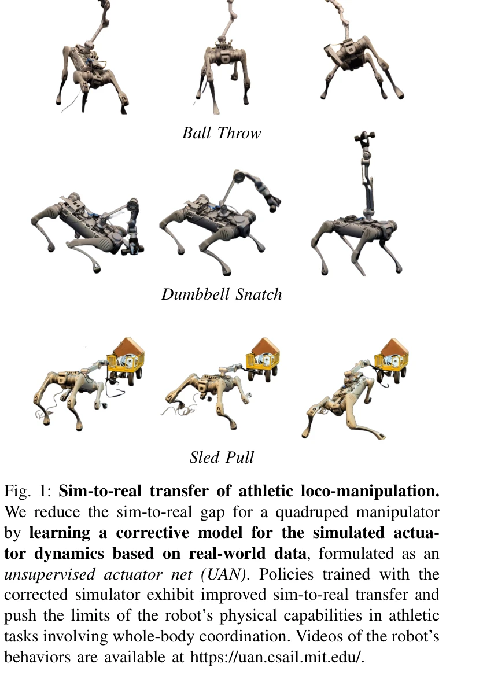
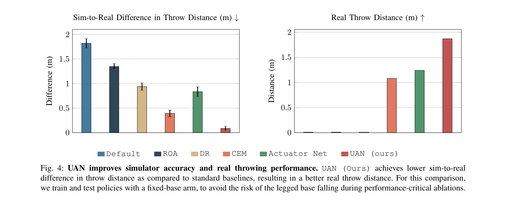
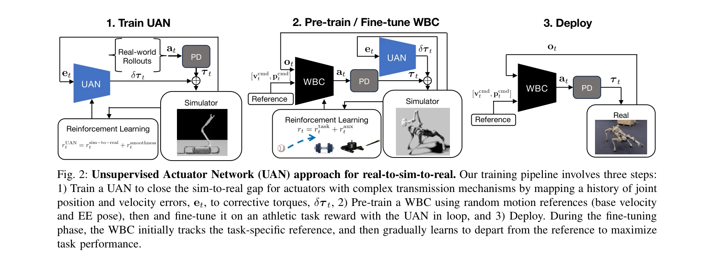

# Bridging the Sim-to-Real Gap for Athletic Loco-Manipulation

> **저자**: Nolan Fey, Gabriel B. Margolis, Martin Peticco, Pulkit Agrawal | **날짜**: 2025-02-15 | **URL**: [https://arxiv.org/abs/2502.10894](https://arxiv.org/abs/2502.10894)

---

## Essence

*Fig. 1: Sim-to-real transfer of athletic loco-manipulation.*

본 논문은 로봇의 운동 조작 작업에서 시뮬레이션-현실 간극을 줄이기 위해 Unsupervised Actuator Net(UAN)을 제안하고, 이를 기반으로 한 2단계 훈련 파이프라인을 통해 던지기, 들어올리기 등의 역동적인 운동 행동을 학습하도록 한다.

## Motivation

- **Known**: 시뮬레이션-현실 전이를 위해 도메인 랜덤화와 참조 궤적 추적 보상이 전통적으로 사용되어 왔으며, RL 기반 방법들이 로봇 제어에 효과적임이 알려져 있다.
- **Gap**: 작업 보상만으로 훈련할 경우 보상 해킹(reward hacking)이 발생하고 탐색이 충분히 방향성을 갖지 못하며, 비인간형 모양의 로봇(예: 다리 조작기)을 위한 고품질 참조 데이터 수집이 어렵다.
- **Why**: 토크 센서 없이도 복잡한 전동기 메커니즘의 시뮬레이션 정확도를 높일 수 있다면 로봇이 더욱 역동적이고 목표지향적인 운동 행동을 안정적으로 학습할 수 있기 때문이다.
- **Approach**: 실세계 데이터를 활용하여 위치 및 속도 오차로부터 보정 토크를 예측하는 UAN을 RL로 훈련한 후, 사전훈련된 전신 제어기(WBC)를 참조 궤적으로 초기화하여 작업 보상으로 미세조정하는 2단계 파이프라인을 제안한다.

## Achievement

*Fig. 4: UAN improves simulator accuracy and real throwing performance. UAN (Ours) achieves lower sim-to-real*

- **UAN의 토크 센서 미요구**: 토크 측정값 대신 조인트 인코더 측정값만으로 조화 드라이브 액추에이터의 비선형 마찰, 히스테리시스, 지연을 모델링할 수 있다
- **보상 해킹 완화**: UAN을 통한 시뮬레이터 정확도 향상이 정책의 견고성과 전이성을 보장한다
- **참조 궤적의 힌트 활용**: 엄격한 추적 제약 대신 탐색 가이드로 사용하여 최적 운동 전략 발견을 가능하게 한다
- **실제 로봇 성능**: Unitree B2 사족 로봇에서 볼 던지기, 덤벨 스내치, 썰매 끌기 등 복잡한 전신 운동 행동의 현실 전이를 달성한다

## How

*Fig. 2: Unsupervised Actuator Network (UAN) approach for real-to-sim-to-real. Our training pipeline involves three steps*

- UAN은 2층 MLP(layer size [128, 128], ELU activation)로 설계되며 5ms 시뮬레이션 타임스텝마다 실행된다
- 관찰 공간은 관련 액추에이터의 과거 20(100ms)개 위치 및 속도 오차 이력으로 제한된다
- 동일한 UAN이 모든 팔 관절에 공유되어 데이터 효율성을 높인다
- WBC 사전훈련: 임의의 기저 속도 및 엔드 이펙터 포즈 명령으로 운동 사전 지식을 구축한다
- WBC 미세조정: 참조 궤적으로 초기화 후 작업 보상(rsim→to→real + rsmoothness)으로 훈련한다
- 도메인 랜덤화를 통한 시뮬레이터 환경의 변동성 학습으로 실세계 전이 견고성을 높인다

## Originality

- 토크 센서 미사용으로 UAN을 훈련하는 비지도 학습 접근법이 기존 온라인 시스템 동정(online system identification) 방법과 차별화된다
- 참조 궤적을 추적 보상 대신 탐색 가이드 힌트로 재해석하는 사전훈련-미세조정 전략이 새로운 관점을 제시한다
- 조화 드라이브와 같은 복잡한 전동기 메커니즘의 잔차 모델 학습이 기존 도메인 랜덤화의 한계를 보완한다

## Limitation & Further Study

- UAN 훈련을 위한 실세계 데이터 수집 과정이 명시적으로 설명되지 않아 실무 적용의 비용-효율성이 불명확하다
- 현재 방법은 특정 로봇 플랫폼(Unitree B2 + Z1 Pro)에 제한되어 타 로봇 형태로의 일반화 가능성이 미흡하다
- 참조 궤적의 품질과 초기화가 미세조정 성능에 미치는 영향에 대한 정량적 분석이 부족하다
- 후속연구: 토크 센서를 사용하는 경우와의 상세한 성능 비교, 다양한 로봇 형태(인간형 등)에 대한 확장, UAN의 적응적 재훈련 메커니즘 개발

## Evaluation

- Novelty: 4/5
- Technical Soundness: 3/5
- Significance: 4/5
- Clarity: 4/5
- Overall: 4/5

**총평**: 본 논문은 토크 센서 미사용 UAN과 참조 궤적 힌트 기반 미세조정이라는 실질적이고 창의적인 솔루션으로 시뮬레이션-현실 간극을 좁히며, 복잡한 운동 행동의 견고한 전이를 입증하여 로봇 제어 분야에 의미 있는 기여를 한다.

## Related Papers

- 🏛 기반 연구: [[papers/1323_BridgeData_V2_A_Dataset_for_Robot_Learning_at_Scale/review]] — 대규모 로봇 데이터셋이 VLA 기초 모델의 학습에 필요한 데이터 기반을 제공한다
- 🔄 다른 접근: [[papers/1345_DiffCoTune_Differentiable_Co-Tuning_for_Cross-domain_Robot_C/review]] — cross-domain robot learning을 각각 VLA 기초 모델과 differentiable co-tuning으로 다르게 접근한다
- 🔗 후속 연구: [[papers/1306_All_Robots_in_One_A_New_Standard_and_Unified_Dataset_for_Ver/review]] — ARIO의 통합 데이터 표준을 활용하여 더 효율적이고 실용적인 VLA 모델을 개발한다
- 🔗 후속 연구: [[papers/1475_MetaMorph_Learning_Universal_Controllers_with_Transformers/review]] — 모듈식 로봇에서 다양한 형태로의 일반화와 로봇 간 통합 표준의 확장된 개념이 연결된다.
