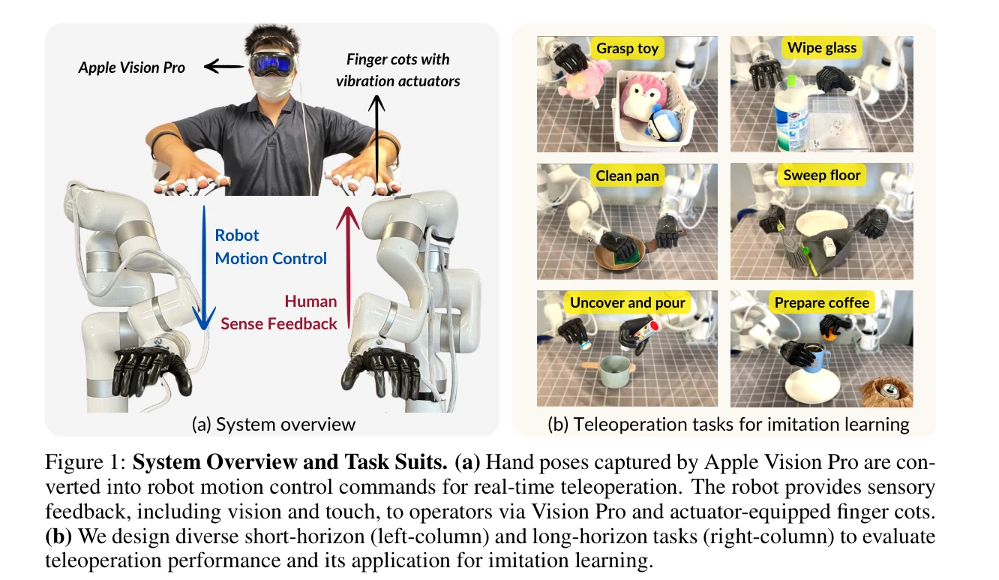
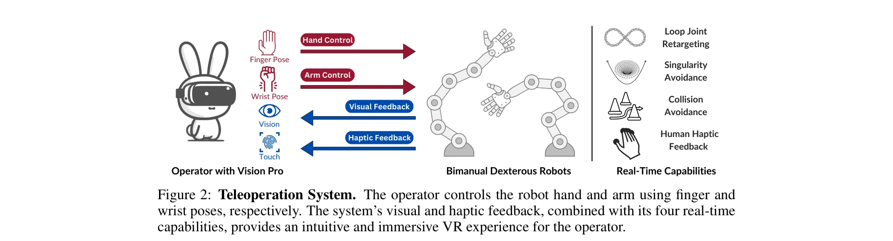

# Bunny-VisionPro: Real-Time Bimanual Dexterous Teleoperation for Imitation Learning

> **저자**: Runyu Ding, Yuzhe Qin, Jiyue Zhu, Chengzhe Jia, Shiqi Yang, Ruihan Yang, Xiaojuan Qi, Xiaolong Wang | **날짜**: 2024-07-03 | **URL**: [https://arxiv.org/abs/2407.03162](https://arxiv.org/abs/2407.03162)

---

## Essence

*Figure 1: System Overview and Task Suits. (a) Hand poses captured by Apple Vision Pro are con-*

Apple Vision Pro의 손 추적 기능을 활용하여 실시간 양손 정교한 조작 로봇을 원격 조종하는 시스템 Bunny-VisionPro를 제안하며, 저비용 haptic feedback과 충돌/특이점 회피를 통해 모방학습용 고품질 시연 데이터를 수집한다.

## Motivation

- **Known**: 기존 원격조종 시스템은 simple gripper를 사용하거나 단일 팔 제어만 가능하며, 고DoF 양손 시스템의 실시간 조종은 특이점 처리와 지연 문제로 어려움이 있다. ALOHA는 gripper만, AnyTeleop은 고성능 GPU 필요 및 단일 팔 설계이다.
- **Gap**: 양손 정교한 조작을 위한 실시간 이중 팔 제어, loop joint 구조의 retargeting, 저비용 haptic feedback을 모두 통합한 완전한 원격조종 시스템이 부재하며, 특히 다단계 장시간 조작 과제의 모방학습 데이터 수집이 미흡하다.
- **Why**: 양손 정교한 조작은 로봇 학습의 핵심이지만 고품질 시연 데이터 수집이 노동집약적이고 어려우며, 실시간 안전한 원격조종 시스템은 operator의 직관적 제어를 가능하게 하여 데이터 수집 효율과 학습 성능을 크게 향상시킨다.
- **Approach**: Vision Pro의 hand pose tracking을 통해 손가락/손목 자세를 로봇 명령으로 변환하고, keypoint 최적화 기반 retargeting, 실시간 arm control (singularity/collision avoidance), 저비용 ERM 진동 actuator 기반 haptic feedback의 3개 모듈을 통합한다.

## Achievement

*Figure 1: System Overview and Task Suits. (a) Hand poses captured by Apple Vision Pro are con-*

- **실시간 성능**: CPU 1코어로 300Hz에서 four-bar linkage 구조의 loop joint retargeting 실현
- **안전성**: 특이점 및 충돌 회피를 실시간으로 처리하여 고DoF 양손 시스템의 안전한 조종 가능
- **Benchmark 성능**: Telekinesis benchmark에서 기존 대비 11% 높은 성공률과 45% 단축된 완료시간 달성
- **모방학습 개선**: 시스템으로 수집한 시연 데이터로 학습한 정책이 신규 자세/미학습 물체에 대해 20% 향상된 일반화 성능
- **장시간 과제**: 기존에 거의 다루지 않은 다단계 장시간 정교한 조작 과제의 모방학습 실현

## How

*Figure 2: Teleoperation System. The operator controls the robot hand and arm using finger and*

- Hand motion retargeting: 인간 손가락 keypoint와 로봇 손가락 forward kinematics 간 거리 최소화 최적화로 실시간 재할당
- Arm motion control: 손목 자세로부터 inverse kinematics로 팔 joint 각도 계산하되, sphere modeling으로 collision detection 수행 및 singularity 처리
- Bimanual initialization: 로봇 손 간 거리가 인간 손 간 거리와 일치하도록 초기화 모드 설계로 자연스러운 양손 조정
- Haptic feedback: 로봇 손의 FSR sensor 촉각 신호를 operator 손의 finger cot 장착 ERM actuator 진동으로 변환
- Modular architecture: 각 모듈이 별도 프로세스에서 실행되어 지연 누적 방지 및 실시간 성능 보장

## Originality

- Vision Pro 손 추적을 양손 정교한 조작 원격조종에 처음 적용하고 실시간 구현
- Four-bar linkage 등 loop joint 구조를 위한 실시간 retargeting 알고리즘 개발 (기존 AnyTeleop은 이 불가)
- GPU 없이 CPU만으로 실시간 collision/singularity avoidance 구현 (AnyTeleop 대비 개선)
- 저비용 ERM actuator ($1.2)를 이용한 finger cot 기반 haptic feedback 장치 설계로 immersion 향상
- 양손 간 거리 정렬 초기화 모드로 자연스러운 bimanual 조종 인터페이스 구현

## Limitation & Further Study

- Vision Pro의 hand tracking 정확도 및 가시성 제약에 따른 조종 환경 한계 미논의
- Haptic feedback이 진동만 제공하며 force feedback 부재로 촉각 정보 제한
- Telekinesis benchmark 이외 다양한 실제 작업 환경에서의 성능 평가 부족
- Operator 학습곡선 및 fatigue 분석 미흡 (user study는 제한적)
- 후속연구: force feedback 통합, 신경망 기반 동적 retargeting, 더 다양한 로봇 플랫폼 지원 등

## Evaluation

- Novelty: 4/5
- Technical Soundness: 4/5
- Significance: 4/5
- Clarity: 4/5
- Overall: 4/5

**총평**: Bunny-VisionPro는 Vision Pro 기반 실시간 양손 정교한 조작 원격조종의 완전한 솔루션을 제시하며, 실시간 안전 제어와 저비용 haptic feedback 통합으로 고품질 모방학습 데이터 수집을 가능하게 한다. 시스템 성능과 학습 효과가 입증되어 로봇 조작 학습의 중요한 인프라가 될 수 있다.

## Related Papers

- 🔗 후속 연구: [[papers/1240_A_Closed-Form_Geometric_Retargeting_Solver_for_Upper_Body_Hu/review]] — Apple Vision Pro 손 추적에서 폐쇄형 기하학적 역기구학이 정확한 관절 매핑에 활용된다
- 🔄 다른 접근: [[papers/1251_ACE_A_Cross-Platform_Visual-Exoskeletons_System_for_Low-Cost/review]] — 저비용 정교한 텔레오퍼레이션에서 Vision Pro 손 추적과 3D 프린팅 exoskeleton의 다른 방식이다
- 🔗 후속 연구: [[papers/1290_BiCoord_장기간_시공간_협응_양팔_조작_벤치마크/review]] — 실시간 양손 조작에서 BiCoord의 장기간 협응 메트릭이 성능 평가에 활용된다
- 🏛 기반 연구: [[papers/1598_Open-TeleVision_Teleoperation_with_Immersive_Active_Visual_F/review]] — 몰입형 능동 시각 텔레오퍼레이션에서 Apple Vision Pro의 손 추적이 기초가 된다
- 🏛 기반 연구: [[papers/1290_BiCoord_장기간_시공간_협응_양팔_조작_벤치마크/review]] — 실시간 양손 정교한 조작에서 장기간 시공간 협응 메트릭이 기반이 된다
- 🏛 기반 연구: [[papers/1240_A_Closed-Form_Geometric_Retargeting_Solver_for_Upper_Body_Hu/review]] — Apple Vision Pro 손 추적 기반 양손 조작에서 정확한 관절각 변환을 위한 기하학적 해법이 기반이 된다
- 🔄 다른 접근: [[papers/1251_ACE_A_Cross-Platform_Visual-Exoskeletons_System_for_Low-Cost/review]] — 저비용 정교한 텔레오퍼레이션에서 exoskeleton과 Vision Pro 손 추적의 다른 방식이다
- 🔗 후속 연구: [[papers/1451_Learning_Human-to-Humanoid_Real-Time_Whole-Body_Teleoperatio/review]] — Bunny-VisionPro의 실시간 양팔 텔레오퍼레이션을 전신 제어로 확장했다
- 🏛 기반 연구: [[papers/1498_OmniH2O_Universal_and_Dexterous_Human-to-Humanoid_Whole-Body/review]] — VR 기반 양팔 텔레오퍼레이션이 OmniH2O의 멀티모달 인터페이스의 기반이 된다
- 🔄 다른 접근: [[papers/1548_Learning_Visuotactile_Skills_with_Two_Multifingered_Hands/review]] — VR 기반 양손 조작 시스템 HATO와 실시간 양손 정교 텔레오퍼레이션 Bunny-VisionPro가 동일한 양손 제어 문제를 다룬다.
- 🔄 다른 접근: [[papers/1598_Open-TeleVision_Teleoperation_with_Immersive_Active_Visual_F/review]] — VR 기반 몰입형 원격 조종 Open-TeleVision과 실시간 양손 정교 텔레오퍼레이션 Bunny-VisionPro가 동일한 VR 텔레오퍼레이션 문제를 다룬다.
