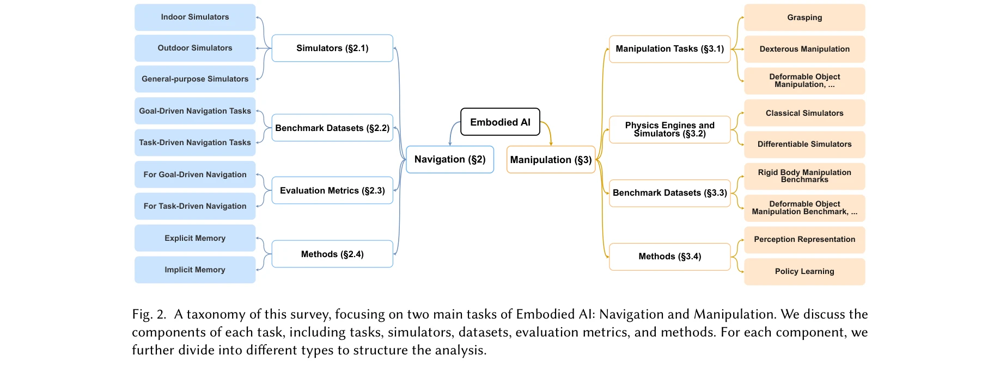
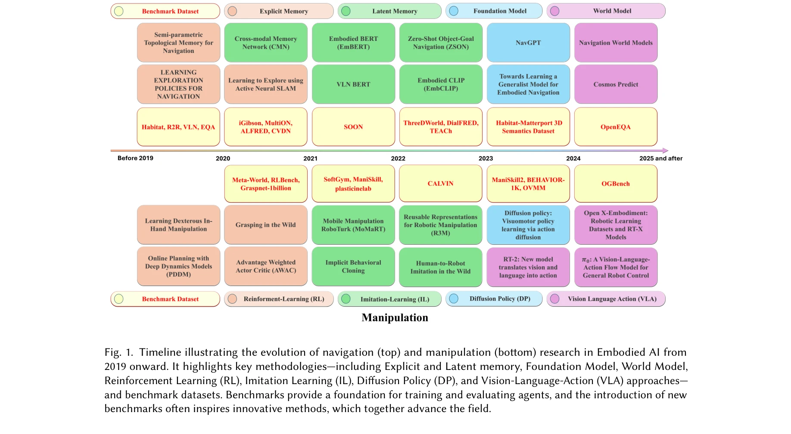
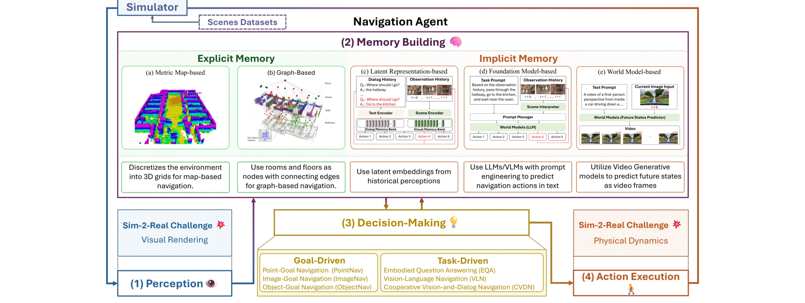

# A Survey of Robotic Navigation and Manipulation with Physics Simulators in the Era of Embodied AI

> **저자**: Lik Hang Kenny Wong, Xueyang Kang, Kaixin Bai, Jianwei Zhang | **날짜**: 2025-05-01 | **URL**: [https://arxiv.org/abs/2505.01458](https://arxiv.org/abs/2505.01458)

---

## Essence

*Fig. 2. A taxonomy of this survey, focusing on two main tasks of Embodied AI: Navigation and Manipulation. We discuss th*

본 논문은 Embodied AI 시대에 로봇의 네비게이션과 조작 작업을 위한 Physics Simulator의 역할을 종합적으로 분석하고, sim-to-real 전이의 간극을 좁히기 위한 시뮬레이터 속성, 벤치마크, 평가 지표 및 최신 방법론을 제시한다.

## Motivation

- **Known**: 네비게이션과 조작은 Embodied AI의 핵심 능력이며, 실제 환경에서의 학습은 비용이 높고 시간이 많이 소요된다. 따라서 sim-to-real 전이가 주요 접근법으로 부상했으나 sim-to-real 간극이 지속적으로 문제가 된다.
- **Gap**: 기존 설문조사들은 LLM과 World Model 출현 이전에 작성되었으며, differentiable physics simulator와 같은 현대적 시뮬레이터 발전이 sim-to-real 간극 해소에 미치는 영향을 충분히 분석하지 못했다. 또한 3D 공간 세분성을 기반으로 한 표현 학습 분류와 geometric equivariant representation에 대한 심층 분석이 부족하다.
- **Why**: 로봇 에이전트는 현실의 다양한 환경과 작업에 적응해야 하므로, 시뮬레이션에서 효과적으로 학습할 수 있는 도구 선택과 방법론 이해가 필수적이다. Physics Simulator의 정확한 특성 파악은 하드웨어 제약을 고려한 최적의 도구 선택을 가능하게 한다.
- **Approach**: 본 논문은 navigation과 manipulation을 중심으로 Physics Simulator의 기능적 속성, 관련 작업, 벤치마크 데이터셋, 평가 지표, 최신 방법론(world models, geometric equivariance)을 체계적으로 분석한다. 2019년 이후의 진화 과정을 timeline으로 추적하고 실제 선택 기준을 제시한다.

## Achievement

*Fig. 1. Timeline illustrating the evolution of navigation (top) and manipulation (bottom) research in Embodied AI from*

- **종합적 설문 제공**: 2019년 이후 navigation과 manipulation 분야의 급속한 발전을 timeline으로 정리하고, RL에서 IL, diffusion policy, VLA 모델로의 진화 과정을 추적
- **Physics Simulator 심층 분석**: Classical Simulator, General-purpose Simulator, Differentiable Simulator 등 다양한 시뮬레이터의 속성과 sim-to-real 간극 해소 메커니즘을 분석
- **구조화된 분류체계**: Navigation을 goal-driven과 task-driven으로, Manipulation을 rigid body와 deformable object로 분류하는 명확한 taxonomy 제시
- **실용적 리소스**: 벤치마크 데이터셋(iGibson, ALFRED, Habitat-Matterport 3D Semantics, GraspNet-1Billion, ManiSkill 등), 평가 지표, 시뮬레이션 플랫폼 정리
- **최신 방법론 통합**: Foundation Model, World Model, geometric equivariance, Vision-Language-Action 등 최신 기술의 영향을 navigation과 manipulation 관점에서 분석

## How

*Fig. 3. This diagram outlines the four key steps in navigation tasks—Perception, Memory Building, Decision-Making, and*

- Navigation 작업을 Perception, Memory Building, Decision-Making, Action Execution의 4단계로 분석
- Visual sim-to-real gap과 physics sim-to-real gap의 두 가지 핵심 도전과제 정의
- Memory를 explicit memory와 implicit memory(latent representation-based)로 분류
- Simulator를 outdoor simulator와 indoor simulator로 구분하여 각각의 특성 분석
- Manipulation 작업에서 RL 기반 방법에서 IL, diffusion policy, VLA로의 진화 추적
- Benchmark 데이터셋의 규모와 도입 시기가 innovation에 미친 영향 분석
- Hardware 제약을 고려한 도구 선택 프레임워크 제공

## Originality

- 기존 설문조사와 달리 LLM과 World Model 시대의 최신 발전을 포함한 포괄적 분석 제공
- Physics Simulator의 속성을 sim-to-real 간극 해소 관점에서 재분류하고, differentiable simulator의 역할 강조
- 3D 공간 세분성(spatial granularity)을 기반으로 표현 학습을 분류하고 task 복잡도와 연결
- Geometric equivariant representation에 대한 심층적 탐구 제시
- Navigation과 Manipulation의 두 핵심 작업을 통합적으로 다루면서 각각의 발전 궤적을 timeline으로 비교

## Limitation & Further Study

- 논문이 설문조사(survey) 성격이므로 새로운 실험이나 알고리즘 제안이 없음
- 현실의 복잡한 deformable object 조작의 시뮬레이션은 여전히 어려우며, 이에 대한 simulator의 한계가 충분히 논의되지 않을 수 있음
- Sim-to-real 전이의 성공률을 정량적으로 비교 분석하는 메타 분석이 부족할 수 있음
- 후속 연구는 differentiable simulator의 실제 효과를 대규모 empirical study로 검증하고, multimodal agent의 시뮬레이션 환경 요구사항을 더 깊이 있게 분석해야 함
- Hardware 제약 하에서 각 simulator와 method의 trade-off를 정량적으로 평가하는 벤치마크 개발 필요

## Evaluation

- Novelty: 4/5
- Technical Soundness: 3/5
- Significance: 4/5
- Clarity: 4/5
- Overall: 4/5

**총평**: 본 논문은 Embodied AI 시대의 navigation과 manipulation 연구를 포괄적으로 정리한 시의적절한 설문조사로, 현대적 simulator 기술과 최신 방법론(world model, geometric equivariance, VLA)을 체계적으로 분석하여 연구자들의 도구 선택과 방법론 설계에 실질적 가이드를 제공한다.

## Related Papers

- 🔄 다른 접근: [[papers/1484_MuJoCo_Playground/review]] — 로봇 시뮬레이션 환경을 각각 physics simulator와 MuJoCo playground라는 다른 관점에서 조사한다
- 🏛 기반 연구: [[papers/1292_A_Comprehensive_Survey_on_World_Models_for_Embodied_AI/review]] — world model의 이론적 틀이 physics simulator 기반 로봇 학습의 환경 모델링에 기초를 제공한다
- 🔗 후속 연구: [[papers/1544_robosuite_A_Modular_Simulation_Framework_and_Benchmark_for_R/review]] — robosuite의 modular simulation을 physics simulator의 포괄적 분석으로 확장하여 더 깊은 이해를 제공한다
