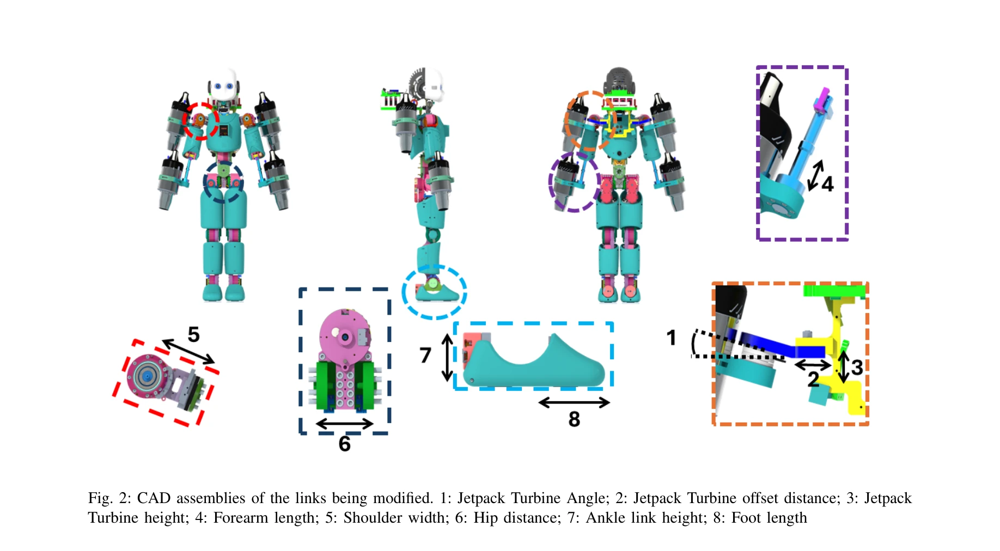
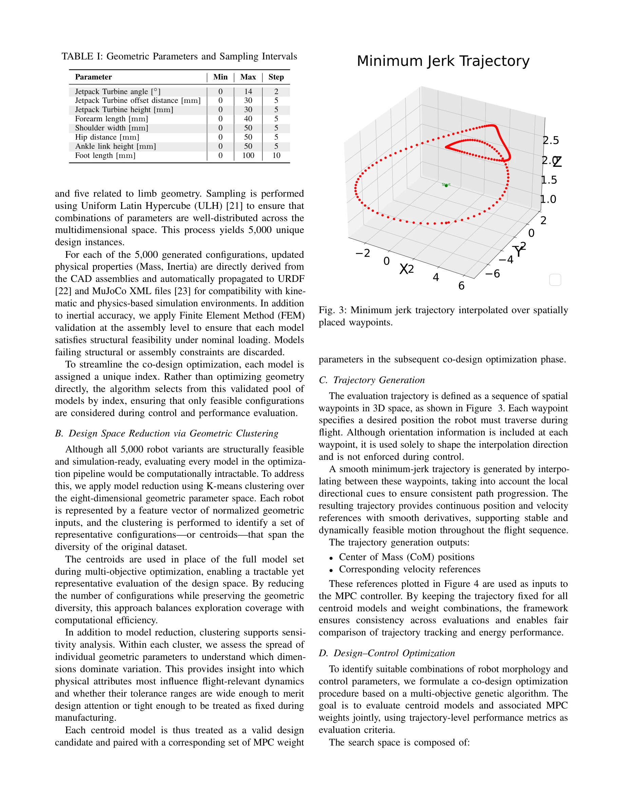

# CAD-Driven Co-Design for Flight-Ready Jet-Powered Humanoids

> **저자**: Punith Reddy Vanteddu, Davide Gorbani, Giuseppe L'Erario, Hosameldin Awadalla Omer Mohamed, Fabio Bergonti, Daniele Pucci | **날짜**: 2025-09-18 | **URL**: [https://arxiv.org/abs/2509.14935](https://arxiv.org/abs/2509.14935)

---

## Essence

*Fig. 2: CAD assemblies of the links being modified. 1: Jetpack Turbine Angle; 2: Jetpack Turbine offset distance; 3: Jet*

CAD 기반 설계 공간 탐색과 Model Predictive Control을 결합하여 제트 추진 인형로봇의 형태와 제어를 동시 최적화하는 co-design 프레임워크를 제시한다.

## Motivation

- **Known**: 로봇 co-design은 형태와 제어를 동시 최적화하여 성능을 향상시키는 것으로 알려져 있으나, 제트 추진 인형로봇의 복잡한 비선형 동역학과 제조 가능성을 모두 고려한 대규모 설계 공간 탐색 방법은 부재했다.
- **Gap**: 기존 co-design 방법들은 제한된 동적 복잡성이나 저차원 설계 공간에만 적용되었으며, 제트 추진 인형로봇에서 추력 인터페이스 배치와 질량 분포의 밀접한 관계를 궤적 성능 지표로 평가하는 방법이 없었다.
- **Why**: 제트 추진 인형로봇의 설계와 제어는 강하게 결합되어 있어서, 형태 최적화와 제어 튜닝을 분리하면 차선의 해에만 도달하게 되므로 비행 성능과 에너지 효율을 동시에 만족하는 flight-ready 설계를 얻기 위해서는 통합 최적화가 필수적이다.
- **Approach**: Design of Experiments로 5,000개의 CAD 기반 설계를 생성하고 K-means 클러스터링으로 계산 비용을 절감한 후, 최소 저크 궤적 추적 성능과 에너지 소비를 목적함수로 하는 NSGA-II 기반 multi-objective 최적화를 통해 기하 파라미터와 MPC 이득을 동시에 탐색한다.

## Achievement

*Fig. 5: Pareto front showing trade-off between tracking error*

- **CAD 기반 설계 공간 생성**: iRonCub-Mk3 모델에서 8개 기하 파라미터를 변화시켜 5,000개의 구조적으로 타당하고 제조 가능한 설계를 생성
- **계산 효율화**: K-means 클러스터링으로 5,000개 모델을 대표 중심으로 축소하여 평가 비용 감소
- **통합 최적화 프레임워크**: 8개 기하 파라미터와 8개 MPC 가중치를 포함한 16차원 입력 공간을 NSGA-II로 동시 최적화
- **검증된 설계**: 모든 설계 후보에 대해 FEM 구조 해석으로 구조 무결성 검증, 최적화된 제어 파라미터와 함께 flight-ready 구성 제공
- **궤적 기반 성능 평가**: minimum-jerk 참조 궤적에 대해 momentum-based linearized MPC를 사용해 추적 오차와 기계 에너지 소비를 평가

## How

*Fig. 3: Minimum jerk trajectory interpolated over spatially*

- Design of Experiments 기반 파라미터 샘플링으로 8개 기하 변수(jetpack 터빈 각도/오프셋/높이, forearm 길이, shoulder 너비, hip 거리, ankle 높이, foot 길이)의 조합 설계 생성
- 각 CAD 모델에서 질량, 무게중심, 링크 관성을 자동 추출하여 동역학 시뮬레이션에 적용
- K-means clustering으로 5,000개 설계를 대표 중심점으로 축소하여 계산량 경감
- centroidal momentum 기반 선형화된 MPC 제어기 설계로 최소 저크 궤적 추적
- Wx, Wl, Wϕ, Wω, W∆s, Wuth 등 8개 MPC 가중치 파라미터 최적화
- NSGA-II multi-objective 최적화로 추적 오류와 기계 에너지 소비를 동시에 최소화하는 Pareto 최전면 도출

## Originality

- 제트 추진 인형로봇의 전체 신체 형태를 thousands 규모로 탐색하면서 궤적 기반 비행 성능 지표로 평가하는 최초의 프레임워크
- CAD 기반 기하 설계와 trajectory-level 성능 평가를 통합하여 component-level 최적화를 넘어 full-body 동적 성능 고려
- 구조적 제약(FEM 검증)과 동적 제약(MPC 궤적 추적)을 동시에 만족하는 제조 가능한 설계 도출
- 형태 변수와 제어 이득을 16차원 unified 입력 공간으로 모델링하여 true co-optimization 달성

## Limitation & Further Study

- K-means 클러스터링으로 인한 설계 공간 축소로 최적 해의 일부 손실 가능성
- linearized momentum-based MPC로 단순화하여 비선형 동역학의 완전한 표현 부족
- minimum-jerk 궤적 하나만 사용하여 다양한 비행 작업에 대한 강건성 미검증
- 실제 제트 터빈의 동작 지연, 노이즈, 불확실성이 고려되지 않음
- **후속연구**: 다중 궤적에 대한 robust co-design, reinforcement learning 기반 제어 통합, 실제 프로토타입 제조 및 비행 테스트 필요

## Evaluation

- Novelty: 4/5
- Technical Soundness: 3/5
- Significance: 4/5
- Clarity: 4/5
- Overall: 4/5

**총평**: 제트 추진 인형로봇의 설계와 제어를 통합 최적화하는 체계적이고 확장 가능한 framework를 제시한 의미 있는 기여이며, CAD 기반 설계 자동화와 대규모 탐색으로 실용적 flight-ready 설계 도출을 가능하게 했다.

## Related Papers

- 🔄 다른 접근: [[papers/1500_iRonCub_3_The_Jet-Powered_Flying_Humanoid_Robot/review]] — CAD 기반 co-design과 실제 제트 엔진 구현의 서로 다른 제트 추진 휴머노이드 개발 접근법을 비교할 수 있습니다.
- 🔗 후속 연구: [[papers/1516_Learning_Aerodynamics_for_the_Control_of_Flying_Humanoid_Rob/review]] — co-design 프레임워크가 공기역학 학습 기반 비행 제어로 확장되어 더 정밀한 제어가 가능합니다.
- 🏛 기반 연구: [[papers/1243_A_Hierarchical_Model-Based_System_for_High-Performance_Human/review]] — MPC 기반 제어 이론이 제트 추진 시스템의 형태-제어 동시 최적화에 기초를 제공합니다.
- 🔗 후속 연구: [[papers/1243_A_Hierarchical_Model-Based_System_for_High-Performance_Human/review]] — ARTEMIS의 MPC 기반 경로계획이 제트 추진 휴머노이드의 co-design 프레임워크에서 제어 최적화에 응용 가능합니다.
- 🔄 다른 접근: [[papers/1500_iRonCub_3_The_Jet-Powered_Flying_Humanoid_Robot/review]] — 실제 제트 엔진 구현과 CAD 기반 co-design의 서로 다른 제트 추진 휴머노이드 개발 접근법을 비교합니다.
- 🏛 기반 연구: [[papers/1516_Learning_Aerodynamics_for_the_Control_of_Flying_Humanoid_Rob/review]] — CFD와 풍동 실험 기반 공기역학 모델이 co-design 프레임워크의 물리적 제약 조건을 제공합니다.
