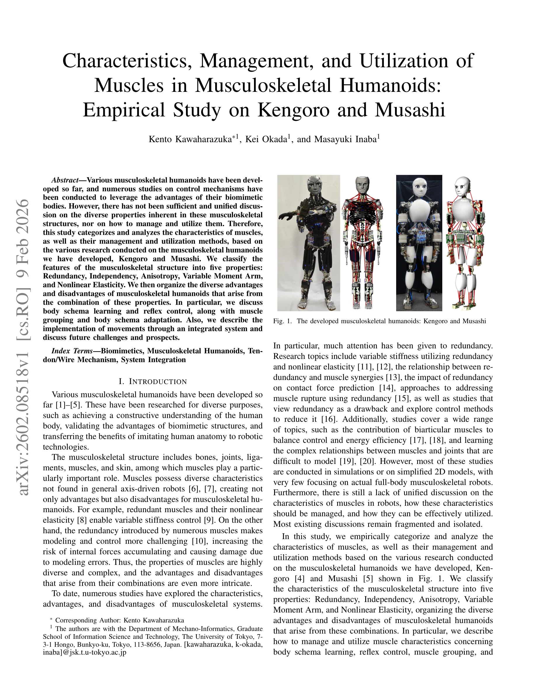
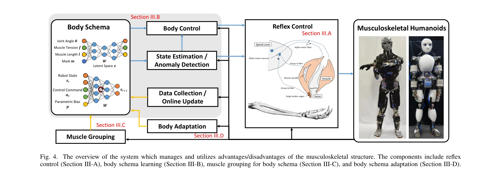

# Characteristics, Management, and Utilization of Muscles in Musculoskeletal Humanoids: Empirical Study on Kengoro and Musashi

> **저자**: Kento Kawaharazuka, Kei Okada, Masayuki Inaba | **날짜**: 2026-02-09 | **URL**: [https://arxiv.org/abs/2602.08518](https://arxiv.org/abs/2602.08518)

---

## Essence

*Fig. 1. The developed musculoskeletal humanoids: Kengoro and Musashi*

본 논문은 근육 구동 인형로봇 Kengoro와 Musashi의 개발을 통해 근육골격 구조의 5가지 특성(Redundancy, Independency, Anisotropy, Variable Moment Arm, Nonlinear Elasticity)을 분류하고, 이들의 관리 및 활용 방법을 체계적으로 분석하는 경험적 연구이다.

## Motivation

- **Known**: 다양한 근육골격 인형로봇이 개발되었으며, 생체모방 신체의 장점을 활용하기 위한 제어 메커니즘에 대한 연구들이 진행되어왔다. 근육 구조는 축 구동 로봇과 달리 다양한 특성을 가지며 장단점을 함께 제공한다.
- **Gap**: 지금까지 근육골격 구조의 다양한 특성을 통합적으로 논의하고 관리 및 활용하는 방법에 대한 충분한 논의가 부족하며, 대부분의 연구가 시뮬레이션이나 2D 모델에 국한되어 실제 전신 로봇에 적용된 사례가 드물다.
- **Why**: 근육골격 구조의 특성 조합으로 인한 복잡한 장단점을 이해하고 효과적으로 활용하는 것은 생체모방 로봇의 성능을 극대화하고 제어 난제를 해결하기 위해 중요하다.
- **Approach**: Kengoro와 Musashi 두 근육골격 인형로봇에서 수행된 다양한 연구를 바탕으로 근육 특성을 5가지로 분류하고, body schema learning, reflex control, muscle grouping, body schema adaptation 등을 통해 장단점을 관리 및 활용한다.

## Achievement

*Fig. 4. The overview of the system which manages and utilizes advantages/disadvantages of the musculoskeletal structure.*

- **5가지 근육 특성 분류**: Redundancy, Independency, Anisotropy, Variable Moment Arm, Nonlinear Elasticity를 체계적으로 분류하여 근육골격 구조의 특성을 통합적으로 설명
- **EKF 기반 관절각 추정**: vision 센서와 AR marker를 활용한 Extended Kalman Filter를 이용한 복잡한 관절각도 추정 방법 제시
- **이차계획법 기반 근육 긴장도 계산**: Quadratic Programming을 통해 목표 관절 토크를 실현하는 근육 긴장도 최적화 방법 개발
- **통합 시스템 구현**: body schema learning, reflex control, muscle grouping, body schema adaptation을 통합한 전신 운동 제어 시스템 구현

## How

*Fig. 2. The basic musculoskeletal structure: the components include bones,*

- 근육 길이 l, 근육 긴장도 f, 근육 온도 c, 관절각 θ 등을 센서로 계측
- Extended Kalman Filter를 이용한 근육 길이 변화로부터의 관절각 추정 (식 7-15)
- Vision 기반 역운동학을 통한 추정 관절각 보정 (식 16)
- 가중 이차계획법으로 주어진 관절 토크를 실현하는 근육 긴장도 계산 (식 17)
- Body schema learning으로 복잡한 근육-관절 관계 학습
- Reflex control을 통한 빠른 반응 제어
- Muscle grouping과 body schema adaptation으로 근육 특성 관리

## Originality

- 실제 전신 근육골격 인형로봇(Kengoro, Musashi)에서 수집한 경험적 데이터를 바탕으로 5가지 근육 특성을 통합적으로 분류 및 분석
- Pulley를 사용하지 않아 moment arm이 변하는 실제적인 근육골격 구조에 초점
- Body schema learning, reflex control, muscle grouping, body schema adaptation 등 여러 소프트웨어 접근법을 통합하여 근육 특성의 장단점을 체계적으로 관리
- 복잡한 관절(ball joint, scapula) 구조에 적합한 vision 기반 관절각 추정 방법 제시

## Limitation & Further Study

- Pulley를 사용하는 wire-driven 로봇에는 직접 적용되지 않으며, 공압 인공근육(pneumatic artificial muscles) 로봇과의 직접 비교 부족
- 하드웨어는 고정되어 있고 소프트웨어에만 초점을 맞춤으로써 하드웨어 설계의 영향 분석 미흡
- 실제 근육 스트레치와 마찰 등 모델링할 수 없는 요인으로 인한 관절각 추정 오차 존재
- 후속 연구에서는 모델링 오차 감소, 다양한 운동 과제의 통합 시스템 성능 평가, 근육 손상 복구 능력 향상 등이 필요

## Evaluation

- Novelty: 4/5
- Technical Soundness: 3/5
- Significance: 4/5
- Clarity: 4/5
- Overall: 4/5

**총평**: 본 논문은 실제 근육골격 인형로봇에 기반한 포괄적인 경험적 분석으로, 근육 특성의 5가지 분류 체계와 통합 관리 방법을 제시하여 생체모방 로봇 연구에 중요한 기여를 한다. 다만 하드웨어의 고정과 제한된 적용 범위가 보완되어야 할 과제이다.

## Related Papers

- 🔗 후속 연구: [[papers/1388_Exceeding_the_Maximum_Speed_Limit_of_the_Joint_Angle_for_the/review]] — 근육골격 구조의 5가지 특성 분석이 중복 힘줄 구동 시스템의 관절 속도 제한 극복 연구로 확장됩니다.
- 🧪 응용 사례: [[papers/1318_Control_of_Humanoid_Robots_with_Parallel_Mechanisms_using_Di/review]] — 근육의 Redundancy와 Variable Moment Arm 특성이 병렬 메커니즘의 정확한 비선형 모델링에 적용됩니다.
- 🏛 기반 연구: [[papers/1389_Explosive_Output_to_Enhance_Jumping_Ability_A_Variable_Reduc/review]] — 근육의 Nonlinear Elasticity 특성이 가변 감속비 설계의 폭발적 출력 메커니즘 이해에 기초가 됩니다.
- 🏛 기반 연구: [[papers/1318_Control_of_Humanoid_Robots_with_Parallel_Mechanisms_using_Di/review]] — 병렬 구동 메커니즘의 비선형 모델링이 근육골격 구조의 Variable Moment Arm 특성 이해에 기초가 됩니다.
- 🧪 응용 사례: [[papers/1389_Explosive_Output_to_Enhance_Jumping_Ability_A_Variable_Reduc/review]] — 폭발적 출력 메커니즘이 근육골격 구조의 Nonlinear Elasticity 특성 활용에 응용됩니다.
- 🏛 기반 연구: [[papers/1388_Exceeding_the_Maximum_Speed_Limit_of_the_Joint_Angle_for_the/review]] — 중복 힘줄 구동 시스템의 관절 속도 제한 극복이 근육골격 구조의 Redundancy 특성 활용에 기초합니다.
