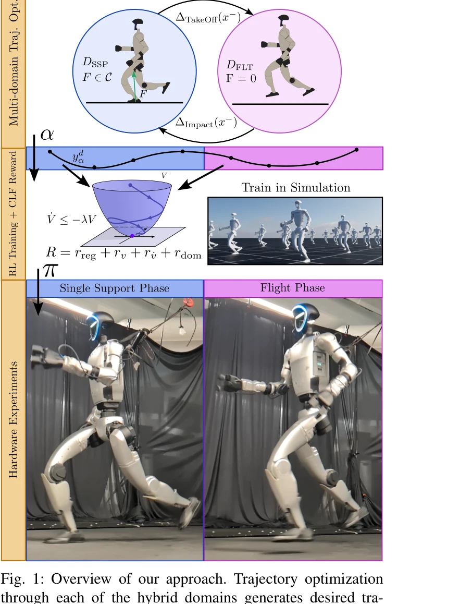
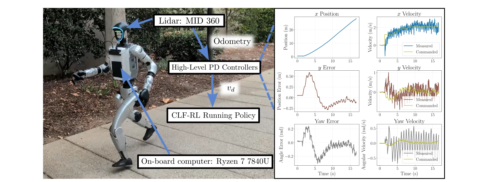
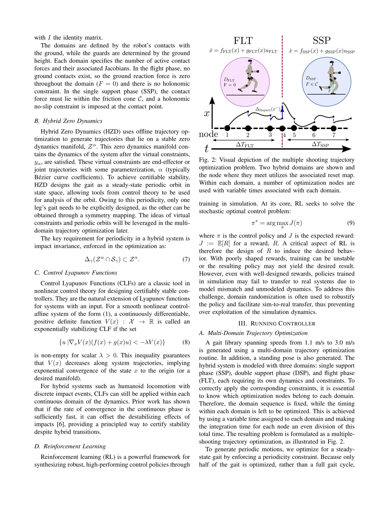

# Chasing Stability: Humanoid Running via Control Lyapunov Function Guided Reinforcement Learning

> **저자**: Zachary Olkin, Kejun Li, William D. Compton, Aaron D. Ames | **날짜**: 2025-09-23 | **URL**: [https://arxiv.org/abs/2509.19573](https://arxiv.org/abs/2509.19573)

---

## Essence

*Fig. 1: Overview of our approach. Trajectory optimization*

이 논문은 Control Lyapunov Function (CLF)을 RL 보상 함수에 내장하여 인간형 로봇의 안정적인 달리기 제어를 달성한다. 궤적 최적화를 통해 생성한 동적 참조 궤적과 CLF 기반 추적 제어기의 안정성 조건을 RL 학습에 통합하여 보상 설계를 자동화한다.

## Motivation

- **Known**: 강화학습은 다리 로봇 제어에 높은 인기를 얻고 있지만 보상 함수를 수작업으로 튜닝해야 한다는 문제가 있다. 고전 제어 이론의 CLF는 비선형 시스템의 안정성을 보장하는 수학적 도구이다.
- **Gap**: 기존 RL 방법들은 궤적을 사용하더라도 ad-hoc 방식으로 보상을 설정하거나, 안정성 보장 없이 휴리스틱하게 설계된다. 또한 인간형 로봇의 달리기에서 비행 단계를 포함한 동적으로 안정적인 동작과 정확한 추적을 동시에 달성한 사례가 드물다.
- **Why**: 인간형 로봇의 달리기는 비행 단계와 단일 지지 단계를 포함한 하이브리드 동역학이 필요하며, 모델 불일치와 환경 불확실성에 강건해야 한다. CLF 기반 접근은 수학적 안정성 보장과 함께 자동화된 보상 설계를 통해 이 문제를 해결할 수 있다.
- **Approach**: 다중 도메인 궤적 최적화를 통해 비행 단계와 단일 지지 단계의 동적 실현 가능한 참조 궤적을 생성한다. 이를 기반으로 CLF를 구성하여 CLF의 안정성 조건(Lyapunov 감소)을 RL의 보상 함수로 직접 임베딩하고, 시뮬레이션에서 훈련한 정책을 실제 로봇에 배포한다.

## Achievement

*Fig. 5: Experimental setup and outdoor velocity and position tracking. The graphic on the left shows the location of the*

- **자동화된 보상 설계**: CLF 기반 보상을 통해 휴리스틱 보상 항의 수작업 튜닝을 제거하고 수학적으로 원리 있는 중간 보상을 제공한다.
- **증명 가능한 안정성 유도**: CLF의 Lyapunov 감소 조건을 RL 학습에 직접 임베딩하여 안정적 거동을 유도한다.
- **동적 달리기 달성**: 비행 단계와 단일 지지 단계를 모두 포함한 완전한 인간형 로봇의 달리기 동작을 구현한다.
- **실험 환경에서의 강건성**: 트레드밀과 실외 환경에서 안정적으로 작동하며, 토르소와 발에 가해진 외란에도 견딘다.
- **정확한 추적 제어**: 온보드 센서만을 사용하여 높은 정확도의 위치 및 속도 추적을 달성한다.

## How

*Fig. 2: Visual depiction of the multiple shooting trajectory*

- Hybrid Zero Dynamics (HZD) 프레임워크를 사용하여 가상 제약(virtual constraints)을 매개변수화하고 다중 도메인 궤적 최적화를 수행한다.
- 비행 단계(FLT)와 단일 지지 단계(SSP) 각각에 대해 Bézier 곡선 기반의 동적 실현 가능한 궤적을 생성한다.
- 각 도메인에 대해 CLF를 구성하고, CLF 안정성 조건 {u | ∇xV(x)(f(x) + g(x)u) < -λV(x)} ≠ ∅를 만족하는 정도를 보상으로 사용한다.
- 정책 네트워크를 시뮬레이션에서 CLF 기반 보상으로 훈련하고, 수렴 후 런타임에서 궤적 최적화와 CLF 계산을 제거한다.
- Unitree G1 인간형 로봇에 배포하고 트레드밀 및 실외 환경에서 평가한다.

## Originality

- CLF의 안정성 조건을 직접 RL 보상에 임베딩하는 방식은 기존의 ad-hoc 궤적 추적 보상과 다르게 수학적 근거를 제공한다.
- Hybrid Zero Dynamics와 RL의 결합을 통해 궤적 최적화의 동적 실현 가능성과 RL의 robust 학습 능력을 동시에 활용한다.
- 풀사이즈 인간형 로봇(humanoid, 이전 연구는 주로 이족 보행)에서 비행 단계를 포함한 달리기를 달성한 점이 독창적이다.
- 온보드 센서만으로 글로벌 위치 추적을 수행하는 방식으로 완전 자율주행 스택에 통합 가능한 형태를 제시한다.

## Limitation & Further Study

- CLF 구성을 위해 다중 도메인 궤적 최적화가 필수적이므로, 새로운 로봇이나 환경에 적용 시 초기 비용이 높을 수 있다.
- 시뮬레이션과 실제 로봇 간의 sim-to-real gap에 대한 명시적 논의가 제한적이다.
- 다양한 외란 조건(예: 경사면, 매우 높은 속도)에 대한 일반화 능력을 평가한 결과가 부분적이다.
- 보상 함수의 설계 (λ 파라미터, 가중치 등)에 대한 민감도 분석이 상세하지 않다.
- 후속 연구로 다양한 지형과 추가 외란 조건에서의 강건성 확대, 온라인 CLF 적응화 메커니즘 개발 필요하다.

## Evaluation

- Novelty: 4/5
- Technical Soundness: 3/5
- Significance: 4/5
- Clarity: 4/5
- Overall: 4/5

**총평**: 이 논문은 Control Lyapunov Function을 RL 보상에 직접 통합하여 인간형 로봇의 안정적이고 강건한 달리기 제어를 실현한 의미 있는 연구이다. 수학적 엄밀성과 실제 하드웨어 검증을 모두 제시하며, 자동화된 보상 설계를 통해 기존 RL의 튜닝 문제를 해결한 점이 두드러진 기여이다.

## Related Papers

- 🏛 기반 연구: [[papers/1315_Composite_Motion_Learning_with_Task_Control/review]] — 안정적 달리기 제어에서 적응형 보조 힘 학습의 안정성 조건이 기초가 된다
- 🔗 후속 연구: [[papers/1333_Design_and_Control_of_a_Bipedal_Robotic_Character/review]] — 이족 로봇 제어에서 CLF 기반 안정성이 엔터테인먼트 로봇의 동적 이동에 확장된다
- 🧪 응용 사례: [[papers/1395_FastStair_Learning_to_Run_Up_Stairs_with_Humanoid_Robots/review]] — 휴머노이드 계단 달리기에서 CLF 기반 안정성 제어가 적용된다
- 🔄 다른 접근: [[papers/1517_Learning_agile_and_dynamic_motor_skills_for_legged_robots/review]] — 민첩하고 동적인 운동 기술에서 CLF 기반과 일반적인 RL의 다른 학습 접근이다
- 🔗 후속 연구: [[papers/1315_Composite_Motion_Learning_with_Task_Control/review]] — 적응형 보조 힘 학습에서 CLF 기반 안정성 조건이 복잡한 동작 습득에 확장된다
- 🏛 기반 연구: [[papers/1333_Design_and_Control_of_a_Bipedal_Robotic_Character/review]] — 엔터테인먼트 로봇의 동적 이동에서 CLF 기반 안정성 제어가 기초가 된다
- 🔄 다른 접근: [[papers/1457_HuB_Learning_Extreme_Humanoid_Balance/review]] — 둘 다 휴머노이드 균형과 안정성을 다루지만 HuB는 극단적 균형에, Control Lyapunov는 수학적 안정성에 집중한다
