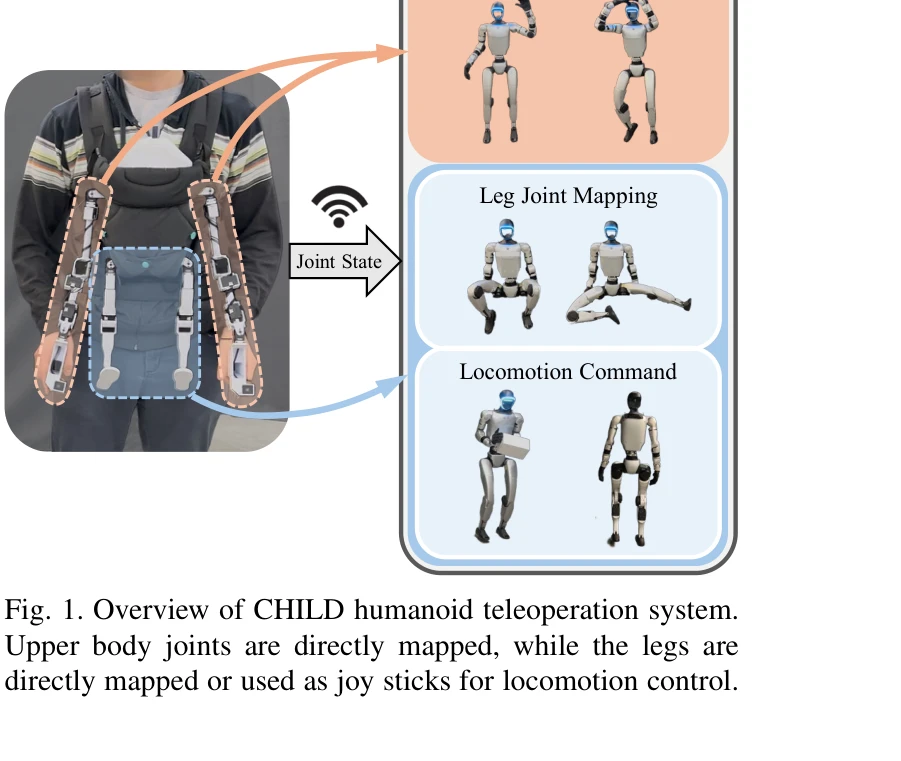

# CHILD (Controller for Humanoid Imitation and Live Demonstration): a Whole-Body Humanoid Teleoperation System

> **저자**: Noboru Myers, Obin Kwon, Sankalp Yamsani, Joohyung Kim | **날짜**: 2025-07-31 | **URL**: [https://arxiv.org/abs/2508.00162](https://arxiv.org/abs/2508.00162)

---

## Essence

*Fig. 1. Overview of CHILD humanoid teleoperation system.*

CHILD는 베이비 캐리어 형태로 컴팩트하게 설계된 휴머노이드 로봇 전신 텔레오퍼레이션 시스템으로, 직접 관절 매핑을 통해 네 개 팔다리 모두의 관절 수준 제어를 가능하게 한다.

## Motivation

- **Known**: 기존 텔레오퍼레이션 연구는 주로 단일 또는 이중 팔 시스템에 집중했으며, 시각 기반 시스템(VR, RGB-D)이나 IMU 기반 접근법이 사용되어왔다. 최근 dual-arm 시스템에서 joint-level 텔레오퍼레이션이 주목받고 있다.
- **Gap**: 기존 연구는 휴머노이드 로봇의 전신 joint-level 텔레오퍼레이션을 드물게 지원하며, 대부분의 시스템은 비용이 높고 휴대성이 낮거나 복잡한 제어 파이프라인을 가진다.
- **Why**: 전신 joint-level 제어는 로봇의 다양한 작업 수행 능력을 확장하고, 직관적인 제어와 이중 텔레오퍼레이션을 통한 힘 피드백을 동시에 제공하며, 단일 운영자가 이동 가능한 형태로 구현할 수 있기 때문에 중요하다.
- **Approach**: 정규화된 kinematically identical leader 구조를 사용하여 관절 수준의 직접 매핑을 구현하고, 재구성 가능한 마운트 설계(7개 마운트)와 저비용 servo motor(DYNAMIXEL XL330-M288-T)를 활용하여 다양한 로봇 구성에 적응할 수 있게 했다.

## Achievement

- **전신 joint-level 텔레오퍼레이션**: direct joint mapping을 통해 휴머노이드 로봇의 전신 관절에 대한 직접 제어를 최초로 구현
- **재구성 가능한 아키텍처**: 7개 마운트와 clip 설계로 humanoid, dual-arm, single-arm 등 다양한 로봇 구성 지원
- **컴팩트한 설계**: 전체 시스템을 표준 베이비 캐리어에 수납하여 단일 운영자의 이동성 확보
- **적응형 force feedback**: 운영자 경험 향상 및 불안전한 관절 움직임 방지
- **오픈 소스 공개**: 하드웨어 설계 완전 공개로 접근성과 재현성 촉진 및 1k 달러 이하 저비용

## How

- 베이비 캐리어를 외부 구조로 활용하여 컴팩트성과 이동성 확보
- 7개의 reconfigurable 마운트(다리 2개, 지면 평행 팔 2개, 45도 기울임 팔 2개, 목 1개) 설계로 다양한 shoulder 구성 대응
- kinematically identical leader 구조 유지하되 scaling factor α(0.65~0.9)를 적용하여 운영자의 reach 내에 워크스페이스 최적화
- DYNAMIXEL XL330-M288-T servo motor 활용으로 고해상도 encoder와 force feedback 동시 제공
- pogo pin connector를 통한 전력 및 통신 관리로 빠른 leader 탈착 가능
- 3D printed PLA 부품과 print-in-place compliant clip으로 저비용 및 재현성 확보
- desktop monitor stand adapter 설계로 고정 플랫폼 배치 시 복수 운영자 동시 제어 지원
- torso 폭을 로봇 shoulder 폭의 90%로 설정하고 shoulder-to-hip 비율 유지

## Originality

- 휴머노이드 로봇의 전신 joint-level 텔레오퍼레이션에 direct joint mapping 방식을 최초로 적용
- 7개 마운트 구조로 다양한 shoulder 구성(0~45도)의 휴머노이드 로봇에 대응 가능한 adaptive 설계
- 베이비 캐리어 형태의 혁신적인 컴팩트 디자인으로 단일 운영자의 이동성과 전신 제어를 동시에 달성
- pogo pin connector와 print-in-place clip 기반의 빠른 재구성 메커니즘
- 1k 달러 이하의 저비용 오픈 소스 구현으로 접근성 극대화

## Limitation & Further Study

- 운영자가 직립 자세에서는 동시에 최대 2개 팔다리만 제어 가능하며, 복잡한 움직임(예: crawling)은 고정 플랫폼 필요
- kinematic 스케일링으로 인한 workspace 제약으로 특정 작업의 정밀도 가능성 미제시
- IMU 기반 torso 제어의 정확성과 안정성에 대한 정량적 평가 부재
- 다양한 humanoid 로봇(G1, Atlas, Figure 023, GR-1 등)에서의 성능 비교 분석 미흡
- 장시간 운영 시 운영자의 피로도 평가 및 개선 방안 미제시
- 운영자의 움직임 의도를 정확히 감지하기 위한 센서 융합 기술의 고도화 필요

## Evaluation

- Novelty: 4/5
- Technical Soundness: 3/5
- Significance: 4/5
- Clarity: 4/5
- Overall: 4/5

**총평**: CHILD는 베이비 캐리어 형태의 혁신적인 컴팩트 설계와 재구성 가능한 7-마운트 아키텍처로 휴머노이드 로봇의 전신 joint-level 텔레오퍼레이션을 최초로 실현했으며, 저비용 오픈 소스 구현으로 로봇 공학 커뮤니티에 높은 접근성을 제공한다.

## Related Papers

- 🔗 후속 연구: [[papers/1244_A_Humanoid_Visual-Tactile-Action_Dataset_for_Contact-Rich_Ma/review]] — 전신 텔레오퍼레이션에서 촉각 센서 기반 접촉 풍부한 조작이 확장 적용된다
- 🏛 기반 연구: [[papers/1251_ACE_A_Cross-Platform_Visual-Exoskeletons_System_for_Low-Cost/review]] — 베이비 캐리어 형태 시스템에서 정교한 손 제어를 위한 visual-exoskeleton이 기초가 된다
- 🔄 다른 접근: [[papers/1306_CLONE_Closed-Loop_Whole-Body_Humanoid_Teleoperation_for_Long/review]] — 휴머노이드 전신 텔레오퍼레이션에서 베이비 캐리어 형태와 MR 헤드셋의 다른 인터페이스다
- 🧪 응용 사례: [[papers/1479_HumanoidExo_Scalable_Whole-Body_Humanoid_Manipulation_via_We/review]] — 확장 가능한 전신 조작에서 CHILD의 직접 관절 매핑이 적용된다
- 🔄 다른 접근: [[papers/1306_CLONE_Closed-Loop_Whole-Body_Humanoid_Teleoperation_for_Long/review]] — 휴머노이드 전신 텔레오퍼레이션에서 MR 헤드셋과 베이비 캐리어 형태의 다른 인터페이스다
- 🧪 응용 사례: [[papers/1244_A_Humanoid_Visual-Tactile-Action_Dataset_for_Contact-Rich_Ma/review]] — 전신 텔레오퍼레이션에서 접촉이 풍부한 조작 작업을 위한 촉각 데이터가 활용된다
- 🔗 후속 연구: [[papers/1251_ACE_A_Cross-Platform_Visual-Exoskeletons_System_for_Low-Cost/review]] — 전신 텔레오퍼레이션에서 손 부분의 정교한 제어를 위해 ACE 시스템이 확장 적용된다
