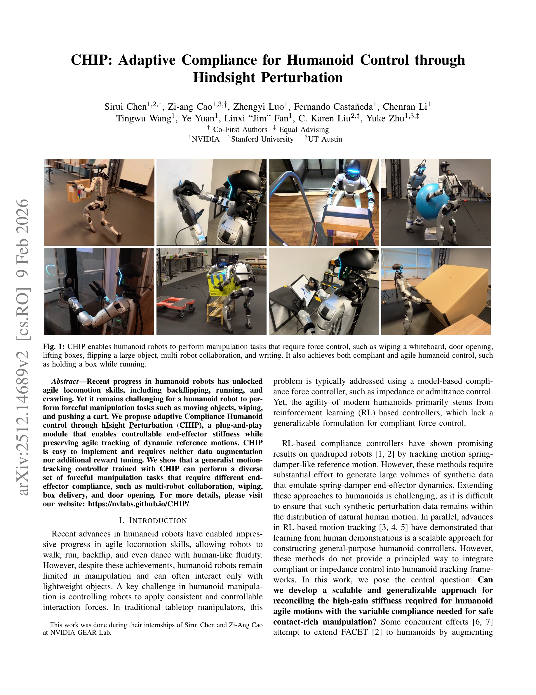

# CHIP: Adaptive Compliance for Humanoid Control through Hindsight Perturbation

> **저자**: Sirui Chen, Zi-ang Cao, Zhengyi Luo, Fernando Castañeda, Chenran Li, Tingwu Wang, Ye Yuan, Linxi "Jim" Fan, C. Karen Liu, Yuke Zhu | **날짜**: 2026-02-09 | **DOI**: [10.48550/arXiv.2512.14689](https://doi.org/10.48550/arXiv.2512.14689)

---

## Essence

*Fig. 1: CHIP enables humanoid robots to perform manipulation tasks that require force control, such as wiping a whiteboa*

CHIP는 hindsight perturbation을 통해 humanoid robot의 motion tracking 프레임워크에 적응형 compliance control을 통합하는 plug-and-play 모듈로, 민첩한 움직임을 유지하면서 힘 제어가 필요한 조작 작업을 수행할 수 있게 한다.

## Motivation

- **Known**: Humanoid robot은 Deep-Mimic 기반의 RL motion tracking을 통해 agile locomotion을 달성했으나, compliance가 필요한 조작 작업에서는 제한적이다. 기존 방법들(UniFP, FACET, SoftMimic)은 합성 데이터 증강이나 reward 재설계를 요구한다.
- **Gap**: RL 기반 motion tracking 프레임워크에서 stiffness와 compliance 요구사항을 동시에 만족시키는 scalable하고 generalizable한 접근법이 부재하다. 기존 compliance 학습 방법은 large-scale human motion dataset 확장에 어려움이 있다.
- **Why**: Humanoid robot의 실용적 활용을 위해서는 wiping, door opening, object manipulation 등 힘 제어가 필요한 다양한 작업을 안전하고 효과적으로 수행해야 하며, 동시에 기존의 민첩한 movement 능력을 보존해야 한다.
- **Approach**: Reference motion을 hindsight에서 로봇의 compliant response로 해석하여, sparse tracking goal에만 perturbation effect를 제거함으로써 dense reward 계산은 원본 reference motion으로 유지한다. 이를 통해 기존 motion tracking 프레임워크에 minimal modification으로 compliance 제어를 통합한다.

## Achievement

*Fig. 1: CHIP enables humanoid robots to perform manipulation tasks that require force control, such as wiping a whiteboa*

- **Plug-and-play CHIP 모듈**: 기존 humanoid motion tracking 프레임워크에 minimal modification으로 통합 가능하며, 데이터 증강이나 reward tuning 불필요
- **Local 3-point tracking**: Head와 두 손의 motion을 추적하는 compliant controller로 VR 기반 teleoperation과 Vision Language Action(VLA) policy learning 지원
- **Global 3-point tracking**: 다중 로봇 간 좌표화된 grasping과 object transportation 실현
- **다양한 조작 작업**: Wiping, writing, door opening, box delivery, cart pushing, multi-robot collaboration 등 diverse forceful manipulation 작업 수행
- **Agility 보존**: Dancing, running, squatting 등 기존 agile locomotion 능력 유지

## How

*Fig. 2: Overview of training and deployment of CHIP: this general formulation takes tracking targets, end-effector compl*

- Reference motion을 perturbation에 대한 compliant response로 hindsight 해석
- Original reference motion으로부터 sparse tracking goal(head, wrist positions)에서만 perturbation effect를 제거
- Dense reward computation은 unmodified reference motion으로 유지하여 tracking quality 보존
- RL 정책이 tracking goal과 reference motion 간의 차이를 compliance로 학습
- Impedance control 원리를 RL online loop에 직접 통합하여 spring-damper-like behavior 유도
- Standard motion tracking 프레임워크(Deep-Mimic 기반)에 가벼운 수정으로 적용

## Originality

- Hindsight perturbation이라는 novel perspective: reference motion 자체는 수정하지 않고 tracking goal만 선택적으로 조정
- 기존 synthetic data augmentation 대신 input space 수정에 집중하는 새로운 접근법
- RL-based motion tracking과 impedance control을 direct하게 통합하는 원리적 해결책
- Quadruped 기반 compliance 학습(FACET)을 humanoid로 효과적으로 확장

## Limitation & Further Study

- 실제 로봇 플랫폼에서의 검증 부족 - 대부분 시뮬레이션 기반 결과
- Hindsight perturbation의 이론적 수렴 보장이나 stability 분석 미흡
- Contact force의 정확한 크기 제어보다는 relative compliance 조정에 중점
- 다양한 humanoid morphology에 대한 일반화 가능성 검증 필요
- 후속 연구: 실제 하드웨어 플랫폼 적용, tactile feedback 통합, 더 복잡한 multi-contact manipulation 시나리오 확대

## Evaluation

- Novelty: 4/5
- Technical Soundness: 3/5
- Significance: 4/5
- Clarity: 4/5
- Overall: 4/5

**총평**: CHIP는 elegantly simple하면서도 practical한 해결책으로, 기존 humanoid motion tracking에 compliance control을 scalable하게 통합한다. Hindsight perturbation이라는 핵심 아이디어는 RL과 classical control을 효과적으로 결합하며, 다양한 실제 작업에서의 광범위한 적용 가능성을 보여준다.

## Related Papers

- 🔗 후속 연구: [[papers/1287_BeyondMimic_From_Motion_Tracking_to_Versatile_Humanoid_Contr/review]] — motion tracking 프레임워크에서 적응형 compliance 제어가 plug-and-play로 통합된다
- 🔄 다른 접근: [[papers/1315_Composite_Motion_Learning_with_Task_Control/review]] — 휴머노이드 제어에서 hindsight perturbation과 적응형 보조 힘의 다른 적응 방식이다
- 🏛 기반 연구: [[papers/1320_Coordinated_Humanoid_Manipulation_with_Choice_Policies/review]] — 통합 휴머노이드 조작에서 적응형 compliance가 Choice Policy의 기초 제어가 된다
- 🧪 응용 사례: [[papers/1436_HAIC_Humanoid_Agile_Object_Interaction_Control_via_Dynamics-/review]] — 민첩한 물체 상호작용에서 적응형 compliance 제어가 동역학 인식에 적용된다
- 🔄 다른 접근: [[papers/1315_Composite_Motion_Learning_with_Task_Control/review]] — 휴머노이드 적응 학습에서 보조 힘과 hindsight perturbation의 다른 보조 방식이다
- 🔗 후속 연구: [[papers/1320_Coordinated_Humanoid_Manipulation_with_Choice_Policies/review]] — Choice Policy 기반 모방학습에서 적응형 compliance 제어가 기초 제어로 활용된다
