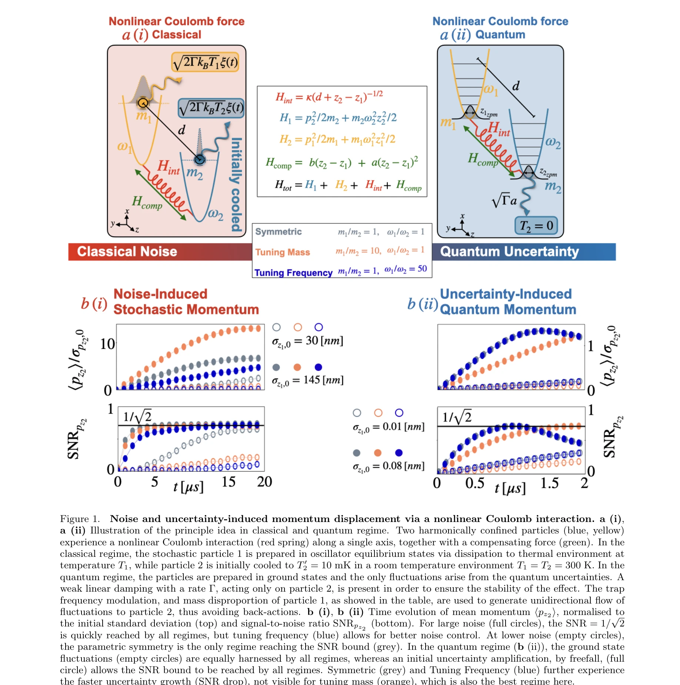
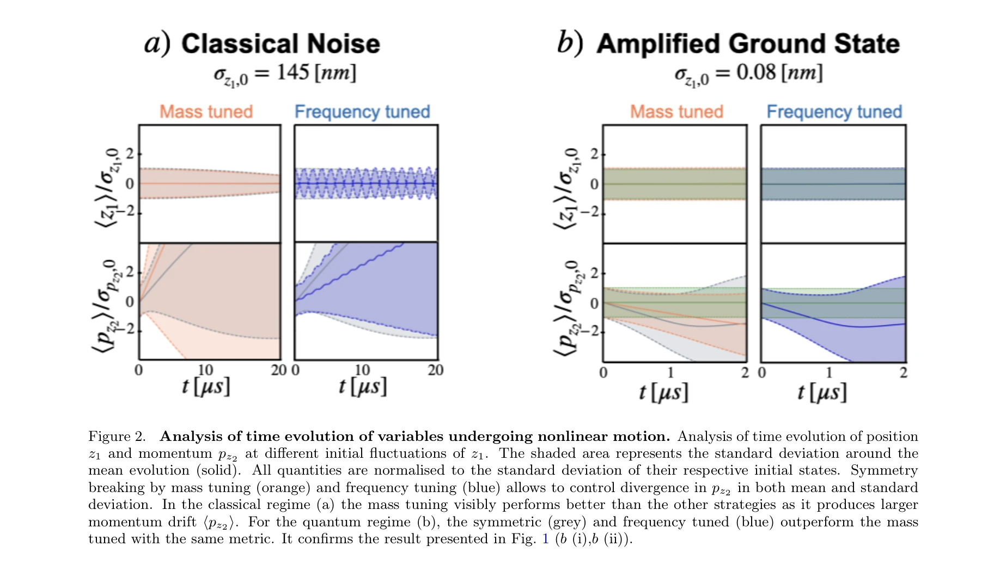

# Climber Force and Motion Estimation from Video

> **저자**:  | **날짜**:  | **URL**: [https://rihat99.github.io/climb_force/](https://rihat99.github.io/climb_force/)

---

## Essence

*Figure 1.*

쿨롱 상호작용으로부터 발생하는 3차 비선형 항을 이용하여 한 입자의 위치 잡음이 다른 입자의 모멘텀을 간섭적으로 변위시키는 현상을 고전 및 양자 영역에서 이론적으로 제시한다.

## Motivation

- **Known**: 조화 포텐셜에 갇힌 대전 입자들 간의 쿨롱 상호작용은 조화 근사에서 결합된 조화 진동자로 기술되며, 선형 양자 시스템의 제어는 광범위하게 달성되어 있다.
- **Gap**: 조화 근사를 넘어서는 비선형 쿨롱 효과, 특히 거시적 기계 시스템에서의 직접 관측 가능한 비상호적 비선형 현상은 충분히 탐구되지 않았다.
- **Why**: 제어 가능한 비선형 양자 상호작용은 현대 양자 기술에 필수적이며, 기본 물리 상수인 쿨롱 력으로부터 자연스럽게 구현될 수 있다면 양자 센싱, 양자 열역학, 양자 컴퓨팅 등 광범위한 응용이 가능해진다.
- **Approach**: 2개 대전 입자의 쿨롱 상호작용 해밀턴인에서 조화 항을 보상 선형력으로 제거하고, 남은 3차 비선형 항 H₃ ≈ κ/d⁴(z₁-z₂)³을 분석한다. 고전 열잡음 및 양자 불확정성 기반 역학을 모두 검토한다.

## Achievement

*Figure 2.*

- **비선형 쿨롱 상호작용의 이론적 격리**: 조화 근사 이상의 3차 항만을 추출하는 최소 모델 제시
- **비상호적 잡음-유도 모멘텀 변위**: 한 입자의 위치 잡음/불확정성이 다른 입자의 모멘텀을 간섭적으로 변위시키는 신호대잡음비(SNR) 증가 현상 예측
- **광범위한 파라미터 공간 검증**: 매개변수 공간(질량, 트랩 주파수)의 넓은 범위에서 고전 및 양자 영역 모두에서 효과 관측 가능성 입증
- **실험적 구현 가능성**: levitated nanoparticles에서 trapped ions에 이르는 다양한 플랫폼에서 실현 가능성 논의

## How

*Figure 1.*

- 조화 포텐셜로 제한된 2개 대전 입자 시스템의 해밀턴인 (식 1) 구성
- 선형 보상력(정전기적 기울기, 매개변수 피드백)을 적용하여 상수 및 1차 항 제거
- Taylor 전개의 3차 항만 유지하여 최소 비선형 모델 도출 (식 2)
- 고전 영역: 초기 열 상태의 비대칭 준비(입자 2는 냉각, 입자 1은 실온)로 잡음 구동 현상 분석
- 양자 영역: 기저 상태에서 양자 불확정성만 고려한 유사 분석
- SNR 변화를 통한 비선형 효과 정량화

## Originality

- **조화 근사 뛰어넘기**: 기존 rotating wave approximation이나 engineered cubic interactions 대신, 기본 쿨롱 력의 고차 전개항에서 직접 비선형성 추출
- **비상호성의 통합 관점**: 상호적(reciprocal) 쿨롱 상호작용에서 비상호적(non-reciprocal) 현상 도출 메커니즘 명확화
- **고전-양자 통일 프레임**: 동일한 물리 원리로 stochastic 및 quantum 영역 현상을 동시에 분석

## Limitation & Further Study

- **경쟁하는 비선형항의 상쇄**: 단일입자 비선형항(z₁³, z₂³)과 쌍 비선형항(z₁z₂², z₂¹z₂)이 상반되어 직접 관측 어려움 가능성
- **최적 보상 가정**: 완전한 선형 항 제거를 가정하나, 실제 구현에서는 잔여 항이 가시성을 감소시킬 수 있음
- **3차 전개의 유효성**: 더 큰 잡음 /운동 진폭에서 4차 이상 항의 역할 미평가
- **후속 연구**: 가우시안 얽힘(Gaussian entanglement) 이상의 비고전적 상관(non-Gaussian correlations) 탐구 필요

## Evaluation

- Novelty: 4/5
- Technical Soundness: 3/5
- Significance: 4/5
- Clarity: 4/5
- Overall: 4/5

**총평**: 기본 물리 상수인 쿨롱 력의 비선형 부분을 정교하게 격리하여 고전-양자 통일 이론을 제시하는 우수한 개념 논문이며, 실험적 검증 가능성과 양자 기술 응용 전망이 높으나 경쟁 비선형항의 실제 효과는 추가 분석이 필요하다.

## Related Papers

- 🏛 기반 연구: [[papers/1313_Aspects_of_entanglement_with_background_electric_and_magneti/review]] — 쿨롱 상호작용의 3차 비선형 항이 배경 전기장에서 입자쌍 생성의 양자장론적 기초를 제공합니다.
- 🔗 후속 연구: [[papers/1530_Revised_identification_of_strain_gradient_elastic_parameters/review]] — 입자 모멘텀 간섭 현상이 granular mechanics의 strain gradient 탄성 매개변수 식별로 확장 적용됩니다.
- 🔄 다른 접근: [[papers/1587_Time-Transient_Wireless_RF_Sensor_with_Differentiative_Detec/review]] — 물리학적 상호작용 분석과 RF 센서 기반 물성 감지의 서로 다른 물질 특성 연구 방법을 비교할 수 있습니다.
- 🏛 기반 연구: [[papers/1530_Revised_identification_of_strain_gradient_elastic_parameters/review]] — granular mechanics의 strain gradient 매개변수가 쿨롱 상호작용 비선형 항의 미시역학적 기초를 제공합니다.
- 🔄 다른 접근: [[papers/1587_Time-Transient_Wireless_RF_Sensor_with_Differentiative_Detec/review]] — RF 센서 기반 물성 감지와 물리학적 입자 상호작용 분석의 서로 다른 물질 특성 연구 접근법을 비교합니다.
- 🔗 후속 연구: [[papers/1313_Aspects_of_entanglement_with_background_electric_and_magneti/review]] — 배경 자기장이 전기장 생성 입자쌍 entanglement에 미치는 영향이 쿨롱 상호작용 비선형 항 연구로 확장됩니다.
