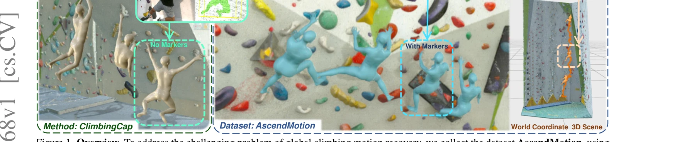
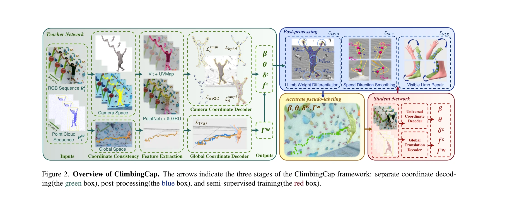

# ClimbingCap: Multi-Modal Dataset and Method for Rock Climbing in World Coordinate

> **저자**: Ming Yan, Xincheng Lin, Yuhua Luo, Shuqi Fan, Yudi Dai, Qixin Zhong, Lincai Zhong, Yuexin Ma, Lan Xu, Chenglu Wen, Siqi Shen, Cheng Wang | **날짜**: 2025-03-27 | **URL**: [https://arxiv.org/abs/2503.21268](https://arxiv.org/abs/2503.21268)

---

## Essence

*Figure 1. Overview. To address the challenging problem of global climbing motion recovery, we collect the dataset Ascend*

암벽 등반의 복잡한 자세와 전역 위치 추정을 위해 RGB, LiDAR, IMU를 통합한 대규모 멀티모달 데이터셋 AscendMotion과 전역 좌표계에서 등반 동작을 복원하는 ClimbingCap 방법을 제안한다.

## Motivation

- **Known**: Human Motion Recovery(HMR) 연구는 주로 달리기 같은 지면 기반 동작에 집중했으며, 기존 공개 등반 데이터셋은 SPEED21(2D)과 CIMI4D(규모 작음, 비숙련자 데이터)에 불과하다.
- **Gap**: 등반은 오프그라운드 동작으로 복잡한 자세와 전역 위치의 정확한 복원이 필요하지만, 대규모 3D 레이블링된 등반 데이터셋의 부재와 기존 global HMR 방법들의 등반 동작 적응 실패가 해결되지 않았다.
- **Why**: 올림픽 정식 종목으로 등재된 암벽 등반의 기술 분석, 코칭, 부상 방지 등을 위해 정확한 동작 캡처 기술이 필요하며, 지면 기반과 다른 오프그라운드 동작의 이해가 HMR 분야의 확장성에 중요하다.
- **Approach**: 별도 좌표 디코딩(RGB로 카메라 좌표, LiDAR로 전역 좌표 추정), 후처리(두 좌표계 일관성 보정), 반지도 학습(teacher-student 방식으로 레이블 없는 데이터 활용)의 삼중 전략을 통해 등반 동작을 복원한다.

## Achievement

*Figure 1. Overview. To address the challenging problem of global climbing motion recovery, we collect the dataset Ascend*

- **AscendMotion 데이터셋**: 412k 프레임(RGB, LiDAR, IMU), 22명의 숙련된 등반 코치, 12개의 서로 다른 암벽, 전역 궤적 레이블 포함으로 기존 CIMI4D(180k 프레임)보다 2배 이상 규모 및 난이도 증대
- **ClimbingCap 방법**: 멀티모달 입력을 활용한 전역 좌표계 HMR로 기존 global HMR 방법들을 능가하는 성능 달성
- **포괄적 검증**: AscendMotion 및 CIMI4D 데이터셋에서 최신 방법들과의 광범위한 실험을 통해 방법의 우수성 입증

## How

*Figure 2. Overview of ClimbingCap. The arrows indicate the three stages of the ClimbingCap framework: separate coordinat*

- RGB 이미지에서 camera-space 자세 추정을 위해 CNN 기반 특징 추출 및 회귀
- LiDAR 점군을 세계 좌표계로 변환(Pc = Ωw2c · Pw)하여 전역 위치 및 방향 추정
- 분리된 좌표 디코딩 결과를 post-processing 단계에서 일관성 최적화를 통해 통합
- 레이블 없는 등반 데이터에 대해 teacher-student semi-supervised 학습 적용으로 모델 성능 강화
- 자동 주석과 수동 정제 결합으로 높은 정확도의 모션 레이블링

## Originality

- 등반 동작의 특성(오프그라운드, 복잡한 자세, 벽과의 상호작용)을 반영한 맞춤형 HMR 방법 설계로 일반적 global HMR의 한계 극복
- RGB와 LiDAR 모달리티의 역할 분리(카메라/전역 좌표 각각)를 통한 혁신적 멀티모달 통합 전략
- 대규모 숙련자 데이터 기반의 첫 본격적 등반 HMR 데이터셋 구축으로 분야 기초 마련
- Semi-supervised 학습을 통한 레이블 없는 데이터 활용으로 현실적 데이터 수집 부담 완화

## Limitation & Further Study

- 실험이 주로 실내 암벽 환경에 한정되어 실외 자연 암벽 등반 동작 일반화 가능성 미검증
- LiDAR 센서의 높은 비용과 야외 환경 작동 제약으로 실제 스포츠 응용의 확장성 제한 가능
- 장시간 등반 시퀀스에서의 누적 오차 특성과 경계 조건(top-out 동작 등) 처리에 대한 상세 분석 부족
- 후속 연구로 경량 센서 조합, 야외 환경 강화 학습, 다양한 등반 스타일의 더 넓은 피험자 군 확보 필요

## Evaluation

- Novelty: 4/5
- Technical Soundness: 3/5
- Significance: 4/5
- Clarity: 4/5
- Overall: 4/5

**총평**: 등반 동작 캡처라는 미개척 분야에 대규모 고품질 데이터셋과 멀티모달 맞춤형 방법을 제시하여 HMR 분야의 확장성을 입증했으며, 공개 공개와 현장 적용 가능성이 높아 학술 및 실용적 가치가 크다.

## Related Papers

- 🔄 다른 접근: [[papers/1403_FRAME_Floor-aligned_Representation_for_Avatar_Motion_from_Eg/review]] — egocentric motion capture를 다른 센서 모달리티와 환경에서 수행하는 접근법이다
- 🔗 후속 연구: [[papers/1338_DexterCap_An_Affordable_and_Automated_System_for_Capturing_D/review]] — 손가락 동작 캡처를 전신 복잡 동작 캡처로 확장한 기술적 발전이다
- 🏛 기반 연구: [[papers/1487_HUMOTO_A_4D_Dataset_of_Mocap_Human_Object_Interactions/review]] — 복잡한 인간-물체 상호작용 데이터 구축의 방법론적 기반을 제공한다
- 🏛 기반 연구: [[papers/1338_DexterCap_An_Affordable_and_Automated_System_for_Capturing_D/review]] — 복잡한 동작 캡처 시스템의 기술적 기반과 방법론을 제공한다
- 🔄 다른 접근: [[papers/1403_FRAME_Floor-aligned_Representation_for_Avatar_Motion_from_Eg/review]] — egocentric motion capture를 다른 센서와 알고리즘으로 구현한 접근법이다
