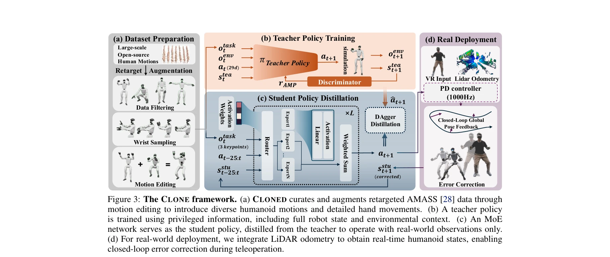

# CLONE: Closed-Loop Whole-Body Humanoid Teleoperation for Long-Horizon Tasks

> **저자**: Yixuan Li, Yutang Lin, Jieming Cui, Tengyu Liu, Wei Liang, Yixin Zhu, Siyuan Huang | **날짜**: 2025-06-10 | **URL**: [https://arxiv.org/abs/2506.08931](https://arxiv.org/abs/2506.08931)

---

## Essence

CLONE은 MoE 기반 정책과 폐루프 오류 수정을 결합한 인형 휴머노이드 텔레오퍼레이션 시스템으로, MR 헤드셋의 헤드와 핸드 추적만으로 장시간 전신 협응 제어와 정밀한 위치 유지를 실현한다.

## Motivation

- **Known**: 현재 휴머노이드 텔레오퍼레이션은 안정성을 위해 상하체 제어를 분리하거나 폐루프 피드백 없이 개루프로 동작하여 위치 드리프트가 누적된다.
- **Gap**: 전신 협응을 유지하면서 장시간 작업 동안 정확한 전역 위치 추적을 동시에 달성하는 텔레오퍼레이션 시스템이 부재하다.
- **Why**: 휴머노이드 로봇이 복잡한 환경에서 조작과 이동을 통합한 작업을 수행하려면 직관적이면서도 정밀한 전신 제어가 필수적이며, 이는 가정용 보조 및 위험 환경 작업 등 실제 응용에 중요하다.
- **Approach**: MoE 아키텍처로 다양한 모션 스킬을 학습하면서 LiDAR 오도메트리와 Apple Vision Pro 추적을 통한 폐루프 오류 수정 메커니즘으로 위치 드리프트를 방지한다.

## Achievement

*Figure 3: The CLONE framework. (a) CLONED curates and augments retargeted AMASS [28] data through*

- **첫 MoE 기반 전신 텔레오퍼레이션 프레임워크**: 상하체 협응을 유지하면서 다양한 모션 스킬을 통합적으로 학습할 수 있는 아키텍처 구현
- **폐루프 오류 수정 시스템**: LiDAR 오도메트리 기반 실시간 전역 위치 피드백으로 장거리 궤적에서 최소 위치 드리프트 달성
- **CLONED 데이터셋**: AMASS를 온라인 핸드 오리엔테이션 생성 방법으로 증강하여 복잡한 조작 시나리오에 강건한 일반화 제공
- **실제 성능 입증**: 상용 MR 헤드셋 최소 입력만으로 지면에서 물체 집기 등 복잡한 협응 움직임 실현

## How

*Figure 3: The CLONE framework. (a) CLONED curates and augments retargeted AMASS [28] data through*

- AMASS 모션 캡처 데이터를 필터링, 손목 샘플링, 모션 편집으로 전처리하고 온라인 핸드 오리엔테이션 생성 방법을 적용
- Teacher Policy π를 Discriminator 기반 adversarial motion prediction (AMP) 보상으로 훈련하여 전신 협응 학습
- MoE 아키텍처의 Router가 입력 특징에 따라 N개의 Expert 중 가중 조합을 선택하여 다양한 모션에 적응
- VR 입력(3개 키포인트: 헤드, 양손)과 LiDAR 오도메트리로부터의 전역 위치 오류를 실시간으로 감지하고 보정된 상태(s_t^u corrected)로 정책 입력 조정
- PD 컨트롤러(1000Hz)로 보정된 정책 출력을 저수준 액튜에이터 명령으로 변환하여 Unitree G1 로봇에 배포

## Originality

- MoE 기반 정책을 휴머노이드 텔레오퍼레이션에 처음 적용하여 상하체 분리 없이 자연스러운 협응 움직임 실현
- LiDAR 오도메트리를 폐루프 오류 수정에 통합함으로써 이족 보행 로봇의 누적 위치 드리프트 문제를 체계적으로 해결
- 온라인 핸드 오리엔테이션 생성 방법으로 기존 모션 캡처 데이터셋의 조작 작업 표현 부족을 보완
- 상용 MR 헤드셋(Apple Vision Pro)만을 입력으로 사용하면서 전신 텔레오퍼레이션을 실현한 실용적 접근

## Limitation & Further Study

- LiDAR 오도메트리의 정확도는 환경의 특성(예: 반사면, 동적 장애물)에 의존하며, GNSS가 불가능한 실내 환경에서의 장시간 드리프트 누적 가능성
- MoE 라우터의 Expert 선택이 휴리스틱 기반일 가능성이 있어, 모션 경계 영역(예: 보행에서 조작으로의 전환)에서의 성능이 명확하지 않음
- CLONED 데이터셋이 특정 휴머노이드 형태(Unitree G1)와 연산자 특성에 편향될 수 있어, 다른 휴머노이드 플랫폼으로의 전이 성능 미검증
- 폐루프 오류 수정 메커니즘이 실패한 경우(예: LiDAR 블라인드 영역 진입)의 안전성 및 폴백 전략 부재
- **후속연구**: (1) 적응적 LiDAR 오도메트리 또는 하이브리드 센싱(비전 + 관성계측)을 통한 센서 강건성 향상, (2) 다양한 휴머노이드 형태에 대한 도메인 적응 학습, (3) 불완전한 폐루프 상황에서의 점진적 오류 복구 메커니즘 개발

## Evaluation

- Novelty: 4/5
- Technical Soundness: 3/5
- Significance: 4/5
- Clarity: 4/5
- Overall: 4/5

**총평**: CLONE은 MoE 기반 정책과 LiDAR 기반 폐루프 오류 수정을 창의적으로 결합하여 휴머노이드 텔레오퍼레이션의 두 가지 근본 과제(전신 협응과 위치 드리프트)를 동시에 해결한 의미 있는 기여이며, 상용 MR 헤드셋만으로 복잡한 장시간 작업을 실현한 점에서 실용성과 확장성이 높다.

## Related Papers

- 🔗 후속 연구: [[papers/1240_A_Closed-Form_Geometric_Retargeting_Solver_for_Upper_Body_Hu/review]] — MR 헤드셋 기반 텔레오퍼레이션에서 상체 실시간 역기구학이 전신 제어에 확장된다
- 🔄 다른 접근: [[papers/1246_A_Rapid_Instrument_Exchange_System_for_Humanoid_Robots_in_Mi/review]] — MR 헤드셋 원격조작에서 장시간 협응과 수술용 정밀 조작의 다른 응용 분야다
- 🔄 다른 접근: [[papers/1302_CHILD_Controller_for_Humanoid_Imitation_and_Live_Demonstrati/review]] — 휴머노이드 전신 텔레오퍼레이션에서 MR 헤드셋과 베이비 캐리어 형태의 다른 인터페이스다
- 🏛 기반 연구: [[papers/1598_Open-TeleVision_Teleoperation_with_Immersive_Active_Visual_F/review]] — 몰입형 능동 시각 텔레오퍼레이션에서 MR 헤드셋의 헤드-핸드 추적이 기초가 된다
- 🔄 다른 접근: [[papers/1302_CHILD_Controller_for_Humanoid_Imitation_and_Live_Demonstrati/review]] — 휴머노이드 전신 텔레오퍼레이션에서 베이비 캐리어 형태와 MR 헤드셋의 다른 인터페이스다
- 🔄 다른 접근: [[papers/1240_A_Closed-Form_Geometric_Retargeting_Solver_for_Upper_Body_Hu/review]] — MR 헤드셋 기반 전신 텔레오퍼레이션에서 상체 제어의 실시간 역기구학 해법이 필요하다
- 🔄 다른 접근: [[papers/1246_A_Rapid_Instrument_Exchange_System_for_Humanoid_Robots_in_Mi/review]] — HMD 기반 몰입형 원격조작에서 수술과 일반 조작의 다른 접근 방식이다
- 🧪 응용 사례: [[papers/1591_OmniClone_Engineering_a_Robust_All-Rounder_Whole-Body_Humano/review]] — OmniClone의 견고한 전신 휴머노이드 제어 기술이 CLONE의 장기 텔레오퍼레이션 시스템에서 실제 적용될 수 있다.
