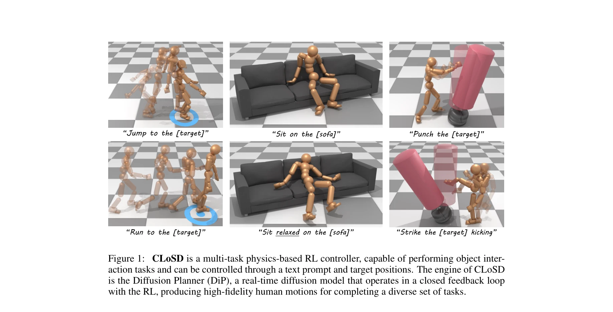

# CLoSD: Closing the Loop between Simulation and Diffusion for multi-task character control

> **저자**: Guy Tevet, Sigal Raab, Setareh Cohan, Daniele Reda, Zhengyi Luo, Xue Bin Peng, Amit H. Bermano, Michiel van de Panne | **날짜**: 2024-10-04 | **URL**: [https://arxiv.org/abs/2410.03441](https://arxiv.org/abs/2410.03441)

---

## Essence

*Figure 1: CLoSD is a multi-task physics-based RL controller, capable of performing object inter-*

Motion diffusion 모델과 physics-based RL 제어의 강점을 결합하여 text 기반의 다중 작업 캐릭터 제어를 수행하는 CLoSD를 제안한다. Diffusion Planner(DiP)와 tracking controller 간의 closed-loop 상호작용을 통해 텍스트 프롬프트와 목표 위치로 제어 가능한 물리 시뮬레이션 기반 캐릭터 제어를 실현한다.

## Motivation

- **Known**: Motion diffusion 모델은 다양한 모션 생성에 탁월하나 물리적 타당성이 부족하고, RL 기반 제어는 물리적 타당성을 보장하나 데이터 확장성이 제한적이다. 최근 text-to-motion과 physics-based 제어 관련 연구들이 진행되고 있다.
- **Gap**: 기존 접근법들은 diffusion 기반 text-to-motion과 physics-based RL 제어를 단순히 연결하거나 한 작업에만 특화되어 있어, 다양한 작업을 seamlessly 수행하면서도 물리적 타당성과 환경 상호작용을 동시에 만족하는 방법이 부족하다.
- **Why**: Interactive text-driven 제어, 객체 상호작용, 다중 작업 처리를 동시에 달성할 수 있는 통합 시스템의 개발은 실제 애플리케이션(게임, 애니메이션, 로봇)에서 중요하며, 현존하는 단일 목적 제어 방식의 한계를 극복하는 데 의의가 있다.
- **Approach**: Motion diffusion을 real-time auto-regressive 모델(DiP)로 재구성하여 텍스트와 목표 위치 조건으로 빠른 motion planning을 수행하고, 이를 PHC 기반의 robust motion tracking 정책과 closed-loop으로 연결한다. 환경 피드백을 DiP에 fed back하여 interactive control을 실현하고, 모든 작업을 대상으로 한 in-the-loop fine-tuning을 수행한다.

## Achievement

*Figure 1: CLoSD is a multi-task physics-based RL controller, capable of performing object inter-*

- **Real-time Diffusion Planning**: DiP를 통해 40-frame 모션을 3,500 fps(175× real-time)로 생성하여 실시간 제어 가능
- **Multi-task 통합 제어**: 단일 정책으로 goal-reaching, target-striking, couch interaction 등 다양한 작업을 seamlessly 수행
- **폐쇄루프 상호작용**: 환경 피드백을 diffusion 모델에 autoregressive하게 반영하여 interactive text-driven 제어 실현
- **우수한 성능**: 기존 text-to-motion 제어 방식과 멀티태스크 제어 방식을 모두 능가
- **객체 상호작용**: 물리 기반 시뮬레이션으로 foot sliding, floating 등 kinematic 모션의 아티팩트 제거

## How

*Figure 2: CLoSD Overview. (Left) DiP is a rapid auto-regressive diffusion model conditioned on*

- **Motion Representation 변환**: HumanML3D 표현(relative)에서 PHC 표현(global)으로 R2G() 함수를 통해 변환
- **Diffusion Planner(DiP) 구축**: Text 인코더와 위치 조건을 받아 auto-regressive diffusion으로 10 diffusion steps 내에 모션 생성
- **RL Tracking Controller**: PHC 기반의 robust motion imitator를 사용하여 DiP 생성 모션을 물리 시뮬레이션에서 추적
- **Closed-loop 연결**: RL controller의 실행 결과(character state)를 DiP에 fed back하여 다음 모션 계획 생성
- **In-the-loop Fine-tuning**: DiP와 상호작용하는 상황에 대해 tracking RL 정책을 재학습하여 mismatch 해결
- **Multi-task 학습**: Goal-reaching, striking, sitting 등 여러 작업을 동시에 학습하는 universal fine-tuning process 적용

## Originality

- **Diffusion을 계획 모듈로 재해석**: 기존의 offline 생성 용도에서 벗어나 real-time planning 에이전트로 diffusion 모델을 활용한 새로운 관점
- **Closed-loop 구조**: Diffusion-based planner와 RL-based executor 간의 양방향 피드백을 통해 interactive control 실현
- **In-the-loop Fine-tuning**: 실제 closed-loop 상태 분포에서 RL 정책을 재학습하는 체계적 접근으로 sim-to-real gap 완화
- **Text + 위치 하이브리드 제어**: 텍스트로 의도/스타일을 지정하고 위치로 정확한 타겟 제어를 가능하게 하는 이중 조건화 메커니즘

## Limitation & Further Study

- **Computational 의존성**: DiP 성능이 기반 diffusion 모델의 품질에 의존하며, 모델 크기와 계산 비용에 대한 상세 분석 부족
- **Task 확장성**: 현재 제시된 작업(navigation, striking, sitting)에 한정되어 있으며, 더 복잡한 멀티-에이전트나 장시간 시퀀스에 대한 평가 미흡
- **Motion Representation 변환**: HumanML3D에서 PHC로의 변환 과정에서 정보 손실 가능성과 두 표현 간 호환성 문제 미상세 분석
- **Generalization**: 학습 데이터와 환경이 다른 상황에서의 transfer learning 성능에 대한 평가 부족
- **후속 연구**: (1) 더 다양한 작업과 복잡한 장면에서의 확장, (2) 다른 physics simulator와의 호환성 검증, (3) 실제 로봇에서의 sim-to-real transfer 검증

## Evaluation

- Novelty: 4/5
- Technical Soundness: 3/5
- Significance: 4/5
- Clarity: 4/5
- Overall: 4/5

**총평**: CLoSD는 diffusion 모델과 physics-based RL을 창의적인 closed-loop 구조로 통합하여 text-driven 다중 작업 제어의 새로운 패러다임을 제시한다. Real-time 성능과 다양한 객체 상호작용을 동시에 달성한 점에서 실질적 가치가 높으며, 향후 embodied AI와 interactive animation 분야에서 중요한 기초가 될 수 있다.

## Related Papers

- 🔄 다른 접근: [[papers/1419_Generative_World_Modelling_for_Humanoids_1X_World_Model_Chal/review]] — Generative World Modelling for Humanoids는 LEO와 유사한 3D 구체화 에이전트이지만 인간형 로봇에 특화된 생성형 접근법을 사용한다
- 🔗 후속 연구: [[papers/1476_Humanoid_World_Models_Open_World_Foundation_Models_for_Human/review]] — Humanoid World Models는 LEO의 3D 구체화 개념을 인간형 로봇을 위한 범용 제어기로 확장한다
- 🏛 기반 연구: [[papers/1517_PointWorld_Scaling_3D_World_Models_for_In-The-Wild_Robotic_M/review]] — PointWorld는 LEO의 3D 월드 모델링에 필요한 확장 가능한 3D 월드 모델의 기반을 제공한다
