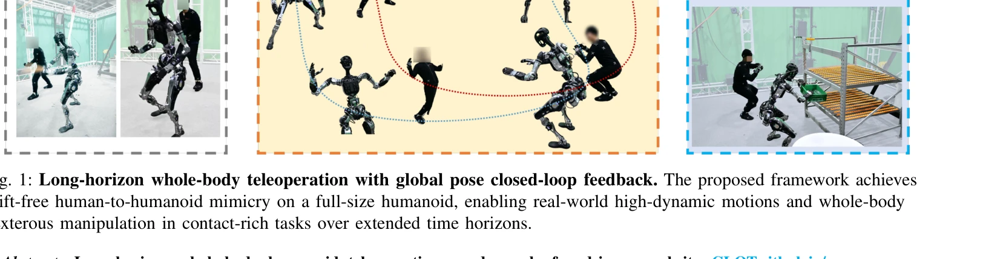

# CLOT: Closed-Loop Global Motion Tracking for Whole-Body Humanoid Teleoperation

> **저자**: Tengjie Zhu, Guanyu Cai, Yang Zhaohui, Guanzhu Ren, Haohui Xie, ZiRui Wang, Junsong Wu, Jingbo Wang, Xiaokang Yang, Yao Mu, Yichao Yan | **날짜**: 2026-02-13 | **URL**: [https://arxiv.org/abs/2602.15060](https://arxiv.org/abs/2602.15060)

---

## Essence

*Fig. 1: Long-horizon whole-body teleoperation with global pose closed-loop feedback. The proposed framework achieves*

CLOT는 고주파 위치 추정 피드백을 통해 폐루프 전역 자세 제어를 달성하는 실시간 인간형 로봇 전신 텔레오퍼레이션 시스템으로, 장기간 동안 전역 드리프트 없이 안정적인 동작을 가능하게 한다.

## Motivation

- **Known**: 최근 학습 기반 추적 방법들은 민첩하고 조화로운 동작을 가능하게 했지만, 로봇의 로컬 프레임에서 작동하며 전역 자세 피드백을 무시하여 장시간 실행 중 드리프트와 불안정성이 발생한다.
- **Gap**: 기존 전신 추적 시스템들은 로컬 로봇 프레임에서 동작하여 누적된 전역 자세 드리프트를 초래하고, 강화학습에서 전역 추적 보상을 직접 적용하면 공격적이고 취약한 수정이 발생한다.
- **Why**: 인간형 로봇의 장기간 안정적인 텔레오퍼레이션은 고품질의 실세계 데이터 수집 및 구현에 필수적이며, 전역 드리프트 제거는 안전성과 작업 성공률을 크게 향상시킨다.
- **Approach**: Observation Pre-shift라는 데이터 기반 무작위화 전략을 제안하여 관찰 궤적과 보상 신호를 분리하고, Transformer 기반 정책 네트워크와 adversarial motion prior (AMP) 정규화를 결합하며, 20시간의 엄격하게 선별된 인간 동작 데이터를 수집하여 학습한다.

## Achievement

*Fig. 1: Long-horizon whole-body teleoperation with global pose closed-loop feedback. The proposed framework achieves*

- **폐루프 전역 제어**: 고주파 위치 추정 피드백을 통해 전역 자세 폐루프 제어를 달성하는 실시간 전신 텔레오퍼레이션 시스템 개발
- **데이터 기반 무작위화 전략**: Observation Pre-shift 기법을 통해 관찰 궤적과 보상 신호를 분리하여 부드럽고 안정적인 전역 수정을 가능하게 함
- **인간 동작 데이터셋**: 불안정한 동작을 배제하는 엄격한 프로토콜로 수집한 20시간 이상의 다양한 인간 동작 데이터셋 구축
- **실세계 검증**: 31 DoF (손 제외) 전신 인간형 로봇 Adam Pro에서 높은 동적 성능, 고정밀 추적, 강력한 외란 거부 능력 및 접촉이 많은 조작 작업 수행 확인

## How

*Fig. 3: Overview of the CLOT pipeline. Phase 1: Data Pipeline. Human motion is captured using a hybrid optical–inertial*

- OptiTrack optical motion capture 시스템을 이용하여 인간 동작과 로봇 전역 자세를 고정밀로 동시 기록
- Pinocchio IK solver를 사용하여 캡처된 인간 동작을 온라인으로 로봇 목표 궤적으로 변환 (역기구학)
- Observation Pre-shift 무작위화: 주기적으로 관찰의 목표 자세를 무작위 미래 타임스탬프로 설정하면서 추적 보상은 현재 시간과 일치
- Transformer 기반 정책 네트워크 설계로 시공간 정보 캡처 능력 향상
- Adversarial Motion Prior (AMP) 보상을 통해 부자연스러운 동작 억제
- PPO (Proximal Policy Optimization) 알고리즘으로 1300 GPU시간 이상 학습
- 손과 손가락 동작에 대해서는 변환된 조인트 참조값에 직접 PD 추적 적용

## Originality

- 폐루프 전역 자세 제어와 전신 추적을 결합한 혁신적인 접근법으로, 기존 로컬 프레임 중심 시스템의 한계 극복
- Observation Pre-shift라는 관찰과 보상 신호 분리 전략은 암묵적 동작 보간 학습을 가능하게 하는 독창적 기법
- 텔레오퍼레이션 특화 인간 동작 데이터셋 수집의 엄격한 프로토콜 설계로 기존 공개 애니메이션 데이터셋의 한계 개선
- 고주파 위치 추정 피드백을 통한 실시간 폐루프 동작 추적이라는 새로운 패러다임 제시

## Limitation & Further Study

- 연구에서 사용한 모션 캡처 시스템 의존성으로 인해 실제 현장 배포 환경에서의 적용 제한 가능성
- 20시간의 인간 동작 데이터는 제한적일 수 있으며, 매우 이례적이거나 극한의 동작에 대한 일반화 성능 미확인
- Adam Pro 특정 로봇에 대한 학습으로, 다른 인간형 로봇으로의 전이 학습(transfer learning) 성능 미검증
- 손 제외 31 DoF 제어이므로 세밀한 손가락 동작이 필요한 조작 작업의 한계
- 후속 연구에서는 모션 캡처 시스템 없이 카메라 기반 비전 피드백으로의 확장, 더 다양한 인간형 로봇 플랫폼으로의 일반화, 극한 동작에 대한 데이터 강화 필요

## Evaluation

- Novelty: 4/5
- Technical Soundness: 4/5
- Significance: 4/5
- Clarity: 4/5
- Overall: 4/5

**총평**: CLOT는 폐루프 전역 자세 제어, 혁신적 Observation Pre-shift 무작위화 전략, 엄격하게 선별된 인간 동작 데이터를 결합하여 장기간 드리프트 없는 안정적인 인간형 로봇 텔레오퍼레이션을 최초로 실현한 기여도 높은 연구이다.

## Related Papers

- 🔗 후속 연구: [[papers/1271_Architecture_Is_All_You_Need_Diversity-Enabled_Sweet_Spots_f/review]] — 견고한 제어 구조 설계에 RSR 루프의 시뮬레이션 개선 방법론을 추가한다
- 🔄 다른 접근: [[papers/1310_CMR_Contractive_Mapping_Embeddings_for_Robust_Humanoid_Locom/review]] — sim-to-real 갭 해소에서 시뮬레이션 개선 대신 수축 매핑 기반 견고성 확보 방법을 제시한다
- 🏛 기반 연구: [[papers/1580_MOSAIC_Bridging_the_Sim-to-Real_Gap_in_Generalist_Humanoid_M/review]] — MOSAIC의 sim-to-real 전이에 RSR 루프의 점진적 개선 방법론을 활용한다
- 🔄 다른 접근: [[papers/1310_CMR_Contractive_Mapping_Embeddings_for_Robust_Humanoid_Locom/review]] — 견고성 확보에서 시뮬레이션 개선 대신 수축 매핑 기반 접근 방식을 제시한다
- 🏛 기반 연구: [[papers/1271_Architecture_Is_All_You_Need_Diversity-Enabled_Sweet_Spots_f/review]] — layered control architecture의 견고성이 RSR 루프의 sim-to-real 갭 해소에 기여한다
