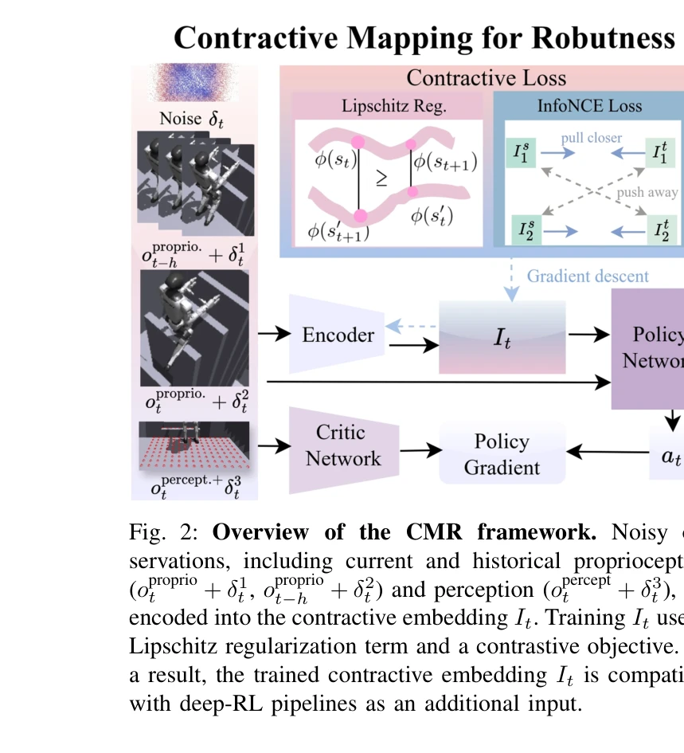
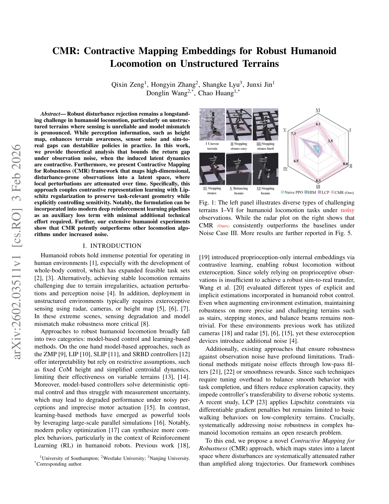

# CMR: Contractive Mapping Embeddings for Robust Humanoid Locomotion on Unstructured Terrains

> **저자**: Qixin Zeng, Hongyin Zhang, Shangke Lyu, Junxi Jin, Donglin Wang, Chao Huang | **날짜**: 2026-02-03 | **URL**: [https://arxiv.org/abs/2602.03511](https://arxiv.org/abs/2602.03511)

---

## Essence

*Fig. 2: Overview of the CMR framework. Noisy ob-*

CMR은 고차원의 노이즈가 있는 관측을 수축 매핑(contractive mapping)을 통해 잠재 공간으로 변환하여, 인간형 로봇이 비정형 지형에서 견고한 보행을 할 수 있게 하는 프레임워크이다. Contrastive representation learning과 Lipschitz regularization을 결합하여 관측 노이즈로 인한 성능 저하를 이론적으로 제한한다.

## Motivation

- **Known**: 인간형 로봇의 보행은 깊이 강화학습을 통해 복잡한 행동을 합성할 수 있으며, 지형 인식을 위해 높이 맵 등의 외수용성(exteroceptive) 정보를 활용한다. 그러나 센서 노이즈와 sim-to-real 갭은 실제 배포 시 정책을 불안정화시킨다.
- **Gap**: 기존 노이즈 견고성 방법(저역통과 필터, 매끄러움 보상)은 튜닝 오버헤드가 크고 탐색 능력을 제한한다. LCP 같은 최근 방법도 기본 보행 행동에만 제한되며, 복잡한 인간형 보행에서 체계적으로 노이즈 견고성을 다루는 방법이 부족하다.
- **Why**: 노이즈로 인한 성능 저하를 이론적으로 제한하고 현대적 deep RL 파이프라인에 최소한의 추가 노력으로 통합 가능한 방법이 필요하다. 이는 실제 로봇 배포 시 신뢰성과 안정성을 크게 향상시킨다.
- **Approach**: CMR은 관측을 contractive 잠재 공간으로 인코딩하며, 이 공간에서는 로컬 섭동이 시간에 따라 감쇠된다. Contrastive representation learning으로 과제 관련 구조를 보존하면서 Lipschitz regularization으로 민감도를 명시적으로 제어한다.

## Achievement

*Fig. 1: The left panel illustrates diverse types of challenging*

- **이론적 근거**: 잠재 역학이 contractive일 때 관측 노이즈 하에서 return gap을 제한하는 이론적 분석 제공
- **알고리즘 프레임워크**: Contrastive representation learning과 Lipschitz regularization을 결합한 CMR 프레임워크 제시
- **실제 통합성**: 보조 손실항으로 현대 deep RL 파이프라인에 최소한의 기술적 노력으로 통합 가능
- **실험 성과**: 다양한 지형에서 증가된 노이즈 조건 하에서 기존 보행 알고리즘을 능력있게 능가, 광범위한 ablation study로 각 컴포넌트 효과 검증

## How

*Fig. 2: Overview of the CMR framework. Noisy ob-*

- 노이즈가 있는 관측 \\tilde{s}_t = s_t + δ_t^s을 contractive embedding I_t로 매핑
- Lipschitz regularization으로 입출력 민감도를 명시적으로 제한하여 작은 섭동이 비례적으로 제한된 출력 변화를 유발하도록 제어
- Contrastive 목적함수로 과제 관련 기하학적 구조 보존
- 학습된 embedding을 정책 네트워크의 추가 입력으로 활용하여 deep RL 파이프라인과 통합
- 다양한 지형(계단, stepping stones, balance beams 등)에서 검증 및 ablation 연구 수행

## Originality

- **첫 적용**: Contraction mapping theorem을 학습 기반 인간형 보행 과제에 처음 도입하여 노이즈 유도 return gap에 대한 엄밀한 제한 설정
- **통합 설계**: Contrastive learning과 Lipschitz constraint를 명시적으로 결합하여 섭동 감쇠를 달성하는 novel 접근
- **실용성**: 복잡한 추가 기술 없이 표준 deep RL 파이프라인에 보조 손실항으로 쉽게 통합 가능한 단순하면서도 효과적인 설계

## Limitation & Further Study

- 이론적 분석이 특정 contractive 조건 가정에 기반하고 있으며, 실제 복잡한 동역학에서 이 조건의 만족 정도를 분석하기 위해 더 강력한 경험적 검증 필요
- Lipschitz 제약이 정책의 표현력을 제한할 수 있으며, 과제의 복잡도가 증가할 때 이에 대한 균형 조절 전략이 명시되지 않음
- 시뮬레이션 기반 실험이 주이며, 실제 하드웨어 로봇에서의 검증(특히 sim-to-real 전이)이 부족함
- 다양한 노이즈 분포(가우시안, non-Gaussian 등)에 대한 견고성 분석이 제한적이며, uniform noise 가정의 일반화 가능성 검토 필요
- **후속 연구**: 적응형 Lipschitz 상수 조정, 비선형 노이즈 모델 처리, 실제 로봇 배포 시 성능 검증, 다양한 로봇 형태에 대한 generalization 분석

## Evaluation

- Novelty: 4/5
- Technical Soundness: 3/5
- Significance: 4/5
- Clarity: 4/5
- Overall: 4/5

**총평**: CMR은 노이즈 견고성을 위해 contraction mapping theorem을 학습 기반 인간형 보행에 처음 적용한 독창적 연구이며, 이론과 실제를 연결하는 엄밀한 분석을 제공한다. 다양한 지형과 노이즈 조건에서의 강력한 실험 결과와 deep RL 파이프라인으로의 용이한 통합이 실용적 가치를 높인다.

## Related Papers

- 🏛 기반 연구: [[papers/1257_Advancing_Humanoid_Locomotion_Mastering_Challenging_Terrains/review]] — 비정형 지형에서의 견고한 보행에 DWL의 표현 학습 기법을 활용한다
- 🔄 다른 접근: [[papers/1309_CLOT_Closed-Loop_Global_Motion_Tracking_for_Whole-Body_Human/review]] — 견고성 확보에서 시뮬레이션 개선 대신 수축 매핑 기반 접근 방식을 제시한다
- 🔗 후속 연구: [[papers/1317_Contrastive_Representation_Learning_for_Robust_Sim-to-Real_T/review]] — 대조 학습에 수축 매핑과 Lipschitz 정규화를 추가하여 견고성을 강화한다
- 🔄 다른 접근: [[papers/1309_CLOT_Closed-Loop_Global_Motion_Tracking_for_Whole-Body_Human/review]] — sim-to-real 갭 해소에서 시뮬레이션 개선 대신 수축 매핑 기반 견고성 확보 방법을 제시한다
- 🏛 기반 연구: [[papers/1317_Contrastive_Representation_Learning_for_Robust_Sim-to-Real_T/review]] — 견고한 제어를 위한 대조 학습과 표현 학습의 이론적 기반을 제공한다
- 🔗 후속 연구: [[papers/1257_Advancing_Humanoid_Locomotion_Mastering_Challenging_Terrains/review]] — 노이즈가 있는 관측에서의 견고성을 위해 수축 매핑 임베딩을 추가로 활용할 수 있다
