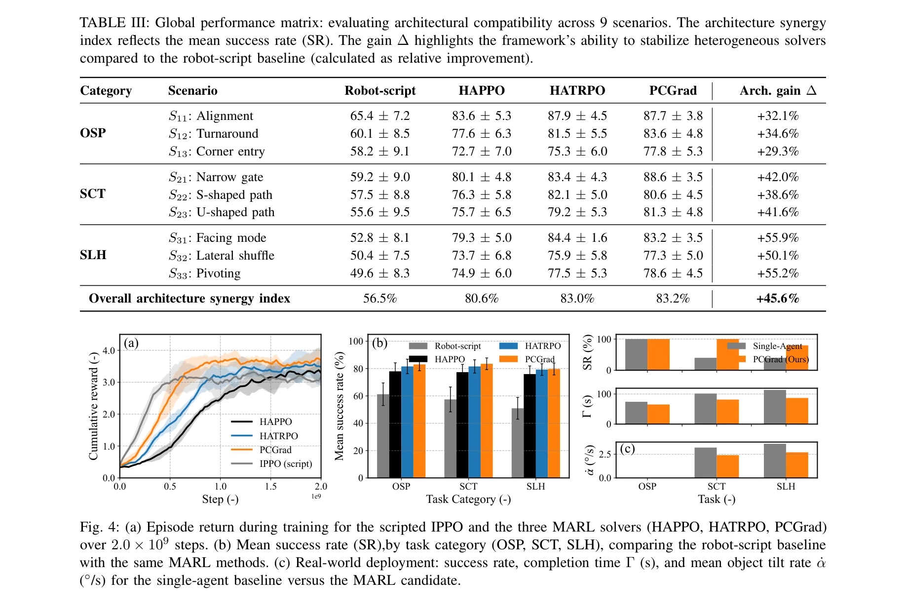

# Cognition to Control - Multi-Agent Learning for Human-Humanoid Collaborative Transport

> **저자**: Hao Zhang, Ding Zhao, H. Eric Tseng | **날짜**: 2026-03-04 | **URL**: [https://arxiv.org/abs/2603.03768](https://arxiv.org/abs/2603.03768)

---

## Essence

*Fig. 3: The proposed hierarchical HRC framework for humanoid-object coordination, partitioning decision-making into thre*

인간-휴머노이드 협업 운반을 위해 VLM 기반 인지, Markov potential game 기반 MARL 조정, 전신 제어를 통합한 3계층 C2C 프레임워크를 제안하며, 명시적 역할 할당 없이 자발적인 리더-팔로워 역할 형성을 실현한다.

## Motivation

- **Known**: 기존 HRC 시스템은 명시적 역할 할당, 의도 추론, 손설계 조정 스크립트에 의존하거나 단일 에이전트 RL로 인간을 수동 환경으로 취급하여 brittleness와 non-stationarity 문제가 있다.
- **Gap**: 고수준 의미적 추론과 저수준 고주파 물리 제어 간의 인지-물리 간격이 존재하며, 상호 적응을 내재적으로 모델링하면서도 동시에 안정적 접촉 기반 협업을 가능하게 하는 통합 아키텍처가 부족하다.
- **Why**: 중요한 이유는 인간-로봇 협업 운반이 연속적 양방향 상호작용, 접촉 안정성, 안전성을 요구하는 산업용 및 보조 로봇의 핵심 기능이기 때문이다.
- **Approach**: C2C는 VLM 기반 의미 인지층, MARL 기반 전술 조정층, 고주파 전신 제어층으로 계층을 분리하여 인지에서 제어로의 경로를 명시적으로 구조화하고, 객체 중심 Markov potential game 공식화로 자연스러운 역할 전환을 유도한다.

## Achievement

*Fig. 4: (a) Episode return during training for the scripted IPPO and the three MARL solvers (HAPPO, HATRPO, PCGrad)*

- **계층적 HRC 아키텍처**: 의미 추론과 전술 물리 조정을 분리하여 VLM의 저주파 전략적 기능과 MARL의 고주파 반응형 조정 간 granularity gap을 해결
- **역할 자유 다중 에이전트 학습**: 명시적 역할 할당이나 의도 추론 모듈 없이 Markov potential game 공식화를 통해 상호 적응이 태스크 매니폴드에서 자발적으로 출현
- **강화된 강건성**: 단일 에이전트 및 end-to-end 기준 대비 높은 성공률과 강건성을 협업 조작 작업에서 달성, 다양한 인간 기동과 환경 제약에 대한 resilience 입증

## How

*Fig. 3: The proposed hierarchical HRC framework for humanoid-object coordination, partitioning decision-making into thre*

- **Cognition layer (VLM)**: 시각 입력에서 의미 인식 객체 이동 방향(anchors)을 추론, 상시 장면 레퍼런트 유지 및 구체화된 affordances/constraints 도출
- **Skill Policy layer (MARL)**: 객체 중심 Markov potential game 공식화로 장기 스킬 선택 및 순서를 인간-로봇 coupling 제약 하에서 최적화, residual policy로 파트너 동역학 내재화
- **Whole-body control layer**: 선택된 스킬을 고주파로 실행하면서 kinematic/dynamic feasibility와 contact stability 강제, I-WBC(Interaction-aware WBC) 커널 사용
- **Decentralized MARL**: 각 에이전트가 독립적으로 정책 유지하면서 공유 potential으로 태스크 진행 인코딩, 자발적 leader-follower 역할 전환 가능

## Originality

- VLM을 저주파 전략 기반으로 제한하고 MARL을 고주파 전술 조정으로 명시적으로 분리하는 granularity 해결책의 명시적 구조화
- 명시적 역할 할당 없이 Markov potential game의 공유 potential을 통해 자발적 role-free 상호 적응을 유도하는 새로운 MARL 공식화
- 인간을 수동 환경이 아닌 co-evolving 에이전트로 모델링하는 symmetric MARL 접근, oscillatory behavior 및 non-stationarity 문제 회피
- VLM, MARL, WBC를 통합한 end-to-end 인지-물리 계층화 아키텍처로서의 시스템적 기여

## Limitation & Further Study

- 실험이 협업 운반 작업에 제한되어 있으며, 다른 형태의 HRC 작업(예: 조립, 섬세한 조작)에서의 일반화 미검증
- VLM의 추론 지연이 시스템 응답성에 미치는 영향과 실시간 성능 트레이드오프에 대한 상세 분석 부족
- 실제 인간 파트너와의 상호작용 실험 데이터가 제시되지 않았으며, 시뮬레이션 또는 제한된 인간 스터디에 국한된 검증
- Markov potential game의 potential 함수 설계가 객체 중심이므로, 다중 객체 또는 복잡한 태스크 의존성이 있는 시나리오에서의 확장성 의문
- **후속 연구**: 실시간 VLM 추론 최적화, 다양한 HRC 작업으로의 확장, 장기 인간-로봇 상호작용 데이터 수집, 다중 객체 협업 설정 지원

## Evaluation

- Novelty: 4/5
- Technical Soundness: 3/5
- Significance: 4/5
- Clarity: 4/5
- Overall: 4/5

**총평**: 본 논문은 VLM과 MARL, WBC를 명시적으로 계층화하여 인지-물리 간격을 해소하고, 역할 자유 다중 에이전트 학습으로 자발적 협업을 실현한 혁신적 HRC 프레임워크를 제시한다. 강건성 실험에서 우수한 성과를 보이나, 실제 인간 상호작용 검증과 작업 일반화 측면에서 보완이 필요하다.

## Related Papers

- 🔄 다른 접근: [[papers/1600_UniGoal_Towards_Universal_Zero-shot_Goal-oriented_Navigation/review]] — UniGoal은 ApexNav와 유사한 zero-shot object navigation이지만 범용적 목표 지향 접근법을 사용한다
- 🔗 후속 연구: [[papers/1490_NavigateDiff_Visual_Predictors_are_Zero-Shot_Navigation_Assi/review]] — NavigateDiff는 ApexNav의 zero-shot navigation을 시각적 예측기 기반의 확산 모델로 확장한다
- 🏛 기반 연구: [[papers/1507_OpenBench_A_New_Benchmark_and_Baseline_for_Semantic_Navigati/review]] — OpenBench는 ApexNav의 zero-shot navigation 성능 평가를 위한 의미 네비게이션 벤치마크 기반을 제공한다
- 🔗 후속 연구: [[papers/1463_LOVON_Legged_Open-Vocabulary_Object_Navigator/review]] — 적응적 탐색 전략을 legged 로봇의 객체 네비게이션에 적용하여 더욱 효율적인 탐색을 달성할 수 있습니다.
- 🔗 후속 연구: [[papers/1630_WMNav_Integrating_Vision-Language_Models_into_World_Models_f/review]] — WMNav의 world model 기반 예측이 ApexNav의 adaptive exploration과 결합되어 더 효율적인 object goal navigation을 달성할 수 있음
- 🔗 후속 연구: [[papers/1345_CoWs_on_Pasture_Baselines_and_Benchmarks_for_Language-Driven/review]] — ApexNav는 CoWs의 언어 기반 zero-shot navigation을 적응적 탐색 전략으로 확장한다
- 🔗 후속 연구: [[papers/1584_NoMaD_Goal_Masked_Diffusion_Policies_for_Navigation_and_Expl/review]] — NoMaD의 goal masking 아이디어가 ApexNav의 적응적 탐색 전략과 결합되어 더 효과적인 탐색-활용 균형을 달성할 수 있음
