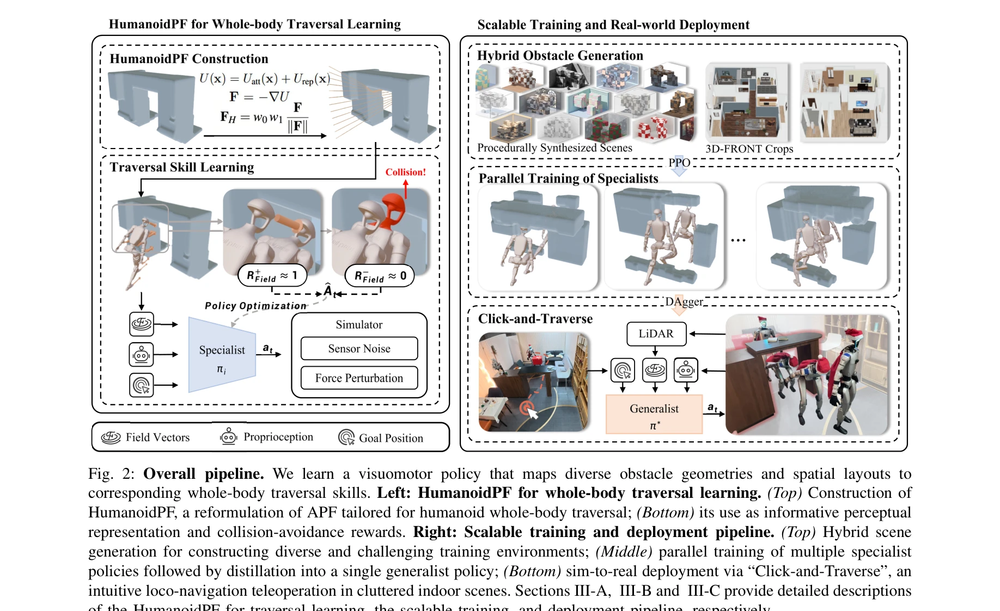
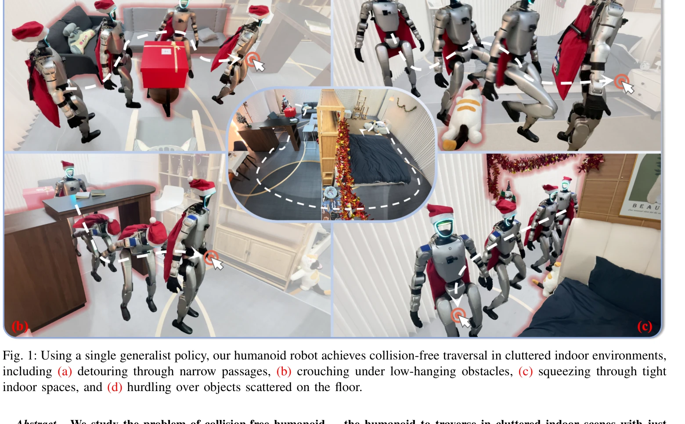

# Collision-Free Humanoid Traversal in Cluttered Indoor Scenes

> **저자**: Han Xue, Sikai Liang, Zhikai Zhang, Zicheng Zeng, Yun Liu, Yunrui Lian, Jilong Wang, Qingtao Liu, Xuesong Shi, Li Yi | **날짜**: 2026-01-23 | **DOI**: [10.48550/arXiv.2601.16035](https://doi.org/10.48550/arXiv.2601.16035)

---

## Essence

*Fig. 2: Overall pipeline. We learn a visuomotor policy that maps diverse obstacle geometries and spatial layouts to*

본 논문은 실내 복잡한 환경에서 휴머노이드 로봇이 장애물을 피하면서 자유롭게 이동할 수 있도록 하는 충돌 회피 순회(traversal) 방법을 제안하며, Humanoid Potential Field (HumanoidPF)라는 표현 방식을 도입하여 장애물-휴머노이드 관계를 명시적으로 인코딩한다.

## Motivation

- **Known**: 사족 로봇과 휴머노이드는 복잡한 지형에서의 보행 능력을 보여주었으나, 기존 연구들은 부분적 공간 레이아웃(terrains 또는 overhead obstacles)과 단순한 기하학적 형태(직육면체, 정다면체)의 장애물만 다루었다.
- **Gap**: 실내 클러터 환경에서 지면, 측면, 상단 장애물이 동시에 존재하는 복잡한 기하학적 형태의 장애물들에 대한 충돌 회피 능력이 부족하며, 충돌 후 희소(sparse) 신호에만 의존하는 기존의 RL 방식으로는 효율적인 학습이 어렵다.
- **Why**: 가정용 휴머노이드 로봇이 실제 실내 환경에서 안전하게 작동하려면 다양한 공간 레이아웃과 복잡한 기하학의 장애물을 효과적으로 회피해야 하며, 이는 로봇 기술의 실생활 적용을 위해 필수적이다.
- **Approach**: Classical Artificial Potential Field (APF)를 휴머노이드 로봇의 전신 순회 학습에 맞도록 재구성한 HumanoidPF를 제안하여 관찰 신호와 보상 설계에 통합하고, 현실적 3D 실내 장면과 절차적으로 합성된 장애물을 결합한 하이브리드 장면 생성 방식으로 학습 다양성을 확보한다.

## Achievement

*Fig. 1: Using a single generalist policy, our humanoid robot achieves collision-free traversal in cluttered indoor envir*

- **HumanoidPF 표현**: 휴머노이드와 장애물의 관계를 충돌 회피 방향의 연속 그래디언트 장(field)으로 인코딩하여 정책 관찰과 보상 신호로 활용하며, 시뮬레이션-실제 간 지각 갭이 무시할 수 있는 수준임을 확인
- **하이브리드 장면 생성**: 실제 3D 실내 데이터셋의 크롭과 절차적으로 생성된 고난이도 장애물을 결합하여 다양하고 도전적인 학습 시나리오 구성
- **일반화 가능한 정책**: 단일 일반화 정책(generalist policy)이 지면, 측면, 상단 장애물이 모두 존재하는 복잡한 실내 환경에서 안정적으로 작동
- **실제 적용 시스템**: Click-and-Traverse (CAT) 텔레조작 시스템으로 사용자가 단일 클릭으로 휴머노이드 로봇의 안전한 순회 제어 가능
- **광범위한 검증**: 시뮬레이션 및 실제 실내 환경에서의 광범위한 실험을 통해 방법의 효과성 입증

## How

*Fig. 2: Overall pipeline. We learn a visuomotor policy that maps diverse obstacle geometries and spatial layouts to*

- HumanoidPF 구성: Artificial Potential Field를 다중 신체 부위(multiple key body parts)에 대해 쿼리하여 각 부위가 이동해야 할 방향을 나타내는 방향 신호 제공
- 관찰 공간 설계: 원시 고차원 비전 입력 대신 HumanoidPF의 방향 신호를 정책의 관찰로 사용하여 순회 의사결정을 직접 추론
- 보상 함수 설계: HumanoidPF가 유도하는 선호 방향 분포와 정책의 동작 방향을 정렬하도록 하는 anticipatory 및 dense 보상 제공
- 하이브리드 학습 환경: 현실적 3D 실내 장면의 크롭과 절차적 합성 장애물을 결합한 다양한 클러터 구성 생성
- 다중 전문가 정책에서 단일 일반화 정책으로의 증류(distillation): 다양한 장면과 장애물에 대해 병렬로 학습한 전문가 정책들을 단일 일반화 정책으로 통합
- Sim-to-real 배포: HumanoidPF의 연속 필드 공식화가 자연스러운 저주파 필터로 작동하여 지각 노이즈 완화 및 실제 환경으로의 안정적 전이

## Originality

- **HumanoidPF의 새로운 설계**: 기존 APF를 휴머노이드 전신 운동에 맞게 재구성한 것으로, 단순한 중심질량(center of mass) 또는 단일 발(foot joint) 추상화를 넘어 다중 신체 부위에 대한 방향 신호 제공
- **지각-보상 이중 활용**: HumanoidPF를 정책 관찰과 보상 설계의 두 가지 방식으로 통합하여 dense supervision과 sparse feedback 간의 불일치 해소
- **하이브리드 장면 생성 전략**: 현실적 데이터와 절차적 합성을 결합하여 기존 데이터셋에 드물게 나타나는 고난이도 클러터 시나리오에 노출
- **실제 클러터 환경의 광범위한 다양성 처리**: 지면, 측면, 상단 장애물이 동시에 존재하는 전체 공간 레이아웃과 복잡한 기하학적 형태를 동시에 다룬 첫 시도

## Limitation & Further Study

- **HumanoidPF의 계산 복잡도**: 다중 신체 부위에 대한 potential field 계산의 실시간 성능 분석이 명확하지 않음
- **실제 환경의 불완전한 지각**: 지각 오류나 동적 장애물(moving obstacles)에 대한 대응 능력이 제시되지 않음
- **정책 증류의 효율성**: 다중 전문가 정책의 학습 비용과 증류 프로세스의 성능 트레이드오프 분석 부족
- **일반화 범위의 한계**: 극도로 좁은 통로(극한 케이스)나 매우 복잡한 비정형 장애물 배치에서의 성능 제한 가능성
- **후속 연구**: 동적 장애물 및 다중 에이전트 환경으로의 확장, HumanoidPF의 물리적 해석력 강화, 실시간 성능 최적화

## Evaluation

- Novelty: 4/5
- Technical Soundness: 3/5
- Significance: 4/5
- Clarity: 4/5
- Overall: 4/5

**총평**: 본 논문은 휴머노이드 로봇의 실내 클러터 환경 순회라는 중요한 문제를 처음으로 체계적으로 다루며, HumanoidPF라는 혁신적인 표현 방식으로 관찰과 보상 설계를 효과적으로 통합하고, 하이브리드 장면 생성과 실제 시스템 구현을 통해 높은 실용성과 일반화 능력을 보여준다.

## Related Papers

- 🔗 후속 연구: [[papers/1340_Dexterous_Safe_Control_for_Humanoids_in_Cluttered_Environmen/review]] — 복잡한 환경에서의 충돌 회피를 더 정교한 섬세한 안전 제어로 확장한다
- 🧪 응용 사례: [[papers/1329_Deep_Whole-body_Parkour/review]] — 실내 복잡 환경에서의 충돌 회피를 parkour와 같은 동적 동작에 적용한다
- 🏛 기반 연구: [[papers/1273_ARMOR_Egocentric_Perception_for_Humanoid_Robot_Collision_Avo/review]] — 충돌 회피를 위한 인지 시스템과 환경 표현의 기본 원리를 제공한다
- 🏛 기반 연구: [[papers/1340_Dexterous_Safe_Control_for_Humanoids_in_Cluttered_Environmen/review]] — 섬세한 안전 제어에 복잡한 환경에서의 충돌 회피 기법을 활용한다
