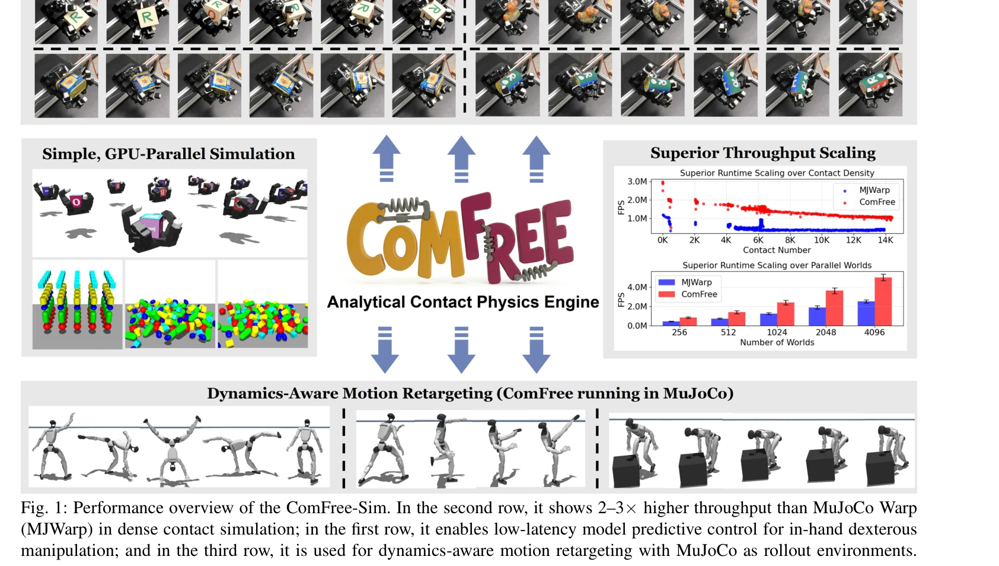
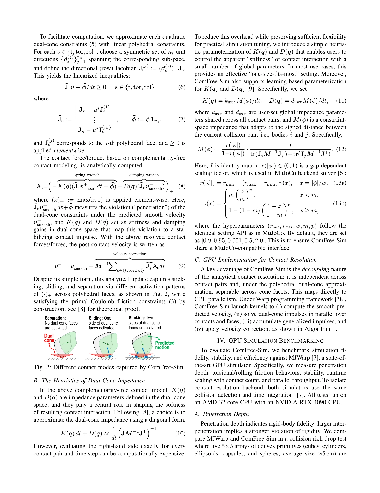

# ComFree-Sim: A GPU-Parallelized Analytical Contact Physics Engine for Scalable Contact-Rich Robotics Simulation and Control

> **저자**: Chetan Borse, Zhixian Xie, Wei-Cheng Huang, Wanxin Jin | **날짜**: 2026-03-12 | **URL**: [https://arxiv.org/abs/2603.12185](https://arxiv.org/abs/2603.12185)

---

## Essence

*Fig. 1: Performance overview of the ComFree-Sim. In the second row, it shows 2–3× higher throughput than MuJoCo Warp*

ComFree-Sim은 complementarity-free 접근법을 기반으로 GPU에서 병렬화된 분석적 접촉 물리 엔진으로, 접촉 임펄스를 폐형식으로 계산하여 접촉 해상도의 계산 복잡도를 선형으로 낮춘다.

## Motivation

- **Known**: 주류 물리 엔진들은 complementarity 제약이나 제약 최적화를 통해 비침투와 Coulomb 마찰을 시행하며, 접촉 밀도에 따라 반복 풀이 비용이 초선형으로 증가한다.
- **Gap**: GPU 가속 시뮬레이터들이 등장했음에도 접촉 해상도 단계에서 여전히 병목이 존재하며, 고주파 제어와 고밀도 접촉 환경에서 실시간 배포가 어렵다.
- **Why**: 로봇 조작, 보행, 학습 등 현대 로봇 공학에서 접촉 풍부 시뮬레이션의 확장성이 중요하며, 낮은 지연 시간의 고주파 제어가 폐루프 성능을 크게 향상시킨다.
- **Approach**: Complementarity-free 접촉 모델링을 확장하여 6D 접촉 모델(접선, 비틀림, 구름 마찰)을 개발하고, Coulomb 마찰의 이중 원뿔에서 impedance 스타일의 예측-수정 업데이트를 통해 폐형식 해를 도출한다.

## Achievement

*Fig. 1: Performance overview of the ComFree-Sim. In the second row, it shows 2–3× higher throughput than MuJoCo Warp*

- **확장된 6D 분석적 접촉 모델**: 접선 마찰, 비틀림 마찰, 구름 마찰을 통합 분석 dual-cone 프레임워크 내에서 캡처
- **선형 시간 복잡도**: 접촉 계산이 접촉 쌍 간 독립적이고 원뿔 패싯 간 분리 가능하여 선형 확장성 달성
- **고성능**: MJWarp 대비 밀도 높은 접촉 장면에서 2-3배 높은 처리량과 비슷한 물리적 충실도
- **실하드웨어 배포**: 다중 손가락 LEAP 손에서 실시간 MPC 기반 손가락 조작 제어 및 dynamics-aware 모션 재타겟팅 성공
- **드롭인 호환성**: MuJoCo 호환 인터페이스로 MJWarp의 대체 백엔드로 제공

## How

*Fig. 2: Different contact modes captured by ComFree-Sim.*

- Complementarity-free 접촉 모델링: 폐형식 임펄스 계산으로 반복 풀이 제거
- GPU 병렬화: 접촉 계산이 자연스럽게 GPU 커널에 매핑되는 구조 활용
- Dual-cone impedance 휴리스틱: 실제적이고 안정적인 접촉 임펄스 해상도
- Warp 구현: NVIDIA Warp 프레임워크 기반 GPU 가속 구현
- 시뮬레이션 벤치마크: 침투 깊이, 마찰 거동, 수치 안정성, 시간 복잡도 측정
- MPPI 기반 MPC: 고주파 모델 예측 제어를 통한 폐루프 성능 평가

## Originality

- Complementarity-free 접근법을 GPU 병렬화 분석 엔진으로 처음 구현하고 6D 모델로 확장
- Dual-cone impedance 휴리스틱을 도입하여 실용적이고 안정적인 해상도 달성
- MuJoCo 호환 인터페이스를 제공하여 기존 로봇 학습 플랫폼과의 통합성 극대화
- 실하드웨어(LEAP 손)에 배포하여 이론과 실제의 간극 해소

## Limitation & Further Study

- Complementarity-free 모델이 모든 접촉 시나리오에서 기존 방법과 동일한 물리적 충실도를 보장하는지 추가 검증 필요
- 더 복잡한 형상(비凸 접촉, 다중 바디 체인)에 대한 확장성과 정확도 분석 부족
- Dual-cone impedance 파라미터 튜닝의 일반화 및 자동화 방안 필요
- 다양한 접촉 시나리오(접착, 마찰 불안정성 등)에서의 성능 비교 필요
- 후속 연구로 learning-based 동적 impedance 적응 메커니즘 개발과 접촉 모델 통합 개선 가능

## Evaluation

- Novelty: 4/5
- Technical Soundness: 3/5
- Significance: 4/5
- Clarity: 4/5
- Overall: 4/5

**총평**: ComFree-Sim은 complementarity-free 해석을 GPU 병렬화로 구현하여 접촉 밀도에 따른 계산 병목을 근본적으로 해결하고, 실하드웨어 배포까지 달성한 실질적이고 혁신적인 기여이다. 높은 처리량과 낮은 지연 시간으로 고주파 접촉 제어를 가능하게 한다.

## Related Papers

- 🔄 다른 접근: [[papers/1325_cuRoboV2_Dynamics-Aware_Motion_Generation_with_Depth-Fused_D/review]] — GPU 병렬화된 물리 엔진을 다른 구조와 용도로 구현한 접근법이다
- 🔗 후속 연구: [[papers/1469_ManiSkill3_GPU_Parallelized_Robotics_Simulation_and_Renderin/review]] — GPU 가속 물리 시뮬레이션을 로봇 조작 학습으로 확장한 플랫폼이다
- 🏛 기반 연구: [[papers/1484_HumanPlus_Humanoid_Shadowing_and_Imitation_from_Humans/review]] — 고성능 물리 시뮬레이션의 기반 프레임워크를 제공하는 연구다
- 🔄 다른 접근: [[papers/1325_cuRoboV2_Dynamics-Aware_Motion_Generation_with_Depth-Fused_D/review]] — GPU 기반 물리 시뮬레이션을 다른 접촉 해상도 방법으로 구현한다
