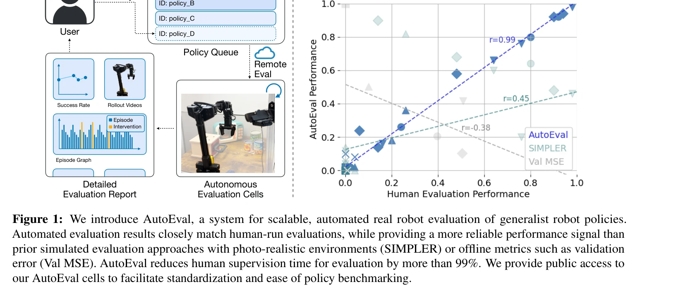
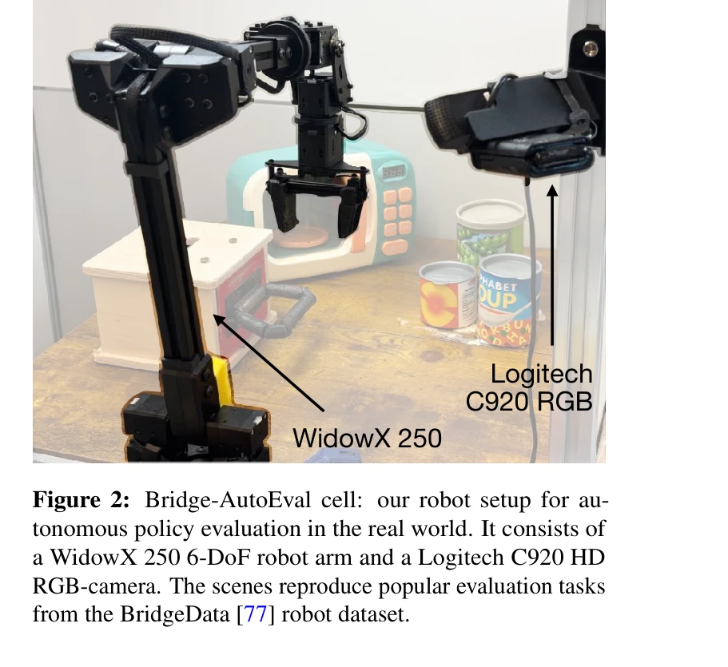

# AutoEval: Autonomous Evaluation of Generalist Robot Manipulation Policies in the Real World

> **저자**: Zhiyuan Zhou, Pranav Atreya, You Liang Tan, Karl Pertsch, Sergey Levine | **날짜**: 2025-03-31 | **URL**: [https://arxiv.org/abs/2503.24278](https://arxiv.org/abs/2503.24278)

---

## Essence

*Figure 1: We introduce AutoEval, a system for scalable, automated real robot evaluation of generalist robot policies.*

AutoEval은 대규모 로봇 정책 평가의 병목을 해결하기 위해 자동화된 성공 감지와 장면 리셋 기능을 갖춘 실세계 자율 평가 시스템으로, 인간 개입을 99% 이상 감소시키면서 24시간 연속 평가를 가능하게 한다.

## Motivation

- **Known**: 로봇 기초 모델과 generalist 정책의 발전으로 다양한 작업과 장면에서의 평가 필요성이 증대되었으며, 실제 평가는 장면 리셋과 성공 판단에 많은 인간 시간을 소요한다.
- **Gap**: 기존 시뮬레이션 기반 평가는 현실과의 갭으로 신뢰도가 낮고, 실세계 평가는 인간 개입이 필수적이어서 generalist 정책의 대규모 평가를 확장하기 어렵다.
- **Why**: generalist 로봇 정책의 성능 평가를 위해서는 수백 개 이상의 롤아웃이 필요한데, 이를 위해 인간 시간을 대폭 줄이면서도 신뢰할 수 있는 평가 결과를 얻는 것이 로봇 학습 발전에 필수적이다.
- **Approach**: 대규모 사전 학습 모델을 활용하여 자동 리셋 정책과 성공 감지기를 학습하고, 평가 장면과 작업에 맞게 적응시켜 Bridge-AutoEval 세 개 환경에 인스턴스화했다.

## Achievement

*Figure 1: We introduce AutoEval, a system for scalable, automated real robot evaluation of generalist robot policies.*

- **99% 이상 인간 개입 감소**: 자동화된 장면 리셋과 성공 감지로 24시간 연속 평가 가능
- **높은 신뢰도**: AutoEval 평가 결과가 인간이 직접 수행한 평가와 높은 상관관계 달성
- **우수한 확장성**: 24시간에 약 500 에피소드 평가 가능하며, 시뮬레이션 기반 평가보다 더 신뢰할 수 있는 성능 지표 제공
- **다양한 작업 지원**: 천 조작, 옷 조작 등 시뮬레이션이 어려운 작업도 평가 가능
- **공개 접근 제공**: BridgeData 환경에서 WidowX 로봇 팔을 사용한 여러 AutoEval 장면에 대한 공개 접근 제공

## How

*Figure 2: Bridge-AutoEval cell: our robot setup for au-*

- Job queue 기반 아키텍처: 소프트웨어 클러스터 스케줄링 시스템과 유사한 방식으로 평가 정책 제출
- 자동 장면 리셋: 대규모 사전 학습 모델을 기반으로 학습된 리셋 정책으로 장면 자동 복구
- 자동 성공 감지: 학습된 성공 감지기로 정책 실행 결과 자동 평가
- 적응 학습: 각 평가 장면과 작업에 맞게 리셋 정책과 성공 감지기 파인튜닝
- Bridge-AutoEval 구현: BridgeV2 환경에서 세 개의 테이블탑 조작 작업을 위한 자동화된 평가 환경 구축
- 상세 보고서 생성: 롤아웃 비디오, 에피소드 그래프, 상세 평가 리포트 등 종합 결과 제공

## Originality

- 실세계 로봇 평가를 위한 최초의 포괄적인 자동화 시스템: 단순히 단일 환경이 아닌 다양한 generalist 작업에 대응
- learned reset 및 success detection 모듈: 작업 특화 수동 규칙이 아닌 학습 기반 접근으로 일반화 가능성 증대
- 분산 평가 네트워크 아키텍처: 여러 기관에 걸쳐 설치 가능하도록 설계된 최초의 표준화된 프레임워크
- 공개 벤치마킹 플랫폼: 연구 커뮤니티가 접근 가능한 공개 AutoEval 셀 제공

## Limitation & Further Study

- BridgeData V2 및 WidowX 로봇 팔로 제한된 초기 구현: 다른 로봇 embodiment나 테이블탑이 아닌 환경에의 확장 필요
- 자동 리셋 정책의 실패 케이스: 학습된 모델의 오류로 인한 간헐적 개입 여전히 필요
- 성공 감지 정확도의 작업 의존성: 복잡한 작업에서 감지 정확도 저하 가능성
- 후속 연구: 다른 기관으로의 AutoEval 설치 확대로 분산 평가 네트워크 형성 필요, 더 다양한 작업과 embodiment 대응

## Evaluation

- Novelty: 4/5
- Technical Soundness: 3/5
- Significance: 4/5
- Clarity: 4/5
- Overall: 4/5

**총평**: AutoEval은 generalist 로봇 정책 평가의 심각한 확장성 문제를 실질적으로 해결하는 혁신적인 시스템으로, 자동화된 리셋과 성공 감지를 통해 인간 개입을 극적으로 줄이면서도 신뢰할 수 있는 결과를 제공한다. 공개 벤치마킹 플랫폼 제공으로 로봇 학습 커뮤니티에 중대한 기여를 한다.

## Related Papers

- 🔄 다른 접근: [[papers/1260_AGILE_A_Comprehensive_Workflow_for_Humanoid_Loco-Manipulatio/review]] — 로봇 개발 프로세스 자동화를 각각 정책 평가와 전체 워크플로우라는 다른 측면에서 접근한다
- 🔗 후속 연구: [[papers/1315_AutoRT_Embodied_Foundation_Models_for_Large_Scale_Orchestrat/review]] — AutoRT의 대규모 데이터 수집을 자동화된 평가 시스템으로 보완하여 완전한 개발 파이프라인을 구성한다
- 🏛 기반 연구: [[papers/1334_Code_as_Policies_Language_Model_Programs_for_Embodied_Contro/review]] — LLM을 활용한 정책 코드 생성이 자동화된 정책 평가의 기초 기술을 제공한다
- 🔄 다른 접근: [[papers/1260_AGILE_A_Comprehensive_Workflow_for_Humanoid_Loco-Manipulatio/review]] — 로봇 정책 개발의 전체 워크플로우를 표준화한다는 동일한 목표를 평가와 학습이라는 다른 측면에서 접근한다
- 🔄 다른 접근: [[papers/1535_RoboArena_Distributed_Real-World_Evaluation_of_Generalist_Ro/review]] — 로봇 정책 평가에서 중앙집중식 자동 평가와 분산형 크라우드소싱 평가라는 서로 다른 접근법을 제시한다.
- 🏛 기반 연구: [[papers/1315_AutoRT_Embodied_Foundation_Models_for_Large_Scale_Orchestrat/review]] — 대규모 자율 데이터 수집이 자동화된 정책 평가에 필요한 다양한 평가 시나리오를 제공한다
- 🔗 후속 연구: [[papers/1334_Code_as_Policies_Language_Model_Programs_for_Embodied_Contro/review]] — LLM 기반 정책 코드 생성을 자동화된 평가 시스템과 결합하여 완전한 자율 개발 파이프라인을 구성한다
