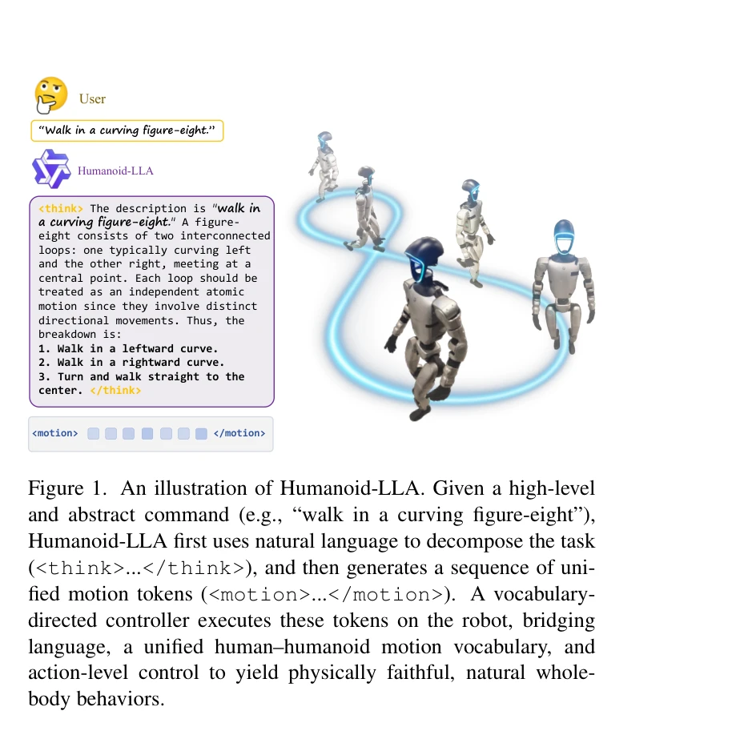
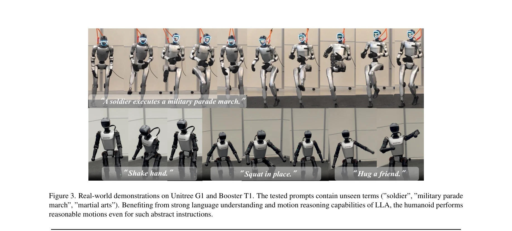
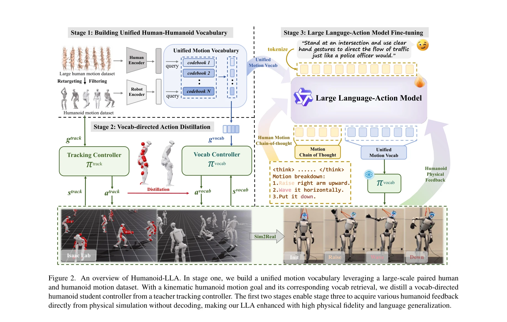

# Commanding Humanoid by Free-form Language: A Large Language Action Model with Unified Motion Vocabulary

> **저자**: Zhirui Liu, Kaiyang Ji, Ke Yang, Jingyi Yu, Ye Shi, Jingya Wang | **날짜**: 2026-04-10 | **DOI**: [10.48550/arXiv.2511.22963](https://doi.org/10.48550/arXiv.2511.22963)

---

## Essence

*Figure 1. An illustration of Humanoid-LLA. Given a high-level*

Humanoid-LLA는 통합 모션 어휘를 기반으로 자유형식 자연어 명령을 휴머노이드 로봇의 물리적으로 실행 가능한 전신 동작으로 매핑하는 대규모 언어-행동 모델이다. Supervised Fine-Tuning과 강화학습을 통해 언어 이해와 물리적 타당성을 동시에 달성한다.

## Motivation

- **Known**: 최근 LLM 기반 Vision-Language-Action 모델들이 로봇 조작 작업에서 성공을 거두었으며, 저수준 휴머노이드 보행 및 조작 제어 기술도 발전했다. 하지만 자유형식 언어 조건 전신 제어는 여전히 미해결 과제이다.
- **Gap**: 기존 방법들은 (1) 운동 다양성과 물리적 타당성 간의 트레이드오프, (2) 인간 모션 데이터셋 기반 접근 시 로봇 실행 오류, (3) 고품질 물리적 근거 휴머노이드 데이터 부족 문제를 가지고 있다.
- **Why**: 휴머노이드 로봇이 자유형식 언어 명령을 따를 수 있도록 하는 것은 인간-로봇 상호작용, 협력 작업 실행, 일반목적 embodied intelligence 실현에 필수적이다.
- **Approach**: VQ-VAE 기반 통합 모션 어휘를 구축하여 인간과 휴머노이드 모션 프리미티브를 공유 이산 공간에 정렬하고, 이를 바탕으로 특권 정책 증류로 사전 훈련된 컨트롤러를 얻은 후, dynamics-aware 보상으로 강화학습을 적용하여 미세 조정한다.

## Achievement

*Figure 3. Real-world demonstrations on Unitree G1 and Booster T1. The tested prompts contain unseen terms (”soldier”, ”m*

- **통합 모션 어휘**: 양방향 cross-embodiment 재구성 감독을 포함한 VQ-VAE 토큰화를 통해 인간과 휴머노이드 모션을 하나의 이산 공간에 정렬하여 대규모 인간 모션 데이터셋의 확장성을 활용
- **어휘 지향 제어 증류**: 특권 추적 정책을 이산 모션 토큰 조건 학생 컨트롤러로 증류하여 물리적 타당성을 보장하면서 유연한 행동 선택 가능
- **2단계 LLA 훈련**: Supervised Fine-Tuning(motion chain-of-thought 사용)과 RL Fine-Tuning(물리적 피드백 사용)으로 언어 이해와 물리적 추론을 동시에 확보
- **실제 로봇 성능**: Unitree G1, Booster T1에서 기존 언어 조건 컨트롤러 대비 모션 자연스러움, 안정성, 실행 성공률 향상 입증

## How

*Figure 2. An overview of Humanoid-LLA. In stage one, we build a unified motion vocabulary leveraging a large-scale paire*

- VQ-VAE 기반 Tokenizer: 인간 모션 캡처와 그 retarget된 휴머노이드 모션 쌍을 양방향 reconstruction 손실로 동시 양자화하여 unified vocabulary 구성
- Privileged Policy 증류: 시뮬레이션에서 dense reference trajectory를 추적하도록 학습한 특권 정책을 이산 모션 토큰으로만 조건지은 학생 정책으로 증류
- Supervised Fine-Tuning: 대규모 text-human motion 데이터셋에서 LLA를 SFT하되, motion chain-of-thought 프롬팅 전략을 통해 구조화된 추론 유도
- Reinforcement Learning Fine-Tuning: Group Relative Policy Optimization을 사용하여 언어 정렬과 생성된 토큰 시퀀스의 물리적 실행성을 모두 보상하는 dynamics-aware reward 적용
- 실시간 실행: 학습된 LLA가 생성한 모션 토큰 시퀀스를 어휘 지향 컨트롤러가 휴머노이드 로봇에서 물리적 근거하에 실행

## Originality

- 양방향 cross-embodiment reconstruction 감독이 포함된 unified VQ-VAE 토큰화로 기존 humanoid-only 또는 감독 부재 접근을 개선
- 특권 정책 증류와 이산 토큰 기반 제어의 결합으로 dense trajectory 추적과 토큰 생성 간 gap을 메움
- Motion chain-of-thought 프롬팅과 dynamics-aware RL 보상을 통한 2단계 LLA 훈련으로 언어 의미론과 물리적 타당성을 end-to-end로 통합
- 대규모 인간 모션 데이터로 SFT하고 시뮬레이션 물리 피드백으로 RLFT하는 하이브리드 학습 패러다임이 데이터 부족 문제를 경감

## Limitation & Further Study

- 실험이 주로 시뮬레이션과 두 개의 특정 로봇(Unitree G1, Booster T1)에 제한되어 다양한 휴머노이드 플랫폼 일반화성 검증 필요
- 대규모 인간 모션 데이터셋에 의존하는데, 특정 도메인이나 동작에 대한 데이터 부재 시 성능 저하 가능성 미논의
- Motion chain-of-thought 프롬팅의 정확한 설계와 효과 크기에 대한 상세 ablation study 부족
- Dynamics-aware reward의 구체적 형태와 하이퍼파라미터 선택에 대한 민감도 분석 미흡
- open-vocabulary 지원 주장에 비해 평가 대상 지시어 유형과 범위 규모가 명확히 제시되지 않음

## Evaluation

- Novelty: 4/5
- Technical Soundness: 4/5
- Significance: 4/5
- Clarity: 4/5
- Overall: 4/5

**총평**: Humanoid-LLA는 unified motion vocabulary, policy distillation, 2단계 LLA 훈련을 통해 자유형식 언어와 휴머노이드 전신 제어를 최초로 통합한 종합적 프레임워크로, 데이터 부족 문제를 창의적으로 해결하고 실제 로봇에서 우수한 성능을 입증한 높은 가치의 기여이다.

## Related Papers

- 🔄 다른 접근: [[papers/1407_FRoM-W1_Towards_General_Humanoid_Whole-Body_Control_with_Lan/review]] — FRoM-W1과 함께 자연어 지시 기반 휴머노이드 전신 제어의 두 가지 접근법으로, 통합 모션 어휘 vs 단계별 프레임워크를 비교할 수 있다
- 🔗 후속 연구: [[papers/1405_From_Language_to_Locomotion_Retargeting-free_Humanoid_Contro/review]] — RoboGhost의 retargeting-free 접근법이 Humanoid-LLA의 언어-행동 매핑을 더욱 직접적이고 효율적으로 구현한다
- 🏛 기반 연구: [[papers/1426_HumanPlus_Humanoid_Shadowing_and_Imitation_from_Humans/review]] — HumanPlus의 인간-로봇 모방 학습 방법론이 Humanoid-LLA의 물리적으로 실행 가능한 동작 생성에 기반 기술을 제공한다
- 🔗 후속 연구: [[papers/1405_From_Language_to_Locomotion_Retargeting-free_Humanoid_Contro/review]] — RoboGhost의 retargeting-free 접근법이 Humanoid-LLA의 언어-행동 매핑을 motion latent 공간에서 더욱 직접적으로 구현한다
- 🔄 다른 접근: [[papers/1407_FRoM-W1_Towards_General_Humanoid_Whole-Body_Control_with_Lan/review]] — FRoM-W1과 Humanoid-LLA는 자연어 지시 기반 휴머노이드 전신 제어에서 단계별 프레임워크 vs 통합 언어-행동 모델이라는 서로 다른 아키텍처를 제시한다
- 🏛 기반 연구: [[papers/1490_HYPERmotion_Learning_Hybrid_Behavior_Planning_for_Autonomous/review]] — Humanoid-LLA의 자유형식 언어 명령 처리 능력이 HYPERmotion의 자유 텍스트 명령 기반 로코-매니퓰레이션에 언어 이해의 기반 기술을 제공한다
