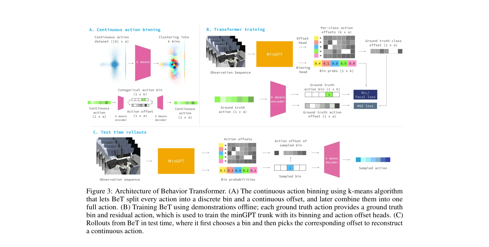
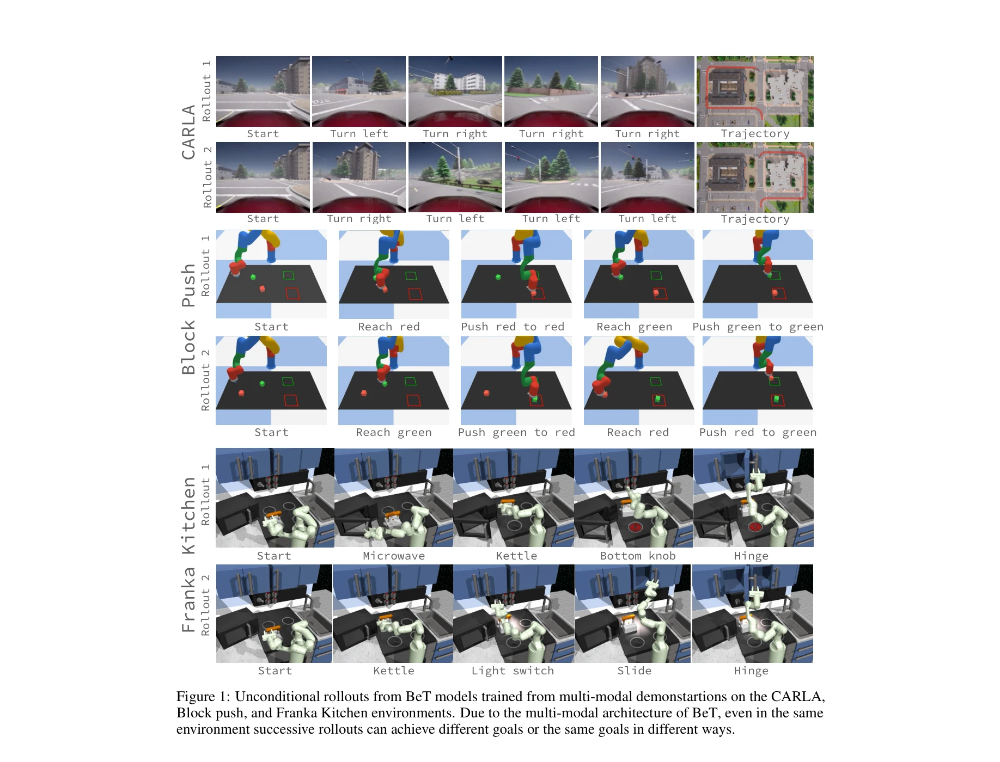

# Behavior Transformers: Cloning $k$ modes with one stone

> **저자**: Nur Muhammad Mahi Shafiullah, Zichen Jeff Cui, Ariuntuya Altanzaya, Lerrel Pinto | **날짜**: 2022-06-22 | **URL**: [https://arxiv.org/abs/2206.11251](https://arxiv.org/abs/2206.11251)

---

## Essence

*Figure 3: Architecture of Behavior Transformer. (A) The continuous action binning using k-means algorithm*

Behavior Transformer (BeT)는 transformer 아키텍처에 action discretization과 multi-task action correction을 결합하여 unlabeled demonstration data에서 multi-modal continuous actions를 학습하는 기법이다.

## Motivation

- **Known**: Behavior cloning과 offline RL은 reward 라벨 없이 큰 데이터셋에서 행동을 학습할 수 있지만, 기존 방법들은 unimodal expert 데이터를 가정하므로 multi-modal 행동 분포를 다루지 못한다.
- **Gap**: 자연스러운 human demonstration은 wide variance와 multiple modes를 가지지만, 현재 방법들은 이를 효과적으로 모델링하지 못하며 주로 goal-conditioned policies로 제한된다.
- **Why**: Vision과 NLP는 대규모 사전학습 데이터로부터 학습되지만 behavior learning은 그렇지 못하므로, multi-modal behavior data를 효과적으로 활용할 수 있는 방법이 필요하다.
- **Approach**: Continuous actions를 k-means로 discrete bins로 clustering한 후, transformer가 각 bin의 확률과 residual offset을 동시에 예측하는 방식으로 multi-modal continuous action distribution을 모델링한다.

## Achievement

*Figure 1: Unconditional rollouts from BeT models trained from multi-modal demonstartions on the CARLA,*

- **Multi-modal 성능**: 다양한 robotic manipulation과 self-driving 데이터셋에서 기존 behavior modeling 방법들을 크게 능가한다.
- **Mode coverage**: 하나의 모드로 붕괴되지 않고 pre-collected dataset의 주요 modes를 포착한다.
- **Architecture simplicity**: 복잡한 generative model이나 complicated training scheme 없이 standard transformer를 활용한다.

## How

*Figure 3: Architecture of Behavior Transformer. (A) The continuous action binning using k-means algorithm*

- k-means clustering을 통해 continuous actions를 discrete action bins ⌊a⌋와 continuous residual ⟨a⟩로 분해
- MinGPT transformer backbone을 사용하여 observation sequence로부터 action bin probabilities를 예측
- Multi-task learning으로 action bin 분류와 per-bin residual offset 예측을 동시에 수행
- Test time에 sampled bin에 해당하는 offset을 더하여 continuous action 재구성
- History-aware modeling으로 P(at | ot, ot-1, ..., ot-h+1) 형태로 non-Markovian 정책 학습

## Originality

- Transformer의 discrete token 생성 능력과 action discretization을 결합한 새로운 접근
- Object detection의 offset prediction 개념을 behavior cloning에 적용하는 창의적인 아이디어
- MDN처럼 명시적으로 mode centers를 예측하지 않으면서도 multi-modal 분포를 모델링하는 방식
- K-means 기반 action factorization으로 continuous와 discrete 예측을 분리하는 설계

## Limitation & Further Study

- K-means binning의 선택 (k값)이 성능에 미치는 영향에 대한 자세한 분석 부족
- 고차원 action space에서 k개 bin이 exponential하게 증가할 수 있는 scalability 문제
- Online RL과의 통합이나 reward signal과의 결합 방안에 대한 탐구 미흡
- Residual offset 학습의 정확성이 action reconstruction quality에 미치는 영향 분석 필요
- 후속 연구: multi-task learning과의 더 깊은 통합, 적응적 binning 전략 개발, 다른 discretization 방법 비교

## Evaluation

- Novelty: 4/5
- Technical Soundness: 3/5
- Significance: 4/5
- Clarity: 4/5
- Overall: 4/5

**총평**: BeT는 transformer의 강점과 action discretization을 창의적으로 결합하여 multi-modal behavior learning의 중요한 문제를 우아하게 해결한다. 광범위한 실험과 ablation study로 방법의 효과성을 충분히 입증했으며, behavior cloning 분야에 의미 있는 기여를 한다.

## Related Papers

- 🔄 다른 접근: [[papers/1330_CLAM_Continuous_Latent_Action_Models_for_Robot_Learning_from/review]] — 둘 다 continuous action space에서 multi-modal behavior 학습이지만 BeT는 action discretization을, CLAM은 continuous latent action을 사용한다.
- 🔗 후속 연구: [[papers/1363_Diffusion_Transformer_Policy/review]] — Diffusion Transformer Policy가 BeT의 transformer 기반 multi-modal action learning을 diffusion 기법으로 더욱 발전시킨다.
- 🏛 기반 연구: [[papers/1581_Structured_World_Models_from_Human_Videos/review]] — Multi-task Deep RL with PopArt의 multi-task 학습 방법론이 BeT의 k개 mode cloning에서 task 간 균형을 위한 기반을 제공한다.
- 🏛 기반 연구: [[papers/1433_In-Context_Imitation_Learning_via_Next-Token_Prediction/review]] — Behavior Transformers의 다중 모드 cloning 방법론이 ICRT의 in-context imitation learning에 기반 아이디어를 제공합니다.
- 🔗 후속 연구: [[papers/1450_Learning_Fine-Grained_Bimanual_Manipulation_with_Low-Cost_Ha/review]] — Action Chunking with Transformers를 저비용 하드웨어에 적용하여 실용적인 bimanual manipulation을 구현한 사례입니다.
- 🔄 다른 접근: [[papers/1330_CLAM_Continuous_Latent_Action_Models_for_Robot_Learning_from/review]] — 둘 다 continuous action learning이지만 CLAM은 latent action space를, BeT는 action discretization을 통한 multi-modal 학습을 사용한다.
