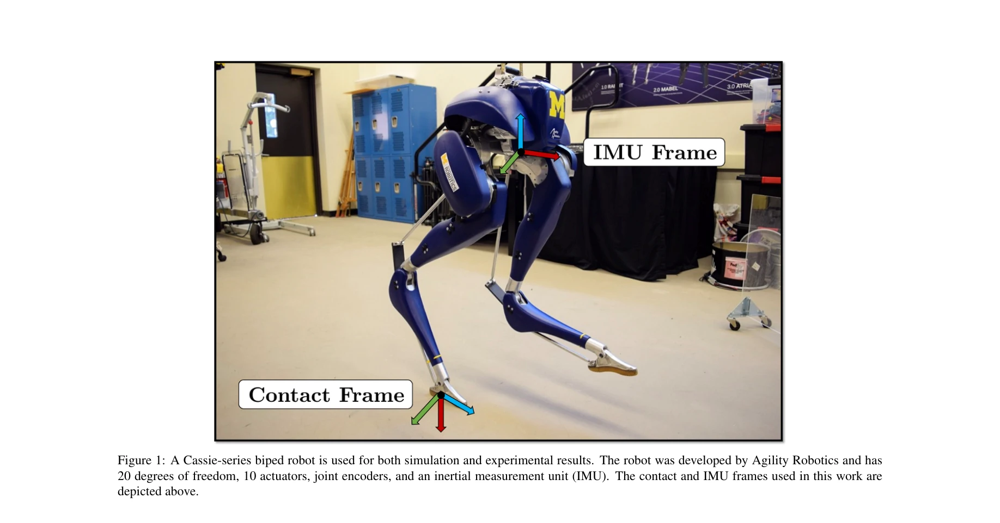
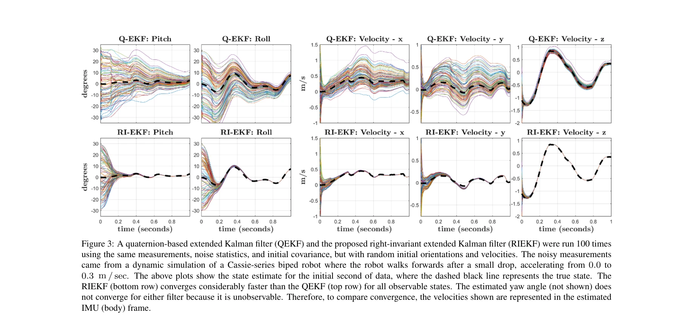

# Contact-Aided Invariant Extended Kalman Filtering for Robot State Estimation

> **저자**: Ross Hartley, Maani Ghaffari, Ryan M. Eustice, Jessy W. Grizzle | **날짜**: 2019-04-19 | **URL**: [https://arxiv.org/abs/1904.09251](https://arxiv.org/abs/1904.09251)

---

## Essence

*Figure 1: A Cassie-series biped robot is used for both simulation and experimental results. The robot was developed by A*

Lie 군론을 기반으로 한 Invariant Extended Kalman Filter (InEKF)를 개발하여 다리로봇의 접촉 센서, IMU, 운동학 데이터를 융합해 위치와 속도를 추정한다. 표준 EKF 대비 향상된 수렴성과 관측가능성을 제공한다.

## Motivation

- **Known**: 다리로봇의 상태 추정은 시각 기반 또는 IMU와 운동학/접촉 데이터 융합을 통해 수행되어왔으며, 표준 EKF (특히 quaternion-based EKF)가 널리 사용되고 있다.
- **Gap**: 표준 EKF는 현재 상태 추정값에 의존하는 선형화로 인해 관측가능성이 비일관적이고 수렴 성질이 제한적이다. Lie 군 불변성을 활용한 체계적 설계가 부재했다.
- **Why**: 다리로봇의 장기 자율주행을 위해서는 조명 변화에 강건하고 수렴 보장이 좋은 proprioceptive 센서 기반 상태 추정기가 필수이며, 이는 SLAM과 지형 매핑 등 고수준 작업을 지원한다.
- **Approach**: Lie 군 이론과 불변 관측기 설계를 적용하여 contact-inertial 동역학과 전방 운동학 측정을 결합한 InEKF를 유도했으며, 오차 동역학이 log-linear 자율 미분방정식을 따르도록 보장한다.

## Achievement

*Figure 3: A quaternion-based extended Kalman filter (QEKF) and the proposed right-invariant extended Kalman filter (RIEKF)*

- **log-linear 오차 동역학**: 상태 추정값과 무관한 오차 동역학으로 인해 기궤도와 독립적인 수렴 영역 획득
- **일관성 있는 관측가능성**: 표준 EKF와 달리 선형화된 관측 모델이 상태 추정값에 의존하지 않아 비선형 시스템과 일관성 있는 국소 관측가능성 행렬 도출
- **IMU 바이어스 포함**: 상태 증강을 통해 IMU 바이어스를 추정기에 통합
- **좌불변/우불변 형식화**: 세계 중심(world-centric)과 로봇 중심(robo-centric) 두 형식의 추정기 모두 제시
- **하드웨어 검증**: Cassie-series 이족 로봇에서 모션 캡처와 LiDAR 매핑 실험을 통해 QEKF 대비 우수한 성능 입증

## How

*Figure 3: A quaternion-based extended Kalman filter (QEKF) and the proposed right-invariant extended Kalman filter (RIEKF)*

- Lie 군 위의 상태 정의 및 group-affine 동역학 검증으로 log-linear 성질 보장
- Right-invariant 오차 정의를 통한 InEKF 유도 (Section 5)
- IMU 바이어스 상태 증강 및 접촉점 추가/제거 메커니즘 (Section 7-8)
- 연속시간 및 해석적 이산화 형식 제공 (Appendix)
- Left-invariant 오차 정의를 사용한 대안적 유도 (Section 10)
- Cassie 로봇 시뮬레이션 및 실험을 통한 수렴 특성 비교분석

## Originality

- Contact-inertial 네비게이션에 Lie 군 불변 관측기 이론을 체계적으로 적용한 첫 시도
- Forward kinematic 측정 모델과의 통합으로 기존 InEKF (SLAM, aided-inertial navigation)의 적용 범위 확장
- 로봇 기반 상태 추정에서 불변성으로 인한 superior 수렴 및 일관성 성질을 이론적으로 증명하고 실증
- Open-source C++ 라이브러리 공개로 재현성과 실용성 제고

## Limitation & Further Study

- **센서 잡음 및 바이어스**: 실제 환경에서 log-linear 성질이 근사화되므로 이론적 보장이 약화되는 한계
- **국소 수렴성**: EKF의 근본적 특성으로 전역 수렴은 보장되지 않으며 초기 추정값에 민감
- **접촉 감지 의존성**: 정확한 접촉 상태 감지 불가능 시 필터 성능이 급격히 저하될 우려
- **후속연구**: 불확실한 동역학 하에서의 robust InEKF 설계, 다중 센서 융합 시 관측가능성 분석 심화, 다리 로봇 이외 플랫폼(humanoid, quadruped)으로 확장

## Evaluation

- Novelty: 4/5
- Technical Soundness: 4/5
- Significance: 4/5
- Clarity: 4/5
- Overall: 4/5

**총평**: Lie 군 불변 관측기 이론을 다리로봇 상태 추정에 체계적으로 적용한 우수한 논문으로, 이론적 엄밀성(log-linear 오차 동역학, 일관성 있는 관측가능성)과 실증적 검증(Cassie 로봇 실험)을 모두 제시하며 로봇 자율주행의 장기 안정성 향상에 중요한 기여를 한다.

## Related Papers

- 🏛 기반 연구: [[papers/1276_AutoOdom_Learning_Auto-regressive_Proprioceptive_Odometry_fo/review]] — 자동회귀 주행거리측정에 접촉 기반 상태 추정의 InEKF 이론을 활용한다
- 🔗 후속 연구: [[papers/1495_InEKFormer_A_Hybrid_State_Estimator_for_Humanoid_Robots/review]] — InEKF 기반 상태 추정을 하이브리드 접근 방식으로 확장하여 성능을 향상시킨다
- 🔄 다른 접근: [[papers/1551_Legged_Robot_State-Estimation_Through_Combined_Forward_Kinem/review]] — 접촉 기반 상태 추정에서 InEKF 대신 순방향 운동학 결합 방법을 제시한다
- 🔗 후속 연구: [[papers/1276_AutoOdom_Learning_Auto-regressive_Proprioceptive_Odometry_fo/review]] — 접촉 기반 상태 추정을 자동회귀 학습으로 확장하여 더 정확한 주행거리측정을 달성한다
- 🔄 다른 접근: [[papers/1495_InEKFormer_A_Hybrid_State_Estimator_for_Humanoid_Robots/review]] — 두 논문 모두 하이브리드 상태 추정을 다루지만, 하나는 InEKF+Transformer에, 다른 하나는 contact-aided InEKF에 초점을 둔다.
- 🏛 기반 연구: [[papers/1551_Legged_Robot_State-Estimation_Through_Combined_Forward_Kinem/review]] — contact-aided invariant EKF의 이론적 배경이 factor graph 기반 상태 추정에서 접촉 정보 활용의 토대를 제공함
- 🔄 다른 접근: [[papers/1579_MorphoGuard_A_Morphology-Based_Whole-Body_Interactive_Motion/review]] — 접촉 상태 추정을 위한 불변 확장 칼만 필터링 방식과 MPM 기반 신경망 접근법이 서로 다른 접촉 모델링 철학을 보여줍니다.
