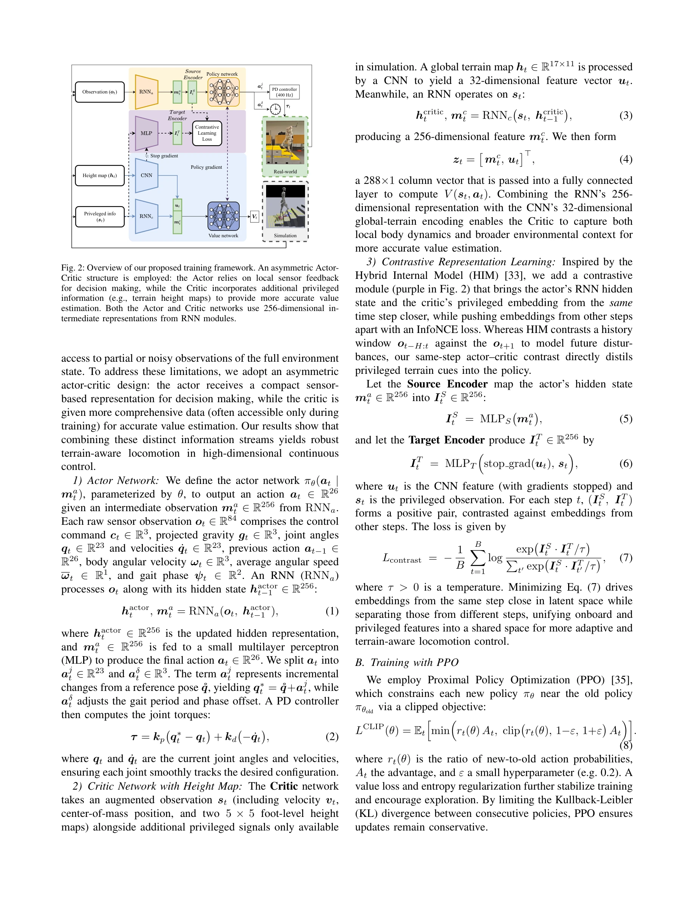
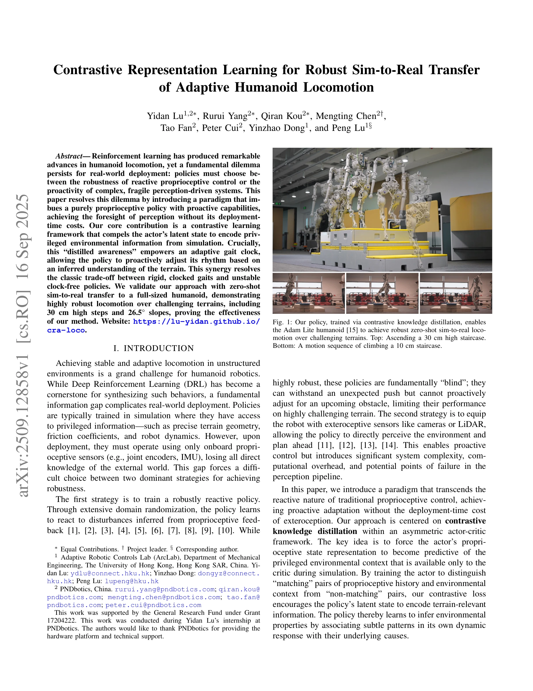

# Contrastive Representation Learning for Robust Sim-to-Real Transfer of Adaptive Humanoid Locomotion

> **저자**: Yidan Lu, Rurui Yang, Qiran Kou, Mengting Chen, Tao Fan, Peter Cui, Yinzhao Dong, Peng Lu | **날짜**: 2025-09-16 | **URL**: [https://arxiv.org/abs/2509.12858](https://arxiv.org/abs/2509.12858)

---

## Essence

*Fig. 2: Overview of our proposed training framework. An asymmetric Actor-*

Contrastive learning을 통해 privileged environmental information을 proprioceptive policy의 latent state에 distill하여, 순수 proprioceptive 제어의 견고성을 유지하면서 adaptive gait clock으로 지형을 능동적으로 인식할 수 있는 휴머노이드 로봇 제어 방법을 제시한다.

## Motivation

- **Known**: 강화학습은 휴머노이드 로봇의 안정적인 보행을 합성할 수 있으나, 시뮬레이션과 현실 간 정보 격차로 인해 견고한 reactive proprioceptive 제어와 복잡한 perception 기반 제어 사이의 딜레마가 존재한다.
- **Gap**: 기존 방법들은 적응형 gait를 학습할 수 있지만, proprioceptive policy가 언제 어떻게 적응해야 하는지에 대한 '지혜'가 부족하다. 또한 perception 기반 접근은 배포 시 복잡도와 장애점이 증가한다.
- **Why**: 현실 배포 환경에서 센서 신뢰성과 계산 효율성을 보장하면서도 높은 난이도 지형(30cm 계단, 26.5° 경사)을 통과할 수 있는 적응형 휴머노이드 제어는 로봇 공학의 중요한 과제이다.
- **Approach**: Asymmetric actor-critic 프레임워크 내에서 contrastive knowledge distillation을 적용하여, actor의 proprioceptive 상태 표현이 시뮬레이션 중 critic에게만 제공되는 privileged environmental context(높이 맵)를 예측하도록 강제한다. 이를 통해 distilled awareness가 adaptive gait clock을 지능적으로 조정한다.

## Achievement

*Fig. 1: Our policy, trained via contrastive knowledge distillation, enables*

- **Contrastive learning 기반 지식 증류**: 시뮬레이션의 privileged information을 순수 proprioceptive policy로 end-to-end 방식으로 distill하여 별도의 world model이나 teacher-student 다단계 구조를 회피
- **Rigid gait와 clock-free gait 간 trade-off 해결**: Distilled awareness를 기반으로 adaptive gait clock이 지형을 인식하여 gait frequency와 phase를 동적으로 조정
- **Zero-shot sim-to-real 전이 검증**: 30cm 높이의 계단과 26.5° 경사 등 도전적인 지형에서 실제 full-sized humanoid(Adam Lite)의 견고한 보행을 달성

## How

*Fig. 2: Overview of our proposed training framework. An asymmetric Actor-*

- Actor-Critic 비대칭 구조: Actor는 compact sensor input(84차원)을 받아 26차원 action으로 변환하고, Critic은 privileged information(height map)을 CNN으로 처리하여 더 정확한 value estimation 수행
- RNN 기반 temporal modeling: Actor와 Critic 모두 256차원 hidden state를 가진 recurrent neural network 사용
- Spatial contrastive objective: Actor의 proprioceptive history와 environmental context의 matching/non-matching 쌍을 구분하도록 contrastive loss 적용
- Adaptive gait mechanism: Policy의 latent state로부터 추론된 환경 인식을 바탕으로 global phase φ(t)를 동적으로 조정하여 gait rhythm을 적응
- Domain randomization: 시뮬레이션 학습 중 extensive domain randomization으로 robust terrain-aware locomotion 구현

## Originality

- 기존의 temporal contrastive learning(historical-future alignment)이나 auxiliary world model과 달리, spatial contrastive objective를 사용하여 직접적으로 immediate environmental context와 policy latent representation을 정렬
- Distilled awareness와 adaptive gait clock의 시너지: 단순히 지형 인식만이 아닌, 그 인식을 기반으로 정확한 제어 구조(adaptive clock)에 통합하는 것이 신규 기여
- Asymmetric actor-critic 프레임워크 내에서의 contrastive learning 적용 방식의 창의적 설계

## Limitation & Further Study

- 실험이 단일 로봇 플랫폼(Adam Lite)에서만 수행되어 다양한 휴머노이드 형태에 대한 일반화 가능성이 미명확
- Privileged information이 height map으로 제한되어, friction coefficient나 robot dynamics 등 다른 중요한 환경 특성의 활용 가능성 탐구 부재
- Contrastive loss 설계 및 hyperparameter(negative sampling, temperature scaling 등)에 대한 상세한 ablation study 부족
- Indoor 시뮬레이션 환경과 제한된 실외 지형(실험용 계단, 경사) 사이의 sim-to-real gap에 대한 심화 분석 필요
- Long-horizon navigation이나 복잡한 환경에서의 성능 평가 부재

## Evaluation

- Novelty: 4/5
- Technical Soundness: 3/5
- Significance: 4/5
- Clarity: 4/5
- Overall: 4/5

**총평**: 본 논문은 contrastive learning을 통해 sim-to-real 정보 격차를 효과적으로 극복하고, adaptive gait clock과의 통합으로 reactive 제어의 견고성과 proactive 제어의 적응성을 결합한 창의적이고 실용적인 방법을 제시한다. Zero-shot sim-to-real 전이 실험의 성공과 도전적 지형 통과 결과는 방법의 효과성을 입증하나, 단일 플랫폼 검증과 ablation study 보강이 영향력 증대에 필요하다.

## Related Papers

- 🔗 후속 연구: [[papers/1255_Adapting_Humanoid_Locomotion_over_Challenging_Terrain_via_Tw/review]] — 지형 적응에 대조 학습을 통한 환경 정보 증류를 추가하여 견고성을 강화한다
- 🏛 기반 연구: [[papers/1310_CMR_Contractive_Mapping_Embeddings_for_Robust_Humanoid_Locom/review]] — 견고한 제어를 위한 대조 학습과 표현 학습의 이론적 기반을 제공한다
- 🏛 기반 연구: [[papers/1271_Architecture_Is_All_You_Need_Diversity-Enabled_Sweet_Spots_f/review]] — proprioceptive 제어의 견고성에 구조적 분리 원칙을 활용한다
- 🔗 후속 연구: [[papers/1310_CMR_Contractive_Mapping_Embeddings_for_Robust_Humanoid_Locom/review]] — 대조 학습에 수축 매핑과 Lipschitz 정규화를 추가하여 견고성을 강화한다
- 🔗 후속 연구: [[papers/1271_Architecture_Is_All_You_Need_Diversity-Enabled_Sweet_Spots_f/review]] — 구조적 분리 원칙을 대조 학습 기반 견고한 제어로 확장한다
- 🏛 기반 연구: [[papers/1255_Adapting_Humanoid_Locomotion_over_Challenging_Terrain_via_Tw/review]] — 지형 인식을 위한 대조 학습 기법의 이론적 기반을 제공한다
- 🔄 다른 접근: [[papers/1431_Impact_of_Static_Friction_on_Sim2Real_in_Robotic_Reinforceme/review]] — 두 논문 모두 sim-to-real transfer를 다루지만, 하나는 정적 마찰에, 다른 하나는 contrastive representation learning에 초점을 둔다.
