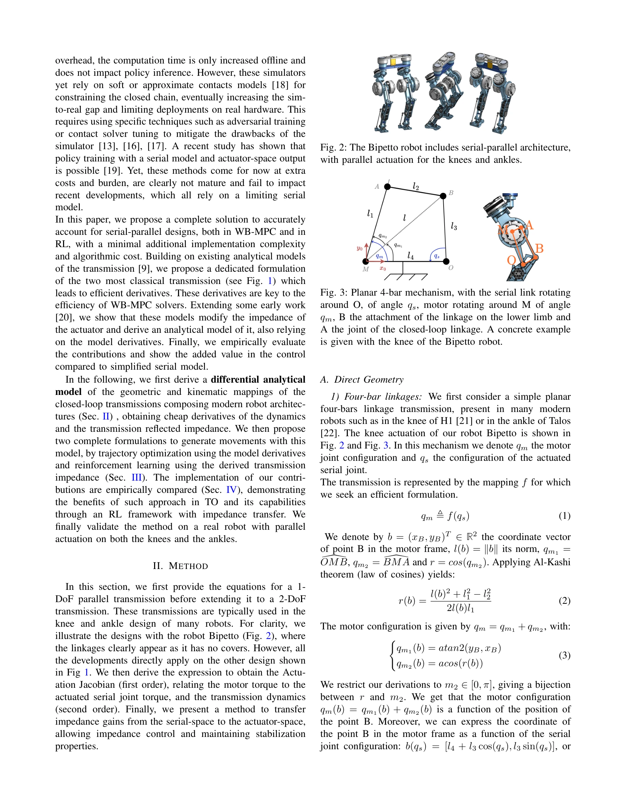
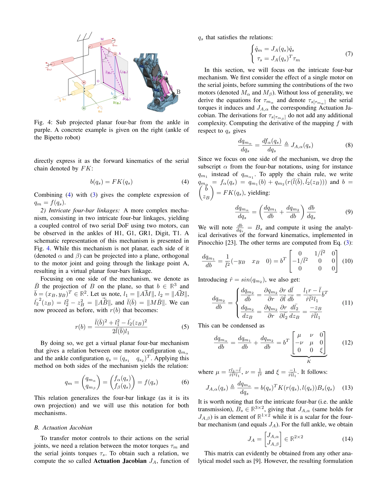

# Control of Humanoid Robots with Parallel Mechanisms using Differential Actuation Models

> **저자**: Victor Lutz, Ludovic de Matteis, Virgile Batto, Nicolas Mansard | **날짜**: 2025-03-28 | **URL**: [https://arxiv.org/abs/2503.22459](https://arxiv.org/abs/2503.22459)

---

## Essence

*Fig. 2: The Bipetto robot includes serial-parallel architecture,*

Humanoid 로봇의 병렬 구동 메커니즘(knee, ankle)에 대한 정확한 비선형 전달함수 모델을 제시하고, 이를 trajectory optimization과 reinforcement learning에 통합하여 제어 성능을 향상시킨다.

## Motivation

- **Known**: 최근 humanoid 로봇들은 모터를 관절에서 분리하는 serial-parallel 아키텍처를 채택하여 leg inertia를 감소시키지만, 정확한 closed-loop 모델링은 계산 비용이 크다. 따라서 대부분의 제어 알고리즘은 상수 감속비로 근사한다.
- **Gap**: 기존 constant reduction ratio 근사는 병렬 메커니즘의 비선형 특성을 무시하여 제어 성능을 제한하며, 정확한 모델을 사용하는 가능한 방법들(GPU simulator, exact kinematic modeling)은 계산 비용이나 sim-to-real gap 문제가 있다.
- **Why**: 정확한 전달함수 모델을 활용하면 로봇의 동적 성능을 향상시킬 수 있으며, 미분 가능한 저비용 형태로 표현하면 trajectory optimization과 reinforcement learning 모두에 실질적으로 적용 가능하다.
- **Approach**: Four-bar linkage 기구학에 기반한 analytical formulation을 개발하여 actuation Jacobian과 transmission dynamics를 정확히 계산하고, 이를 통해 전달 임피던스를 유도하여 trajectory optimization과 RL 기반 제어에 통합한다.

## Achievement

*Fig. 3: Planar 4-bar mechanism, with the serial link rotating*

- **정확한 비선형 전달함수 모델링**: 1-DoF (knee) 및 2-DoF (ankle) 병렬 메커니즘에 대해 compact analytical formulation 제시
- **효율적 미분 계산**: 2차 미분까지 fully differentiable하면서도 minimal formulation으로 계산 비용 최소화
- **Actuation Jacobian 유도**: Motor torque를 serial joint torque로 변환하는 정확한 관계식 도출
- **Transmission impedance 전달**: Serial-space impedance gains를 actuator-space로 변환하여 impedance control 가능화
- **하드웨어 검증**: Bipetto 로봇에서 trajectory optimization과 RL 기반 locomotion policy learning으로 constant-ratio 접근법 대비 향상된 정확도와 견고성 입증

## How

*Fig. 4: Sub projected planar four-bar from the ankle in*

- Four-bar linkage의 직접 기하학(Direct Geometry): Al-Kashi 정리를 적용하여 motor 각도 qm과 serial joint 각도 qs의 관계식 유도
- 2-DoF ankle 메커니즘: 3차원 복잡한 구조를 평면에 정사영(orthogonal projection)하여 virtual planar four-bar로 분석
- Actuation Jacobian: 전달함수 f(qs)를 qs에 대해 미분하여 qs 속도를 motor 속도로 변환, 역으로 torque 변환
- Transmission dynamics 계산: Actuation Jacobian 미분을 통해 2차 동역학 정보 획득
- Impedance 변환: 운동에너지 및 위치에너지 변환을 통해 serial impedance를 actuator-space impedance로 매핑
- Trajectory optimization: 유도된 dynamics 미분을 MPC solver에 통합
- RL 통합: Transmission impedance를 reward function 또는 policy 제약으로 활용하여 안정화

## Originality

- 기존 연구[9]의 systematic analytical model을 바탕으로 하지만, 2차 미분 최적화를 위한 efficient formulation 개발이 새로움
- Four-bar linkage에서 ankle의 intricate 2-DoF 메커니즘까지 통일된 formulation으로 확장
- Transmission impedance의 analytical derivation이 RL 기반 제어와 명시적으로 연결된 점이 novel
- WB-MPC와 RL 두 제어 패러다임 모두에 동시에 적용 가능한 통합 솔루션 제시

## Limitation & Further Study

- 현재 formulation은 knee와 ankle의 두 표준 메커니즘만 다루며, 다른 병렬 구조 (shoulder, hip 등)로 일반화 필요
- Planar 또는 가상 planar 메커니즘 가정이 있어 완전히 3차원적인 구조에는 제한될 수 있음
- 하드웨어 실험이 Bipetto 로봇 한 대에만 수행되어 다양한 로봇 플랫폼에서의 검증 필요
- 마찰, 백래시 등 실제 메커니즘 비선형성은 모델에 포함되지 않음
- GPU 기반 simulator와의 비교가 없어 계산 효율성 정량적 비교 부족
- 후속 연구: 3차 이상 미분 필요 응용, 시변 메커니즘 모델링, 더 많은 로봇 플랫폼 검증

## Evaluation

- Novelty: 4/5
- Technical Soundness: 3/5
- Significance: 4/5
- Clarity: 4/5
- Overall: 4/5

**총평**: 이 논문은 humanoid 로봇의 병렬 구동 메커니즘을 정확하면서도 효율적으로 모델링하는 실질적인 솔루션을 제시하며, trajectory optimization과 reinforcement learning 양쪽 제어 프레임워크에 통합한 점이 실무적 가치가 높다. 하드웨어 검증과 analytical formulation의 우수성이 돋보이지만, 다양한 메커니즘과 플랫폼으로의 확장이 필요하다.

## Related Papers

- 🧪 응용 사례: [[papers/1241_A_Framework_for_Optimal_Ankle_Design_of_Humanoid_Robots/review]] — 병렬 메커니즘의 정확한 비선형 전달함수 모델이 발목 설계 최적화의 제어 성능 향상에 직접 적용됩니다.
- 🏛 기반 연구: [[papers/1300_Characteristics_Management_and_Utilization_of_Muscles_in_Mus/review]] — 병렬 구동 메커니즘의 비선형 모델링이 근육골격 구조의 Variable Moment Arm 특성 이해에 기초가 됩니다.
- 🔗 후속 연구: [[papers/1472_Humanoid_Robot_Acrobatics_Utilizing_Complete_Articulated_Rig/review]] — 병렬 메커니즘 제어가 완전한 강체역학 방정식 기반 곡예 제어 아키텍처로 확장 적용됩니다.
- 🧪 응용 사례: [[papers/1300_Characteristics_Management_and_Utilization_of_Muscles_in_Mus/review]] — 근육의 Redundancy와 Variable Moment Arm 특성이 병렬 메커니즘의 정확한 비선형 모델링에 적용됩니다.
- 🏛 기반 연구: [[papers/1241_A_Framework_for_Optimal_Ankle_Design_of_Humanoid_Robots/review]] — 발목 설계 최적화의 병렬 메커니즘 이론이 휴머노이드 로봇의 병렬 구동 메커니즘 제어에 직접 적용됩니다.
- 🏛 기반 연구: [[papers/1472_Humanoid_Robot_Acrobatics_Utilizing_Complete_Articulated_Rig/review]] — 병렬 메커니즘의 정확한 동역학 모델이 완전한 강체역학 방정식 활용의 기반을 제공합니다.
