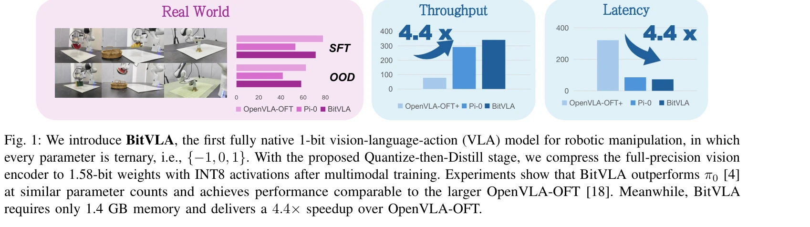
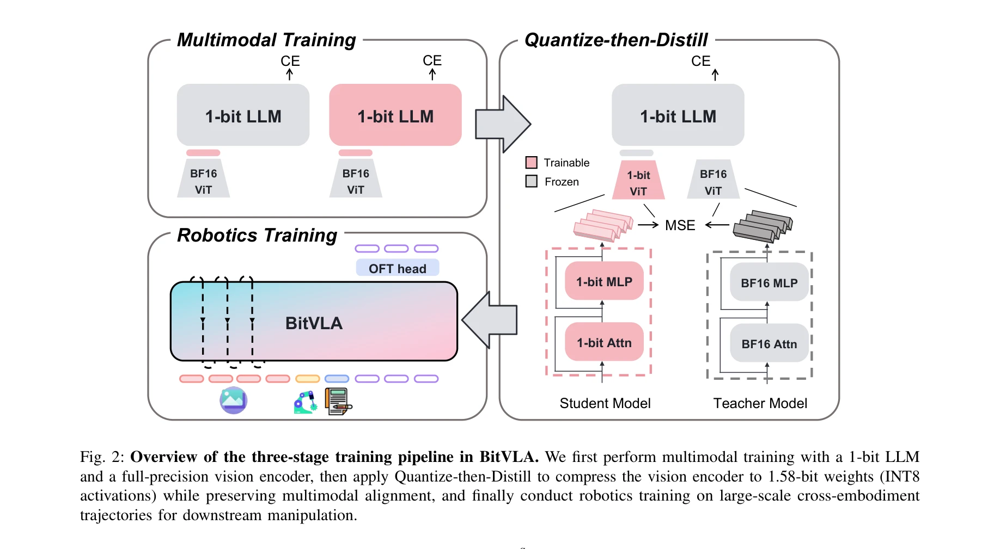

# BitVLA: 1-bit Vision-Language-Action Models for Robotics Manipulation

> **저자**: Hongyu Wang, Chuyan Xiong, Ruiping Wang, Xilin Chen | **날짜**: 2025-06-09 | **URL**: [https://arxiv.org/abs/2506.07530](https://arxiv.org/abs/2506.07530)

---

## Essence

*Fig. 1: We introduce BitVLA, the first fully native 1-bit vision-language-action (VLA) model for robotic manipulation, i*

로봇 조작을 위한 완전한 1-bit Vision-Language-Action 모델인 BitVLA를 제안하여 11.0배의 메모리 감소와 4.4배의 지연 시간 단축을 달성하면서도 full-precision 기준 모델과 비슷한 성능을 유지한다.

## Motivation

- **Known**: Vision-Language-Action (VLA) 모델은 로봇 조작을 위한 유망한 패러다임이지만, 기존 VLA 모델들은 대규모 full-precision 파라미터로 인해 엣지 로봇 플랫폼에 배포하기 어렵다는 문제가 있다.
- **Gap**: 극도로 낮은 비트의 모델링(1-bit LLM)이 언어 영역에서 성과를 보였으나, 다중모달 인식과 로봇 제어로의 확장은 여전히 미흡한 상태이며, post-hoc 압축만으로는 정확도 손실을 초래한다.
- **Why**: 메모리 제약이 있는 엣지 로봇 플랫폼에서 경쟁력 있는 조작 능력을 실현하기 위해 training-time에 양자화와 학습을 통합한 co-design이 필요하며, 이는 로봇 공학 분야의 실제 배포 가능성을 크게 향상시킬 수 있다.
- **Approach**: BitNet b1.58 2B4T 1-bit LLM 백본과 full-precision vision encoder를 초기에 학습한 후, Quantize-then-Distill이라는 양자화 인식 학습 전략으로 vision encoder를 1.58-bit 가중치로 압축하면서 teacher 모델의 지도로 표현 정렬을 유지하고, 대규모 로봇 궤적에 대한 사전학습을 수행한다.

## Achievement

*Fig. 1: We introduce BitVLA, the first fully native 1-bit vision-language-action (VLA) model for robotic manipulation, i*

- **완전한 1-bit VLA 모델**: 모든 파라미터가 ternary {-1, 0, 1}인 첫 번째 fully native 1-bit Vision-Language-Action 모델을 구축했다.
- **극적인 효율성 개선**: 모델 메모리를 11.0배 감소(1.4GB)시키고 end-to-end 지연 시간을 4.4배 단축하면서도 성능 저하 최소화
- **경쟁력 있는 성능 유지**: OpenVLA-OFT baseline과 비교하여 LIBERO 벤치마크 및 실제 로봇 실험에서 유사한 조작 성공률 달성
- **Quantize-then-Distill 전략**: Vision encoder를 1.58-bit 가중치로 압축하는 경량 양자화 인식 훈련 방법 제시로 표현 정렬 유지

## How

*Fig. 2: Overview of the three-stage training pipeline in BitVLA. We first perform multimodal training with a 1-bit LLM*

- BitNet b1.58 2B4T를 1-bit LLM 백본으로 사용하고 SigLIP-L을 224×224 해상도의 vision encoder로 채택
- LLaVA 훈련 패러다임을 따라 1-bit LLM과 full-precision vision encoder를 페어링하여 multimodal 훈련 수행
- Quantize-then-Distill 단계에서 full-precision vision encoder를 teacher로 사용하여 MSE와 Cross-Entropy 손실로 1.58-bit INT8 vision encoder 훈련
- OpenVLA 패러다임을 따라 약 1M개의 실제 로봇 궤적으로 로봇 조작 사전학습 수행
- Linear transformation에서 ternary 가중치와 INT8 활성화를 사용하여 부동소수점 연산량을 1/10 이상 감소

## Originality

- 다중모달 perception과 로봇 제어 영역에 native 1-bit 모델링을 처음 적용
- 양자화를 훈련 후 압축이 아닌 훈련 과정의 일부로 통합하는 Quantize-then-Distill 방법론 개발
- Vision-Language-Action 학습의 복잡한 상호작용 속에서 극단적인 저비트 양자화의 실현 가능성 입증
- 엣지 로봇 플랫폼의 메모리-성능 trade-off를 해결하는 training-time co-design 패러다임 제시

## Limitation & Further Study

- 현재 SigLIP-L vision encoder 기반이므로 더 큰 vision 모델의 1.58-bit 양자화 가능성 미검증
- Quantize-then-Distill에서 teacher 모델이 여전히 full-precision이므로 배포 시 추가 메모리 요구
- LIBERO 시뮬레이션과 특정 실제 로봇 작업에 한정된 평가로 일반화 가능성에 대한 추가 검증 필요
- 후속 연구에서 더 극단적인 양자화(binary 가중치) 가능성, 더 큰 기본 VLM과의 결합, 그리고 1-bit VLA 특화 가속기 설계 탐색 권장

## Evaluation

- Novelty: 4/5
- Technical Soundness: 4/5
- Significance: 4/5
- Clarity: 4/5
- Overall: 4/5

**총평**: BitVLA는 로봇 조작용 VLA 모델의 극단적 양자화의 첫 성공적 사례로, Quantize-then-Distill이라는 혁신적 훈련 전략을 통해 11배 메모리 감소와 4.4배 속도 향상을 달성하면서도 성능을 유지하여 엣지 로봇 배포의 실질적 경로를 제시한다.

## Related Papers

- 🔄 다른 접근: [[papers/1327_CEED-VLA_Consistency_Vision-Language-Action_Model_with_Early/review]] — 둘 다 VLA 모델 최적화를 다루지만 BitVLA는 1-bit quantization을, CEED-VLA는 early-exit decoding을 통한 가속화를 추구한다.
- 🔗 후속 연구: [[papers/1588_TinyVLA_Towards_Fast_Data-Efficient_Vision-Language-Action_M/review]] — TinyVLA의 fast, data-efficient 접근법이 BitVLA의 1-bit 압축과 결합되어 더욱 경량화된 VLA 모델을 구현할 수 있다.
- 🏛 기반 연구: [[papers/1577_SpecPrune-VLA_Accelerating_Vision-Language-Action_Models_via/review]] — SpecPrune-VLA의 pruning 기법이 BitVLA의 1-bit quantization과 함께 사용되어 더 효과적인 모델 압축을 달성할 수 있다.
- 🔄 다른 접근: [[papers/1495_NORA_A_Small_Open-Sourced_Generalist_Vision_Language_Action/review]] — VLA 모델의 경량화에서 3B 파라미터와 1-bit quantization이라는 서로 다른 효율성 향상 접근법을 보여준다.
- 🔄 다른 접근: [[papers/1533_RLRC_Reinforcement_Learning-based_Recovery_for_Compressed_Vi/review]] — VLA 모델의 효율성 향상을 압축과 양자화라는 상호 보완적인 방법으로 달성한다.
- 🔄 다른 접근: [[papers/1577_SpecPrune-VLA_Accelerating_Vision-Language-Action_Models_via/review]] — VLA 모델 효율화의 다른 접근법으로 1비트 양자화와 토큰 프루닝의 성능-효율성 트레이드오프를 비교할 수 있다.
- 🔄 다른 접근: [[papers/1588_TinyVLA_Towards_Fast_Data-Efficient_Vision-Language-Action_M/review]] — VLA 모델 경량화의 다른 접근법으로 1비트 양자화와 소형 아키텍처 설계를 비교할 수 있다.
- 🔗 후속 연구: [[papers/1627_What_Matters_in_Building_Vision-Language-Action_Models_for_G/review]] — BitVLA의 1-bit 압축 기술이 RoboVLMs의 효율성을 크게 개선한 실용적 발전
- 🔄 다른 접근: [[papers/1616_VLA-Adapter_An_Effective_Paradigm_for_Tiny-Scale_Vision-Lang/review]] — 둘 다 경량 VLA 모델이지만 VLA-Adapter는 0.5B 파라미터, BitVLA는 1-bit 양자화로 다른 효율성 접근법이다
- 🧪 응용 사례: [[papers/1502_It_Takes_Two_Learning_Interactive_Whole-Body_Control_Between/review]] — Coordinated Humanoid Manipulation의 choice policies가 이중-휴머노이드 협력 제어의 실제 구현 사례를 보여줌
- 🏛 기반 연구: [[papers/1524_Learning_Human-Humanoid_Coordination_for_Collaborative_Objec/review]] — 인간과 로봇의 협응된 조작을 위한 choice policy 기반 접근법이 COLA의 동적 역할 전환 메커니즘의 이론적 토대를 제공함
- 🔄 다른 접근: [[papers/1327_CEED-VLA_Consistency_Vision-Language-Action_Model_with_Early/review]] — 둘 다 VLA 모델 효율성 개선이지만 CEED-VLA는 early-exit decoding을, BitVLA는 1-bit quantization을 통한 최적화를 추구한다.
