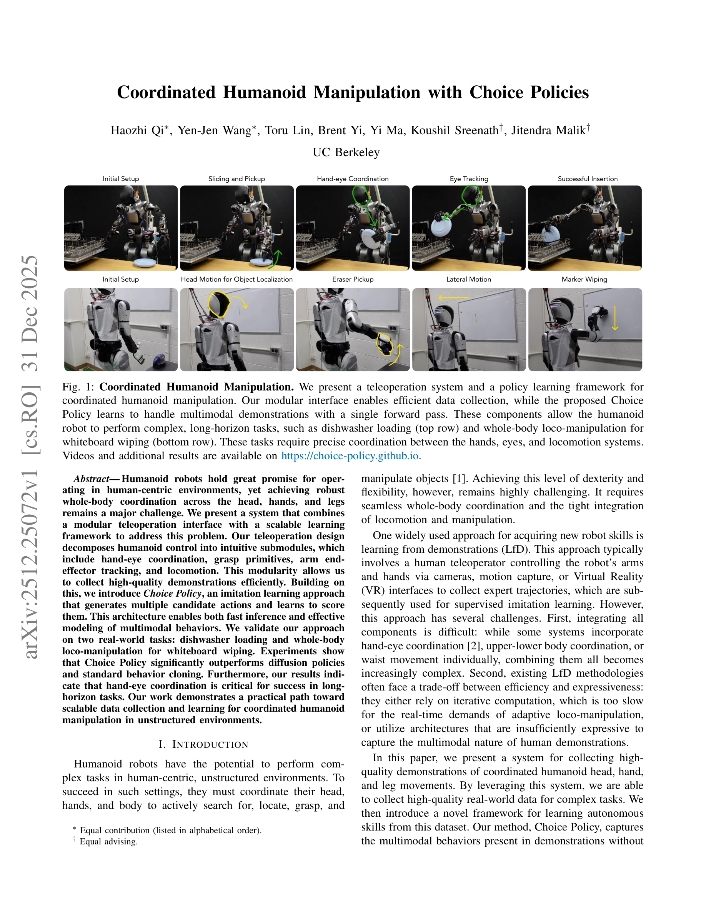
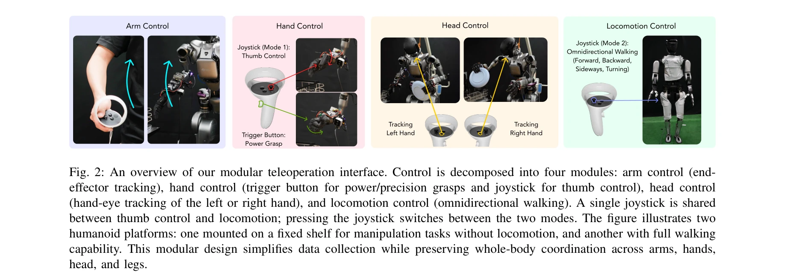

# Coordinated Humanoid Manipulation with Choice Policies

> **저자**: Haozhi Qi, Yen-Jen Wang, Toru Lin, Brent Yi, Yi Ma, Koushil Sreenath, Jitendra Malik | **날짜**: 2025-12-31 | **DOI**: [10.48550/arXiv.2512.25072](https://doi.org/10.48550/arXiv.2512.25072)

---

## Essence

*Fig. 1: Coordinated Humanoid Manipulation. We present a teleoperation system and a policy learning framework for*

인간형 로봇의 머리, 손, 다리를 통합 제어하기 위해 모듈식 텔레오퍼레이션 인터페이스와 Choice Policy라는 모방학습 방법을 결합한 시스템을 제시합니다. Choice Policy는 여러 후보 행동을 생성하고 점수를 매겨 빠른 추론과 다중모드 동작 모델링을 동시에 달성합니다.

## Motivation

- **Known**: 인간형 로봇은 인간 중심 환경에서 작업할 잠재력이 있으며, 인간 키포인트 기반 망원경화나 VR 인터페이스를 이용한 텔레오퍼레이션 연구가 진행되어 왔습니다. 하지만 머리, 손, 다리의 전신 조율과 multimodal 행동 모델링은 여전히 도전 과제입니다.
- **Gap**: 기존 학습 방식은 효율성과 표현력 사이의 트레이드오프를 마주하고 있으며, diffusion 정책은 추론 속도가 느리고 behavior cloning은 다중모드 특성을 잘 포착하지 못합니다. 또한 전신 조율을 동시에 다루는 통합 텔레오퍼레이션 시스템과 대응하는 학습 방법이 부족합니다.
- **Why**: 인간형 로봇이 현실 세계의 비정형 환경에서 복잡한 장기 태스크를 수행하려면 전신 협력이 필수적이며, 이를 위한 효율적인 데이터 수집과 빠른 추론 방식의 학습 프레임워크가 필요합니다.
- **Approach**: 모듈식 VR 기반 텔레오퍼레이션 인터페이스를 통해 팔 엔드이펙터 추적, 손 자세, 손-눈 협력, 보행 제어를 분해된 형태로 수집합니다. 수집된 데이터로부터 Choice Policy를 학습하여 여러 후보 행동을 생성하고 스코어 네트워크를 통해 최적 행동을 선택합니다.

## Achievement

*Fig. 1: Coordinated Humanoid Manipulation. We present a teleoperation system and a policy learning framework for*

- **모듈식 텔레오퍼레이션 설계**: 전신 제어를 직관적인 4개 서브모듈(팔 제어, 손 제어, 머리 제어, 보행 제어)로 분해하여 데이터 수집 효율성을 크게 개선
- **Choice Policy 알고리즘**: K개의 후보 행동 생성 및 스코어 네트워크를 통한 선택으로 단일 포워드 패스로 multimodal 행동 모델링 가능
- **실제 환경 검증**: 식기세척기 로딩과 화이트보드 닦기 전신 로코-조작 태스크에서 diffusion policy 및 behavior cloning을 능가하는 성능 입증
- **손-눈 협력의 중요성 규명**: 장기 태스크 성공에 있어 능동적 시선 추적의 필수성을 실험으로 검증

## How

*Fig. 2: An overview of our modular teleoperation interface. Control is decomposed into four modules: arm control (end-*

- VR 컨트롤러의 포즈 변화를 팔 엔드이펙터 포즈로 직접 매핑
- 트리거 버튼으로 power/precision grasp 선택, 조이스틱으로 엄지손가락 제어
- 손-눈 협력 모드에서 머리가 왼손 또는 오른손을 자동 추적
- 조이스틱으로 보행 명령 입력, 시뮬레이션에서 사전 학습된 RL 기반 base policy 활용
- 수집된 데이터의 점수 네트워크: ground-truth 행동과의 negative MSE 중첩으로 감독
- 행동 제안 네트워크: winner-takes-all 패러다임으로 최소 MSE를 가진 제안만 역전파 업데이트

## Originality

- 모듈식 분해를 통한 전신 인간형 로봇 제어의 새로운 접근 — 기존 작업은 상체만, 또는 상하체를 분리하여 다룸
- multi-choice learning에 영감을 받은 Choice Policy의 설계로 diffusion 및 behavior cloning의 단점을 동시에 해결
- 손-눈 협력이 장기 태스크 성공에 미치는 영향을 체계적으로 분석
- 실제 인간형 로봇에서 전신 조율이 필요한 두 가지 현실 태스크에 대한 comprehensive 검증

## Limitation & Further Study

- 데이터 수집이 여전히 수동 텔레오퍼레이션에 의존하며, 대규모 자동화된 학습으로의 확장성 제한
- Choice Policy의 K(후보 개수)와 스코어 네트워크 아키텍처에 대한 설계 선택의 민감도 분석 부재
- 두 가지 특정 태스크에만 검증되었으며, 다른 도메인(예: 미세 조작, 비정상 객체)의 일반화 능력 미확인
- winner-takes-all 학습이 다양한 행동 모드를 완전히 포착하는지에 대한 이론적 보장 부족
- 후속 연구: 자동화된 데이터 생성, 시뮬레이션 사전학습, 강화학습과의 결합을 통한 정책 개선; 더 복잡한 multimodal 분포를 다루기 위한 스코어 함수의 고도화

## Evaluation

- Novelty: 4/5
- Technical Soundness: 3/5
- Significance: 4/5
- Clarity: 4/5
- Overall: 4/5

**총평**: 이 논문은 인간형 로봇의 전신 조율 문제에 대해 실용적이고 체계적인 해결책을 제시하며, 모듈식 인터페이스와 Choice Policy의 조합이 실제 환경에서 효과적임을 입증합니다. 다만 대규모 데이터 확장성과 다양한 도메인으로의 일반화 가능성에 대한 추가 분석이 필요합니다.

## Related Papers

- 🔗 후속 연구: [[papers/1279_BEHAVIOR_Robot_Suite_Streamlining_Real-World_Whole-Body_Mani/review]] — 통합 휴머노이드 조작에서 Choice Policy가 WB-VIMA 시각운동 정책을 확장한다
- 🔗 후속 연구: [[papers/1303_CHIP_Adaptive_Compliance_for_Humanoid_Control_through_Hindsi/review]] — Choice Policy 기반 모방학습에서 적응형 compliance 제어가 기초 제어로 활용된다
- 🏛 기반 연구: [[papers/1289_Bi-Level_Motion_Imitation_for_Humanoid_Robots/review]] — 모듈식 텔레오퍼레이션에서 사회적 의도 추론이 Choice Policy의 행동 선택에 기초가 된다
- 🧪 응용 사례: [[papers/1436_HAIC_Humanoid_Agile_Object_Interaction_Control_via_Dynamics-/review]] — 동역학 인식 물체 상호작용에서 Choice Policy의 다중모드 행동 모델링이 적용된다
- 🏛 기반 연구: [[papers/1303_CHIP_Adaptive_Compliance_for_Humanoid_Control_through_Hindsi/review]] — 통합 휴머노이드 조작에서 적응형 compliance가 Choice Policy의 기초 제어가 된다
- 🏛 기반 연구: [[papers/1279_BEHAVIOR_Robot_Suite_Streamlining_Real-World_Whole-Body_Mani/review]] — Choice Policy의 모듈식 접근에서 WB-VIMA 시각운동 정책이 기초가 된다
