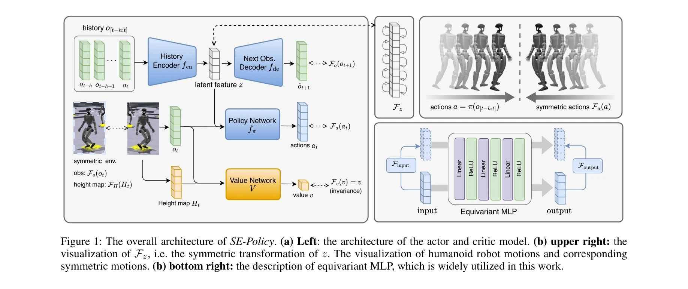

# Coordinated Humanoid Robot Locomotion with Symmetry Equivariant Reinforcement Learning Policy

> **저자**: Buqing Nie, Yang Zhang, Rongjun Jin, Zhanxiang Cao, Huangxuan Lin, Xiaokang Yang, Yue Gao | **날짜**: 2025-08-02 | **URL**: [https://arxiv.org/abs/2508.01247](https://arxiv.org/abs/2508.01247)

---

## Essence

*Figure 1: The overall architecture of SE-Policy. (a) Left: the architecture of the actor and critic model. (b) upper rig*

인간의 양측 대칭성을 모방하여 휴머노이드 로봇의 대칭성을 DRL 프레임워크에 엄격히 내장한 SE-Policy를 제안하며, actor에는 equivariance, critic에는 invariance를 추가 하이퍼파라미터 없이 구현한다.

## Motivation

- **Known**: 기존 DRL 방식은 로봇의 형태학적 대칭성을 무시하여 부조화롭고 비최적의 행동을 야기한다. 이를 해결하기 위해 temporal symmetry, data augmentation, loss regularization 등 다양한 방법들이 제안되었으나 느슨한 제약이나 추가 하이퍼파라미터 조정의 문제가 있다.
- **Gap**: 기존의 느슨한 equivariant 방법들은 정책 제약이 불충분하고, 정규화 방법들은 추가 하이퍼파라미터를 요구하며, 엄격한 equivariant 방법들은 시뮬레이션 환경에서만 검증되어 실제 휴머노이드 로봇에서의 효과가 미흡하다.
- **Why**: 휴머노이드 로봇 제어는 높은 민첩성과 견고성을 요구하며, 형태학적 대칭성을 올바르게 활용하면 조화로운 움직임과 더 나은 성능을 달성할 수 있다.
- **Approach**: 네트워크 아키텍처에 엄격한 대칭성 equivariance와 invariance를 직접 내장하여 actor-critic 기반 DRL 방식을 설계하고, Unitree G1 로봇의 속도 추적 작업으로 검증한다.

## Achievement

*Figure 2: The tracking errors in terms of position (TE-P) and*

- **추적 정확도 향상**: 기존 최신 방법 대비 최대 40% 향상된 속도 추적 오차 달성
- **공간-시간 조화**: 부조화로운 움직임을 제거하고 자연스러운 대칭 운동 생성
- **추가 하이퍼파라미터 제거**: 엄격한 equivariance 제약을 아키텍처에 내장하면서 조정할 파라미터 없음
- **현실 로봇 검증**: 시뮬레이션뿐 아니라 실제 Unitree G1 로봇에서 우수 성능 입증
- **일반적 적용성**: 대칭 형태를 가진 다양한 휴머노이드 로봇과 제어 작업에 적용 가능

## How

*Figure 1: The overall architecture of SE-Policy. (a) Left: the architecture of the actor and critic model. (b) upper rig*

- Observation space에 사용자 속도 명령 c, 로봇 상태(각속도, 관절각, 이전 액션), 위상 입력 Φ 포함
- Actor 네트워크: 관찰을 equivariant MLP로 처리하여 대칭 관찰에 대해 대칭 액션 출력
- Critic 네트워크: invariant 구조로 대칭 관찰에 동일한 가치 함수값 반환
- Equivariant MLP: 선형층-ReLU-선형층 구조로 strict equivariance 보장
- Height map encoder 및 history encoder로 센서 입력과 시간적 정보 처리
- Actor-critic 프레임워크를 통한 정책과 가치 함수의 동시 학습

## Originality

- 휴머노이드 로봇을 위한 엄격한(strict) symmetry equivariance를 아키텍처 수준에서 최초로 구현
- 추가 하이퍼파라미터 없이 actor의 equivariance와 critic의 invariance를 동시에 달성하는 깔끔한 설계
- 느슨한 제약 방식의 한계를 극복하고 기존 엄격한 equivariant 방법의 실제 로봇 적용 가능성 입증

## Limitation & Further Study

- Velocity tracking 작업에만 검증되었으며, 다른 조작(manipulation) 또는 복합 운동 작업에의 일반화 가능성 미검토
- Unitree G1 로봇에서만 실제 실험이 수행되어 다른 휴머노이드 로봇 플랫폼에서의 성능 미확인
- 위상 입력 Φ 설계가 작업에 종속적일 수 있으며, 다양한 동작 주기를 가진 작업에 대한 적응성 미분석
- sim-to-real transfer의 상세한 분석 및 보정(domain randomization 등) 방법론 부재
- 대칭성이 불완전한 마모·손상된 로봇에서의 성능 저하 가능성에 대한 논의 필요

## Evaluation

- Novelty: 4/5
- Technical Soundness: 3/5
- Significance: 4/5
- Clarity: 4/5
- Overall: 4/5

**총평**: 본 논문은 휴머노이드 로봇의 형태학적 대칭성을 DRL에 엄격히 내장하는 우아한 해결책을 제시하며, 추가 하이퍼파라미터 없이 40% 성능 향상과 우수한 공간-시간 조화를 달성하는 강력한 결과를 보여준다. 실제 로봇 검증과 명확한 구조 덕분에 높은 가치의 연구이나, 작업 및 로봇 플랫폼 다양성에서 일반화 검증이 필요하다.

## Related Papers

- 🏛 기반 연구: [[papers/1242_A_Gait_Driven_Reinforcement_Learning_Framework_for_Humanoid/review]] — 주기적 보행 학습에 인간의 대칭성을 DRL에 내장하여 더 자연스러운 보행을 달성한다
- 🔄 다른 접근: [[papers/1258_Adversarial_Locomotion_and_Motion_Imitation_for_Humanoid_Pol/review]] — 적대적 학습 대신 대칭성 제약을 통한 자연스러운 보행 제어 방법을 제시한다
- 🏛 기반 연구: [[papers/1293_A_Distributional_Treatment_of_Real2Sim2Real_for_Object-Centr/review]] — 생체역학적 대칭성 분석에서 인간과 휴머노이드의 차이점을 고려한다
- 🔗 후속 연구: [[papers/1242_A_Gait_Driven_Reinforcement_Learning_Framework_for_Humanoid/review]] — 주기적 보행 학습에 대칭성 제약을 추가하여 더 안정적인 보행을 달성할 수 있다
- 🔗 후속 연구: [[papers/1466_Humanoid_Hanoi_Investigating_Shared_Whole-Body_Control_for_S/review]] — Humanoid Hanoi의 장시간 box rearrangement는 Bootstrap Your Own Skills의 새로운 태스크 해결 능력으로 확장될 수 있다.
- 🏛 기반 연구: [[papers/1527_Learning_Humanoid_Arm_Motion_via_Centroidal_Momentum_Regular/review]] — 대칭성 등변 좌표계를 활용한 휴머노이드 locomotion 조율의 이론적 배경을 팔-다리 협응 제어에 적용할 수 있는 토대를 제공함
