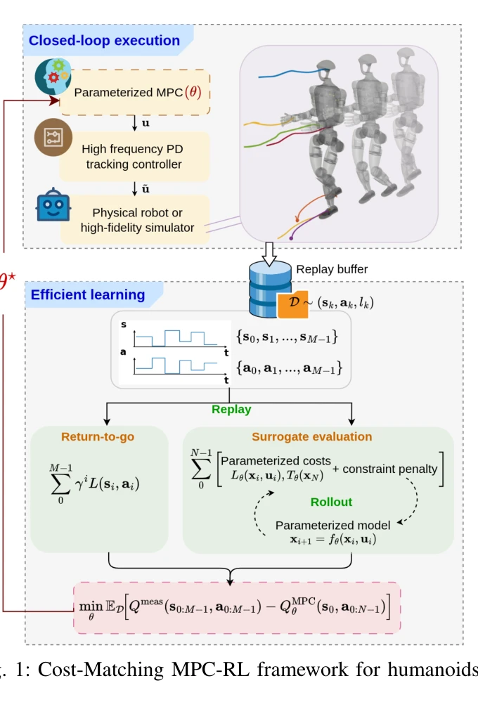
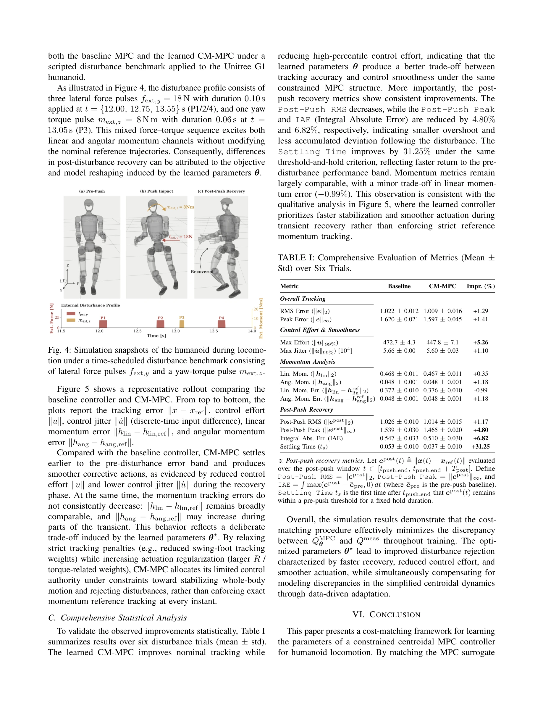

# Cost-Matching Model Predictive Control for Efficient Reinforcement Learning in Humanoid Locomotion

> **저자**:  | **날짜**: 2026-03-30 | **URL**: [https://arxiv.org/abs/2603.28243](https://arxiv.org/abs/2603.28243)

---

## Essence

*Fig. 1: Cost-Matching MPC-RL framework for humanoids.*

휴머노이드 로봇의 효율적인 학습을 위해 Cost-Matching MPC (CM-MPC)를 제안하며, 고충실도 폐루프 데이터로부터 MPC 비용-도달 함수를 근사하여 학습 중 반복적인 MPC 풀이를 피한다.

## Motivation

- **Known**: MPC는 휴머노이드 보행 제어의 지배적 패러다임이며, RL은 데이터로부터 강건한 행동을 학습할 수 있으나, 표준 gradient 기반 MPC-RL은 학습 루프 내 반복적 MPC 풀이로 인해 계산 부담이 크다.
- **Gap**: 복잡하고 시간 제약이 있는 휴머노이드 보행 스택에서 MPC-RL의 학습 효율성이 낮으며, solve-in-the-loop 훈련의 계산 비용을 줄이면서도 MPC 구조의 제약 처리와 해석 가능성을 유지할 방법이 부족하다.
- **Why**: 휴머노이드 보행은 intermittent contacts, 높은 자유도, 엄격한 안전 제약을 가지며 모델 오차와 외부 교란에 강건해야 하므로, 효율적이면서도 안전하고 해석 가능한 학습 방법이 중요하다.
- **Approach**: Centroidal dynamics 기반 parameterized MPC의 cost-to-go Q^MPC_θ와 실측 장기 수익 Q_meas 간 불일치를 최소화하여 MPC 파라미터를 학습하며, 기록된 상태-행동 궤적을 따라 MPC 모델을 롤아웃하고 gradient 기반 최적화를 수행한다.

## Achievement

*Fig. 4: Simulation snapshots of the humanoid during locomo-*

- **Computational Efficiency**: 학습 중 반복적 MPC 풀이를 제거하여 훈련 시간을 크게 단축하면서도 deployment 시 표준 constrained receding-horizon MPC 컨트롤러로 작동
- **Generic Framework**: Optimal Control Problem (OCP) 형식의 시스템에 적용 가능한 일반적 cost-matching 학습 프레임워크 제시
- **Improved Performance**: 수동 튜닝 baseline 대비 보행 성능 향상 및 모델 불일치와 외부 교란에 대한 강건성 증가
- **Open-source Implementation**: GitHub에 공개된 구현으로 재현성과 접근성 확보

## How

*Fig. 1: Cost-Matching MPC-RL framework for humanoids.*

- Centroidal Momentum Matrix (CMM)를 활용한 완전한 중심 동역학 모델 도입으로 base와 limb 동작의 관성 커플링 포착
- Joint limits, friction cone, Center of Pressure (CoP), collision avoidance 등 phase-dependent 부등식 제약과 영속도 추적, zero wrench 등 등식 제약 정의
- Reference tracking, dynamic stability, physical plausibility를 포함한 multi-term stage cost (L_trac, L_base, L_com, L_swing, L_torque) 설계
- 고충실도 폐루프 궤적으로부터 측정된 Q_meas와 parametric MPC 모델의 Q^MPC_θ 간 MSE 최소화 손실함수로 gradient descent 수행
- Hierarchical control architecture에서 upper-level MPC와 lower-level PD tracking controller의 분리로 learning layer와 execution layer 구분

## Originality

- 기존 MPC-RL 프레임워크에서 solve-in-the-loop의 계산 병목을 cost-matching 방식으로 우회하는 novel 접근법 제시
- Centroidal dynamics 기반 OCP 형식으로 휴머노이드 보행의 제약 최적화 문제를 엄밀하게 정식화
- Closed-loop 실측 데이터와 MPC surrogate 비용 간 직접 매칭을 통한 효율적 value function approximation 실현

## Limitation & Further Study

- Centroidal dynamics는 고차 동역학 효과(예: 접촉 실현 세부사항, 액추에이터 포화)를 근사화하므로 sim-to-real gap 가능성
- 학습 성능이 초기 고충실도 폐루프 데이터의 품질과 분포에 의존하므로 데이터 수집 비용 고려 필요
- Friction cone, CoP 등 접촉 제약의 discrete phase 전환을 smooth하게 처리하는 방법론 부재
- **후속연구**: 실제 로봇 플랫폼에서의 검증, domain randomization을 통한 robust 학습, online adaptation 메커니즘 통합

## Evaluation

- Novelty: 4/5
- Technical Soundness: 3/5
- Significance: 4/5
- Clarity: 4/5
- Overall: 4/5

**총평**: 이 논문은 MPC-RL의 계산 부담을 cost-matching을 통해 효과적으로 해결하면서 constraint 처리와 해석 가능성을 보존한 실용적이고 창의적인 방법을 제시하며, centroidal dynamics 기반의 엄밀한 휴머노이드 모델링과 함께 open-source 공개로 재현성이 높다.

## Related Papers

- 🏛 기반 연구: [[papers/1265_AMO_Adaptive_Motion_Optimization_for_Hyper-Dexterous_Humanoi/review]] — 효율적인 강화학습에 궤적 최적화와 RL 결합의 기본 원리를 제공한다
- 🔗 후속 연구: [[papers/1283_Benchmarking_Humanoid_Imitation_Learning_with_Motion_Difficu/review]] — 관찰 공간 변화 문제에 비용 매칭 MPC의 효율적 학습 방법론을 적용한다
- 🔄 다른 접근: [[papers/1408_Full-Order_Sampling-Based_MPC_for_Torque-Level_Locomotion_Co/review]] — 효율적 학습에서 비용 매칭 대신 샘플링 기반 MPC 접근 방식을 제시한다
- 🏛 기반 연구: [[papers/1283_Benchmarking_Humanoid_Imitation_Learning_with_Motion_Difficu/review]] — 관찰 공간 변화 벤치마킹에서 모션 난이도 정량화 방법론을 활용할 수 있다
- 🔗 후속 연구: [[papers/1265_AMO_Adaptive_Motion_Optimization_for_Hyper-Dexterous_Humanoi/review]] — 궤적 최적화와 RL의 결합을 비용 매칭 MPC로 더 효율적으로 구현한다
- 🔄 다른 접근: [[papers/1408_Full-Order_Sampling-Based_MPC_for_Torque-Level_Locomotion_Co/review]] — 둘 다 MPC를 다루지만 DIAL-MPC는 training-free diffusion 기반, Cost-Matching은 효율적 RL 기반 접근을 사용한다.
- 🏛 기반 연구: [[papers/1521_Learning_Differentiable_Reachability_Maps_for_Optimization-b/review]] — 모델 예측 제어의 효율성을 위한 비용 매칭 접근법이 reachability map 기반 최적화의 이론적 배경을 제공함
