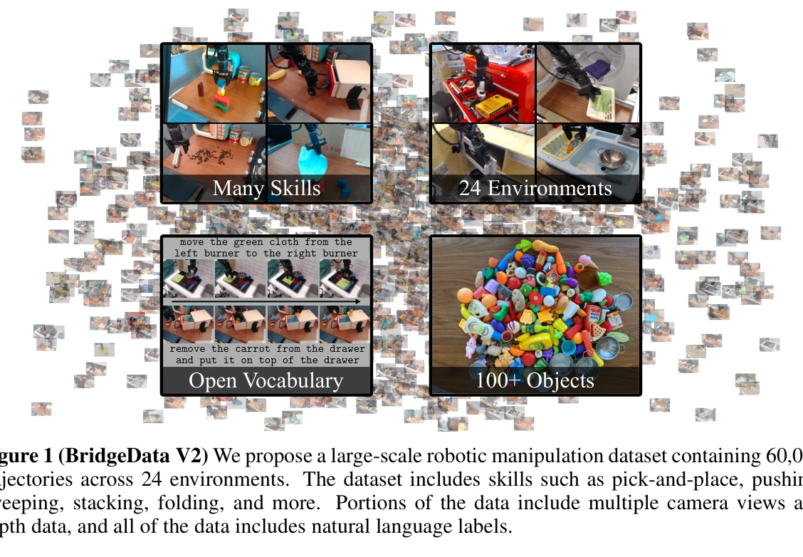
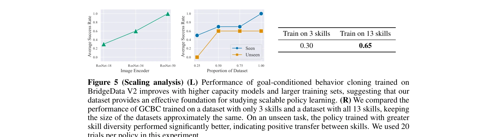
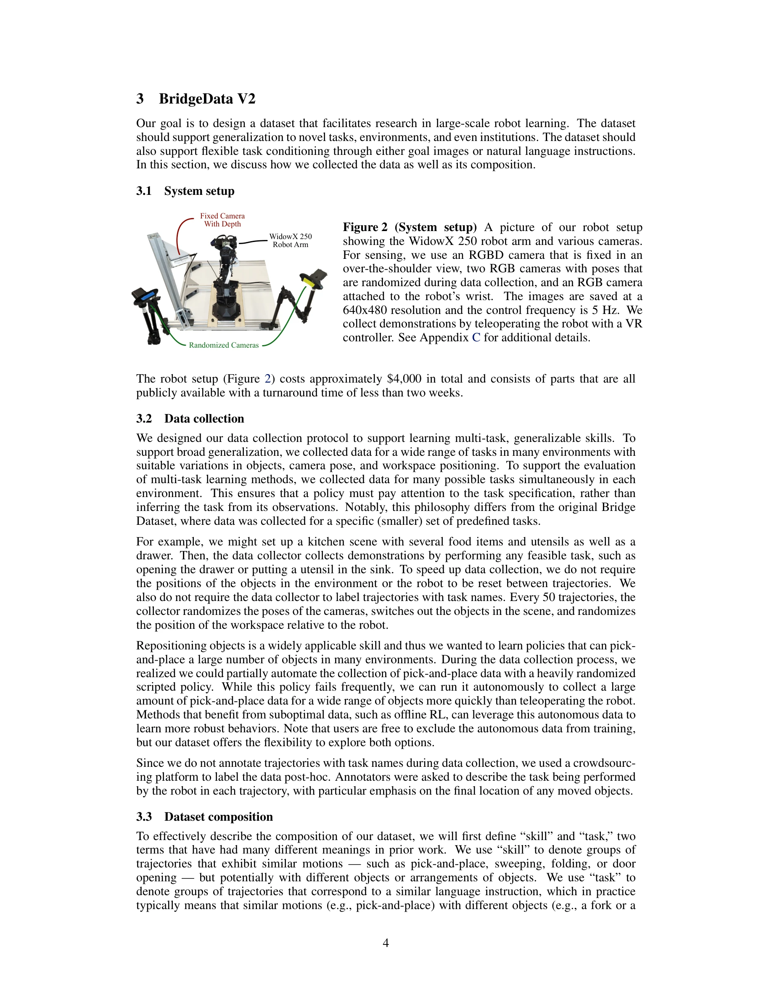

# BridgeData V2: A Dataset for Robot Learning at Scale

> **저자**: Homer Walke, Kevin Black, Abraham Lee, Moo Jin Kim, Max Du, Chongyi Zheng, Tony Zhao, Philippe Hansen-Estruch, Quan Vuong, Andre He, Vivek Myers, Kuan Fang, Chelsea Finn, Sergey Levine | **날짜**: 2023-08-24 | **URL**: [https://arxiv.org/abs/2308.12952](https://arxiv.org/abs/2308.12952)

---

## Essence

*Figure 1 (BridgeData V2) We propose a large-scale robotic manipulation dataset containing 60,096*

저비용 공개 로봇으로 24개 환경에서 수집한 60,096개 궤적으로 이루어진 대규모 로봇 조작 데이터셋 BridgeData V2를 제안하며, 다양한 imitation learning 및 offline RL 방법들과의 호환성을 검증한다.

## Motivation

- **Known**: 로봇 학습에서 대규모 다양한 데이터셋이 성능 향상에 도움이 된다는 것이 알려져 있으며, 기존 로봇 데이터셋들은 단일 환경·작업에 한정되거나 특정 로봇에만 적용 가능한 한계가 있다.
- **Gap**: 여러 환경과 작업을 포함하면서도 공개 저비용 로봇으로 수집되고 자연어 조건화를 지원하며 다양한 학습 방법과 호환되는 대규모 로봇 데이터셋이 부족하다.
- **Why**: 대규모 다양한 데이터셋은 환경·도메인·기관 간 일반화 능력을 향상시키고 로봇 학습 연구의 접근성을 높이며 확장 가능한 로봇 학습 방법 개발을 촉진한다.
- **Approach**: 저비용 공개 로봇으로 24개 환경에서 인간 데모(84%) 및 scripted policy(16%)를 통해 60,096개 궤적을 수집하고, goal image 또는 자연어 조건화를 지원하는 형태로 구성하였다. 6가지 state-of-the-art imitation learning 및 offline RL 방법을 평가하고 데이터 크기·다양성의 영향을 분석했다.

## Achievement

*Figure 5 (Scaling analysis) (L) Performance of goal-conditioned behavior cloning trained on*

- **대규모 다양한 데이터셋 구축**: 13개 기술, 24개 환경, 100개 이상의 객체를 포함한 60,096개 궤적으로 기존 Bridge Dataset 대비 7배 이상 확대
- **다중 조건화 방식 지원**: goal image 및 자연어 명령 기반의 open-vocabulary 작업 지정이 가능하도록 설계
- **광범위한 호환성 검증**: text-conditioned BC, goal-conditioned BC, goal-conditioned RL 등 6가지 방법론에서 효과적으로 작동하는 다목적 데이터셋임을 실증
- **확장 분석 결과**: 모델 크기와 데이터 크기·다양성 증가에 따라 성능이 향상됨을 정량적으로 입증. 기술 다양성이 환경 일반화를 개선함을 증명
- **공개 자원 제공**: 데이터셋 및 사전학습 모델을 공개하여 로봇 학습 연구의 접근성 향상

## How

*Figure 2 (System setup) A picture of our robot setup*

- 저비용 공개 로봇(Widowx 250) 플랫폼 사용으로 재현 가능성 확보
- 24개 서로 다른 환경에서 장시간에 걸쳐 인간 데모 및 자동화된 pick-and-place policy로 데이터 수집
- 자연언어 주석(natural language labels) 추가로 language-conditioned 방법 지원
- 다중 카메라 뷰 및 깊이 데이터 포함으로 다양한 센서 모식 지원
- 13개 기술(pick-and-place, pushing, sweeping, stacking, folding 등) 및 다수의 객체 조합으로 작업 다양성 극대화
- Behavioral cloning, offline RL, goal-conditioned RL 등 다양한 알고리즘 평가 및 벤치마크 수행
- Data scale, model capacity, 기술 및 환경 다양성에 따른 성능 변화 실증 분석

## Originality

- 기존 Bridge Dataset 대비 양적·질적 개선: 단순 데이터 확대뿐 아니라 자연어 조건화, 다양한 환경·기술·객체 포함으로 다목적 사용성 확보
- 기술 다양성과 환경 일반화의 관계를 독립적으로 검증하여 데이터 다양성의 효과를 분명히 실증한 점이 신규
- 6가지 heterogeneous 방법론(text-conditioned BC, goal-conditioned BC/RL 등)에 대한 일관된 평가로 데이터셋의 범용성을 체계적으로 입증
- 공개 저비용 로봇으로 수집하면서도 규모와 다양성에서 RT-1, RoboSet 등 대규모 데이터셋과 경쟁하는 수준 달성
- 명확한 스케일링 분석을 통해 모델 용량, 데이터 규모, 기술 다양성 간의 정량적 관계 규명

## Limitation & Further Study

- 모든 데이터가 단일 로봇 플랫폼(Widowx 250)에서 수집되어 cross-robot generalization에 대한 검증 부재
- 주로 테이블 상의 조작(tabletop manipulation)에 집중되어 있어 더 복잡한 실환경 작업에의 적용 가능성 미검증
- 기술별 데이터 불균형(pick-and-place에 편향) 및 성공률 편향이 언급되지 않음
- 후속 연구 방향: (1) 여러 로봇 플랫폼으로의 데이터 확장, (2) 더 다양한 환경·작업(동적 상호작용, 협동 등) 포함, (3) sim-to-real transfer 효과 분석, (4) 다른 대규모 데이터셋(RH20T 등)과의 결합 활용

## Evaluation

- Novelty: 4/5
- Technical Soundness: 3/5
- Significance: 4/5
- Clarity: 4/5
- Overall: 4/5

**총평**: BridgeData V2는 기존 로봇 데이터셋의 한계를 해결하는 대규모 다양한 벤치마크로서, 공개 저비용 로봇과 다양한 환경·기술·조건화 방식을 통해 범용성과 재현 가능성을 모두 확보하였다. 6가지 방법론에 대한 포괄적 평가와 스케일링 분석은 로봇 학습 연구의 데이터-중심 접근법의 중요성을 강하게 입증하며, 공개 자원으로서 학계에 상당한 기여를 할 것으로 판단된다.

## Related Papers

- 🏛 기반 연구: [[papers/1306_All_Robots_in_One_A_New_Standard_and_Unified_Dataset_for_Ver/review]] — 저비용 로봇 기반의 대규모 데이터셋이 통합 데이터 표준 개발의 실제 사례를 제공한다
- 🔄 다른 접근: [[papers/1372_DROID_A_Large-Scale_In-The-Wild_Robot_Manipulation_Dataset/review]] — 대규모 로봇 manipulation 데이터셋을 각각 저비용 공개 로봇과 in-the-wild 환경으로 다르게 수집한다
- 🏛 기반 연구: [[papers/1348_Data_Scaling_Laws_in_Imitation_Learning_for_Robotic_Manipula/review]] — imitation learning의 데이터 scaling law가 BridgeData V2 같은 대규모 데이터셋 설계에 이론적 기초를 제공한다
- 🏛 기반 연구: [[papers/1296_Bridging_the_Sim-to-Real_Gap_for_Athletic_Loco-Manipulation/review]] — 대규모 로봇 데이터셋이 VLA 기초 모델의 학습에 필요한 데이터 기반을 제공한다
- 🧪 응용 사례: [[papers/1564_Scaling_Proprioceptive-Visual_Learning_with_Heterogeneous_Pr/review]] — BridgeData V2가 HPT의 대규모 이종 데이터 사전학습을 실제 로봇 학습 데이터셋에서 구체적으로 적용한다.
- 🔗 후속 연구: [[papers/1541_RoboMIND_Benchmark_on_Multi-embodiment_Intelligence_Normativ/review]] — BridgeData V2의 대규모 로봇 학습 데이터셋 구축 경험을 다중 embodiment 환경으로 확장하여 더 포괄적인 벤치마크를 제공한다.
- 🔗 후속 연구: [[papers/1552_RoboTwin_Dual-Arm_Robot_Benchmark_with_Generative_Digital_Tw/review]] — 기존 로봇 학습 데이터셋의 한계를 극복하기 위해 3D generative model을 활용한 synthetic 데이터 생성 방법을 제시한다.
- 🔗 후속 연구: [[papers/1306_All_Robots_in_One_A_New_Standard_and_Unified_Dataset_for_Ver/review]] — BridgeData V2의 대규모 데이터셋을 더 포괄적인 통합 표준과 다중 로봇 플랫폼으로 확장한다
