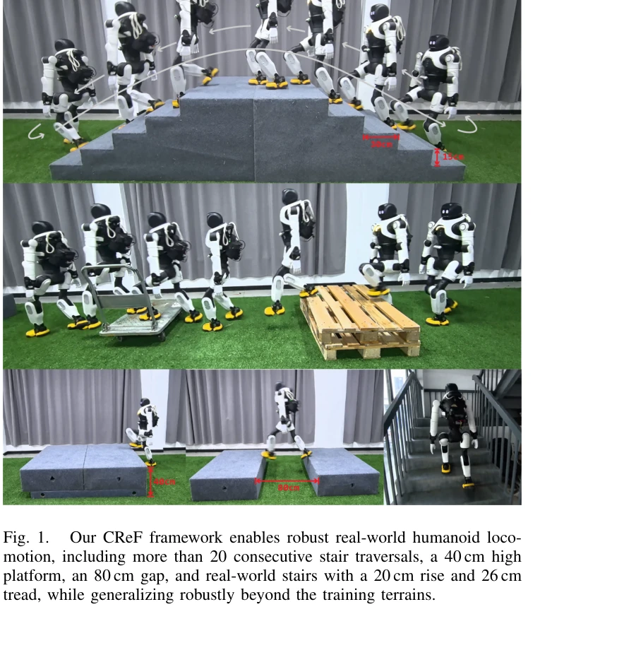

# CReF: Cross-modal and Recurrent Fusion for Depth-conditioned Humanoid Locomotion

> **저자**:  | **날짜**: 2026-03-31 | **URL**: [https://arxiv.org/abs/2603.29452](https://arxiv.org/abs/2603.29452)

---

## Essence

*Fig. 2.*

CReF는 cross-modal attention, gated residual fusion, recurrent fusion을 결합하여 raw forward-facing depth로부터 직접 로코모션 관련 특징을 학습하는 단일 단계의 깊이 조건부 인형로봇 로코모션 프레임워크로, AGIBOT X2 Ultra에서 zero-shot sim-to-real transfer를 달성한다.

## Motivation

- **Known**: 깊이 기반 인형로봇 로코모션은 가능하지만, 기존 방법들은 2.5D terrain 표현, 보조 기하학적 목표 또는 depth corruption 시뮬레이션에 의존하는 경향이 있다.
- **Gap**: 기존 방법들은 explicit geometric intermediates 또는 multi-stage supervision에 의존하며, 이는 수직 구조, perforated obstacles, 복잡한 실제 환경의 blind spots를 상속받는다.
- **Why**: 인형로봇이 복잡한 지형을 안정적으로 통과하려면 직관적이고 해석 가능한 중간 표현 없이도 end-to-end로 깊이 정보를 활용할 수 있어야 하며, zero-shot transfer는 실제 배포의 실용성을 크게 향상시킨다.
- **Approach**: CReF는 proprioception 쿼리 기반 cross-modal attention으로 proprioception과 depth 토큰을 결합하고, gated residual fusion으로 표현을 통합한 후, highway-style output gate로 제어되는 GRU를 사용하여 temporal integration을 수행한다. 추가로 foot-end point-cloud 샘플에서 supportable foothold candidates를 추출하는 terrain-aware foothold placement reward를 도입한다.

## Achievement

*Fig. 1.*

- **단일 단계 end-to-end 프레임워크**: explicit geometric intermediates 없이 raw depth에서 직접 joint position targets로 매핑하는 통합된 아키텍처
- **terrain-aware foothold placement reward**: supportable 영역 추출 및 touchdown 유도로 장시간 계단 통과(특히 내림차순)에서 상당한 성능 향상
- **Zero-shot sim-to-real transfer**: 합성 depth corruption 없이 훈련된 정책이 handrails, hollow pallet assemblies, reflective interference, visually cluttered outdoor 환경을 포함한 다양한 실제 환경에 성공적으로 전이
- **robust terrain traversal**: 20+ 연속 계단 통과, 40cm 높이 플랫폼, 80cm 갭, 실제 계단(20cm rise, 26cm tread) 등 다양한 terrain difficulty에서 안정적 성능

## How

*Fig. 2.*

- **Cross-modal attention**: proprioception tokens를 queries로 사용하여 depth tokens와의 attention 연산 수행, proprioception-guided depth feature extraction 실현
- **Gated residual fusion**: multi-head attention 출력을 gated fusion block으로 통합하여 표현 결합
- **Recurrent fusion with GRU**: Gated Recurrent Unit으로 temporal memory를 관리하며, highway-style output gate σ(·)로 recurrent features와 feedforward features의 상태 의존적 혼합 조절
- **Terrain-aware foothold placement reward**: 현재 foot-end position 주변의 point-cloud 샘플에서 supportable foothold candidates 추출, touchdown location이 nearest supportable candidate에 가까워지도록 reward
- **Asymmetric critic**: 정책은 proprioception과 depth만 사용하지만, value network는 시뮬레이션에서 privileged information (ground-truth base linear velocity, robot-centric terrain height)으로 훈련
- **PPO 기반 훈련**: 제시된 reward terms (Table I)을 조합하여 속도 추적, 자세 유지, foothold 배치, 안정성 등을 균형있게 최적화

## Originality

- **cross-modal attention의 proprioception-queried 설계**: proprioception이 depth feature 추출을 직접 제어하는 구조로, 기존 단순 concatenation 대비 명시적인 모달 간 상호작용 구현
- **gated residual fusion 메커니즘**: 두 가지 모달의 특징을 content gate와 sigmoid gate로 조절하여 선택적 정보 통합
- **highway-style output gate를 포함한 recurrent fusion**: GRU의 출력을 직접 사용하지 않고, 현재 상태에 따라 recurrent와 feedforward features를 혼합하여 state-dependent temporal regulation 실현
- **supportable foothold candidates 추출 방식**: point-cloud 기반의 local geometry 해석으로 명시적 height map 없이도 landing surface quality 평가
- **synthetic depth corruption 제거**: 기존 방법과 달리 stereo artifacts나 calibration uncertainty 시뮬레이션 없이도 robust transfer 달성

## Limitation & Further Study

- **point-cloud 기반 foothold 추출의 계산 비용**: real-time performance에 미치는 영향과 온보드 하드웨어의 계산 제약에 대한 분석 부족
- **depth sensor 모달리티 의존성**: forward-facing depth에만 의존하므로 가려진 영역(occlusion)이나 측면 장애물에 대한 인식 제한
- **보상 함수의 수동 튜닝**: 12개 항목의 reward terms에 대한 weight 선택이 휴리스틱에 기반하며, 자동화된 최적화 방법 부재
- **일반화 범위의 명확한 경계**: training terrain categories 내에서의 성능만 주로 보고되며, 완전히 새로운 terrain type에 대한 한계가 명확하지 않음
- **후속 연구**: 다중 센서 융합(e.g., IMU, tactile feedback)으로 인식 범위 확장, 적응형 reward weighting 메커니즘 개발, 다양한 인형로봇 플랫폼으로의 일반화 가능성 검증 필요

## Evaluation

- Novelty: 4/5
- Technical Soundness: 3/5
- Significance: 4/5
- Clarity: 4/5
- Overall: 4/5

**총평**: CReF는 cross-modal fusion과 terrain-aware reward 설계를 통해 explicit geometric representation 없이도 robust depth-conditioned humanoid locomotion을 실현하며, zero-shot sim-to-real transfer 성공은 실제 배포의 실용성을 크게 입증한다. 기술적으로 성숙하고 신기성 높은 아키텍처 설계와 강력한 실험 결과가 본 연구의 주요 강점이다.

## Related Papers

- 🔄 다른 접근: [[papers/1245_A_Hybrid_Autoencoder_for_Robust_Heightmap_Generation_from_Fu/review]] — 둘 다 depth 기반 humanoid locomotion이지만 CReF는 cross-modal fusion을, 하이브리드 오토인코더는 LiDAR+depth 융합을 사용한다.
- 🔗 후속 연구: [[papers/1352_DemoDiffusion_One-Shot_Human_Imitation_using_pre-trained_Dif/review]] — DPL의 depth-only 접근법이 CReF의 cross-modal depth fusion 기법과 결합되어 더 robust한 지형 인식을 구현할 수 있다.
- 🧪 응용 사례: [[papers/1560_SARA-RT_Scaling_up_Robotics_Transformers_with_Self-Adaptive/review]] — LookOut의 real-world humanoid navigation이 CReF의 depth-conditioned locomotion을 실제 환경에서 검증하는 구체적 사례를 제공한다.
- 🔗 후속 연구: [[papers/1245_A_Hybrid_Autoencoder_for_Robust_Heightmap_Generation_from_Fu/review]] — CReF의 cross-modal fusion 기법이 LiDAR와 깊이 카메라 데이터 융합에서 더 효과적인 multimodal 처리를 제공할 수 있다.
- 🏛 기반 연구: [[papers/1352_DemoDiffusion_One-Shot_Human_Imitation_using_pre-trained_Dif/review]] — CReF의 cross-modal fusion 기법이 DPL의 depth-only 지형 인식에서 더 robust한 특징 학습의 기반을 제공한다.
