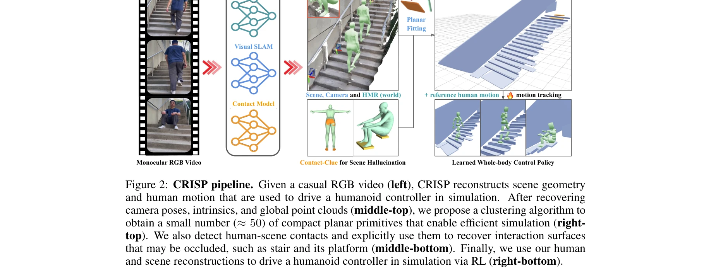
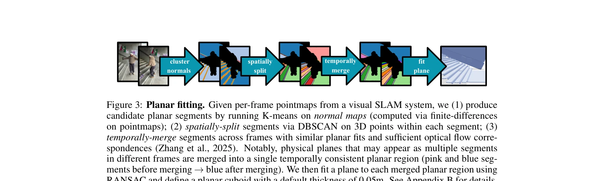

# CRISP: Contact-Guided Real2Sim from Monocular Video with Planar Scene Primitives

> **저자**: Zihan Wang, Jiashun Wang, Jeff Tan, Yiwen Zhao, Jessica Hodgins, Shubham Tulsiani, Deva Ramanan | **날짜**: 2025-12-16 | **URL**: [https://arxiv.org/abs/2512.14696](https://arxiv.org/abs/2512.14696)

---

## Essence

*Figure 2: CRISP pipeline. Given a casual RGB video (left), CRISP reconstructs scene geometry*

CRISP는 단일 카메라 영상에서 시뮬레이션 가능한 인간 동작과 장면 기하학을 복원하는 방법으로, 평면 기본 요소(planar primitive) 피팅과 접촉 모델링을 통해 물리 시뮬레이션에 적합한 깨끗한 기하학을 생성한다.

## Motivation

- **Known**: 선행 연구들은 데이터 주도 사전(data-driven prior)과 결합 최적화를 사용하거나 노이즈가 많은 기하학을 복원했으며, 이는 장면 상호작용이 있는 동작 추적에 실패를 초래했다.
- **Gap**: 장면과 인간의 결합 복원에서 물리 기반 제약이 부재했고, 깨끗하고 시뮬레이션 준비가 완료된 기하학 생성이 어려웠으며, 인간-장면 상호작용 중 폐색된 기하학 복원이 미흡했다.
- **Why**: 정확한 인간-장면 재구성은 로보틱스, 화신 AI, AR/VR 등의 응용을 위한 물리 기반 시뮬레이션을 가능하게 하고, 대규모 학습 및 제어 정책 학습을 촉진한다.
- **Approach**: 포인트 클라우드에 평면 기본 요소를 피팅하는 간단한 클러스터링 파이프라인을 사용하여 깨끗한 기하학을 생성하고, 인간 자세를 통해 폐색된 상호작용 표면을 복원하며, RL을 통해 물리적 타당성을 보장한다.

## Achievement

*Figure 4: Qualitative comparison. We compare VideoMimic with CRISP (ours) on six sequences*

- **동작 추적 성공률 대폭 향상**: EMDB와 PROX 벤치마크에서 55.2%에서 6.9%로 동작 추적 실패율 감소 (8배 개선)
- **시뮬레이션 효율성 개선**: 43% 빠른 RL 시뮬레이션 처리량 달성 (밀집 메쉬 접근법 대비)
- **다양한 영상 지원**: 캐주얼 촬영 영상, 인터넷 영상, Sora 생성 영상 등 다양한 도메인에서 검증
- **접촉 기반 기하학 복원**: 인간 자세를 활용하여 의자 등받이 같은 폐색된 표면 복원
- **물리적 타당성**: 시뮬레이션 기반 RL 검증으로 인간과 장면 재구성의 물리적 설득력 확보

## How

*Figure 3: Planar fitting. Given per-frame pointmaps from a visual SLAM system, we (1) produce*

- Visual SLAM을 사용하여 카메라 포즈, 내부 파라미터, 전역 포인트 클라우드 복원
- 정규화 맵(normal map)과 깊이, 광학 흐름에 대한 K-means 클러스터링으로 후보 평면 세그먼트 생성
- 3D 포인트에 DBSCAN을 적용하여 세그먼트를 공간적으로 분할
- 유사한 평면 피팅과 충분한 광학 흐름을 가진 세그먼트를 시간적으로 통합
- Vision-Language Model을 사용하여 앉기-의자 위 같은 인간-장면 상호작용 감지
- 감지된 접촉 정보를 사용하여 폐색된 기하학(예: 계단 플랫폼) 복원
- HMR 네트워크로 SMPL 파라미터 추정하여 인간 동작 복원
- 강화학습을 통해 humanoid controller 학습으로 영상 기반 동작 추적 및 물리 시뮬레이션 실행

## Originality

- 평면 기본 요소 피팅을 통한 시뮬레이션 준비 기하학 생성이라는 간결하면서도 효과적인 접근
- 인간 자세를 기하학적 힌트로 활용하여 폐색된 장면 요소를 추론하는 접촉 기반 완성 전략
- 물리 시뮬레이션 기반 RL을 검증 메커니즘으로 통합하여 재구성 품질 향상 (순환적 개선)
- 데이터 주도 사전 의존도를 감소시키고 물리 제약을 명시적으로 도입한 설계

## Limitation & Further Study

- 정적 장면 가정: 동적으로 변화하는 장면 기하학에 대한 처리 미흡
- 평면 기본 요소의 한계: 곡면이 많은 복잡한 기하학 표현 제한 가능성
- 계산 비용: Visual SLAM, 깊이 추정, RL 학습 등 다중 단계의 누적 계산 부담
- 접촉 모델링의 정확성: Vision-Language Model 기반 상호작용 감지의 오류율 영향
- 후속 연구: 동적 객체 처리, 더 복잡한 기하학 표현 방식, 실시간 처리 최적화, 멀티뷰 입력 활용

## Evaluation

- Novelty: 4/5
- Technical Soundness: 3/5
- Significance: 4/5
- Clarity: 4/5
- Overall: 4/5

**총평**: CRISP는 평면 기본 요소 피팅과 접촉 기반 기하학 복원이라는 창의적 통찰력으로 monocular video에서 물리 시뮬레이션 가능한 인간-장면 재구성을 달성하였으며, 상당한 성능 개선과 실제 응용 가치를 입증한 우수한 논문이다.

## Related Papers

- 🔄 다른 접근: [[papers/1364_Efficient_and_Scalable_Monocular_Human-Object_Interaction_Mo/review]] — 단안 비디오에서 human-object interaction을 다른 최적화 방법으로 복원한다
- 🔗 후속 연구: [[papers/1487_HUMOTO_A_4D_Dataset_of_Mocap_Human_Object_Interactions/review]] — contact-guided real2sim을 4D human-object interaction 데이터로 확장한 연구다
- 🧪 응용 사례: [[papers/1523_Re3Sim_Generating_High-Fidelity_Simulation_Data_via_3D-Photo/review]] — contact 정보를 활용한 시뮬레이션 데이터 생성의 실제 적용 사례다
- 🔄 다른 접근: [[papers/1364_Efficient_and_Scalable_Monocular_Human-Object_Interaction_Mo/review]] — monocular video에서 human-object interaction을 다른 contact modeling으로 복원한다
- 🔗 후속 연구: [[papers/1523_Re3Sim_Generating_High-Fidelity_Simulation_Data_via_3D-Photo/review]] — CRISP의 contact-guided real2sim 기술을 신경 렌더링과 결합하여 더 고충실도 시뮬레이션으로 확장함
