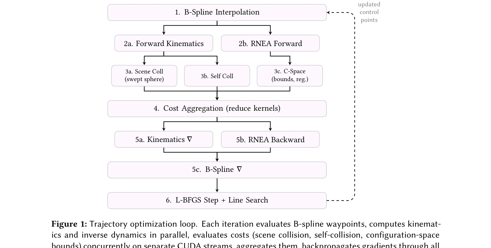
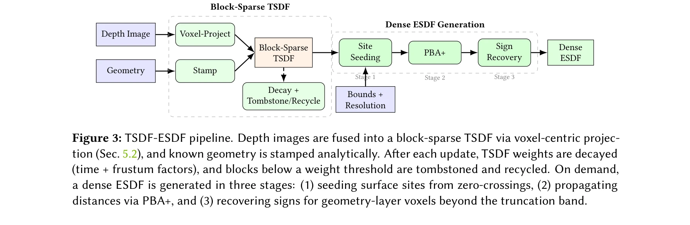

# cuRoboV2: Dynamics-Aware Motion Generation with Depth-Fused Distance Fields for High-DoF Robots

> **저자**: Balakumar Sundaralingam, Adithyavairavan Murali, Stan Birchfield | **날짜**: 2026-03-05 | **URL**: [https://arxiv.org/abs/2603.05493](https://arxiv.org/abs/2603.05493)

---

## Essence

*Figure 1: Trajectory optimization loop. Each iteration evaluates B-spline waypoints, computes kinemat-*

cuRoboV2는 B-spline 궤적 최적화, GPU 기반 TSDF/ESDF 인식 파이프라인, 확장 가능한 고-DoF 로봇 계산을 통합하여 동역학을 고려한 안전하고 실행 가능한 운동 생성을 제공하는 통합 프레임워크다.

## Motivation

- **Known**: 기존 운동 계획 방법은 충돌 회피와 동역학 제약, 높은 자유도 확장성 간에 트레이드오프를 가지고 있으며, 빠른 플래너는 물리적으로 실행 불가능한 궤적을 생성하고 높은 자유도 시스템에서 성능이 저하된다.
- **Gap**: 기존 방법들은 (1) 동역학을 무시하는 빠른 계획, (2) 깊이 데이터 처리의 느린 반응 속도, (3) 고-DoF 로봇에 대한 확장 불가능성을 동시에 해결하지 못하고 있다.
- **Why**: 안전하고 실행 가능한 운동 생성은 실제 로봇 자율성의 핵심이며, 조작 작업과 휴머노이드 운동 생성을 위해 단일 팔 매니퓰레이터에서 전신 휴머노이드까지 확장 가능한 통합 솔루션이 필요하다.
- **Approach**: GPU 네이티브 TSDF/ESDF 파이프라인으로 밀집 거리장을 생성하고, B-spline 기반 궤적 최적화로 부드러움과 토크 제약을 강제하며, topology-aware kinematics와 differentiable inverse dynamics로 고-DoF 로봇의 확장성을 달성한다.

## Achievement

*Figure 3: TSDF-ESDF pipeline. Depth images are fused into a block-sparse TSDF via voxel-centric projec-*

- **B-spline 궤적 최적화**: 제어점 최적화를 통해 부드러움과 토크 제약을 자동으로 강제하여 전역 계획과 반응형 제어 모두에 적용 가능한 통합 표현 제공
- **GPU 네이티브 ESDF 파이프라인**: nvblox 대비 10배 빠르고 8배 메모리 효율적이며 99% 충돌 감지율을 달성하는 block-sparse TSDF와 full workspace 커버리지를 제공
- **고-DoF 로봇 확장성**: 48-DoF 휴머노이드에서 99.6% 충돌 회피 IK 달성 (기존 방법은 실패), 40배 속도 향상으로 고자유도 로봇에 확장 가능
- **조작 작업 성능**: 3kg 페이로드 조건에서 99.7% 성공률 (기존 72-77%), 21% 추적 오차 감소 (PyRoki 대비)
- **휴머노이드 retargeting**: 89.5% 제약 만족도 (PyRoki의 61% 대비), 12배 낮은 cross-seed variance (mink 대비)

## How

- B-spline 제어점에 대한 gradient를 계산하여 경계 조건을 처리하면서 부드러운 궤적 최적화 수행
- voxel-centric projection 전략으로 atomic contention 제거하여 TSDF 통합 가속화
- depth images, meshes, cuboids를 diverse inputs로 수집하여 block-sparse TSDF로 융합
- Parallel Banding Algorithm (PBA+)과 gather-based seeding으로 full CUDA graph capture 가능한 on-demand ESDF 생성
- sparse Jacobian 계산, differentiable inverse dynamics (RNEA), map-reduce self-collision을 GPU에 구현하여 고-DoF 계산 최적화
- motion generation을 위해 B-spline 궤적 최적화와 ESDF 기반 충돌 회피를 결합한 end-to-end 최적화 파이프라인 구성

## Originality

- depth, mesh, primitive를 fusion하는 voxel-centric block-sparse TSDF 아키텍처로 기존 sparse allocation 방식과 차별화
- full workspace ESDF 커버리지를 on-demand로 제공하는 gather-based PBA+ seeding으로 O(1) distance query 실현
- B-spline 기반 궤적 표현을 torque limits와 non-convex collision constraints와 통합하여 dynamic feasibility 보장
- topology-aware kinematics와 map-reduce self-collision으로 48-DoF 휴머노이드까지 확장 가능한 GPU 네이티브 구현
- LLM 보조 개발을 통해 well-structured robotics code가 73%의 새로운 모듈 작성을 자동화할 수 있음을 입증

## Limitation & Further Study

- ESDF 생성은 on-demand 방식으로, 매우 동적인 환경에서 빈번한 재계산이 필요할 수 있으며, occlusion 처리에 대한 구체적 논의 부족
- high-DoF humanoid 성능이 좋지만, 복잡한 다중 접촉(multi-contact) 시나리오나 모멘탈리티 제약에 대한 명시적 처리 미흡
- PyRoki, mink 등 기존 방법과의 비교가 주로 벤치마크에 제한되어 있으며, 실제 환경 조건 변화(조명, 노이즈)에 대한 robust성 검증 부족
- 후속 연구로 real-time dynamic environment mapping, hierarchical planning for complex manipulation tasks, tactile feedback 통합 등이 필요

## Evaluation

- Novelty: 4/5
- Technical Soundness: 4/5
- Significance: 4/5
- Clarity: 4/5
- Overall: 4/5

**총평**: cuRoboV2는 동역학 기반의 안전한 궤적 생성, GPU 최적화된 인식, 고-DoF 확장성을 통합하여 로봇 운동 생성의 세 가지 근본적 문제를 동시에 해결하는 강력한 통합 솔루션으로, 실제 조작과 휴머노이드 작업에서의 혁신적인 성능 향상과 LLM 협력 개발 사례까지 제시하여 로봇 자율성 분야에 중요한 기여를 한다.

## Related Papers

- 🔄 다른 접근: [[papers/1313_ComFree-Sim_A_GPU-Parallelized_Analytical_Contact_Physics_En/review]] — GPU 기반 물리 시뮬레이션을 다른 접촉 해상도 방법으로 구현한다
- 🔗 후속 연구: [[papers/1469_ManiSkill3_GPU_Parallelized_Robotics_Simulation_and_Renderin/review]] — dynamics-aware motion generation을 대규모 로봇 시뮬레이션으로 확장한다
- 🏛 기반 연구: [[papers/1408_Full-Order_Sampling-Based_MPC_for_Torque-Level_Locomotion_Co/review]] — torque-level locomotion control의 기본 동역학 모델링을 제공한다
- 🔄 다른 접근: [[papers/1313_ComFree-Sim_A_GPU-Parallelized_Analytical_Contact_Physics_En/review]] — GPU 병렬화된 물리 엔진을 다른 구조와 용도로 구현한 접근법이다
