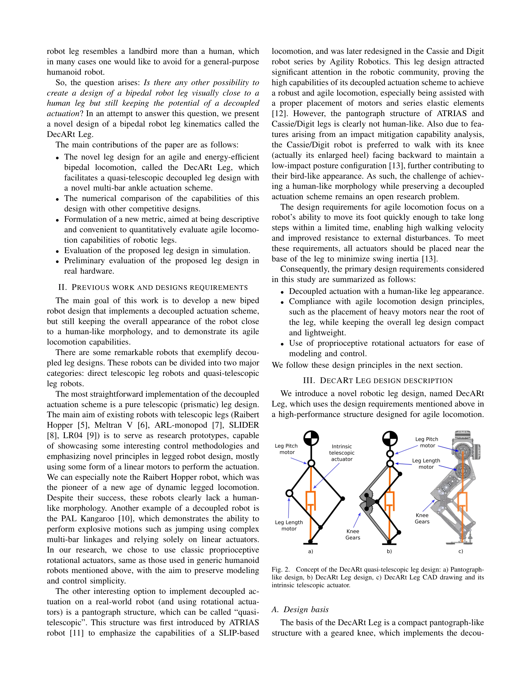
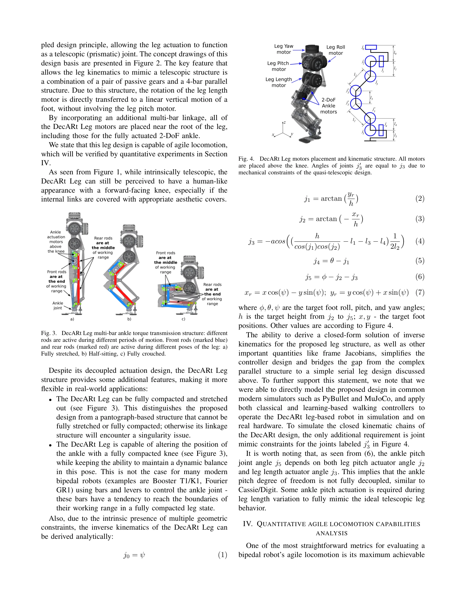

# DecARt Leg: Design and Evaluation of a Novel Humanoid Robot Leg with Decoupled Actuation for Agile Locomotion

> **저자**: Egor Davydenko, Andrei Volchenkov, Vladimir Gerasimov, Roman Gorbachev | **날짜**: 2025-11-13 | **URL**: [https://arxiv.org/abs/2511.10021](https://arxiv.org/abs/2511.10021)

---

## Essence

*Fig. 1. The concept of DecARt Leg design: decoupled actuation, all motors*

DecARt Leg는 decoupled actuation을 사용하면서도 인간형 외관을 유지하는 새로운 로봇 다리 설계를 제안하며, 민첩한 보행을 위해 quasi-telescopic 구조와 다중 바 앵클 구동 시스템을 채택한다.

## Motivation

- **Known**: Cassie/Digit 로봇의 pantograph 구조 기반 decoupled actuation은 뛰어난 보행 성능을 보이지만 조류와 같은 외관을 가지며, 대부분의 상용 휴머노이드 로봇들은 간단한 제어를 위해 coupled serial kinematic 구조를 채택한다.
- **Gap**: 인간형 외관을 유지하면서도 decoupled actuation의 장점을 활용할 수 있는 다리 설계가 없으며, 민첩한 보행 능력을 정량적으로 평가할 표준화된 지표도 부재하다.
- **Why**: Decoupled actuation은 보행 효율성과 민첩성을 향상시킬 수 있으나, 휴머노이드 로봇의 실용적 적용을 위해서는 인간형 외관이 필수적이므로 두 요소를 동시에 달성하는 설계가 중요하다.
- **Approach**: Pantograph 구조를 단순화하고 geared knee와 4-bar parallel 구조를 결합한 quasi-telescopic 설계를 제안하며, 모든 모터를 다리 근부에 배치하고 novel multi-bar linkage로 ankle actuation을 구현한다. 또한 Fastest Achievable Swing Time (FAST) 지표를 제안하여 민첩성을 정량 평가한다.

## Achievement

*Fig. 2.*

- **DecARt Leg 설계**: Decoupled actuation과 인간형 forward-facing knee 외관을 동시에 달성한 novel quasi-telescopic 로봇 다리 구조
- **FAST 지표**: 로봇 다리의 민첩한 보행 능력을 정량적으로 평가하기 위한 새로운 descriptive metric 제안
- **Analytical inverse kinematics**: 기하학적 제약으로부터 해석적으로 도출 가능한 역운동학
- **유연한 동작 범위**: 다리를 완전히 압축하거나 펴는 것이 가능하며, 완전히 구부린 상태에서도 ankle 위치 조절 가능
- **광범위한 평가**: 시뮬레이션 및 실제 하드웨어 실험을 통한 성능 검증

## How

*Fig. 3. DecARt Leg multi-bar ankle torque transmission structure: different*

- Pantograph 구조에 geared knee와 4-bar parallel 구조를 결합하여 leg pitch와 leg length 액추에이션을 decoupled
- Passive gear와 4-bar parallel 구조를 이용해 leg length 모터의 회전을 수직 linear motion으로 변환
- Multi-bar linkage를 통해 모든 motors를 leg root 근처에 배치하여 swing inertia 최소화
- Front/rear rods를 다리의 자세에 따라 선택적으로 활용하는 ankle torque transmission 구조 설계
- Fastest Achievable Swing Time (FAST)을 정의하여 다양한 다리 설계의 민첩성을 정량 비교

## Originality

- Decoupled actuation과 인간형 외관을 동시에 달성한 최초의 quasi-telescopic 로봇 다리 설계
- Passive gears와 4-bar parallel 구조의 새로운 결합으로 intrinsic telescopic 기능 구현
- Pantograph와 달리 singularity 없이 완전히 압축/확장 가능한 구조 혁신
- 다리의 posture에 따라 active linkages를 변경하는 novel ankle actuation approach
- 로봇 다리의 agile locomotion 능력을 정량화하는 새로운 FAST 평가 지표 제안

## Limitation & Further Study

- Hardware 실험이 preliminary 수준으로 제한적이며, 완전한 로봇 시스템에서의 보행 성능 검증 필요
- 제안된 FAST 지표가 다른 설계와의 비교에서 얼마나 discriminative한지 더 광범위한 검증 필요
- 복잡한 multi-bar 구조로 인한 제조 비용 및 유지보수 복잡성에 대한 분석 부재
- 동적 보행 중 balance 유지 및 외란 저항성에 대한 제어 알고리즘 및 실험 결과 제시 필요
- 후속 연구로 실제 보행 속도, 에너지 효율성, 계단 오르내리기 등 실용적 보행 시나리오 평가 필요

## Evaluation

- Novelty: 4/5
- Technical Soundness: 3/5
- Significance: 4/5
- Clarity: 4/5
- Overall: 4/5

**총평**: DecARt Leg는 decoupled actuation과 인간형 외관의 오랜 설계 트레이드오프를 해결한 창의적인 솔루션으로, 새로운 FAST 지표와 함께 로봇 다리 설계의 진전을 제시한다. 다만 실제 보행 성능 검증과 제어 알고리즘 개발이 후속되어야 실용적 가치가 입증될 것이다.

## Related Papers

- 🏛 기반 연구: [[papers/1241_A_Framework_for_Optimal_Ankle_Design_of_Humanoid_Robots/review]] — 다중 바 앵클 구동 시스템이 발목 설계 최적화 프레임워크의 병렬 메커니즘 이론을 기반으로 구현됩니다.
- 🔄 다른 접근: [[papers/1389_Explosive_Output_to_Enhance_Jumping_Ability_A_Variable_Reduc/review]] — decoupled actuation과 가변 감속비의 서로 다른 민첩한 보행을 위한 구동 시스템 설계 접근법을 비교할 수 있습니다.
- 🧪 응용 사례: [[papers/1601_Optimizing_Bipedal_Locomotion_for_The_100m_Dash_With_Compari/review]] — quasi-telescopic 구조의 민첩한 보행 능력이 고속 달리기 최적화에 활용될 수 있습니다.
- 🔗 후속 연구: [[papers/1241_A_Framework_for_Optimal_Ankle_Design_of_Humanoid_Robots/review]] — 발목 설계 프레임워크가 DecARt Leg의 다중 바 앵클 구동 시스템 설계에 확장 적용될 수 있습니다.
- 🔄 다른 접근: [[papers/1389_Explosive_Output_to_Enhance_Jumping_Ability_A_Variable_Reduc/review]] — 가변 감속비와 decoupled actuation의 서로 다른 점프 및 민첩성 향상 메커니즘을 비교 분석할 수 있습니다.
