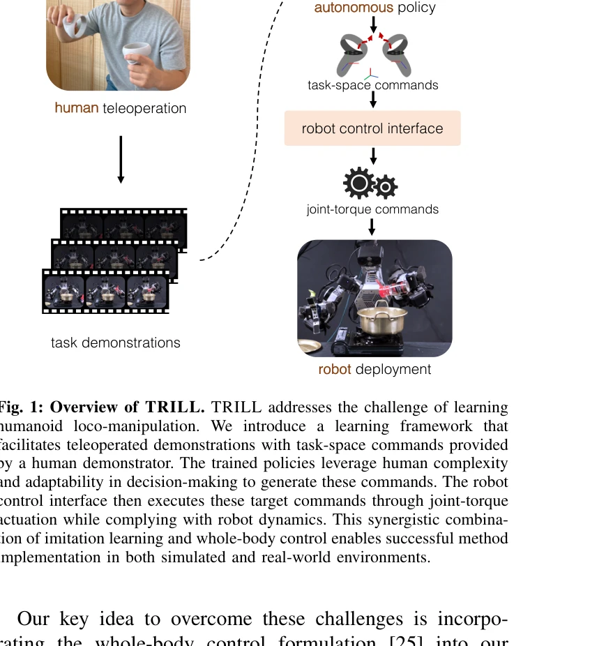
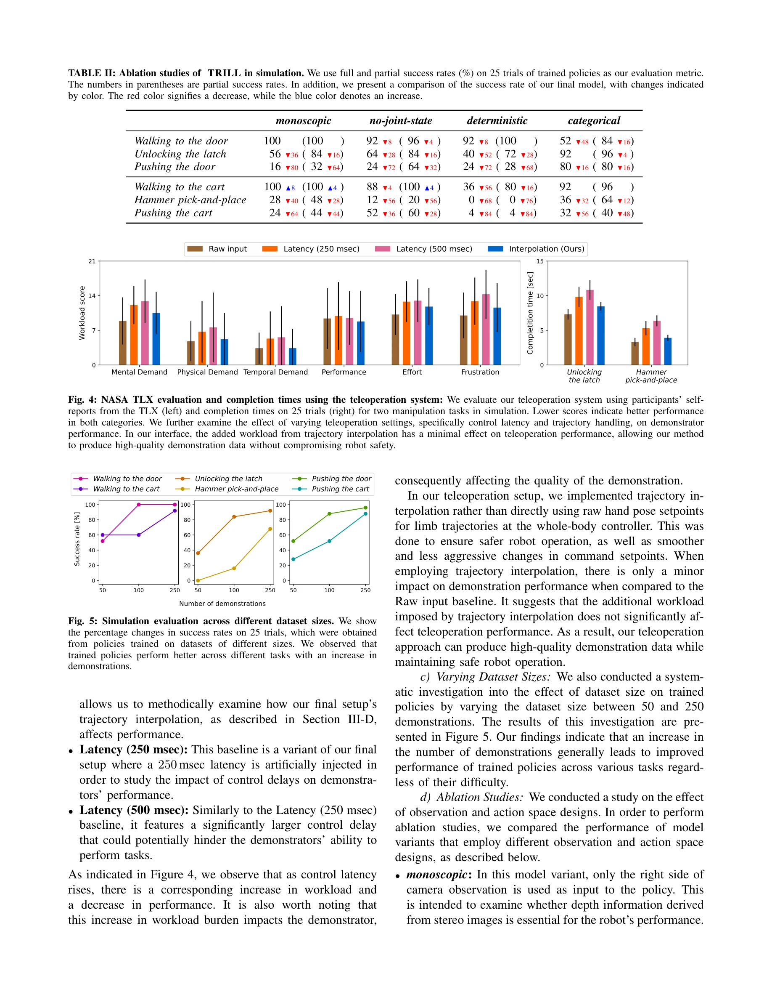
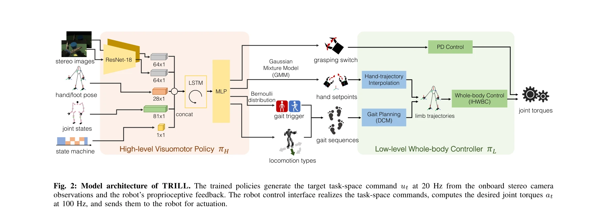

# Deep Imitation Learning for Humanoid Loco-manipulation through Human Teleoperation

> **저자**: Mingyo Seo, Steve Han, Kyutae Sim, Seung Hyeon Bang, Carlos Gonzalez, Luis Sentis, Yuke Zhu | **날짜**: 2023-09-05 | **URL**: [https://arxiv.org/abs/2309.01952](https://arxiv.org/abs/2309.01952)

---

## Essence

*Fig. 1: Overview of TRILL. TRILL addresses the challenge of learning*

이 논문은 VR 텔레오퍼레이션을 통한 인간 시연으로부터 휴머노이드 로봇의 복잡한 로코-매니퓰레이션 기술을 학습하기 위해 TRILL이라는 데이터-효율적 deep imitation learning 프레임워크를 제시한다.

## Motivation

- **Known**: Imitation learning은 로봇 제어기를 인간 시연으로부터 구축하는 유연하고 데이터-기반의 접근법으로, 테이블탑 암이나 휠드 플랫폼과 같은 단순한 로봇에 성공적으로 적용되었다.
- **Gap**: 휴머노이드 로봇의 high degree of freedom과 floating-base 동역학, 접촉-리치 상호작용으로 인한 복잡성으로 인해 대규모 인간 시연 수집 및 정책 학습이 어렵고, 기존 방법들은 대부분 테이블탑 또는 휠드 플랫폼에만 국한되어 있다.
- **Why**: 휴머노이드 로봇의 다목적성과 자율성 향상이 실제 배포에 중요하며, 효율적인 learning from demonstration 방법은 수작업 프로그래밍을 대체하여 휴머노이드의 광범위한 활용을 가능하게 한다.
- **Approach**: Whole-body control formulation을 데이터 수집과 정책 학습에 통합하여, VR 인터페이스를 통한 직관적 시연 수집과 task-space 명령의 고수준 추상화로 데이터-효율적 학습을 구현한다. 이는 high-level visuomotor policy와 low-level whole-body controller의 2단계 계층 구조로 구성된다.

## Achievement

*Fig. 5: Simulation evaluation across different dataset sizes. We show*

- **시뮬레이션 성능**: 자유 공간 로코모션 96%, 매니퓰레이션 80%, 로코-매니퓰레이션 92%의 성공률을 달성하며 기존 최신 방법보다 28% 높은 성공률 달성
- **실제 로봇 구현**: DRACO 3 휴머노이드에서 두 개의 접촉-리치 매니퓰레이션 작업에서 평균 85% 성공률 달성
- **첫 번째 성과**: 실제 휴머노이드 시스템에서 복잡한 매니퓰레이션 작업을 위한 visuomotor 정책의 deep imitation learning 최초 성공 구현
- **데이터 효율성**: High-level action abstraction과 whole-body control의 조합으로 상대적으로 적은 시연 데이터로도 효과적인 학습 가능

## How

*Fig. 2: Model architecture of TRILL. The trained policies generate the target task-space command ut at 20 Hz from the on*

- VR 기반 텔레오퍼레이션 인터페이스를 통해 인간이 task-space 명령을 직관적으로 제공하는 시연 데이터 수집
- Whole-body controller (IHWBC)가 task-space 궤적을 joint-torque 액션으로 변환하면서 로봇 안정성 유지
- ResNet-18 기반의 고수준 visuomotor policy πH가 스테레오 이미지와 proprioceptive 피드백으로부터 손의 포즈 setpoint와 로코모션 명령(gait sequence) 생성
- State machine과 Gaussian Mixture Model을 활용한 gait planning으로 이산적 로코모션 전환 관리
- Hierarchical 정책 구조 π(at|st) = πL(at|st, ut)πH(ut|st)로 고수준 명령과 저수준 제어 분리
- 20 Hz에서 고수준 정책 실행, 100 Hz에서 whole-body controller 실행으로 멀티레이트 제어 구현

## Originality

- Whole-body control을 imitation learning의 데이터 수집 및 정책 학습 파이프라인에 통합한 새로운 접근법
- Task-space action abstraction을 통해 휴머노이드의 고차원 action space 문제를 효율적으로 해결
- Floating-base 동역학과 multi-contact interaction을 안정적으로 처리하면서 deep imitation learning을 휴머노이드에 적용한 첫 번째 실제 구현
- VR 텔레오퍼레이션과 whole-body control의 시너지를 활용하여 인간-로봇 인터페이스의 직관성과 제어 안정성 동시 달성

## Limitation & Further Study

- VR 시연 수집 시 tactile과 proprioceptive sensing 모달리티 부재로 인한 domain gap 존재
- 실제 로봇 실험이 2개의 특정 작업에만 국한되어 일반화 가능성에 대한 추가 검증 필요
- Whole-body controller에 의존하므로 제어기의 안정성 한계가 전체 시스템의 성능을 제한할 수 있음
- 시뮬레이션-현실 간 gap 극복을 위한 추가 연구 필요 (domain randomization, sim2real transfer 등)
- 다양한 휴머노이드 플랫폼에 대한 확장성 및 다양한 로코-매니퓰레이션 작업의 학습 가능성 검증 필요
- 후속 연구로는 온라인 학습, 강화학습과의 결합, 더 복잡한 멀티-스킬 학습 등이 고려될 수 있음

## Evaluation

- Novelty: 4/5
- Technical Soundness: 4/5
- Significance: 4/5
- Clarity: 4/5
- Overall: 4/5

**총평**: 이 논문은 whole-body control과 deep imitation learning을 효과적으로 결합하여 휴머노이드 로봇의 복잡한 로코-매니퓰레이션을 처음으로 성공적으로 학습한 의미 있는 연구이며, VR 텔레오퍼레이션과 고수준 action abstraction을 통한 데이터 효율성 개선이 주요 기여점이다.

## Related Papers

- 🔗 후속 연구: [[papers/1250_A_Whole-Body_Motion_Imitation_Framework_from_Human_Data_for/review]] — VR 텔레오퍼레이션을 통한 휴머노이드 로코-조작에서 전신 motion imitation이 확장된다
- 🔄 다른 접근: [[papers/1331_DemoHLM_From_One_Demonstration_to_Generalizable_Humanoid_Loc/review]] — 휴머노이드 로코-조작 학습에서 인간 시연과 단일 시연 기반의 다른 데이터 효율성이다
- 🏛 기반 연구: [[papers/1287_BeyondMimic_From_Motion_Tracking_to_Versatile_Humanoid_Contr/review]] — 로코-조작 기술 학습에서 motion tracking 기반 다양한 동작 제어가 기초가 된다
- 🧪 응용 사례: [[papers/1436_HAIC_Humanoid_Agile_Object_Interaction_Control_via_Dynamics-/review]] — 동역학 인식 민첩한 물체 상호작용에서 VR 시연 기반 로코-조작이 적용된다
- 🧪 응용 사례: [[papers/1250_A_Whole-Body_Motion_Imitation_Framework_from_Human_Data_for/review]] — VR 텔레오퍼레이션을 통한 로코-조작 학습에서 전신 motion imitation이 적용된다
- 🔄 다른 접근: [[papers/1331_DemoHLM_From_One_Demonstration_to_Generalizable_Humanoid_Loc/review]] — 로코-조작 학습에서 단일 시연과 인간 VR 시연의 다른 데이터 효율성 접근이다
