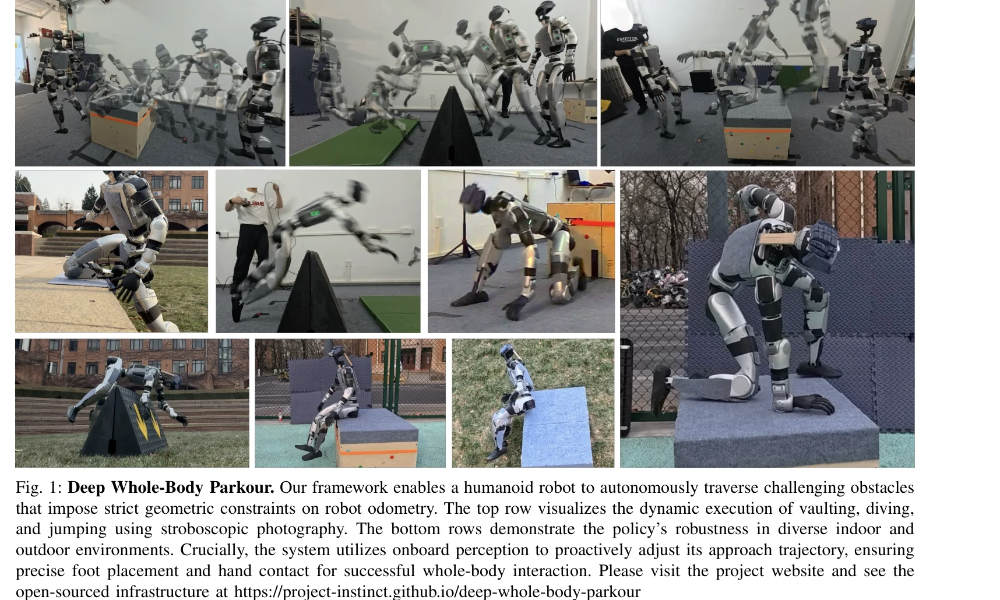

# Deep Whole-body Parkour

> **저자**: Ziwen Zhuang, Shaoting Zhu, Mengjie Zhao, Hang Zhao | **날짜**: 2026-01-12 | **DOI**: [10.48550/arXiv.2601.07701](https://doi.org/10.48550/arXiv.2601.07701)

---

## Essence

*Fig. 2: Data-driven whole-body control framework. Real-world environment scans and human demonstrations are processed an*

이 논문은 외부 센서 정보(depth perception)를 정규화된 전신 동작 추적에 통합하여 불규칙한 지형에서 볼트, 다이빙 롤, 점프 등 복잡한 다중 접촉 동작을 수행하는 인형 로봇 제어 프레임워크를 제시한다.

## Motivation

- **Known**: 기존 연구는 크게 두 가지 패러다임으로 나뉘는데, 인지형 보행(perceptive locomotion)은 지형 적응은 잘하지만 보행 동작만 가능하고, 일반 동작 추적(general motion tracking)은 복잡한 기술을 재현하지만 환경 조건을 무시한다.
- **Gap**: 기존 blind tracking 접근법은 정확한 거리와 각도에서만 작동하며 시각적 피드백이 없어서 장애물 높이나 거리에 맞춰 동작을 조정할 수 없다. 또한 저차원 속도 명령 인터페이스는 복잡한 상호작용 모드를 구분할 수 없어 인형 로봇의 표현력을 제한한다.
- **Why**: 이러한 통합 접근법은 로봇이 고정된 궤적 추적에서 벗어나 실시간 환경 인식을 바탕으로 견고한 역동적 동작을 수행하도록 하며, 이는 실제 환경에서의 배포 가능성을 크게 향상시킨다.
- **Approach**: 광학 모션 캡처로 인간 파쿠르 동작을 기록하고 LiDAR 스캔으로 환경 기하학을 동시에 디지털화하여 motion-terrain 쌍을 생성한 뒤, 이를 NVIDIA Isaac Lab에서 절차적으로 생성된 환경에 배치하고 대규모 강화학습으로 정책을 훈련한다.

## Achievement

*Fig. 1: Deep Whole-Body Parkour. Our framework enables a humanoid robot to autonomously traverse challenging obstacles*

- **깊이 인식 통합 제어**: exteroceptive sensing을 whole-body motion tracking에 통합하여 환경 기하학에 적응하는 폐루프 제어 실현
- **초기 조건 강건성**: 로봇이 장애물로부터의 거리와 각도 변화에 견딜 수 있게 되어 blind tracking의 취약성 극복
- **복합 다중 접촉 기술**: 볼팅, 다이빙 롤, 스크램블링 등 손과 발을 모두 활용하는 고도로 역동적인 동작 실행 가능
- **불규칙 지형 대응**: 실구조화된 실내외 환경에서 로봇의 이동 범위를 단순 보행/달리기를 초월해 확대
- **대규모 병렬 시뮬레이션 인프라**: custom ray-caster와 mesh instancing을 통해 GPU 가속 깊이 렌더링으로 수천 개의 병렬 환경에서 효율적 훈련

## How

*Fig. 2: Data-driven whole-body control framework. Real-world environment scans and human demonstrations are processed an*

- 광학 모션 캡처와 LiDAR 기반 iPad Pro의 3D Scanner App으로 인간 파쿠르 동작과 물리적 장애물을 동시에 기록
- GMR framework를 이용한 최적화 기반 운동학적 필터링 및 수동 키프레임 조정으로 로봇 형태학에 맞게 인간 동작 재목표화(retargeting)
- 스캔된 메시의 후처리로 기능적 기하학(장애물, 플랫폼, 레일)만 추출하여 절차적 환경 생성
- NVIDIA Isaac Lab에서 motion-terrain 쌍을 대규모 병렬로 인스턴스화하고 국소 장애물 기하학에만 기반하도록 배치 무작위화
- Nvidia Warp 기반의 custom GPU ray-caster로 mesh instancing과 collision grouping mechanism 구현하여 병렬 환경 간 시각적 격리 실현
- depth perception을 policy 입력으로 통합하여 reference trajectory를 환경의 시각적 점유도에 따라 적응시킴

## Originality

- 두 가지 기존 패러다임(perceptive locomotion과 general motion tracking)을 처음으로 통일하는 새로운 접근법
- motion-terrain 쌍의 체계적 데이터 수집과 절차적 환경 생성으로 시뮬레이션 환경의 다양성과 일반화 능력 동시 달성
- Nvidia Warp 기반 custom ray-caster와 collision grouping 메커니즘으로 대규모 병렬 깊이 센서 시뮬레이션의 기술적 장벽 극복
- 폐루프 시각적 피드백으로 초기 조건 강건성을 획기적으로 개선하여 blind trajectory tracking의 한계 해결

## Limitation & Further Study

- 학습 데이터가 특정 물리적 실험실에서 캡처된 제한된 파쿠르 기술 세트에 의존하므로 더 광범위한 동작으로의 확장 필요
- 실제 로봇 배포 시 심-투-리얼 간극 메우기 위해 domain randomization이나 추가적 시뮬레이션 노이즈 적용의 필요성 언급 필요
- Unitree G1 단일 로봇 플랫폼에서만 검증되었으므로 다른 인형 형태학으로의 일반화 가능성 미지수
- 후속 연구로 더 복잡한 환경 상호작용(객체 조작), 동적 장애물, 멀티에이전트 협력 시나리오 탐색 가능
- 시각적 피드백의 레이턴시 영향 분석 및 불완전한 센서 정보 처리 방안 연구 필요

## Evaluation

- Novelty: 4/5
- Technical Soundness: 4/5
- Significance: 4/5
- Clarity: 4/5
- Overall: 4/5

**총평**: 이 논문은 인지형 제어와 동작 추적의 패러다임을 처음 통합하여 인형 로봇의 능력을 크게 확장했으며, 대규모 병렬 시뮬레이션을 위한 기술적 혁신과 실제 파쿠르 기술 수행 능력은 로봇 제어 분야에서 의미 있는 진전을 보여준다.

## Related Papers

- 🏛 기반 연구: [[papers/1270_APEX_Learning_Adaptive_High-Platform_Traversal_for_Humanoid/review]] — 전신 parkour에 고플랫폼 순회의 다중 접촉 동작 계획 기법을 활용한다
- 🏛 기반 연구: [[papers/1277_BeamDojo_Learning_Agile_Humanoid_Locomotion_on_Sparse_Footho/review]] — 복잡한 parkour 동작에 sparse foothold 이동의 발판 계획 원리를 적용한다
- 🔗 후속 연구: [[papers/1608_Perceptive_Humanoid_Parkour_Chaining_Dynamic_Human_Skills_vi/review]] — depth 기반 parkour를 인간 스킬 체인으로 확장하여 더 동적인 동작을 수행한다
- 🧪 응용 사례: [[papers/1312_Collision-Free_Humanoid_Traversal_in_Cluttered_Indoor_Scenes/review]] — 실내 복잡 환경에서의 충돌 회피를 parkour와 같은 동적 동작에 적용한다
- 🔗 후속 연구: [[papers/1277_BeamDojo_Learning_Agile_Humanoid_Locomotion_on_Sparse_Footho/review]] — sparse foothold 이동을 전신 parkour로 확장하여 더 복잡한 동작을 수행한다
