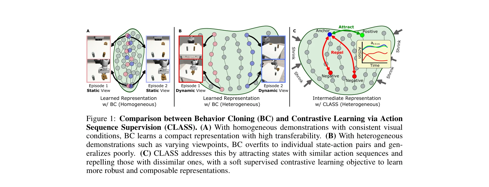
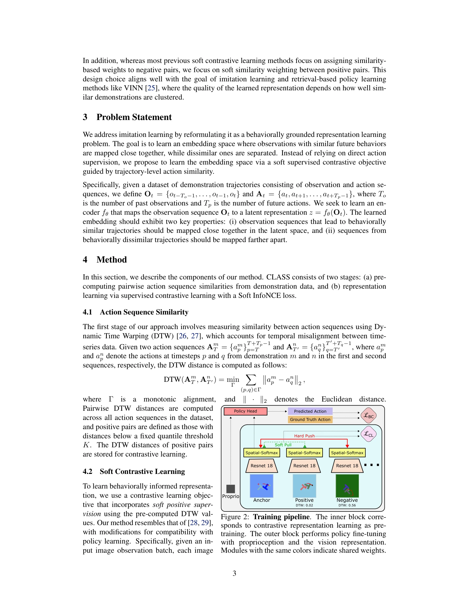

# CLASS: Contrastive Learning via Action Sequence Supervision for Robot Manipulation

> **저자**: Sung-Wook Lee, Xuhui Kang, Brandon Yang, Yen-Ling Kuo | **날짜**: 2025-08-03 | **URL**: [https://arxiv.org/abs/2508.01600](https://arxiv.org/abs/2508.01600)

---

## Essence

*Figure 1: Comparison between Behavior Cloning (BC) and Contrastive Learning via Action*

CLASS는 행동 시퀀스 유사성을 기반으로 하는 supervised contrastive learning을 통해 로봇 조작 태스크에서 robust한 시각적 표현을 학습하는 방법이다. DTW로 측정된 action sequence 유사성을 약한 감독 신호로 활용하여 heterogeneous 데이터셋에서의 일반화 성능을 크게 향상시킨다.

## Motivation

- **Known**: Behavior Cloning은 대규모 시연 데이터와 expressive 모델을 통해 로봇 조작에서 강한 성능을 달성했다. 그러나 BC는 개별 시연에 과적합되는 경향이 있어, 카메라 시점이나 물체 모양이 다른 heterogeneous 데이터셋에서 성능 저하를 겪는다.
- **Gap**: 기존 BC 방식은 공유된 구조(shared structure)를 충분히 포착하지 못하여 다양한 시각 조건에서의 일반화에 실패한다. Contrastive learning을 로봇 조작에 적용한 기존 연구들은 개별 시연 내의 시간적 관계에만 집중하고, 여러 시연 간 유사한 행동을 구성하지 못한다.
- **Why**: 로봇 조작의 실제 응용에서는 서로 다른 카메라 시점이나 객체 변화 등 heterogeneous 조건이 불가피하므로, 이러한 시각적 변화에 robust한 표현 학습이 중요하다. 또한 대규모 데이터 수집 시 다양한 환경에서의 시연을 활용할 수 있게 하면 데이터 효율성을 높일 수 있다.
- **Approach**: CLASS는 두 단계로 구성된다: (1) DTW를 통해 전체 시연 데이터셋에서 action sequence 간 pairwise 유사도를 사전 계산, (2) 계산된 유사도를 기반으로 soft InfoNCE loss를 사용한 supervised contrastive learning으로 인코더를 학습한다.

## Achievement

*Figure 1: Comparison between Behavior Cloning (BC) and Contrastive Learning via Action*

- **Heterogeneous 조건에서의 뛰어난 성능**: Diffusion Policy + CLASS 사전학습 조합이 significant visual shift 환경에서 평균 75% 성공률을 달성하며, 다른 baseline 방법들이 경쟁력 있는 성능을 내지 못할 때도 효과적이다.
- **광범위한 평가**: 5개의 simulation benchmark와 3개의 실제 로봇 태스크에서 검증되었으며, 기존 behavior cloning 및 representation learning baseline을 지속적으로 초과 달성한다.
- **다양한 활용성**: 학습된 표현이 retrieval 기반 제어와 policy fine-tuning 모두에 사용 가능하며, homogeneous와 heterogeneous 데이터 설정 모두에서 성능 향상을 보여준다.

## How

*Figure 2: Training pipeline. The inner block corre-*

- **DTW를 통한 action sequence 유사도 측정**: 두 action sequence 간 거리를 Dynamic Time Warping으로 계산하여 temporal misalignment를 처리한다.
- **Positive pair 정의**: 고정된 quantile threshold K를 기준으로 DTW 거리가 낮은 순서쌍을 positive pair로 정의하고, 해당 DTW 값을 저장한다.
- **Soft supervised contrastive learning**: ResNet-18 + spatial softmax 인코더를 사용하여 L2-정규화된 임베딩을 생성한다.
- **Soft positive weighting**: 계산된 pairwise similarity matrix에서 DTW 기반 유사도에 따라 positive pair에 continuous weight를 할당하여, similarity-weighted positive 쌍을 활용한 soft InfoNCE loss를 최적화한다.
- **Data augmentation**: Random cropping과 Gaussian noise를 anchor 이미지에 적용하여 robustness를 향상시킨다.
- **Fine-tuning 단계**: 사전학습된 representation에 proprioception 정보와 policy head를 추가하여 downstream task에 대해 behavior cloning으로 fine-tuning한다.

## Originality

- **Action sequence 기반의 약한 감독 신호**: 직접적인 action 예측 감독 대신 action sequence 유사성을 기반으로 표현을 학습하는 방식이 novel하다.
- **Cross-demonstration 구성**: 기존 contrastive learning 연구가 개별 시연 내의 시간적 관계에 집중한 반면, CLASS는 서로 다른 시연 간 유사한 행동들을 latent space에서 클러스터링한다.
- **Soft positive pair weighting**: 기존 soft contrastive learning이 주로 negative pair에 대한 similarity-based weighting에 집중한 반면, CLASS는 positive pair에 대한 soft weighting에 중점을 둔다.
- **Retrieval 기반 제어와의 통합**: VINN 같은 retrieval 기반 방법과의 자연스러운 연결을 고려하여 설계되었다.

## Limitation & Further Study

- **DTW threshold 선택의 민감성**: Positive pair를 정의하는 quantile threshold K의 값이 성능에 미치는 영향에 대한 깊이 있는 분석이 부족하며, 이 값의 최적 설정 방법이 명확하지 않다.
- **계산 비용**: 전체 시연 데이터셋에서 pairwise DTW 거리를 사전 계산해야 하므로 대규모 데이터셋에서의 계산 복잡도가 높을 수 있다.
- **다중 모드 행동에 대한 한계**: 동일한 상태에서 여러 가능한 행동 시퀀스가 존재하는 경우, DTW 기반 유사도 측정의 적절성이 보장되지 않는다.
- **Real-world 평가의 제한성**: 실제 로봇 실험은 3개 태스크에 한정되어 있으며, 더 다양한 조작 태스크에서의 일반화 가능성을 보여줄 필요가 있다.
- **후속 연구**: (1) 동적 threshold 설정이나 적응형 positive pair 선택 방법 개발, (2) 계산 효율성을 위한 approximate DTW 또는 계층적 유사도 계산 방식 탐구, (3) 다중 모드 시나리오에서의 action sequence 표현 방법 개선

## Evaluation

- Novelty: 4/5
- Technical Soundness: 4/5
- Significance: 4/5
- Clarity: 4/5
- Overall: 4/5

**총평**: CLASS는 action sequence 유사성을 기반으로 한 새로운 약한 감독 신호를 제안하여 로봇 조작에서 heterogeneous 시각 조건에 robust한 표현 학습을 효과적으로 달성한다. Comprehensive 평가와 실용적 성능 향상으로 로봇 학습 분야에 significant contribution을 제공하는 우수한 논문이다.

## Related Papers

- 🔄 다른 접근: [[papers/1310_Any-point_Trajectory_Modeling_for_Policy_Learning/review]] — 둘 다 라벨이 없는 데이터 활용이지만 CLASS는 action sequence supervision을, ATM은 궤적 모델링을 통한 정책 학습을 사용한다.
- 🏛 기반 연구: [[papers/1520_R3M_A_Universal_Visual_Representation_for_Robot_Manipulation/review]] — R3M의 universal visual representation이 CLASS의 contrastive learning 기반 시각 표현 학습에 대한 이론적 기반을 제공한다.
- 🔗 후속 연구: [[papers/1372_EgoMimic_Scaling_Imitation_Learning_via_Egocentric_Video/review]] — DROID의 대규모 manipulation 데이터가 CLASS의 DTW 기반 action sequence 유사성 측정을 더 다양한 환경에서 검증할 수 있다.
- 🔄 다른 접근: [[papers/1310_Any-point_Trajectory_Modeling_for_Policy_Learning/review]] — 둘 다 라벨이 없는 데이터에서 로봇 정책을 학습하지만 ATM은 궤적 모델링을, CLASS는 action sequence supervision을 사용한다.
