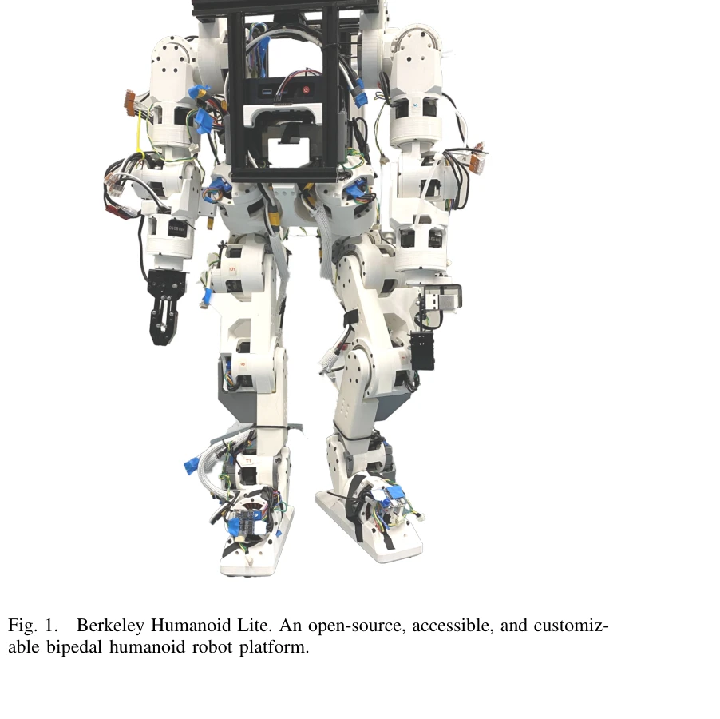
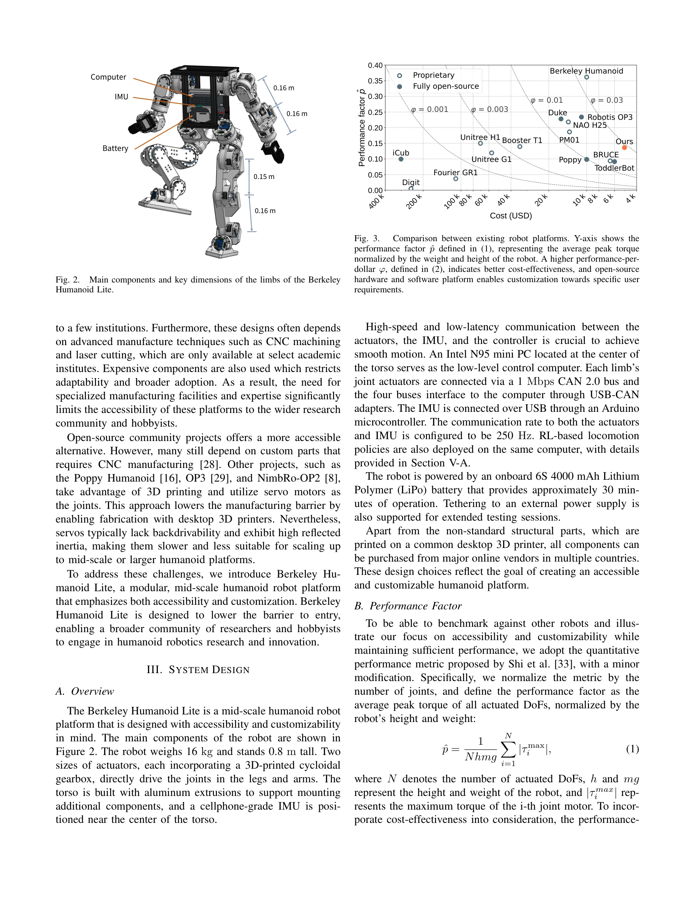

# Demonstrating Berkeley Humanoid Lite: An Open-source, Accessible, and Customizable 3D-printed Humanoid Robot

> **저자**: Yufeng Chi, Qiayuan Liao, Junfeng Long, Xiaoyu Huang, Sophia Shao, Borivoje Nikolic, Zhongyu Li, Koushil Sreenath | **날짜**: 2025-04-24 | **URL**: [https://arxiv.org/abs/2504.17249](https://arxiv.org/abs/2504.17249)

---

## Essence

*Fig. 1.*

Berkeley Humanoid Lite는 3D 프린팅된 cycloidal gear 액추에이터를 활용하여 $5,000 이하의 가격으로 오픈소스 휴머노이드 로봇을 구현했다. 모든 부품을 일반 e-commerce에서 조달하고 표준 데스크톱 3D 프린터로 제작 가능하도록 설계하여 휴머노이드 로봇의 민주화를 실현했다.

## Motivation

- **Known**: 휴머노이드 로봇 분야는 상당한 관심과 발전이 있었으나, 대부분의 상용 제품은 높은 비용, 폐쇄 소스, 투명성 부족으로 접근성이 제한되어 있다. 기존 오픈소스 플랫폼들도 CNC 기계 가공이나 특수 제조 시설이 필요하거나 servo 모터의 역구동성 부족 문제를 가진다.
- **Gap**: 3D 프린팅된 구성품의 강도 및 내구성 부족이 우려되며, 접근성과 신뢰성을 동시에 만족하는 중형 스케일의 오픈소스 휴머노이드 플랫폼이 부재했다. 시뮬레이션에서 실제 하드웨어로의 정책 전이 성공도 검증되지 않았다.
- **Why**: 접근 가능하고 맞춤화 가능한 휴머노이드 로봇 플랫폼은 강화학습 기반 보행 제어, 인간-로봇 상호작용, 로봇 조작 등의 연구 분야 전체의 혁신을 가능하게 한다. 오픈소스화를 통해 전 세계 연구자와 애호가들의 참여를 확대할 수 있다.
- **Approach**: cycloidal gear 설계를 채택한 모듈식 3D 프린팅 액추에이터를 핵심으로 하며, 광범위한 내구성 테스트를 통해 플라스틱 부품의 신뢰성을 검증했다. reinforcement learning 기반 보행 제어기 개발로 시뮬레이션에서 실제 하드웨어로의 zero-shot policy transfer를 실현했다.

## Achievement

*Fig. 2.*

- **접근성과 저비용성**: $5,000 이하의 하드웨어 비용으로 중형 휴머노이드 로봇 구현, 표준 데스크톱 3D 프린터와 일반 e-commerce 부품만으로 제작 가능
- **모듈식 설계**: cycloidal gear 액추에이터의 모듈식 구조로 강도와 내구성의 최적화, 3D 프린팅 부품의 재료 한계 극복
- **강화학습 검증**: reinforcement learning을 이용한 보행 제어기 개발로 zero-shot policy transfer 성공, 플랫폼의 연구 적용성 입증
- **완전 오픈소스**: 하드웨어 설계, embedded code, training 및 deployment framework 전체 공개로 재현, 커스터마이제이션, 개선 가능성 제공

## How

- cycloidal gear 설계: FDM 3D 프린팅에 최적화된 비-핀휠 cycloidal 기어 구현으로 강도와 효율성 확보
- 모듈식 액추에이터: 광범위한 testing을 통해 3D 프린팅된 액추에이터의 내구성과 신뢰성 검증
- 표준 부품 활용: e-commerce에서 즉시 조달 가능한 부품 선정으로 제조 접근성 극대화
- reinforcement learning 기반 제어: 시뮬레이션에서 학습한 정책을 실제 하드웨어에 직접 적용하는 zero-shot transfer 구현
- 텔레오퍼레이션 시스템: 실시간 조작 작업 수행으로 플랫폼의 다양성 입증
- 완전 오픈소스 공개: 상세 제작 지침과 함께 모든 리소스를 https://lite.berkeley-humanoid.org에 공개

## Originality

- 3D 프린팅 cycloidal gear를 mid-scale 휴머노이드에 처음 적용하여 비용-성능 트레이드오프의 새로운 솔루션 제시
- 오픈소스 humanoid 플랫폼 중에서 진정한 데스크톱 3D 프린터 제작 가능성을 구현한 최초의 중형 로봇
- 강화학습 기반 보행 제어에서 시뮬레이션-하드웨어 간 zero-shot policy transfer 성공을 실제로 입증
- cycloidal gear 설계의 FDM 최적화와 내구성 검증을 통해 3D 프린팅 액추에이터의 실용성 확립

## Limitation & Further Study

- 3D 프린팅 부품의 장기적 마모 특성에 대한 추가 연구 필요 (장기 운영 데이터 부족)
- cycloidal gear 설계의 확장성에 대한 검증 (더 큰 스케일이나 더 높은 토크 요구 환경에서의 성능)
- 다양한 제어 작업(manipulation, 복잡한 보행 패턴 등)에 대한 추가 실험 제시 필요
- 다양한 3D 프린터 모델과 재료에 대한 호환성 및 정확도 차이 분석 필요
- 비용 분석에서 노동 시간과 지역별 부품 가격 변동 고려 필요

## Evaluation

- Novelty: 4/5
- Technical Soundness: 3/5
- Significance: 4/5
- Clarity: 4/5
- Overall: 4/5

**총평**: Berkeley Humanoid Lite는 3D 프린팅과 cycloidal gear를 활용하여 접근 가능하고 저비용의 오픈소스 휴머노이드 로봇을 성공적으로 구현했으며, zero-shot policy transfer 검증으로 실용성을 입증했다. 완전한 오픈소스 공개를 통해 휴머노이드 로봇 연구의 민주화에 실질적으로 기여하는 중요한 작업이다.

## Related Papers

- 🔄 다른 접근: [[papers/1262_AGILOped_Agile_Open-Source_Humanoid_Robot_for_Research/review]] — cycloidal gear 액추에이터와 상용 부품 조합의 서로 다른 저비용 휴머노이드 제작 방식을 비교 연구할 수 있습니다.
- 🏛 기반 연구: [[papers/1603_ORCA_An_Open-Source_Reliable_Cost-Effective_Anthropomorphic/review]] — 오픈소스와 저비용 설계 철학이 접근 가능한 로봇 손 제작에 동일하게 적용되는 기반을 제공합니다.
- 🧪 응용 사례: [[papers/1344_DIAL_Distilling_Intent-Aware_Latents_for_Vision-Language-Act/review]] — 표준 데스크톱 3D 프린터로 제작된 휴머노이드가 vision-language-action 모델의 실험 플랫폼으로 활용됩니다.
- 🔄 다른 접근: [[papers/1262_AGILOped_Agile_Open-Source_Humanoid_Robot_for_Research/review]] — 오픈소스 휴머노이드 로봇에서 3D 프린팅 부품 활용과 cycloidal gear 액추에이터의 서로 다른 저비용 구현 방식을 비교할 수 있습니다.
- 🏛 기반 연구: [[papers/1344_DIAL_Distilling_Intent-Aware_Latents_for_Vision-Language-Act/review]] — 접근 가능한 휴머노이드 플랫폼이 vision-language-action 작업의 실험적 검증 기반을 제공합니다.
- 🧪 응용 사례: [[papers/1603_ORCA_An_Open-Source_Reliable_Cost-Effective_Anthropomorphic/review]] — 접근 가능한 로봇 손 제작이 오픈소스 휴머노이드의 손재주 조작 능력 향상에 적용됩니다.
