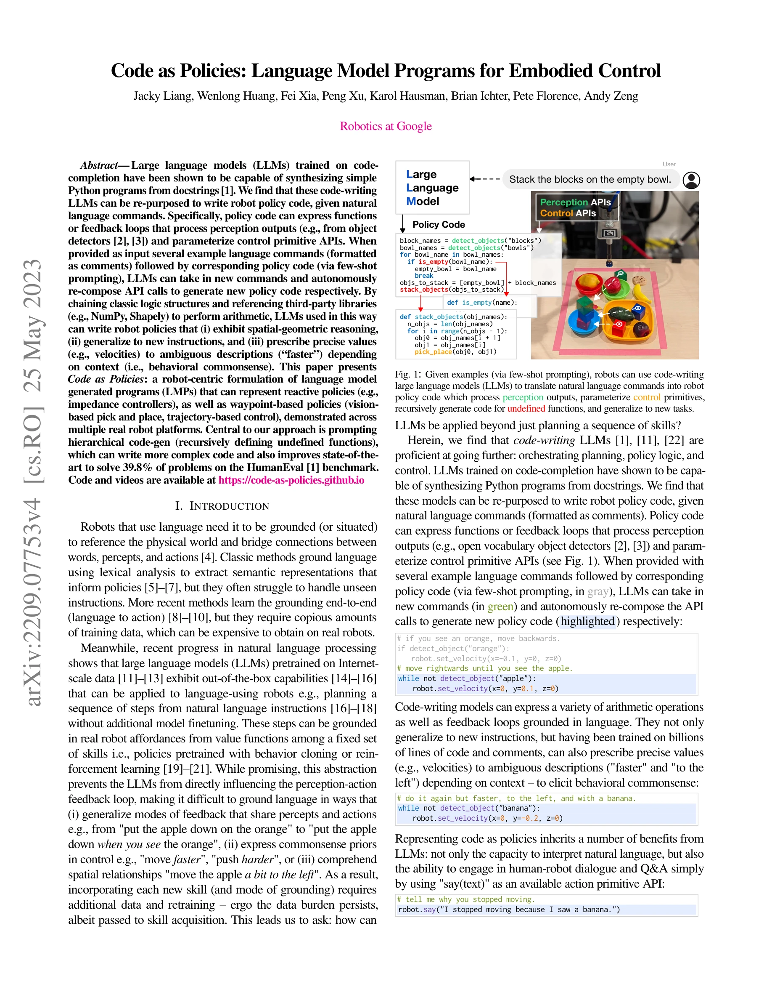
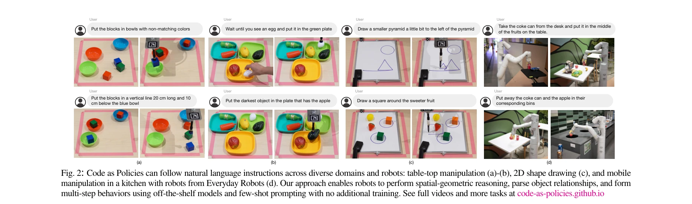

# Code as Policies: Language Model Programs for Embodied Control

> **저자**: Jacky Liang, Wenlong Huang, Fei Xia, Peng Xu, Karol Hausman, Brian Ichter, Pete Florence, Andy Zeng | **날짜**: 2022-09-16 | **URL**: [https://arxiv.org/abs/2209.07753](https://arxiv.org/abs/2209.07753)

---

## Essence

*Fig. 1: Given examples (via few-shot prompting), robots can use code-writing*

Large Language Model(LLM)을 활용하여 자연어 명령을 로봇 정책 코드로 직접 변환하는 "Code as Policies" 방식을 제안하며, few-shot prompting과 hierarchical code-gen을 통해 복잡한 로봇 행동을 실시간으로 생성한다.

## Motivation

- **Known**: LLM은 docstring으로부터 Python 프로그램을 합성할 수 있으며, 로봇 제어에 대해 기존에는 고정된 스킬 세트를 조합하거나 대규모 데이터로 end-to-end 학습하는 방식이 사용되어 왔다.
- **Gap**: 기존 LLM 기반 로봇 제어 방식은 인식-행동 피드백 루프에 직접 영향을 미치지 못하여, 새로운 스킬 추가 시 추가 학습 데이터가 필요하고 공간 관계 이해 및 모호한 명령("더 빠르게")의 정량화가 어렵다.
- **Why**: 로봇이 자연어로 표현된 복잡한 작업을 데이터 수집 없이 실시간으로 학습·수행할 수 있다면, 로봇의 범용성과 사용 편의성이 크게 향상되며 인간-로봇 상호작용의 새로운 가능성이 열린다.
- **Approach**: Code-writing LLM에 few-shot prompt로 예제 명령과 대응하는 정책 코드를 제공하여, 새로운 명령에 대해 perception API(객체 감지)와 control primitive API를 조합한 Python 코드를 자동으로 생성하게 한다. Hierarchical code-gen을 통해 미정의 함수를 재귀적으로 정의하여 복잡도를 증가시킨다.

## Achievement

*Fig. 2: Code as Policies can follow natural language instructions across diverse domains and robots: table-top manipulat*

- **Code as Policies 방식론**: LMP(Language Model Programs)를 로봇 정책 표현으로 사용하여 reactive policy(impedance controller)와 waypoint-based policy(vision-based pick and place, trajectory control) 모두 표현 가능
- **Hierarchical code-gen**: 재귀적 함수 정의를 통해 더 복잡한 코드 생성이 가능하며, HumanEval 벤치마크에서 39.8% P@1 달성으로 기존 최고 성능 개선
- **다중 로봇 플랫폼 검증**: 테이블탑 조작, 2D 도형 그리기, 이동형 조작 등 다양한 도메인과 로봇 시스템에서 실제 동작 입증
- **로봇 특화 벤치마크**: 로봇 코드 생성 문제 평가를 위한 새로운 벤치마크 제시

## How

*Fig. 1: Given examples (via few-shot prompting), robots can use code-writing*

- Few-shot prompting: 자연어 명령을 주석 형태로, 대응하는 정책 코드를 예제로 제공하여 in-context learning 활성화
- Perception-Action 연결: detect_objects(), is_empty() 등 perception API와 robot.set_velocity(), pick_place() 등 control primitive API를 Python 코드에서 조합
- Hierarchical code-gen: 미정의 함수에 대해 LLM을 재귀적으로 호출하여 함수 정의를 자동으로 생성
- Third-party library 활용: NumPy(점 보간), Shapely(도형 생성/분석) 등 기존 라이브러리를 통한 공간-기하 추론
- Control parameter 추론: 모호한 표현("faster", "to the left")을 코드 문맥에 기반하여 구체적인 수치값(속도, 위치)으로 변환
- 대화형 인터페이스: say() API를 통해 로봇이 자신의 행동을 언어로 설명하는 human-robot dialogue 구현

## Originality

- 기존의 LLM 기반 로봇 제어가 고수준 planning만 담당하던 것에서 벗어나, policy code 생성을 통해 저수준 control까지 통합한 end-to-end 접근법이 창신
- Hierarchical code-gen이 단순 코드 완성을 넘어 자동으로 복잡도를 증가시키는 재귀적 구조는 로봇 정책 합성에 맞춤화된 기술
- 공간 관계, 객체 관계, 행동의 세기 등을 단일 Python 코드로 표현하여 모호성 제거와 일반화를 동시에 달성하는 통합 표현 방식

## Limitation & Further Study

- LLM의 hallucination 및 구문 오류 가능성: 생성된 코드의 안정성과 신뢰성에 대한 검증 메커니즘이 부재할 수 있음
- Perception API의 정확도 의존성: 객체 감지 오류가 정책 실행을 크게 방해할 수 있으나, 논문에서 perception robustness 분석이 제한적
- 실시간 성능: LLM 추론 시간이 로봇의 빠른 반응을 요구하는 고속 제어에 적합한지 미확인
- Scalability 문제: 매우 복잡한 다단계 작업이나 high-frequency control에서의 성능 한계 가능성
- 후속 연구: 생성 코드의 정확성 검증 및 자동 수정 메커니즘, 실시간 성능 최적화, 실패 복구 능력 강화 필요

## Evaluation

- Novelty: 4/5
- Technical Soundness: 3/5
- Significance: 4/5
- Clarity: 4/5
- Overall: 4/5

**총평**: 이 논문은 LLM을 로봇 정책 생성에 직접 적용하는 창의적인 방식을 제시하며, hierarchical code-gen을 통한 성능 개선과 다양한 실제 로봇 플랫폼에서의 검증으로 강한 임팩트를 가진다. 다만 생성 코드의 안정성 검증과 실시간 성능 평가가 보완되면 더욱 완성도 높은 연구가 될 것이다.

## Related Papers

- 🔗 후속 연구: [[papers/1314_AutoEval_Autonomous_Evaluation_of_Generalist_Robot_Manipulat/review]] — LLM 기반 정책 코드 생성을 자동화된 평가 시스템과 결합하여 완전한 자율 개발 파이프라인을 구성한다
- 🔄 다른 접근: [[papers/1324_Bridging_Language_and_Action_A_Survey_of_Language-Conditione/review]] — 언어 명령을 로봇 행동으로 변환하는 방식을 각각 직접 코드 생성과 language-conditioned learning으로 다르게 접근한다
- 🔗 후속 연구: [[papers/1335_Code-as-Monitor_Constraint-aware_Visual_Programming_for_Reac/review]] — Code as Policies의 기본 개념을 constraint-aware programming으로 발전시켜 더 안전하고 제약을 고려한 정책 생성을 가능하게 한다
- 🔄 다른 접근: [[papers/1435_Instruct2Act_Mapping_Multi-modality_Instructions_to_Robotic/review]] — 자연언어를 로봇 행동으로 변환하는 서로 다른 접근 방식으로, API 활용과 코드 생성의 차이를 보여준다.
- 🔄 다른 접근: [[papers/1444_Language_to_Rewards_for_Robotic_Skill_Synthesis/review]] — 두 논문 모두 언어를 로봇 제어로 변환하지만, 하나는 보상 함수를, 다른 하나는 직접적인 정책 코드를 생성한다.
- 🔗 후속 연구: [[papers/1561_SayPlan_Grounding_Large_Language_Models_using_3D_Scene_Graph/review]] — Code as Policies가 SayPlan의 LLM 기반 태스크 계획을 코드 생성으로 확장한다.
- 🔄 다른 접근: [[papers/1583_Text2Reward_Reward_Shaping_with_Language_Models_for_Reinforc/review]] — 자연어를 통한 로봇 제어에서 Text2Reward의 보상 생성 방식과 Code as Policies의 프로그램 생성 방식을 해석가능성 측면에서 비교할 수 있다.
- 🔄 다른 접근: [[papers/1622_VoxPoser_Composable_3D_Value_Maps_for_Robotic_Manipulation_w/review]] — VoxPoser는 3D value map 기반으로, Code as Policies는 직접적인 코드 생성으로 LLM을 embodied control에 활용하는 서로 다른 접근법
- 🏛 기반 연구: [[papers/1369_Do_As_I_Can_Not_As_I_Say_Grounding_Language_in_Robotic_Affor/review]] — Code as Policies의 언어 모델 기반 제어가 LLM의 affordance function 활용의 기반이다.
- 🏛 기반 연구: [[papers/1314_AutoEval_Autonomous_Evaluation_of_Generalist_Robot_Manipulat/review]] — LLM을 활용한 정책 코드 생성이 자동화된 정책 평가의 기초 기술을 제공한다
- 🔄 다른 접근: [[papers/1324_Bridging_Language_and_Action_A_Survey_of_Language-Conditione/review]] — 언어와 로봇 행동의 연결을 각각 종합적 조사와 코드 생성이라는 다른 방식으로 접근한다
