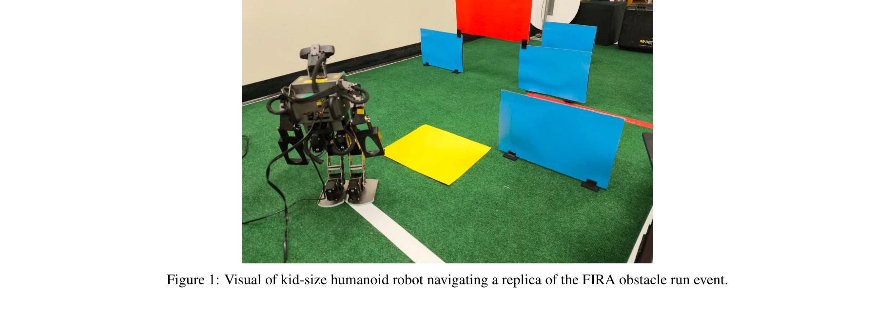
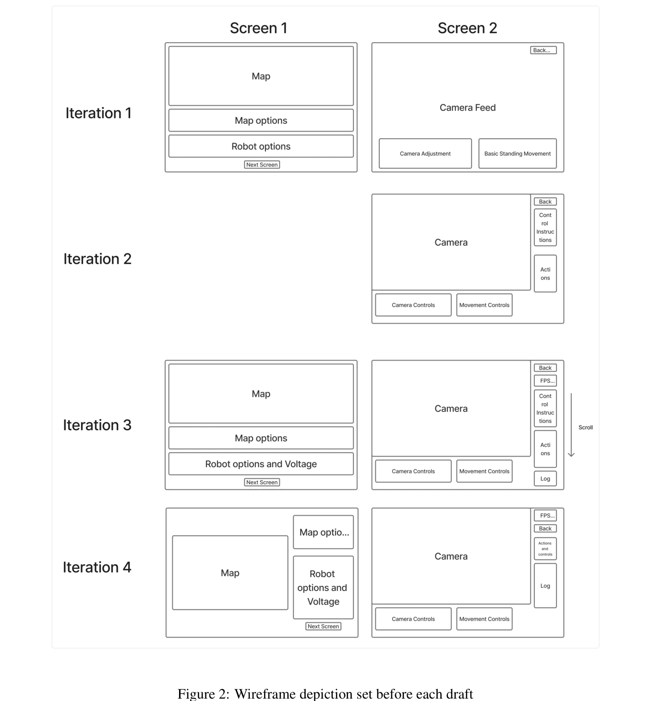

# Development of an Intuitive GUI for Non-Expert Teleoperation of Humanoid Robots

> **저자**: Austin Barret, Meng Cheng Lau | **날짜**: 2025-10-15 | **URL**: [https://arxiv.org/abs/2510.13594](https://arxiv.org/abs/2510.13594)

---

## Essence

*Figure 1: Visual of kid-size humanoid robot navigating a replica of the FIRA obstacle run event.*

휴머노이드 로봇의 비전문가 조종을 위해 카메라 피드를 중심으로 한 직관적이고 확장 가능한 GUI를 개발했다. FIRA HuroCup 장애물 코스 통과를 목표로 사용자 인터페이스 설계 원칙과 HRI 개념을 통합했다.

## Motivation

- **Known**: 휴머노이드 로봇의 원격 조종은 의료, 채광, 우주탐사 등 실무 분야에서 중요하며, FIRA RoboWorld Cup과 같은 경쟁 플랫폼이 존재한다. 기존 GUI는 전문 조종사 중심으로 설계되어 비전문가 접근성이 낮다.
- **Gap**: 대부분의 원격 조종 연구가 숙련 조종사를 대상으로 하며, 단순하고 확장 가능하면서도 경쟁 준비가 되어 있는 비전문가용 GUI가 부족하다. 기존 인터페이스는 명확한 레이블, 직관적 레이아웃, 크롤링 같은 핵심 동작, 카메라 배치 등이 결여되어 있다.
- **Why**: 비전문가가 조종할 수 있는 직관적 GUI는 새로운 팀 참가자의 재교육 필요성을 줄이고 인지 부하를 감소시켜 성능 향상과 안전성 증대로 이어진다. 경쟁과 실무 환경에서 다양한 사용자가 시스템을 효과적으로 활용할 수 있는 접근성이 중요하다.
- **Approach**: HTML, CSS, JavaScript를 사용한 맞춤형 GUI 개발과 반복적 설계 사이클(와이어프레임 → 구현 → 테스트 → 개선)을 통해 사용자 중심 설계를 실현했다. 카메라 기반 시각 피드백, 명확한 로봇 상태 표시, 확장 가능한 아키텍처를 우선순위로 했다.

## Achievement

- **직관적 제어 인터페이스**: 이동, 크롤링, 측면 이동 등 핵심 동작을 단순하고 명확하게 구현하여 비전문가 접근성 향상
- **향상된 시각 피드백**: 카메라 중심의 환경 인식 최적화와 장애물 매핑 위젯 기능 개선으로 실시간 상황 파악 강화
- **확장 가능한 아키텍처**: HTML/CSS/JavaScript 기반 맞춤형 개발로 외부 라이브러리 의존 최소화하면서 향후 기능 추가 용이
- **진단 및 모니터링 기능**: 전압 표시기 및 진단 로그 추가로 로봇 상태 모니터링 개선

## How

*Figure 2: Wireframe depiction set before each draft*

- Ubuntu Mint 16.04 운영체제와 ROS1 미들웨어의 노드 기반 아키텍처 활용
- Python 2.7과 C++를 사용한 publisher-subscriber 모델 통신 구현
- HTTP 명령 및 WebSocket 실시간 피드백, JSON 메시지 포맷을 통한 클라이언트-서버 통신
- 와이어프레임 기반 반복적 개발: 핵심 기능 구현 → 규정 준수 튜프 트랙에서 테스트 → 작업 성공률 및 워크플로우 효율성 평가
- 카메라 입력만 의존하는 제약 조건 하에서 시각적 피드백 최적화에 집중
- 레이아웃, 기능성, 사용성 연속 개선을 통한 경쟁 환경 대비

## Originality

- FIRA HuroCup 규정 준수 환경에 특화된 비전문가 중심 GUI 개발로, 기존 연구의 기술 능력 우선 설계와 차별화
- 카메라 단독 피드백 제약 하에서 직관적 인터페이스를 설계하는 창의적 접근
- HRI 지침과 웹 설계 모범 사례, shared-control 패러다임을 통합한 실용적 설계 철학
- 외부 라이브러리 무사용 맞춤형 개발로 경쟁 환경의 신속한 수정 및 확장 가능성 확보

## Limitation & Further Study

- **시간 제약으로 인한 외부 사용자 테스트 미실시**: 윤리승인 획득 및 비전문가 대상 정량적 평가(System Usability Scale 등) 미수행
- **단일 개발자 평가**: 개발자 본인만이 사용성 평가를 수행하여 객관성 한계
- **로봇 동작 불일치**: 다른 사용자의 수정으로 인한 로봇 일관성 문제가 테스트에 영향
- **제한된 센서 환경**: FIRA 규정상 외부 센서 불가로 인한 피드백 제약
- **후속 연구**: 제3자 평가, 정량적 메트릭 기반 검증, 비전문가 사용자군 포함 대규모 사용성 시험 필요

## Evaluation

- Novelty: 4/5
- Technical Soundness: 3/5
- Significance: 4/5
- Clarity: 4/5
- Overall: 4/5

**총평**: 경쟁 환경과 실무 필드에서 비전문가가 휴머노이드 로봇을 효과적으로 조종할 수 있도록 설계된 실용적이고 확장 가능한 GUI를 성공적으로 개발했다. 다만 형식적 사용자 테스트와 정량적 평가 부재가 일반화 가능성을 제한하므로, 향후 외부 평가와 대규모 사용성 검증이 필수적이다.

## Related Papers

- 🔄 다른 접근: [[papers/1272_ARMADA_Augmented_Reality_for_Robot_Manipulation_and_Robot-Fr/review]] — 비전문가 로봇 조작에서 직관적 GUI와 증강현실의 다른 인터페이스 접근이다
- 🧪 응용 사례: [[papers/1285_Berkeley_Humanoid_A_Research_Platform_for_Learning-based_Con/review]] — 사용자 친화적 휴머노이드 조작에서 Berkeley Humanoid 플랫폼의 접근성이 적용된다
- 🏛 기반 연구: [[papers/1347_DIJIT_A_Robotic_Head_for_an_Active_Observer/review]] — 비전문가 텔레오퍼레이션에서 능동 관찰자를 위한 직관적 인터페이스가 기초가 된다
- 🔗 후속 연구: [[papers/1462_Human-Robot_Collaboration_for_the_Remote_Control_of_Mobile_H/review]] — 원격 제어 인터페이스에서 직관적 GUI가 인간-로봇 협력으로 확장된다
- 🏛 기반 연구: [[papers/1462_Human-Robot_Collaboration_for_the_Remote_Control_of_Mobile_H/review]] — 비전문가를 위한 직관적 GUI 개념이 원격 제어에서의 인간-로봇 협력의 기반이 된다
