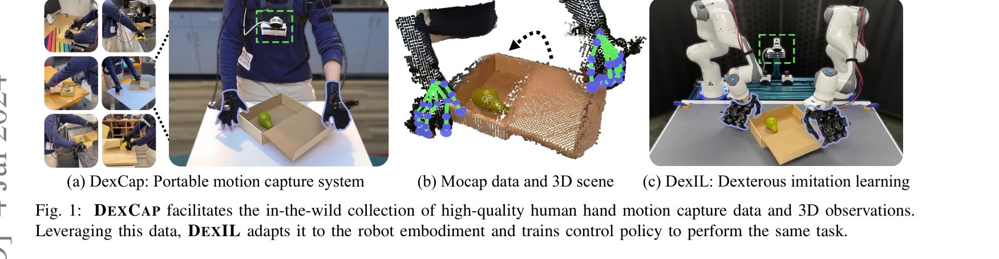
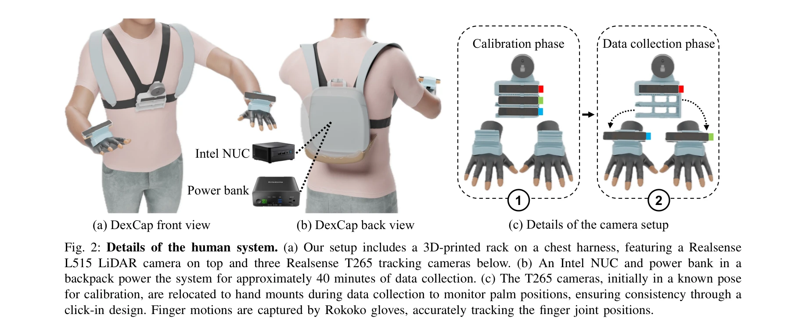

# DexCap: Scalable and Portable Mocap Data Collection System for Dexterous Manipulation

> **저자**: Chen Wang, Haochen Shi, Weizhuo Wang, Ruohan Zhang, Li Fei-Fei, C. Karen Liu | **날짜**: 2024-03-12 | **URL**: [https://arxiv.org/abs/2403.07788](https://arxiv.org/abs/2403.07788)

---

## Essence

*Fig. 1: DEXCAP facilitates the in-the-wild collection of high-quality human hand motion capture data and 3D observations*

DexCap는 휴대 가능한 손 모션 캡처 시스템이고, DexIL은 이 데이터를 이용해 로봇이 인간의 손 움직임으로부터 직접 민첩한 조작 정책을 학습할 수 있는 모방 학습 알고리즘이다.

## Motivation

- **Known**: 로봇 손 조작 학습을 위해 모방 학습이 유망한 방법이며, 기존 mocap 시스템은 대부분 휴대성이 떨어지고 시각 폐색에 취약하다.
- **Gap**: 기존 mocap 시스템이 휴대성과 실시간 추적의 정밀도 문제를 가지고 있으며, 인간 손 데이터를 로봇 정책으로 변환하는 구체적인 알고리즘이 부족하다.
- **Why**: 인간 수준의 로봇 손 민첩성을 달성하기 위해 대규모로 확장 가능하고 정확한 손 움직임 데이터 수집이 필수적이며, 이를 효과적으로 로봇 정책으로 전환하는 것이 중요하다.
- **Approach**: SLAM과 electromagnetic field를 결합한 휴대 가능한 mocap 시스템으로 손목과 손가락 움직임을 추적하고, inverse kinematics와 point cloud 기반 imitation learning을 통해 인간 동작을 로봇 손으로 적응시킨다.

## Achievement

*Fig. 1: DEXCAP facilitates the in-the-wild collection of high-quality human hand motion capture data and 3D observations*

- **DexCap 시스템**: 60Hz의 실시간 6-DoF 손목 자세 및 손가락 움직임 추적으로 폐색에 강건한 휴대 가능한 mocap 시스템 구현
- **DexIL 알고리즘**: Inverse kinematics 기반 retargeting과 point cloud 기반 Diffusion Policy를 사용한 behavior cloning으로 embodiment gap을 해결
- **Human-in-the-loop 메커니즘**: 정책 실행 중 인간 개입을 통해 복잡한 작업에서 로봇 성능을 지속적으로 개선
- **6가지 도전적 조작 작업에서 우수한 성능**: In-the-wild mocap 데이터로부터 직접 학습 가능함을 실증적으로 증명

## How

*Fig. 2: Details of the human system. (a) Our setup includes a 3D-printed rack on a chest harness, featuring a Realsense*

- **Hardware design**: 3D-printed 가슴 거치대에 RGB-D LiDAR 카메라(환경 관찰), 손 장착형 추적 카메라(SLAM 기반 6-DoF 추적), Rokoko 장갑(손가락 관절 추적)을 통합
- **Data retargeting**: 인간의 손가락 끝점을 역기구학(IK)으로 로봇 손가락 끝점 위치에 맞추고, 손목 6-DoF 자세로 IK 초기화
- **Policy training**: RGB-D 이미지를 point cloud로 변환하고 Diffusion Policy 기반 behavior cloning으로 점구름 입력을 받는 정책 학습
- **Human-in-the-loop correction**: 로봇 실행 중 부자연스러운 움직임 발생 시 인간이 DexCap으로 개입하여 수정 데이터 수집 및 정책 fine-tuning
- **Multi-view occlusion robustness**: SLAM과 electromagnetic field의 하이브리드 접근으로 손-물체 상호작용 중 발생하는 시각적 폐색 극복

## Originality

- SLAM 기반 6-DoF 추적과 electromagnetic field 추적을 결합한 새로운 mocap 시스템 아키텍처로 휴대성과 정밀도를 동시에 달성
- Point cloud 기반 Diffusion Policy를 mocap 데이터의 embodiment gap 해결을 위한 imitation learning에 처음 적용
- 정책 학습 중 실시간 인간 개입을 통한 점진적 개선 메커니즘으로 대화형 학습 패러다임 도입
- In-the-wild 환경에서의 실제 손-물체 상호작용 mocap 데이터 수집 및 로봇 학습의 실용적 파이프라인 구축

## Limitation & Further Study

- 시스템의 배터리 지속시간이 약 40분으로 장시간 데이터 수집에 제약이 있음
- Inverse kinematics만으로는 복잡한 embodiment gap을 해결하기 어려워 human-in-the-loop 개입이 필요한 경우가 있음
- 현재 6가지 작업에서만 평가되어 더 다양한 조작 작업에서의 일반화 능력 검증 필요
- 로봇 손의 구조적 제약(손가락 개수, 관절 구성)이 다를 경우 적응 방법론이 필요함
- 후속 연구로는 더 긴 배터리 지속시간, 자동화된 embodiment gap 해결 방법, 다양한 로봇 손 구조로의 확장이 필요

## Evaluation

- Novelty: 4/5
- Technical Soundness: 4/5
- Significance: 4/5
- Clarity: 4/5
- Overall: 4/5

**총평**: DexCap과 DexIL은 휴대 가능한 mocap 데이터 수집과 효과적인 로봇 정책 학습을 위한 실용적이고 혁신적인 솔루션을 제시하며, 인간 수준의 로봇 손 민첩성 달성을 위한 중요한 기초를 마련한다.

## Related Papers

- 🔄 다른 접근: [[papers/1369_EgoDex_Learning_Dexterous_Manipulation_from_Large-Scale_Egoc/review]] — DexCap의 휴대형 모션 캡처 시스템과 EgoDex의 Apple Vision Pro 기반 수집 방식은 서로 다른 접근법으로 손동작 데이터를 획득하는 대안적 방법론입니다.
- 🔗 후속 연구: [[papers/1373_EgoVLA_Learning_Vision-Language-Action_Models_from_Egocentri/review]] — DexCap으로 수집한 손동작 데이터를 EgoVLA의 Vision-Language-Action 모델에 통합하면 더욱 정교한 bimanual humanoid 조작이 가능해집니다.
- 🔗 후속 연구: [[papers/1486_HumDex_Humanoid_Dexterous_Manipulation_Made_Easy/review]] — DexCap의 모션 캡처를 IMU 기반 휴머노이드 전신 제어로 확장했다
- 🏛 기반 연구: [[papers/1604_OSMO_Open-Source_Tactile_Glove_for_Human-to-Robot_Skill_Tran/review]] — 촉각 장갑을 통한 인간-로봇 스킬 전이가 대규모 정교한 조작을 위한 확장 가능한 모션 캡처의 기반이 된다.
