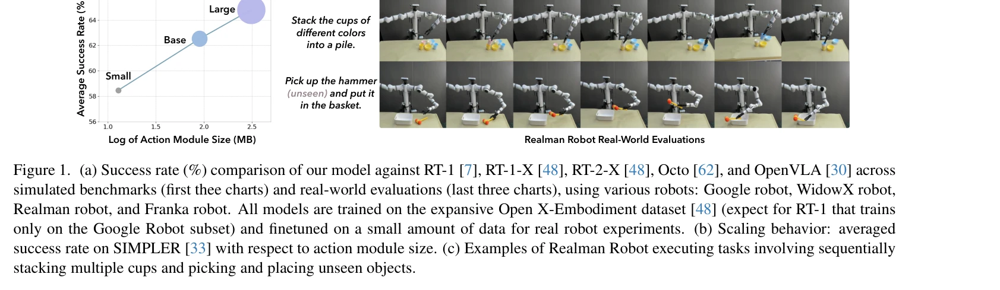
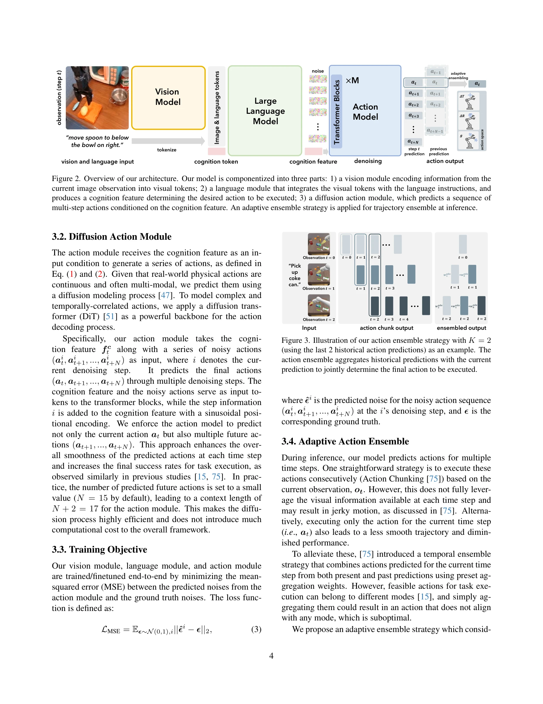

# CogACT: A Foundational Vision-Language-Action Model for Synergizing Cognition and Action in Robotic Manipulation

> **저자**: Qixiu Li, Yaobo Liang, Zeyu Wang, Lin Luo, Xi Chen, Mozheng Liao, Fangyun Wei, Yu Deng, Sicheng Xu, Yizhong Zhang, Xiaofan Wang, Bei Liu, Jianlong Fu, Jianmin Bao, Dong Chen, Yuanchun Shi, Jiaolong Yang, Baining Guo | **날짜**: 2024-11-29 | **URL**: [https://arxiv.org/abs/2411.19650](https://arxiv.org/abs/2411.19650)

---

## Essence

*Figure 1. (a) Success rate (%) comparison of our model against RT-1 [7], RT-1-X [48], RT-2-X [48], Octo [62], and OpenVL*

CogACT는 Vision-Language-Model을 기반으로 하되 cognition과 action을 분리하여 specializing된 diffusion action transformer 모듈을 통해 로봇 조작의 성능을 대폭 향상시킨 VLA 모델이다.

## Motivation

- **Known**: 기존 VLA 모델들은 pretrained VLM을 직접 action prediction에 적용하거나 단순 action quantization을 사용하여 task 성능이 낮으며, diffusion 기반 정책이 multimodal action 분포를 잘 모델링할 수 있음이 알려져 있다.
- **Gap**: 기존 VLA는 VLM의 discrete token prediction 방식이나 regression 기반 접근으로 continuous, multimodal, temporally correlated한 robot action의 특성을 제대로 처리하지 못하며, large diffusion action module과 VLM의 효과적인 통합이 부족하다.
- **Why**: 로봇 조작의 일반화 능력과 task 성능은 실제 로봇 응용에 필수적이며, VLM의 강력한 시각-언어 이해 능력과 action modeling의 분리를 통해 더 효율적인 모델 설계가 가능하다.
- **Approach**: VLM의 cognitive output을 attention mechanism으로 precondition하는 대형 diffusion transformer 기반 action module을 설계하고, Adaptive Action Ensemble 알고리즘으로 temporal fusion을 수행하여 cognition과 action을 synergize한다.

## Achievement

*Figure 1. (a) Success rate (%) comparison of our model against RT-1 [7], RT-1-X [48], RT-2-X [48], Octo [62], and OpenVL*

- **성능 우위**: OpenVLA (7B)와 유사한 모델 크기에서 simulation에서 35% 이상, 실제 로봇에서 55% 이상 높은 성공률 달성 및 RT-2-X (55B)를 simulation에서 18% 앞지름
- **다중 로봇 적응성**: Google robot, WidowX, Realman, Franka 등 5개 로봇에서 일관되게 우수한 성능 및 빠른 adaptation 능력 입증
- **우수한 일반화**: 미학습 객체와 배경에 대한 뛰어난 generalization 능력
- **확장성**: diffusion action transformer가 몇백 MB 크기 증가로 significant performance enhancement를 보이는 favorable scaling behavior 보유

## How

*Figure 2. Overview of our architecture. Our model is componentized into three parts: 1) a vision module encoding informa*

- Pretrained VLM을 frozen 또는 finetunable하게 유지하고 이의 output을 specialized diffusion transformer action module의 attention mechanism을 통해 precondition
- Action sequence modeling을 위해 diffusion transformer (DiT) 아키텍처 채용하여 continuous, multimodal, temporally correlated action 특성 반영
- Adaptive Action Ensemble (AAE) 알고리즘으로 과거 action predictions을 적응적으로 fusion하여 temporal consistency 향상
- Open X-Embodiment dataset으로 학습하고 실제 로봇 실험을 위해 소량 데이터로 finetuning
- 다양한 action module backbone (sequential vs single-step, 다양한 모델 크기) 체계적 비교 및 ablation study 수행

## Originality

- Cognition (VLM)과 action (diffusion transformer) 기능의 명시적 분리 및 componentized 아키텍처 제안
- Large-scale diffusion action transformer (최대 300M parameters)을 VLA에 통합하여 action signal의 특성을 전문적으로 모델링
- Adaptive Action Ensemble 알고리즘으로 temporal fusion의 새로운 접근
- VLM pretrained capability를 유지하면서도 action modeling에 특화된 모듈의 favorable scaling behavior 체계적 검증

## Limitation & Further Study

- Action module 크기 300M은 여전히 modest하며 더 큰 스케일 탐색 필요
- Diffusion model의 높은 computational cost로 인한 inference latency 고려 부족
- Real-world 평가가 제한된 로봇과 환경에서만 수행됨
- VLM fine-tuning 여부와 action module 학습 전략의 trade-off 분석 부재
- 향후 더 많은 로봇 embodiment과 다양한 task category에서의 일반화 능력 검증 필요

## Evaluation

- Novelty: 4/5
- Technical Soundness: 4/5
- Significance: 4/5
- Clarity: 4/5
- Overall: 4/5

**총평**: CogACT는 VLM과 diffusion action transformer의 effective synergy를 통해 로봇 조작 성능에서 significant advancement를 달성한 well-motivated 연구이며, componentized 아키텍처와 체계적인 실험을 통해 높은 원창성과 실용적 가치를 보여준다.

## Related Papers

- 🔄 다른 접근: [[papers/1338_ConRFT_A_Reinforced_Fine-tuning_Method_for_VLA_Models_via_Co/review]] — 둘 다 VLA 모델의 성능 향상을 다루지만 CogACT는 cognition-action 분리를, ConRFT는 강화학습 기반 미세조정을 사용한다.
- 🏛 기반 연구: [[papers/1437_InternVLA-A1_Unifying_Understanding_Generation_and_Action_fo/review]] — InternVLA-A1의 통합된 이해-생성-행동 구조가 CogACT의 전문화된 diffusion action transformer 설계에 대한 기반을 제공한다.
- 🔗 후속 연구: [[papers/1510_OpenVLA_An_Open-Source_Vision-Language-Action_Model/review]] — OpenVLA의 오픈소스 VLA 모델이 CogACT의 전문화된 아키텍처를 더 광범위한 커뮤니티에서 활용할 수 있게 한다.
- 🔄 다른 접근: [[papers/1338_ConRFT_A_Reinforced_Fine-tuning_Method_for_VLA_Models_via_Co/review]] — 둘 다 VLA 성능 향상이지만 ConRFT는 강화학습 미세조정을, CogACT는 cognition-action 모듈 분리를 통한 접근법을 사용한다.
- 🏛 기반 연구: [[papers/1357_Dexterous_Manipulation_through_Imitation_Learning_A_Survey/review]] — Dexterous manipulation을 위한 데이터 수집과 처리 파이프라인 기술이 imitation learning survey의 핵심 구성요소가 된다.
