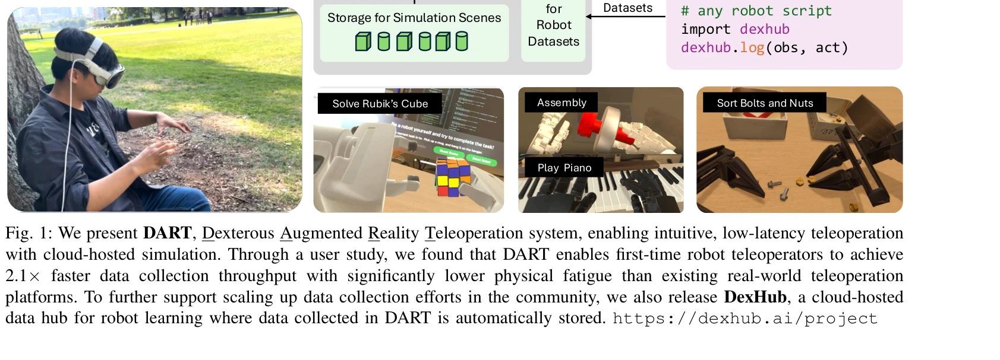

# DexHub and DART: Towards Internet Scale Robot Data Collection

> **저자**: Younghyo Park, Jagdeep Singh Bhatia, Lars Ankile, Pulkit Agrawal | **날짜**: 2024-11-04 | **URL**: [https://arxiv.org/abs/2411.02214](https://arxiv.org/abs/2411.02214)

---

## Essence

*Fig. 1: We present DART, Dexterous Augmented Reality Teleoperation system, enabling intuitive, low-latency teleoperation*

DART는 AR 기반 원격 조종 플랫폼으로 클라우드 시뮬레이션을 활용하여 로봇 데이터 수집을 대규모로 crowdsource 가능하게 하며, 수집된 데이터를 DexHub 클라우드 데이터베이스에 자동 저장한다.

## Motivation

- **Known**: 로봇 학습을 위한 대규모 데이터 수집 노력들이 존재하지만 실제 환경 설정, 하드웨어 요구사항, 반복적인 리셋으로 인해 확장성이 제한된다.
- **Gap**: 기존 데이터 수집 방식은 강한 물리적 피로, 낮은 처리량, 제한된 적용성을 보이며, 시뮬레이션 기반의 확장 가능한 crowdsourcing 솔루션이 부족하다.
- **Why**: 인터넷 규모의 다양하고 고품질 로봇 데이터는 일반화된 로봇 시스템 개발에 필수적이며, 효율적인 데이터 수집 플랫폼은 정책 학습의 성능과 강건성을 크게 향상시킨다.
- **Approach**: DART는 ARKit 기반의 손 추적, RealityKit를 통한 AR 렌더링, differential IK 기반 손 재타겟팅, 클라우드 기반 물리 엔진을 통합하여 직관적이고 저지연의 시뮬레이션 기반 원격 조종을 제공한다.

## Achievement

*Fig. 4: Data throughput comparison between DART and real-*

- **데이터 수집 효율성 증대**: 사용자 연구에서 DART가 실제 환경 원격 조종 대비 2.1배 빠른 데이터 수집 처리량을 달성
- **운영자 피로 감소**: 물리적·인지적 피로가 현저히 낮으며 버튼 클릭으로 환경 리셋 가능
- **현실 전이 성능**: DART로 수집한 데이터로 학습한 정책이 실제 로봇으로 성공적으로 전이되고 보이지 않은 시각적 방해에 강건함
- **커뮤니티 인프라 제공**: DexHub 클라우드 데이터베이스로 로봇 학습 데이터의 중앙집중식 저장소 및 공개 공유 플랫폼 구축

## How

*Fig. 1: We present DART, Dexterous Augmented Reality Teleoperation system, enabling intuitive, low-latency teleoperation*

- ARKit 기술로 사용자의 손 움직임을 실시간 추적하여 4개 손가락 키포인트 검출
- 차동 inverse kinematics (Differential IK)를 통해 사용자의 손 동작을 로봇 자유도로 재타겟팅
- RealityKit 기반의 고화질 AR 렌더링으로 시뮬레이션 장면의 시각적 피드백 제공
- 클라우드 호스팅된 물리 엔진과 시뮬레이션 장면 저장소로 네트워크 지연 최소화 및 무한 장면 확장 지원
- 클릭 기반 환경 리셋으로 물리적 리셋 제거
- 수집된 모든 데이터를 DexHub에 자동으로 로깅하는 통합 API 제공 (예: dexhub.log(obs, act))

## Originality

- AR 기반 시각적 피드백을 통한 저지연 원격 조종으로 기존 video streaming 방식의 네트워크 병목 극복
- simulation-to-reality transfer 와 함께 data augmentation/randomization의 이점을 활용하여 simulation 기반 정책이 real-world 정책보다 우수함을 실증
- 첫 번째로 완전히 접근 가능한 웹 기반 crowdsourcing 데이터 수집 플랫폼과 공개 데이터 허브의 통합 제공
- dexterous hand manipulation 과 bimanual task에 초점을 맞춘 대규모 데이터 수집 (기존 연구들의 parallel jaw gripper 편향 극복)

## Limitation & Further Study

- 현재 구현이 시뮬레이션 기반이므로 domain gap 여전히 존재할 가능성 (논문에서 visual disturbance robustness 보이지만 광범위한 실환경 변수 미검증)
- DexHub 데이터셋의 최종 공개 시기 및 규모가 명시되지 않았으며 'upon curation' 조건이 불명확함", 'AR 기반 추적의 정확도 한계 및 복잡한 손 포즈 (occlusion 등) 처리 능력 미평가
- 다양한 로봇 형태(bimanual, 다른 그리퍼)로의 확장 가능성은 제시되었으나 실제 구현 결과 미제시
- 후속 연구로는 더 복잡한 환경에서의 시뮬-현실 간극 최소화, reinforcement learning을 통한 수집 데이터 정제 자동화, 더 다양한 로봇 플랫폼 지원 등이 필요

## Evaluation

- Novelty: 4/5
- Technical Soundness: 3/5
- Significance: 4/5
- Clarity: 4/5
- Overall: 4/5

**총평**: DART와 DexHub는 로봇 데이터 수집의 확장성을 획기적으로 개선하는 실용적이고 우아한 솔루션으로, AR 기반 저지연 원격 조종과 클라우드 통합 데이터 허브의 조합을 통해 인터넷 규모의 로봇 학습 생태계 구축을 가능하게 한다.

## Related Papers

- 🏛 기반 연구: [[papers/1369_EgoDex_Learning_Dexterous_Manipulation_from_Large-Scale_Egoc/review]] — DART의 클라우드 기반 데이터 수집 플랫폼은 EgoDex가 보여준 대규모 egocentric 비디오 수집의 기술적 기반이 됩니다.
- 🔗 후속 연구: [[papers/1342_DexUMI_Using_Human_Hand_as_the_Universal_Manipulation_Interf/review]] — DexHub의 클라우드 데이터베이스는 UniDex의 대규모 로봇 중심 데이터셋 구축을 위한 인프라로 활용될 수 있습니다.
- 🔗 후속 연구: [[papers/1272_ARMADA_Augmented_Reality_for_Robot_Manipulation_and_Robot-Fr/review]] — 대규모 로봇 데이터 수집에서 AR 기반 robot-free 방법이 확장 적용된다
- 🏛 기반 연구: [[papers/1468_Humanoid_Manipulation_Interface_Humanoid_Whole-Body_Manipula/review]] — DexHub의 대규모 데이터 수집 개념이 HuMI의 휴대용 데이터 수집 시스템의 기반이 된다
