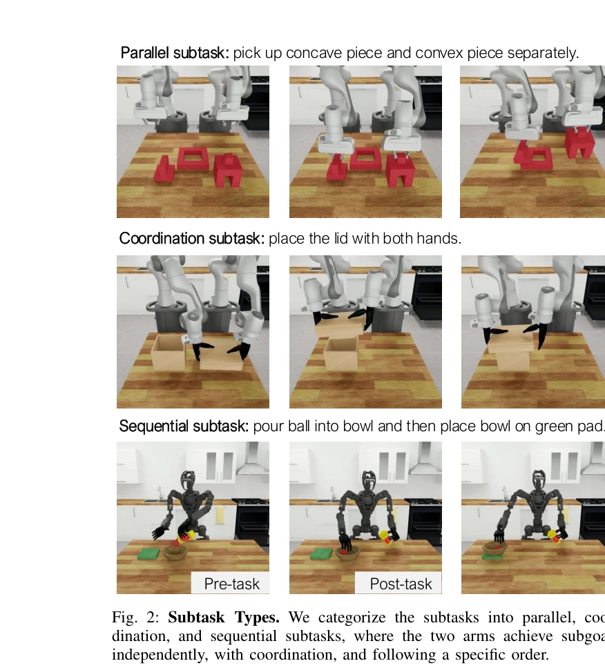

# DexMimicGen: Automated Data Generation for Bimanual Dexterous Manipulation via Imitation Learning

> **저자**: Zhenyu Jiang, Yuqi Xie, Kevin Lin, Zhenjia Xu, Weikang Wan, Ajay Mandlekar, Linxi Fan, Yuke Zhu | **날짜**: 2024-10-31 | **URL**: [https://arxiv.org/abs/2410.24185](https://arxiv.org/abs/2410.24185)

---

## Essence

*Fig. 1: DexMimicGen Overview. DexMimicGen offers an efficient pipeline*

DexMimicGen은 소수의 인간 시연으로부터 대규모의 시뮬레이션 데이터를 자동 생성하여 양손 민첩한 조작 로봇의 모방 학습을 가능하게 하는 시스템이다. 60개의 원본 시연으로부터 21K개의 데모를 생성하여 실제 로봇에 배포하는 완전한 파이프라인을 제시한다.

## Motivation

- **Known**: MimicGen은 단일 팔 로봇을 위한 자동 데이터 생성을 성공적으로 수행했다. 인간 시연을 통한 모방 학습은 로봇 조작 기술 학습의 효과적인 방법이나 데이터 수집이 병목이다.
- **Gap**: 양손 민첩 로봇은 동시에 두 팔과 다중 손가락을 제어해야 하므로 데이터 수집이 매우 어렵다. 기존 MimicGen은 단일 subtask 분할에 의존하여 양손 협력이 필요한 독립적, 상호종속적 동작을 처리하지 못한다.
- **Why**: 양손 인간형 로봇의 데이터 수집은 비용이 크고 인간 노력이 많이 소요되므로 자동화된 시뮬레이션 기반 데이터 생성이 실용적이고 확장 가능한 해결책이다.
- **Approach**: DexMimicGen은 유연한 팔별 subtask 분할 전략, 동기화 메커니즘, 순서 제약을 도입하여 parallel, coordination, sequential subtask를 처리한다. 시뮬레이션에서 생성된 궤적을 real-to-sim-to-real 파이프라인으로 실제 로봇에 배포한다.

## Achievement

*Fig. 1: DexMimicGen Overview. DexMimicGen offers an efficient pipeline*

- **자동 데이터 생성 시스템**: 60개의 인간 시연으로부터 21K개의 데모를 생성하는 대규모 자동화 시스템 구현
- **다중 coordination 타입 지원**: parallel, coordination, sequential subtask를 처리하는 팔별 asynchronous 실행, 동기화, 순서 제약 메커니즘 도입
- **종합 시뮬레이션 환경**: 세 가지 구현 타입에 걸친 9개의 조작 과제 제공
- **실제 배포 성공**: 실제 can-sorting 과제에서 0%에서 90% 성공률로 달성
- **공개 자원**: 생성된 데이터셋, 시뮬레이션 환경, 결과를 공개하여 연구 접근성 향상

## How

*Fig. 2: Subtask Types. We categorize the subtasks into parallel, coor-*

- 원본 인간 시연을 각 팔에 대해 분할하여 object-centric subtask로 변환
- 각 subtask를 병렬(parallel), 협력(coordination), 순차(sequential)로 분류
- parallel subtask: 각 팔이 독립적으로 실행하는 pose 변환
- coordination subtask: 동기화 메커니즘으로 두 팔의 정확한 정렬 보장
- sequential subtask: 순서 제약으로 특정 순서 강제
- 시뮬레이션에서 open-loop 실행으로 궤적 재생 및 성공 여부 검증
- Behavioral Cloning을 사용하여 생성된 궤적으로부터 정책 학습
- 학습된 정책을 실제 로봇에 배포 및 visuomotor 제어

## Originality

- MimicGen을 양손 민첩 조작으로 확장하여 기존 기술의 한계 극복
- 팔별 asynchronous subtask 분할이라는 새로운 접근법으로 다양한 협력 형태 동시 처리
- 동기화 및 순서 제약이라는 명시적 메커니즘으로 multi-arm coordination 문제 해결
- real-to-sim-to-real 완전 파이프라인 구현 및 실제 로봇 검증
- 대규모 공개 데이터셋과 시뮬레이션 환경 제공으로 분야 기여

## Limitation & Further Study

- Assumption A1-A3에 의존하여 일반화 가능성 제한 (object 포즈 사전 관찰 필요)
- subtask 분할이 human annotation 또는 heuristic에 의존하여 자동화 정도 미흡
- 시뮬레이션-실제 간의 sim-to-real 격차(시뮬레이션 기반 정책의 실제 성능 저하 가능성) 미포함
- 특정 embodiment 타입(9개 과제)에 국한되어 새로운 구현 형태 적응성 미지수
- 생성된 21K 데모의 다양성과 분포가 실제 과제 변동성을 충분히 커버하는지 미분석
- 후속 연구로 자동 subtask 분할, 더욱 정교한 sim-to-real transfer 기법, 다양한 로봇 embodiment에 대한 확장이 필요

## Evaluation

- Novelty: 4/5
- Technical Soundness: 3/5
- Significance: 4/5
- Clarity: 4/5
- Overall: 4/5

**총평**: DexMimicGen은 양손 민첩 로봇 데이터 수집의 실질적 병목을 자동화된 시뮬레이션 기반 생성으로 해결하며, 다양한 multi-arm coordination 형태를 체계적으로 처리하는 혁신적 접근법을 제시한다. 실제 로봇 배포 성공과 공개된 자원을 통해 높은 실용성과 연구 기여도를 입증한다.

## Related Papers

- 🔄 다른 접근: [[papers/1369_EgoDex_Learning_Dexterous_Manipulation_from_Large-Scale_Egoc/review]] — DexMimicGen의 시뮬레이션 기반 자동 데이터 생성과 EgoDex의 실제 인간 행동 수집은 bimanual manipulation 데이터 확보를 위한 상호 보완적 접근법입니다.
- 🔗 후속 연구: [[papers/1373_EgoVLA_Learning_Vision-Language-Action_Models_from_Egocentri/review]] — DexMimicGen으로 생성된 대규모 양손 조작 데이터는 EgoVLA의 Vision-Language-Action 모델 학습에 풍부한 훈련 소스를 제공합니다.
- 🔗 후속 연구: [[papers/1290_BiCoord_장기간_시공간_협응_양팔_조작_벤치마크/review]] — 양손 정교한 조작 데이터 생성에서 BiCoord의 협응 벤치마크가 확장 적용된다
- 🔗 후속 연구: [[papers/1515_Phantom_Training_Robots_Without_Robots_Using_Only_Human_Vide/review]] — 인간 비디오만으로 로봇 정책을 학습하는 Phantom 방식을 데이터 생성 관점에서 확장한 DexMimicGen과 공통된 접근법을 갖는다.
- 🔗 후속 연구: [[papers/1480_HumanoidGen_Data_Generation_for_Bimanual_Dexterous_Manipulat/review]] — DexMimicGen의 양팔 데이터 생성을 휴머노이드 전신으로 확장했다
