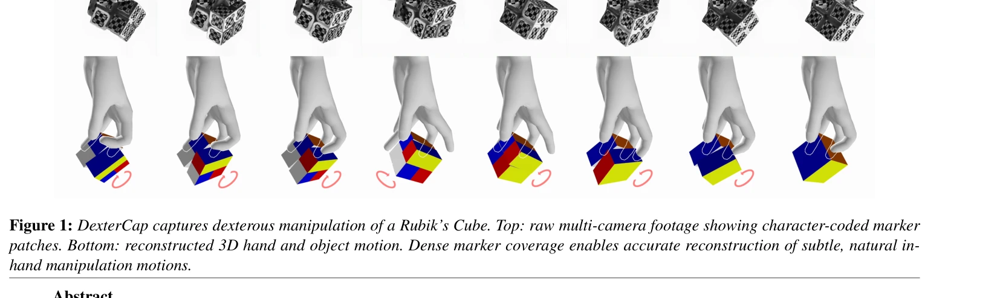
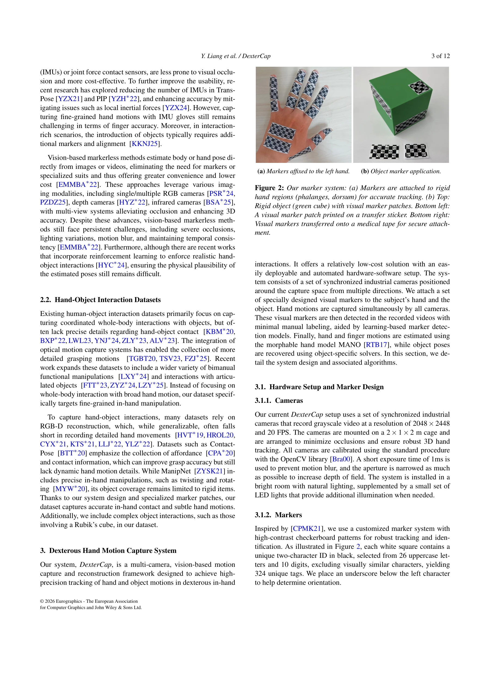
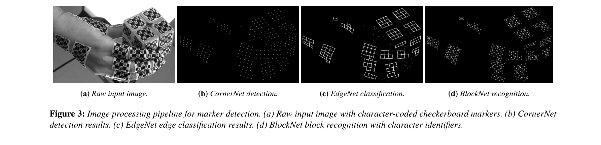

# DexterCap: An Affordable and Automated System for Capturing Dexterous Hand-Object Manipulation

> **저자**: Yutong Liang, Shiyi Xu, Yulong Zhang, Bowen Zhan, He Zhang, Libin Liu | **날짜**: 2026-01-09 | **URL**: [https://arxiv.org/abs/2601.05844](https://arxiv.org/abs/2601.05844)

---

## Essence

*Figure 1: DexterCap captures dexterous manipulation of a Rubik’s Cube. Top: raw multi-camera footage showing character-c*

DexterCap는 character-coded marker patches를 사용하여 손가락의 심각한 자체-폐색 문제를 해결하면서도 저비용으로 정교한 손-물체 조작을 포착하는 광학 모션캡처 시스템이다. 자동화된 재구성 파이프라인과 함께 다양한 조작 행동을 포함하는 DexterHand 데이터셋을 제공한다.

## Motivation

- **Known**: 기존 marker-based optical 시스템(Qualisys, Vicon)은 높은 정확도를 제공하지만 비용이 크고 자체-폐색으로 인한 광범위한 수동 후처리가 필요하다. Vision-based markerless 방법은 저비용이지만 손가락의 정교한 움직임 포착에서 정확도와 견고성이 부족하다.
- **Gap**: 기존 손-물체 상호작용 데이터셋은 단순한 grasp와 이동 또는 간단한 articulated 객체에 집중하며, 복잡한 in-hand manipulation의 세밀한 세부사항을 포착하는 확장 가능한 저비용 시스템이 부재하다.
- **Why**: 손의 정교한 조작 포착은 로보틱스, 애니메이션, 인간-컴퓨터 상호작용 등 다양한 분야에서 중요하며, 저비용이면서도 높은 정확도를 갖춘 확장 가능한 시스템은 대규모 고품질 데이터셋 수집을 가능하게 한다.
- **Approach**: Dense character-coded marker patches와 three-stage marker detection 파이프라인(marker detection → edge detection → tag identification)을 결합하여 폐색 견고성을 확보하고, MANO morphable hand model과 robust calibration 및 solving 절차로 정확한 hand-object pose 재구성을 달성한다.

## Achievement

*Figure 2: Our marker system: (a) Markers are attached to rigid*

- **저비용 optical capture 시스템**: 기존의 고가 professional-grade 시스템 대비 훨씬 저렴한 하드웨어 구성으로도 높은 정확도 달성
- **자동화된 처리 파이프라인**: 일회성 camera calibration 및 MANO shape estimation 후 최소한의 수동 개입으로 fully automatic solving 가능
- **DexterHand 데이터셋**: 단순한 primitive shapes부터 Rubik's Cube 같은 복잡한 articulated objects까지 포함하는 fine-grained in-hand manipulation 데이터셋 공개", '**강화된 폐색 견고성**: Dense marker coverage를 통해 severe self-occlusion 상황에서도 robust tracking 달성
- **확장성**: 누적된 이전 capture 데이터로부터 학습한 모델의 일반화로 후속 capture의 labeling 작업 최소화

## How

*Figure 3: Image processing pipeline for marker detection. (a) Raw input image with character-coded checkerboard markers.*

- Character-coded marker patches를 손과 객체에 부착하여 각 마커의 고유 ID를 인코딩
- Three-stage cascade 구조의 deep learning 기반 image processing model: 먼저 marker center detection, 이후 marker edge detection으로 정확한 경계 파악, 마지막으로 character code 해독으로 ID 인식
- Multi-scale에 걸친 robust marker 인식을 위해 카메라를 손 근처에 배치하되 depth of field 및 hand scale 변화 문제를 해결
- MANO morphable hand model을 사용하여 부분적으로 occluded된 marker 데이터로부터 hand pose 복원
- Calibration 및 solving 절차를 통해 marker 손실 패턴을 고려한 robust reconstruction
- Rigid 객체에 추가 마커를 부착하고 hand-object interaction의 physical plausibility 확보
- Articulated objects(Rubik's Cube 등)로 확장 가능한 설계

## Originality

- Character-coded marker patches의 사용으로 homogeneous marker의 shifting/mislabeling 문제 해결
- Vision-based approach [CPMK21]를 손-물체 상호작용 도메인에 처음 적용하면서 multi-jointed articulated objects 지원으로 확장
- Three-stage cascade 마커 탐지 모델로 손의 resolution 제약과 scale variation 문제를 동시에 해결
- MANO 모델 기반의 robust calibration 및 incomplete marker data로부터의 pose 복원 방법론
- 자동화 정도를 높여 minimal labeling으로 scalable dataset collection 가능하게 함

## Limitation & Further Study

- 초기 새로운 환경에서 image processing model 학습을 위한 소량의 manual labeling 필요 (완전 자동화는 아님)
- 마커 패치의 부착 위치와 밀도가 capture 품질에 영향을 미치므로 신중한 design 필요
- Articulated objects의 경우 여전히 complex multi-jointed objects로의 확장에 제약이 있을 수 있음
- Depth of field 제약으로 인한 카메라 근거리 배치로 포착 범위 제한 가능
- Real-time processing 능력에 대한 언급 부재로 실시간 응용에의 적용성 미불명
- 후속 연구 방향: 더 다양한 복잡한 articulated objects 지원, self-supervised learning으로 labeling 필요성 제거, real-time processing 최적화

## Evaluation

- Novelty: 4/5
- Technical Soundness: 4/5
- Significance: 4/5
- Clarity: 4/5
- Overall: 4/5

**총평**: DexterCap는 character-coded marker와 automated processing pipeline의 조합으로 저비용이면서도 높은 정확도의 손-물체 조작 포착 시스템을 제시하며, DexterHand 데이터셋 공개로 향후 dexterous manipulation 연구에 실질적 기여를 할 것으로 기대된다.

## Related Papers

- 🏛 기반 연구: [[papers/1305_ClimbingCap_Multi-Modal_Dataset_and_Method_for_Rock_Climbing/review]] — 복잡한 동작 캡처 시스템의 기술적 기반과 방법론을 제공한다
- 🧪 응용 사례: [[papers/1429_GraspSense_언어_기반_인지와_힘_맵을_활용한_손재주_로봇_파지_계획/review]] — 정밀한 손가락 움직임 캡처가 로봇 파지 제어에 직접 활용된다
- 🔗 후속 연구: [[papers/1335_Code-as-Monitor_Constraint-aware_Visual_Programming_for_Reac/review]] — mocap 데이터 수집을 더 확장 가능하고 포터블한 시스템으로 발전시켰다
- 🔗 후속 연구: [[papers/1305_ClimbingCap_Multi-Modal_Dataset_and_Method_for_Rock_Climbing/review]] — 손가락 동작 캡처를 전신 복잡 동작 캡처로 확장한 기술적 발전이다
- 🔗 후속 연구: [[papers/1355_DexGarmentLab_Dexterous_Garment_Manipulation_Environment_wit/review]] — 정밀한 손가락 조작 캡처 기술을 의류 조작이라는 복잡한 태스크에 적용한다
- 🧪 응용 사례: [[papers/1429_GraspSense_언어_기반_인지와_힘_맵을_활용한_손재주_로봇_파지_계획/review]] — 정밀한 손가락 동작 캡처가 dexterous grasping 계획에 직접 활용된다
