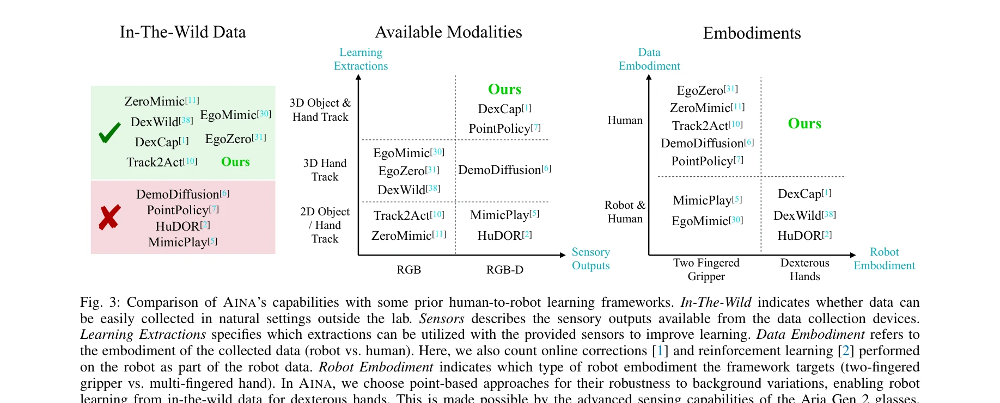

# Dexterity from Smart Lenses: Multi-Fingered Robot Manipulation with In-the-Wild Human Demonstrations

> **저자**: Irmak Guzey, Haozhi Qi, Julen Urain, Changhao Wang, Jessica Yin, Krishna Bodduluri, Mike Lambeta, Lerrel Pinto, Akshara Rai, Jitendra Malik, Tingfan Wu, Akash Sharma, Homanga Bharadhwaj | **날짜**: 2025-11-20 | **URL**: [https://arxiv.org/abs/2511.16661](https://arxiv.org/abs/2511.16661)

---

## Essence

*Fig. 1: AINA is a framework for learning multi-fingered policies from in-the-wild human data collected with smart glasse*

Aria Gen 2 스마트 글래스를 이용해 일상 환경에서 수집한 인간 시연 영상만으로 다중 손가락 로봇 조작 정책을 학습하는 AINA 프레임워크를 제안한다. 로봇 데이터나 시뮬레이션 없이도 9개의 일상 조작 작업에서 정책을 성공적으로 배포할 수 있다.

## Motivation

- **Known**: 인간 비디오에서 로봇 조작을 학습하려는 시도는 존재했으나, 구조화된 환경 수집은 확장성이 떨어지고 웹 비디오는 3D 손 포즈 같은 신뢰할 수 있는 주석을 얻기 어렵다. 또한 기존 방법들은 주로 2손가락 그리퍼에만 성공했다.
- **Gap**: 다중 손가락 손에 대해 in-the-wild 인간 데이터로부터 신뢰할 수 있는 3D 주석을 추출하고, 로봇 데이터 없이도 일반화 가능한 정책을 학습하는 방법이 부족하다.
- **Why**: 로봇 데이터 수집의 노동 집약성을 감소시키고 스케일 가능한 인간-로봇 정책 전이를 달성함으로써 실제 환경에서 범용 로봇 조작으로의 진전을 의미한다.
- **Approach**: Aria Gen 2의 고해상도 RGB, 온보드 3D 손 포즈, 스테레오 깊이 추정 능력을 활용하여 인간 시연을 3D 키포인트와 물체 포인트클라우드로 변환하고, 3D point-based 정책 학습 방식으로 배경 변화에 강건한 폐루프 정책을 학습한다.

## Achievement

*Fig. 3: Comparison of AINA’s capabilities with some prior human-to-robot learning frameworks. In-The-Wild indicates whet*

- **로봇 데이터 제거**: 시뮬레이션, 온라인 수정, 강화학습 없이도 다중 손가락 손 정책을 학습할 수 있는 첫 프레임워크
- **스케일 가능한 데이터 수집**: 누구나, 어디서나, 어떤 배경에서든 15분 정도의 인간 영상 수집으로 충분
- **우수한 성능**: 기존 human-to-robot 학습 방법들을 능가하는 결과를 9개 일상 작업에서 달성
- **배경 견고성**: 3D point-based 접근으로 배경 변화에 강건한 정책 학습

## How

*Fig. 4: Illustration of our overall AINA framework. On the left, we show how the data is processed: the human hand pose *

- Aria Gen 2 글래스로 임의 환경에서 인간 시연 수집 (고해상도 RGB, on-board 3D hand pose, stereo depth)
- FoundationStereo를 이용한 깊이 추정과 2D object tracking으로 물체 포인트클라우드 추출
- 손 키포인트와 물체 포인트를 입력으로 하는 Vector Neuron MLP 기반 point-based policy 학습
- Transformer Encoder와 positional encoding을 활용한 미래 손 키포인트 예측
- 예측된 키포인트로부터 역운동학(IK)을 통해 로봇 관절 각도 생성
- 로봇 배포 환경에서 단일 시연으로 적응

## Originality

- 다중 손가락 손에 대해 순수 인간 데이터만으로 정책을 학습하는 새로운 패러다임 제시
- 스마트 글래스의 고급 센싱 능력(on-board hand pose, stereo depth)을 활용한 신선한 접근
- 3D point cloud와 hand keypoint 기반 표현으로 human-robot embodiment gap을 직접 해결
- 구조화된 환경과 in-the-wild 환경의 장점을 결합한 스마트 글래스 중심의 설계

## Limitation & Further Study

- 단일 로봇 플랫폼(다중 손가락 손)에서만 평가되었으며, 다른 로봇 형태로의 일반화 미검증
- Aria Gen 2의 고가 및 접근성 제약이 광범위한 채택을 어렵게 함
- 9개 작업이 상대적으로 제한적이며, 더 복잡한 조작이나 양손 조작에 대한 미검증
- 손-물체 상호작용이 복잡한 작업이나 폐색(occlusion) 상황에서의 성능 미확인
- 후속 연구는 다른 센서/글래스로의 확장, 더 복잡한 시나리오 평가, 다중 로봇 플랫폼 지원에 중점을 두어야 함

## Evaluation

- Novelty: 4/5
- Technical Soundness: 3/5
- Significance: 4/5
- Clarity: 4/5
- Overall: 4/5

**총평**: 로봇 데이터 완전 제거라는 야심찬 목표를 스마트 글래스의 센싱 능력으로 달성한 혁신적 연구로, 다중 손가락 조작 학습의 새로운 방향을 제시한다. 평가 범위와 일반화 가능성 확인이 향후 과제이나, 실용적이고 확장 가능한 프레임워크라는 점에서 높은 가치를 지닌다.

## Related Papers

- 🔄 다른 접근: [[papers/1372_DROID_A_Large-Scale_In-The-Wild_Robot_Manipulation_Dataset/review]] — 인간 시연 데이터 수집에서 스마트 글래스 기반 접근과 대규모 다양성 기반 접근의 차이점 분석
- 🏛 기반 연구: [[papers/1348_Data_Scaling_Laws_in_Imitation_Learning_for_Robotic_Manipula/review]] — 스마트 글래스 영상만으로 정책 학습하는 데 필요한 데이터 효율성과 다양성의 스케일링 법칙
