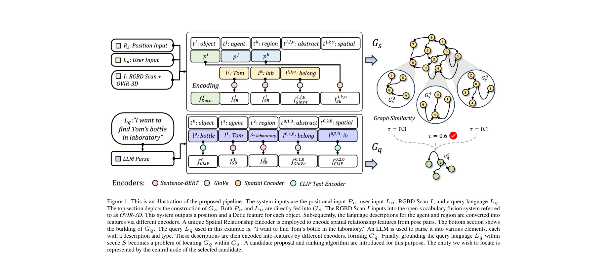
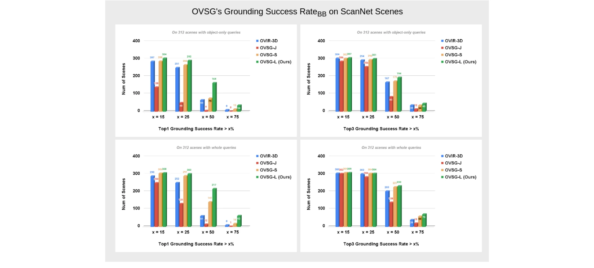

# Context-Aware Entity Grounding with Open-Vocabulary 3D Scene Graphs

> **저자**: Haonan Chang, Kowndinya Boyalakuntla, Shiyang Lu, Siwei Cai, Eric Jing, Shreesh Keskar, Shijie Geng, Adeeb Abbas, Lifeng Zhou, Kostas Bekris, Abdeslam Boularias | **날짜**: 2023-09-27 | **URL**: [https://arxiv.org/abs/2309.15940](https://arxiv.org/abs/2309.15940)

---

## Essence

*Figure 1: This is an illustration of the proposed pipeline. The system inputs are the positional input Pu, user input Lu*

Open-Vocabulary 3D Scene Graph (OVSG)는 자유형식 텍스트 쿼리를 통해 객체, 에이전트, 영역 등 다양한 엔티티를 문맥 인식적으로 localize하는 프레임워크이다. 기존의 고정된 시맨틱 레이블 기반 방식과 달리, 미리 정의되지 않은 카테고리와 관계도 처리할 수 있다.

## Motivation

- **Known**: 3D scene graph는 노드와 엣지로 객체와 그들의 관계를 표현하는 효과적인 방식이고, CLIP 등의 vision-language 모델을 통한 open-vocabulary 감지 기술이 발전했다.
- **Gap**: 기존 3D scene graph 연구들은 미리 정의된 카테고리, 관계, 속성에만 의존하므로 미지의 시맨틱 개념을 처리할 수 없고, 자유형식 자연어 쿼리를 지원하지 않는다.
- **Why**: 로봇의 실제 환경 배포를 위해서는 사용자의 자연스러운 문맥 기반 지시(예: '누군가 앉아있는 소파')를 이해하고 정확히 엔티티를 localize할 수 있어야 한다.
- **Approach**: OVIR-3D 기반 open-vocabulary 감지, LLM을 통한 쿼리 파싱, 그리고 Spatial Relationship Encoder를 포함한 graph matching 알고리즘으로 scene graph와 query graph를 비교한다.

## Achievement

*Figure 5: Performance of OVSG w.r.t Grounding Success RateBB on ScanNet Scenes*

- **새로운 데이터셋**: 8개 시나리오와 4,000개 언어 쿼리를 포함한 DOVE-G 데이터셋 구축
- **성능 우월성**: ScanNet 및 자체 수집 데이터셋에서 기존 semantic-based localization 기법보다 현저히 향상된 성능 달성
- **실세계 적용**: 로봇 네비게이션 및 조작 작업에서 OVSG의 실용성 입증
- **Open-vocabulary 역량**: 미리 정의되지 않은 객체 카테고리와 관계도 처리 가능함을 실험으로 증명

## How

*Figure 1: This is an illustration of the proposed pipeline. The system inputs are the positional input Pu, user input Lu*

- OVIR-3D를 사용하여 RGB-D 스캔에서 open-vocabulary 객체 인스턴스 감지 및 3D fusion 수행
- 노드의 타입(객체, 에이전트, 영역)에 따라 다른 인코더(Detic, Sentence-BERT, 공간 관계 인코더) 적용
- LLM으로 자연어 쿼리를 파싱하여 query graph Gq 구성
- Scene graph Gs와 query graph Gq 간의 subgraph matching을 거리 메트릭과 후보 제안 및 랭킹 알고리즘으로 수행
- 공간 관계는 Spatial Relationship Predictor (SRP)로 특별 처리하여 비선형 공간 언어 현상 모델링

## Originality

- 3D scene graph에 open-vocabulary semantics을 통합한 최초 접근
- 이산 레이블 대신 continuous semantic feature를 사용하여 미지의 개념 처리 가능
- LLM 기반 쿼리 파싱과 graph matching을 결합한 novel architecture
- 공간 언어의 비선형 특성을 모델링하는 Spatial Relationship Encoder 제안

## Limitation & Further Study

- scene reconstruction 품질에 의존하므로 부정확한 3D geometry가 성능을 제한할 수 있음
- LLM 파싱 단계에서 복잡한 쿼리 해석 오류 가능성
- 계산 복잡도: 큰 scale scene에서 graph matching 비용 증가 가능
- 후속 연구로 동적 환경에서의 scene graph 업데이트, 더 복잡한 관계 표현, 다중 언어 지원 필요

## Evaluation

- Novelty: 4/5
- Technical Soundness: 3/5
- Significance: 4/5
- Clarity: 4/5
- Overall: 4/5

**총평**: OVSG는 open-vocabulary 능력을 3D scene graph에 통합하여 로봇이 자연스러운 문맥 기반 지시를 이해할 수 있도록 한 의미 있는 기여이다. 실제 로봇 실험과 새로운 데이터셋을 통해 실용성을 입증했으나, scene reconstruction 정확도와 확장성 측면에서 개선의 여지가 있다.

## Related Papers

- 🔄 다른 접근: [[papers/1345_CoWs_on_Pasture_Baselines_and_Benchmarks_for_Language-Driven/review]] — CoWs on Pasture는 OVSG와 유사한 오픈 어휘 장면 탐색이지만 CLIP 기반의 학습 없는 방법을 사용한다
- 🔗 후속 연구: [[papers/1505_Open-vocabulary_Queryable_Scene_Representations_for_Real_Wor/review]] — Open-vocabulary Queryable Scene Representations는 OVSG의 개념을 실제 로봇 응용을 위한 쿼리 가능한 장면 표현으로 확장한다
- 🏛 기반 연구: [[papers/1561_SayPlan_Grounding_Large_Language_Models_using_3D_Scene_Graph/review]] — SayPlan은 OVSG의 3D 장면 그래프를 대규모 언어 모델과 결합하는 기반을 제공한다
- 🧪 응용 사례: [[papers/1505_Open-vocabulary_Queryable_Scene_Representations_for_Real_Wor/review]] — Context-Aware Entity Grounding이 NLMap의 개방형 어휘 장면 표현을 실제 로봇 조작 환경에서 활용하는 구체적 응용 사례이다.
- 🏛 기반 연구: [[papers/1506_Open-World_Object_Manipulation_using_Pre-trained_Vision-Lang/review]] — Open-vocabulary 3D scene grounding이 pre-trained VLM을 활용한 물체 조작의 이론적 기반을 제공한다.
- 🏛 기반 연구: [[papers/1597_UniAff_A_Unified_Representation_of_Affordances_for_Tool_Usag/review]] — UniAff의 affordance 기반 조작이 Context-Aware Entity Grounding의 3D scene understanding을 기반으로 더 정확한 spatial reasoning을 수행
- 🔄 다른 접근: [[papers/1345_CoWs_on_Pasture_Baselines_and_Benchmarks_for_Language-Driven/review]] — OVSG는 CoWs보다 더 정교한 문맥 인식 엔티티 그라운딩을 제공하지만 둘 다 오픈 어휘 장면 네비게이션을 다룬다
- 🧪 응용 사례: [[papers/1469_Humanoid_Occupancy_Enabling_A_Generalized_Multimodal_Occupan/review]] — 오픈 어휘 3D 장면 그래프가 멀티모달 occupancy 인식에서 의미론적 정보를 통합하는 데 활용됩니다.
- 🔄 다른 접근: [[papers/1544_Learning_to_Look_Seeking_Information_for_Decision_Making_via/review]] — 환경 정보 탐색에서 DISaM의 factorized MDP 방식과 Context-Aware Entity Grounding의 3D 장면 이해 방식을 비교할 수 있다.
