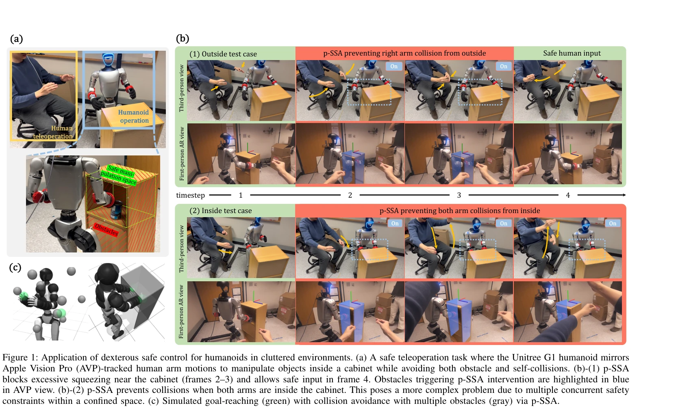
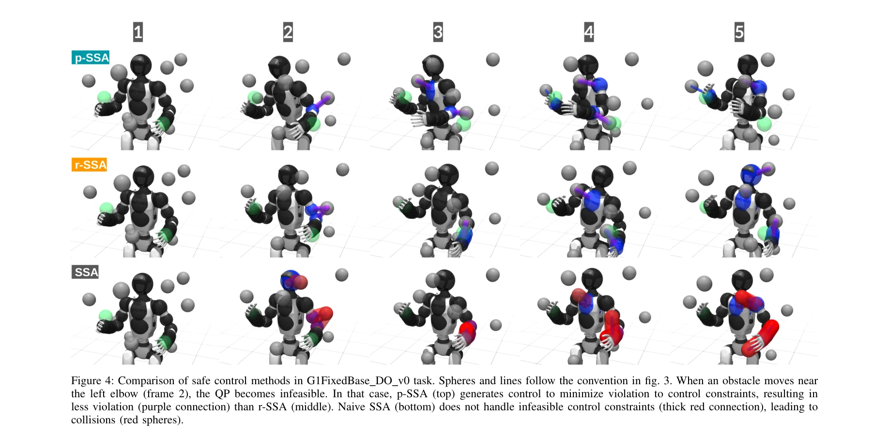
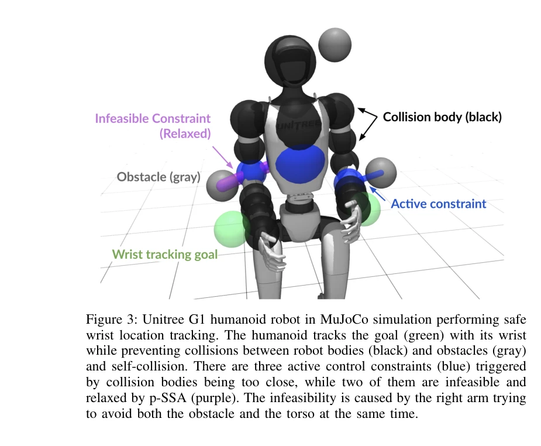

# Dexterous Safe Control for Humanoids in Cluttered Environments via Projected Safe Set Algorithm

> **저자**: Rui Chen, Yifan Sun, Changliu Liu | **날짜**: 2025-02-05 | **URL**: [https://arxiv.org/abs/2502.02858](https://arxiv.org/abs/2502.02858)

---

## Essence

*Figure 1: Application of dexterous safe control for humanoids in cluttered environments. (a) A safe teleoperation task w*

본 논문은 복잡한 환경에서 휴머노이드 로봇의 팔다리 수준의 기하학적 제약을 고려한 섬세한 안전 제어(dexterous safety)를 위해 Projected Safe Set Algorithm (p-SSA)을 제안한다. 이 방법은 충돌 회피 제약들의 충돌을 최소한의 안전 위반으로 완화하여 실행 가능한 제어를 보장한다.

## Motivation

- **Known**: 기존 안전 제어 방법들(SSA, CBF, HJ reachability)은 단일 에너지 함수로 단순한 기하학 모델링과 희소 장애물 환경에서는 효과적이다. 하지만 다중 신체 모델과 밀집된 장애물 환경에서의 안전 제어 문제는 미해결 상태이다.
- **Gap**: 다중 신체 로봇이 밀집된 환경에서 여러 충돌을 동시에 처리할 때, 단일 에너지 함수로는 불가능하며 다중 제약 QP가 자주 실행 불가능해진다. 기존 방법들은 고차원 문제(29-DoF, 200+ 제약)에서 호환성 있는 다중 에너지 함수를 합성할 수 없다.
- **Why**: 휴머노이드 로봇의 실제 배치에서 안전성과 성능을 동시에 보장하는 것이 중요하며, 특히 의료·제조·서비스 로봇이 복잡한 환경에서 근접 작업을 수행할 때 필수적이다.
- **Approach**: p-SSA는 고전 safe control 알고리즘을 다중 제약 케이스로 확장하여, 충돌하는 제약들을 원칙적으로 완화하고 가중 슬랙 정규화를 통해 안전 위반을 최소화한다. 분리된 최적화를 통해 매개변수 튜닝 없이 작동한다.

## Achievement

*Figure 4: Comparison of safe control methods in G1FixedBase DO v0 task. Spheres and lines follow the convention in fig. *

- **dexterous safety 문제 정의**: 다중 신체 로봇의 팔다리 수준 기하학적 제약과 밀집 장애물 환경에서의 안전 제어 문제를 체계적으로 분석하고 다중 제약 QP 실행 불가능성의 근본 원인 규명
- **p-SSA 알고리즘 개발**: 다중 충돌 쌍에 대한 에너지 함수 설계 및 제약 완화 최적화를 통해 고차원 문제(29-DoF, 200+ 제약)에서도 실행 가능한 제어 계산
- **하드웨어 검증**: Unitree G1 휴머노이드 로봇에서 복잡한 충돌 회피 작업(캐비닛 내부 조작, 자기 충돌 방지)을 성공적으로 수행하며 최소한의 안전 위반 달성
- **영점 매개변수 튜닝 일반화**: 시뮬레이션과 실제 로봇 환경에서 다양한 작업에 직접 적용 가능하며 추가 매개변수 조정이 불필요

## How

*Figure 3: Unitree G1 humanoid robot in MuJoCo simulation performing safe*

- 각 잠재적 충돌 쌍(로봇 링크-장애물, 로봇 링크-로봇 링크)에 대해 독립적인 에너지 함수 설계
- 에너지 함수로부터 선형 제어 제약을 도출하여 다중 제약 QP 구성
- QP가 실행 불가능할 때 가중 슬랙 변수를 도입한 Relaxed SSA (r-SSA)로 제약 완화
- Projected SSA (p-SSA)에서는 실행 가능성과 작업 목표를 분리된 최적화 단계로 해결하여 자동 매개변수 선택
- MuJoCo 시뮬레이션 환경과 실제 Unitree G1 플랫폼에서 다양한 collision avoidance 시나리오 평가

## Originality

- 다중 신체-다중 장애물 시나리오에서 dexterous safety라는 새로운 문제 공식화 및 분류
- 고차원 다중 제약 QP의 실행 불가능성을 체계적으로 분석하고 원칙적인 완화 전략 제시
- 기존 SSA/CBF와 달리 수백 개의 제약을 다루면서도 실시간으로 작동하는 확장 알고리즘 개발
- 매개변수 튜닝 없이 일반화되는 safe control 방법의 실현 (기존 방법들은 문제별 세밀 조정 필요)

## Limitation & Further Study

- 이론적 안전 보장(forward invariance) 부재 - p-SSA는 안전 위반을 최소화하지만 완전 제거 불가
- 제약 완화 방식이 启발적(heuristic) 특성을 가지며, 최악의 경우 성능 저하 가능성
- 실험이 단일 로봇 플랫폼(Unitree G1)에 국한되어 다른 휴머노이드 형태에 대한 검증 부재
- 고속 동적 환경이나 변하는 장애물 분포에서의 적응성 미검증
- 후속 연구: (1) 이론적 안전 보장을 제공하는 에너지 함수 합성 방법 개발, (2) 다양한 휴머노이드 형태에 대한 일반화, (3) 동적 환경과의 상호작용 강화

## Evaluation

- Novelty: 4/5
- Technical Soundness: 3/5
- Significance: 4/5
- Clarity: 4/5
- Overall: 4/5

**총평**: 본 논문은 휴머노이드 로봇의 현실적 안전 제어 문제를 명확히 정의하고 실용적이면서도 체계적인 해결책을 제시한다. 이론적 완전성은 부족하나 실제 하드웨어 검증과 매개변수 없는 일반화라는 점에서 실무적 기여도가 높다.

## Related Papers

- 🏛 기반 연구: [[papers/1312_Collision-Free_Humanoid_Traversal_in_Cluttered_Indoor_Scenes/review]] — 섬세한 안전 제어에 복잡한 환경에서의 충돌 회피 기법을 활용한다
- 🔗 후속 연구: [[papers/1424_Geometry-Aware_Predictive_Safety_Filters_on_Humanoids_From_P/review]] — 기하학적 제약을 예측 기반 안전 필터로 확장하여 더 안전한 제어를 달성한다
- 🧪 응용 사례: [[papers/1273_ARMOR_Egocentric_Perception_for_Humanoid_Robot_Collision_Avo/review]] — 충돌 회피 인지 시스템에 p-SSA의 섬세한 안전 제어를 적용한다
- 🔗 후속 연구: [[papers/1312_Collision-Free_Humanoid_Traversal_in_Cluttered_Indoor_Scenes/review]] — 복잡한 환경에서의 충돌 회피를 더 정교한 섬세한 안전 제어로 확장한다
- 🔄 다른 접근: [[papers/1383_End-to-End_Humanoid_Robot_Safe_and_Comfortable_Locomotion_Po/review]] — 둘 다 동적 환경에서의 안전 제어를 다루지만 전자는 end-to-end 학습, 후자는 dexterous한 안전 제어에 중점을 둔다.
- 🔄 다른 접근: [[papers/1424_Geometry-Aware_Predictive_Safety_Filters_on_Humanoids_From_P/review]] — 둘 다 안전한 humanoid 제어를 다루지만 전자는 기하학적 예측 필터링, 후자는 dexterous한 환경 내 안전 제어에 집중한다.
