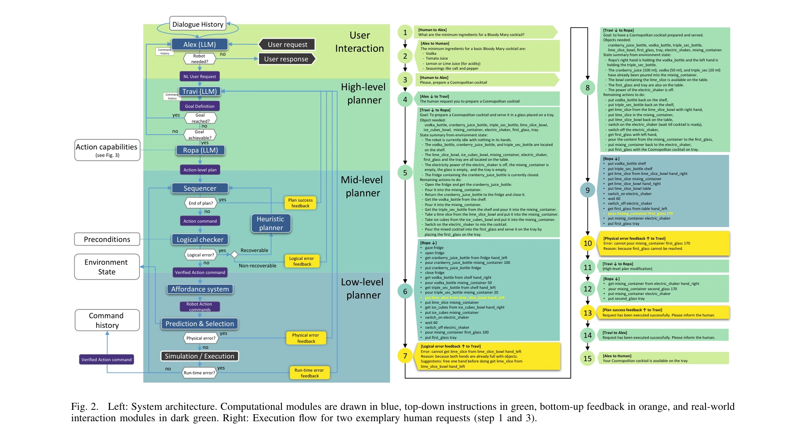
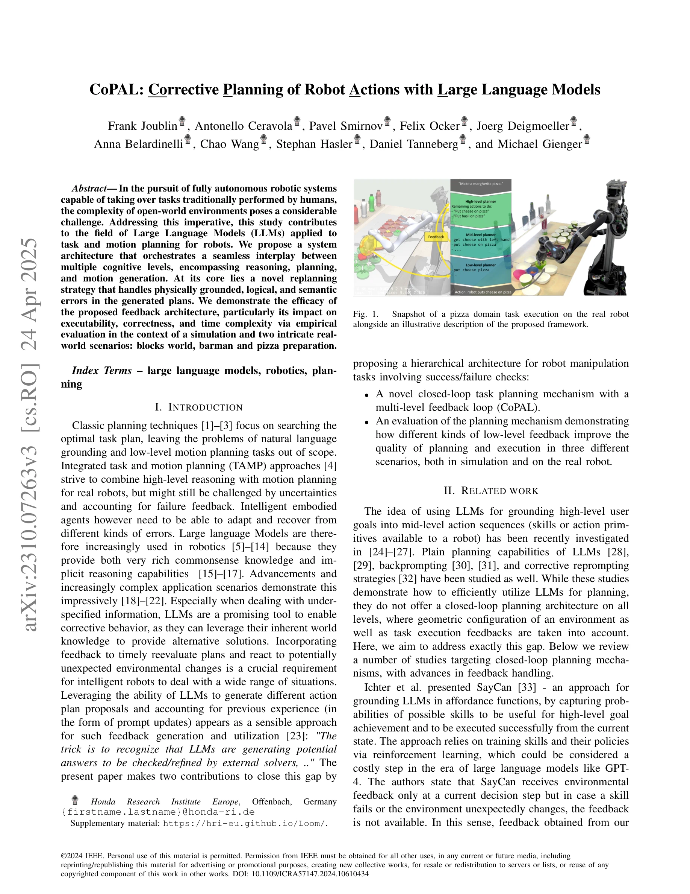

# CoPAL: Corrective Planning of Robot Actions with Large Language Models

> **저자**: Frank Joublin, Antonello Ceravola, Pavel Smirnov, Felix Ocker, Joerg Deigmoeller, Anna Belardinelli, Chao Wang, Stephan Hasler, Daniel Tanneberg, Michael Gienger | **날짜**: 2023-10-11 | **URL**: [https://arxiv.org/abs/2310.07263](https://arxiv.org/abs/2310.07263)

---

## Essence

*Fig. 2.*

CoPAL은 LLM 기반의 계층적 로봇 작업 및 모션 플래닝 시스템으로, 물리적·논리적·의미론적 오류를 처리하는 폐루프 재계획 메커니즘을 제안한다.

## Motivation

- **Known**: LLM은 풍부한 상식 지식과 추론 능력으로 로봇 계획 분야에서 활용되고 있으며, SayCan, InnerMonologue, Text2Motion 등의 선행 연구들이 LLM 기반 피드백 통합을 시도했다.
- **Gap**: 기존 연구들은 기하학적 제약과 모션 플래닝 시스템으로부터의 저수준 피드백을 모두 통합하는 완전한 폐루프 계획 아키텍처를 제시하지 못했다.
- **Why**: 완전 자율 로봇 시스템이 개방형 환경에서 인간의 작업을 대체하려면, 다양한 종류의 오류를 감지하고 복구할 수 있는 통합 피드백 메커니즘이 필수적이다.
- **Approach**: 4층 계층 구조(사용자 상호작용, 고수준 계획, 중간수준 계획, 저수준 계획)로 분해하여 각 레벨의 피드백을 LLM 기반 에이전트(Alex, Travi, Ropa)에 통합하는 폐루프 재계획 전략을 제안한다.

## Achievement

*Fig. 1.*

- **폐루프 재계획 아키텍처**: 다층 피드백 루프를 통해 물리적, 논리적, 의미론적 오류를 처리하는 CoPAL 시스템 구축
- **실증적 평가**: blocks world, barman, pizza preparation 시뮬레이션 및 실제 로봇 환경에서 실행 가능성(executability), 정확성(correctness), 시간 복잡도 개선 입증
- **명확한 역할 분담**: LLM 에이전트들의 캡슐화와 specialization을 통해 안정적이고 확장 가능한 아키텍처 구현

## How

*Fig. 2.*

- User Interaction Layer에서 Alex가 자연어 요청을 해석하고 대화 이력을 유지
- High-Level Planner의 Travi가 chain-of-thought 방식으로 목표, 필요 객체, 환경 상태를 명시화한 고수준 계획 생성
- Mid-Level Planner의 Ropa가 실행 가능한 로봇 명령어로 변환
- 시뮬레이터 기반 기하학적 검증과 모션 플래닝 피드백 수집
- Backprompting을 통해 저수준 오류를 자연언어로 변환하여 상위 LLM 에이전트에 전달
- 재계획 루프에서 실행 불가능한 스킬을 제외하지 않고 대체 계획 생성

## Originality

- 기존 LLM 기반 로봇 계획 연구와 달리, 저수준 모션 플래닝 피드백을 통합한 완전한 계층적 폐루프 아키텍처 제안
- 다중 LLM 에이전트 간의 명확한 역할 분담과 backprompting을 통한 체계적인 피드백 전파 메커니즘
- 물리적 오류 처리에 시뮬레이터를 활용한 실시간 재계획 전략 (기존의 스킬 제외 방식이 아닌 대체 방식)

## Limitation & Further Study

- 평가가 제한된 도메인(blocks world, barman, pizza)에만 실시되어 다양한 복잡한 작업으로의 확장성 검증 부족
- 다중 LLM 에이전트 사용으로 인한 계산 비용과 지연 시간 분석 미흡
- LLM의 hallucination 문제와 안전성 보장 메커니즘에 대한 논의 부재
- 후속 연구: 더 복잡한 실제 환경에서의 성능 평가, 계산 효율성 최적화, 안전성 검증 강화

## Evaluation

- Novelty: 4/5
- Technical Soundness: 3/5
- Significance: 4/5
- Clarity: 4/5
- Overall: 4/5

**총평**: CoPAL은 LLM 기반 로봇 계획의 핵심 한계였던 저수준 피드백 통합을 해결하는 체계적인 계층 구조를 제시하며, 실제 로봇 실험을 통해 그 효과를 입증한 의미 있는 기여이다.

## Related Papers

- 🔄 다른 접근: [[papers/1353_Describe_Explain_Plan_and_Select_Interactive_Planning_with_L/review]] — DEPS는 CoPAL과 유사한 LLM 기반 계획이지만 오픈월드 환경에서 대화형 계획에 특화되어 있다
- 🔗 후속 연구: [[papers/1556_RT-H_Action_Hierarchies_Using_Language/review]] — RT-H는 CoPAL의 계층적 계획을 언어를 사용한 행동 계층으로 확장한다
- 🏛 기반 연구: [[papers/1326_CANVAS_Commonsense-Aware_Navigation_System_for_Intuitive_Hum/review]] — CANVAS는 CoPAL의 수정적 계획에 필요한 상식적 이해 기반을 제공한다
- 🧪 응용 사례: [[papers/1269_Antagonistic_Bowden-Cable_Actuation_of_a_Lightweight_Robotic/review]] — 경량 로봇 손의 100배 페이로드 능력이 20-DoF 손의 정밀한 원격조작에 응용 가능합니다.
- 🏛 기반 연구: [[papers/1460_LLM3Large_Language_Model-based_Task_and_Motion_Planning_with/review]] — 대화형 계획과 언어 모델의 결합이 작업과 모션 계획의 통합적 접근법의 기초를 제공합니다.
- 🏛 기반 연구: [[papers/1553_RoBridge_A_Hierarchical_Architecture_Bridging_Cognition_and/review]] — CoPAL의 corrective planning이 RoBridge의 cognition-execution 브릿지 구현에 필요한 계획 수정 메커니즘을 제공한다.
- 🔄 다른 접근: [[papers/1586_TidyBot_Personalized_Robot_Assistance_with_Large_Language_Mo/review]] — TidyBot은 LLM을 통한 선호도 학습을, CoPAL은 대화형 계획 수정을 통해 로봇이 사용자 요구에 적응하는 다른 방식
- 🔗 후속 연구: [[papers/1326_CANVAS_Commonsense-Aware_Navigation_System_for_Intuitive_Hum/review]] — CoPAL은 CANVAS의 상식적 이해를 대규모 언어 모델 기반 수정 계획으로 확장한다
- 🔄 다른 접근: [[papers/1353_Describe_Explain_Plan_and_Select_Interactive_Planning_with_L/review]] — CoPAL은 DEPS와 유사한 LLM 기반 계획이지만 로봇 행동의 수정적 계획에 특화되어 있다
