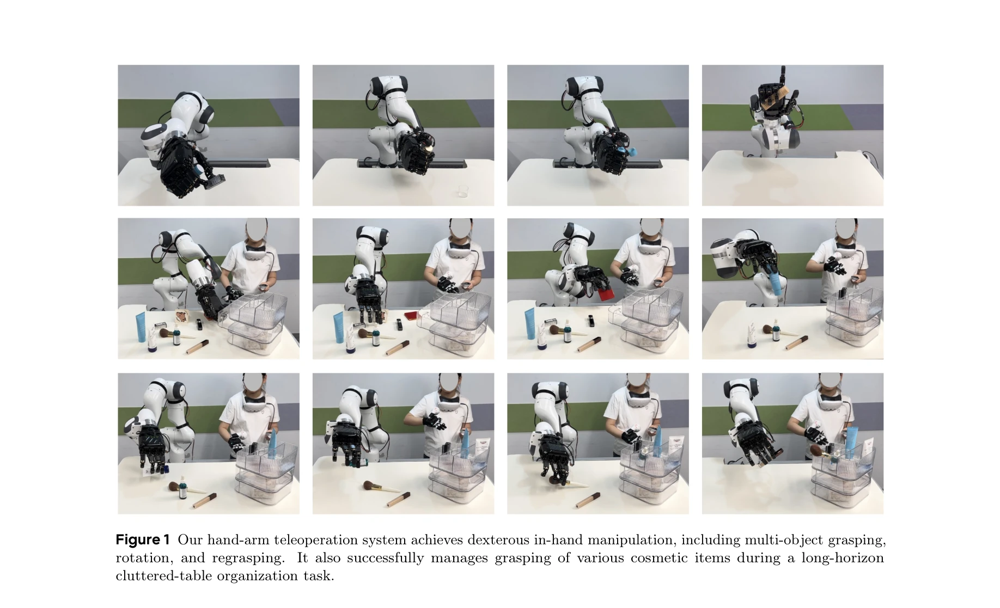
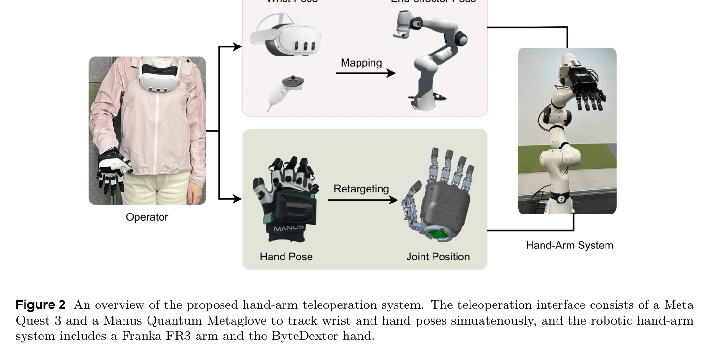

# Dexterous Teleoperation of 20-DoF ByteDexter Hand via Human Motion Retargeting

> **저자**: Ruoshi Wen, Jiajun Zhang, Guangzeng Chen, Zhongren Cui, Min Du, Yang Gou, Zhigang Han, Junkai Hu, Liqun Huang, Hao Niu, Wei Xu, Haoxiang Zhang, Zhengming Zhu, Hang Li, Zeyu Ren | **날짜**: 2025-07-04 | **URL**: [https://arxiv.org/abs/2507.03227](https://arxiv.org/abs/2507.03227)

---

## Essence

*Figure 1 Our hand-arm teleoperation system achieves dexterous in-hand manipulation, including multi-object grasping,*

ByteDexter라는 20-DoF 링크 구동 인간형 로봇 손과 최적화 기반 모션 재타겟팅을 통해 인간의 손 동작을 고충실도로 실시간 원격 조종하고 모방 학습용 시연 데이터를 생성하는 시스템을 제시한다.

## Motivation

- **Known**: 인간형 로봇 손은 기계 설계, 제어, 센서 통합이 필요하며, 모션 캡처와 원격 조종은 고-DoF 손의 제어에 유망한 접근법이다. 링크 구동 메커니즘은 컴팩트성과 내구성의 이점이 있다.
- **Gap**: 기존 원격 조종 시스템들은 인간과 로봇 손의 운동학적 불일치로 인해 인지 부하가 크고 정교한 손 동작의 고충실도 재현에 어려움을 겪는다. 특히 엄지손가락 운동학과 DoF 차이를 해결하는 것이 과제이다.
- **Why**: 일상적인 환경에서 일반용도 로봇이 광범위하게 배포되려면 인간 수준의 정교한 조작 능력이 필수적이며, 고품질 시연 데이터는 모방 학습의 성능을 직접 결정한다.
- **Approach**: ByteDexter는 novel 엄지손가락 메커니즘과 microsecond-level 역운동학 해결기를 포함한 20-DoF 링크 구동 손을 설계하였으며, keyvector 기반 제약 최적화 문제로 human hand pose를 robotic joint commands로 재타겟팅한다.

## Achievement

*Figure 1 Our hand-arm teleoperation system achieves dexterous in-hand manipulation, including multi-object grasping,*

- **컴팩트 20-DoF 인간형 손**: 255×118×77 mm³, 1.3 kg의 소형 폼팩터에서 parallel-serial 토폴로지와 novel decoupled thumb mechanism으로 인간 수준의 정교성 달성
- **실시간 역운동학 해결기**: Ceres Solver 기반 microsecond-level 계산으로 100 Hz 제어 루프 지원, explicit frame-to-frame 변환으로 정확한 transmission kinematics 구현
- **고충실도 모션 재타겟팅**: keyvector 불일치 최소화를 통해 운동학적 불일치를 해결하고 의도적 동작은 보존하면서 무의도적 동작 억제
- **장시간 복잡 조작 검증**: 9개 물품이 무작위로 배치된 어지러진 화장대 정리 작업에서 다중 물체 파지, 회전, 재파지 등 인간 수준의 정교한 조작 수행

## How

*Figure 2 An overview of the proposed hand-arm teleoperation system. The teleoperation interface consists of a Meta*

- Meta Quest 3 헤드셋과 Manus Quantum Metaglove 조합으로 손목 자세와 손 동작 동시 추적
- Franka Research 3 팔에 ByteDexter 손 마운트하여 27-DoF (20 hand + 7 arm) 통합 시스템 구성
- Human hand pose를 keyvector 형태로 표현하고, robotic hand의 joint position을 최소화하는 제약 최적화 문제 formulation
- MCP 관절의 한 DoF 위치에 따라 다른 DoF의 범위를 동적 조정하는 joint-position controller로 실현 가능 명령만 전달
- Manus Glove의 25개 landmarks를 120 Hz로 샘플링하여 retargeting 최적화 입력으로 사용
- 손가락을 인간 비율에 맞게 스케일하되 손바닥 크기는 고정하여 kinematic mismatch 체계적으로 처리

## Originality

- 기존 parallel-serial 토폴로지의 문제점(MCP flexion 증가시 abduction 범위 감소)을 해결하는 novel decoupled thumb mechanism 제안으로 thumb abduction (-4° to 90°) 전체 범위에서 MCP, PIP flexion 독립 달성
- Explicit frame-to-frame 변환을 통한 systematic forward/inverse kinematics 분석으로 기존의 frame-specific trigonometric expansion 방식의 한계 극복
- Keyvector 기반 최적화 재타겟팅 방식으로 기존 fingertip inverse kinematics 또는 empirical scaling 방식보다 superior human-robot kinematic difference resolution 제공
- C++ API의 multi-threading 구현으로 host computer와 onboard controller 간 효율적 양방향 통신 달성

## Limitation & Further Study

- Manus Glove는 캘리브레이션 오버헤드와 operator 불편함이 있으며, 전체 시스템 비용과 복잡도 분석 부족
- 화장대 정리 작업 하나의 장시간 태스크만 검증되었으며, 다양한 물체 특성(형태, 재질, 질량)에 대한 체계적 평가 미흡
- Retargeting 최적화의 computational cost 상세 분석과 실패 케이스 분석 부재
- 생성된 시연 데이터가 실제 모방 학습에 어떻게 기여하는지에 대한 정량적 평가 미흡
- Operator 학습 곡선, 피로도, 인지 부하에 대한 정량적 사용자 연구 부재

## Evaluation

- Novelty: 4/5
- Technical Soundness: 4/5
- Significance: 4/5
- Clarity: 4/5
- Overall: 4/5

**총평**: 이 논문은 linkage-driven 손의 기계적 혁신(novel thumb mechanism), 효율적 실시간 제어(microsecond-level IK solver), 그리고 정교한 모션 재타겟팅을 통합하여 고-DoF 로봇 손의 원격 조종 문제를 체계적으로 해결한 우수한 연구이며, 실제 장시간 조작 작업에서의 성공적 검증이 높은 실용적 가치를 입증한다.

## Related Papers

- 🔄 다른 접근: [[papers/1391_ExtremControl_Low-Latency_Humanoid_Teleoperation_with_Direct/review]] — ByteDexter의 최적화 기반 모션 재타겟팅과 ExtremControl의 SE(3) 포즈 기반 직접 제어는 서로 다른 원격조종 패러다임을 제시합니다.
- 🧪 응용 사례: [[papers/1397_Fauna_Sprout_A_lightweight_approachable_developer-ready_huma/review]] — ByteDexter Hand의 정밀한 손동작 제어 기술은 Sprout 휴머노이드의 VR 기반 텔레오퍼레이션 시스템에 직접 적용 가능합니다.
- 🔄 다른 접근: [[papers/1391_ExtremControl_Low-Latency_Humanoid_Teleoperation_with_Direct/review]] — ExtremControl의 SE(3) 포즈 기반 직접 제어와 ByteDexter의 최적화 기반 모션 재타겟팅은 50ms 극저지연 달성을 위한 서로 다른 텔레오퍼레이션 패러다임입니다.
- 🧪 응용 사례: [[papers/1397_Fauna_Sprout_A_lightweight_approachable_developer-ready_huma/review]] — Sprout의 whole-body control과 사회적 상호작용 통합 플랫폼은 ByteDexter Hand의 정밀한 20-DoF 손동작 제어를 전신 조작으로 확장하는 응용 사례입니다.
- 🔗 후속 연구: [[papers/1462_Human-Robot_Collaboration_for_the_Remote_Control_of_Mobile_H/review]] — ExtremControl의 저지연 텔레오퍼레이션을 인간-로봇 협력 관점에서 확장했다
- 🏛 기반 연구: [[papers/1486_HumDex_Humanoid_Dexterous_Manipulation_Made_Easy/review]] — Dexterous Teleoperation의 손 제어 기술이 HumDex의 손재주 조작의 기반이 된다
- 🏛 기반 연구: [[papers/1512_LapSurgie_Humanoid_Robots_Performing_Surgery_via_Teleoperate/review]] — 정밀한 텔레오퍼레이션 기술이 수술용 도구 조작의 기반이 된다
