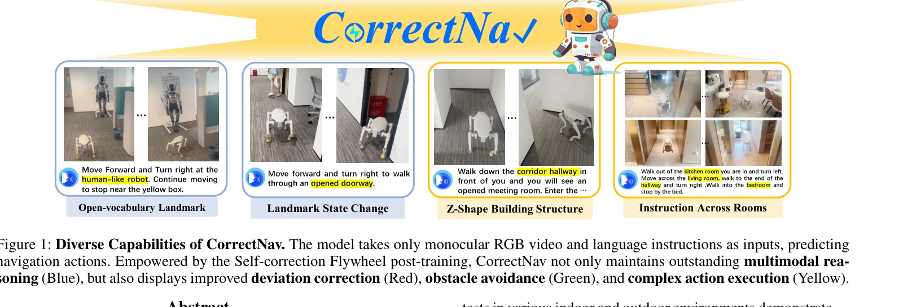
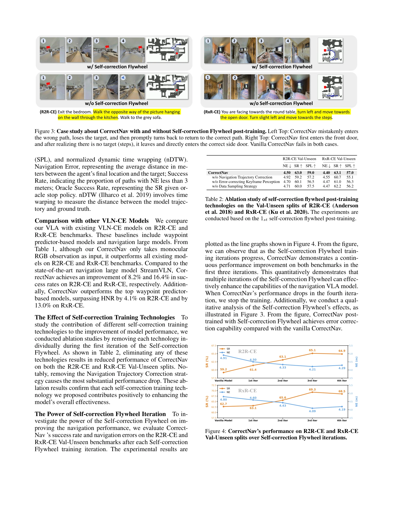
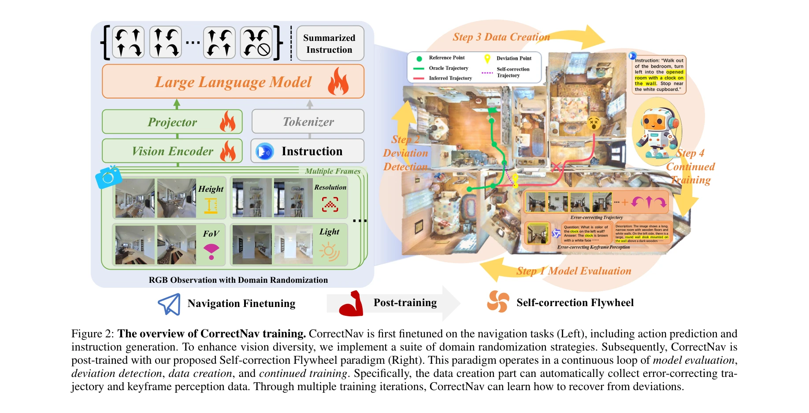

# CorrectNav: Self-Correction Flywheel Empowers Vision-Language-Action Navigation Model

> **저자**: Zhuoyuan Yu, Yuxing Long, Zihan Yang, Chengyan Zeng, Hongwei Fan, Jiyao Zhang, Hao Dong | **날짜**: 2025-08-14 | **URL**: [https://arxiv.org/abs/2508.10416](https://arxiv.org/abs/2508.10416)

---

## Essence

*Figure 1: Diverse Capabilities of CorrectNav. The model takes only monocular RGB video and language instructions as inpu*

Vision-and-Language Navigation 모델의 오류 복구 능력을 강화하기 위해 Self-correction Flywheel이라는 새로운 포스트트레이닝 패러다임을 제안하여 R2R-CE와 RxR-CE 벤치마크에서 최고 성능을 달성했다.

## Motivation

- **Known**: 기존 VLN 모델들은 시각 인식과 멀티모달 추론 능력 향상에 중점을 두고 있으나, 네비게이션 중 발생하는 오류로부터의 복구 능력이 부족하다.
- **Gap**: 현재 VLN 모델들은 단계별 정확한 예측에만 집중하고 있으며, 누적된 오류로부터 자체 수정하는 메커니즘이 없어 성능 한계에 도달해 있다.
- **Why**: 실세계 로봇 네비게이션에서는 완벽한 모든 단계의 예측보다 오류 발생 시 효과적인 복구 능력이 중요하며, 이는 전체적인 성공률 향상과 실용성 극대화에 필수적이다.
- **Approach**: Self-correction Flywheel은 훈련 세트에서 발생한 오류 궤적을 가치 있는 데이터 소스로 활용하여 지각과 행동 관점에서 자동으로 자체 수정 데이터를 생성하고 반복 훈련을 통해 모델을 점진적으로 개선한다.

## Achievement

*Figure 4: CorrectNav’s performance on R2R-CE and RxR-CE*

- **최고 성능 달성**: R2R-CE에서 65.1%, RxR-CE에서 69.3% 성공률로 기존 최고 성능 모델을 8.2%, 16.4% 초과하여 달성
- **실제 로봇 검증**: 다양한 실내외 환경에서 오류 수정, 동적 장애물 회피, 긴 지시문 추종 능력 입증
- **효율적인 아키텍처**: 추가 모듈이나 복잡한 추론 없이 SigLIP, MLP, Qwen2 기반의 단순한 구조로 단말 배포 가능

## How

*Figure 2: The overview of CorrectNav training. CorrectNav is first finetuned on the navigation tasks (Left), including a*

- 훈련된 모델을 훈련 세트에 평가하여 오류 궤적 수집
- 거리 기반 편차 감지(DeviDetect) 알고리즘으로 오류 위치 정확히 파악
- 행동 관점: 편차로부터의 효과적인 복구 궤적 수집 및 MLLM을 통한 설명 생성
- 인식 관점: MLLM을 활용하여 네비게이션 오류 관련 키프레임 분석 및 QA 데이터 생성
- 생성된 자체 수정 데이터(T_c, Cap, Qa)로 모델 재훈련
- 재훈련된 모델 재평가로 새로운 오류 궤적 발굴 및 Flywheel 반복 시작
- 관찰 무작위화, 지시문 생성, 멀티모달 데이터 리콜 등 추가 파인튜닝 전략 적용

## Originality

- 훈련 세트의 오류 궤적을 부정적 요소가 아닌 학습 자료로 재해석하는 새로운 관점
- Self-correction Flywheel의 반복적 개선 메커니즘으로 모델이 자동으로 새로운 오류를 발굴하고 학습하는 사이클 구성
- 지각과 행동 두 가지 관점에서 동시에 오류를 식별하고 자동 수정 데이터를 생성하는 이중 차원의 접근
- 추가 모듈이나 장시간 추론 없이 훈련을 통해 오류 수정 능력을 암묵적으로 통합하는 실용적 설계

## Limitation & Further Study

- Self-correction Flywheel의 수렴성 분석이 부재하며, 최적의 반복 횟수 N 결정 기준이 명확하지 않음
- 거리 임계값 S 같은 하이퍼파라미터의 민감도 분석 및 설정 방법론이 상세하지 않음
- MLLM(Vision-Language Model) 기반의 설명 생성이 폐쇄 소스 모델에 의존할 수 있어 재현성 제한 가능성
- 실제 로봇 테스트의 환경이 제한적이며 더 다양한 시나리오에서의 검증 필요
- 후속 연구로 온라인 학습 환경에서의 Self-correction Flywheel 적응, 멀티에이전트 협업 네비게이션으로의 확장, 그리고 오류 유형별 최적화된 수정 전략 개발이 필요

## Evaluation

- Novelty: 4/5
- Technical Soundness: 3/5
- Significance: 4/5
- Clarity: 4/5
- Overall: 4/5

**총평**: Self-correction Flywheel이라는 혁신적인 포스트트레이닝 패러다임으로 VLN 모델의 오류 복구 능력을 근본적으로 개선하고, 실증적 성과와 실제 로봇 검증을 통해 실용성을 입증했으며, 추가 모듈 없이 훈련만으로 구현 가능한 효율적 설계로 큰 기여를 제시한다.

## Related Papers

- 🔄 다른 접근: [[papers/1328_Chain-of-Action_Trajectory_Autoregressive_Modeling_for_Robot/review]] — 둘 다 vision-language 모델의 오류 처리를 다루지만 CorrectNav는 self-correction flywheel을, Chain-of-Action은 역방향 궤적 모델링을 사용한다.
- 🧪 응용 사례: [[papers/1589_TopV-Nav_Unlocking_the_Top-View_Spatial_Reasoning_Potential/review]] — TopV-Nav의 top-view spatial reasoning이 CorrectNav의 self-correction mechanism을 공간적 추론 관점에서 보완할 수 있다.
- 🏛 기반 연구: [[papers/1612_Visual_Language_Maps_for_Robot_Navigation/review]] — Visual Language Maps의 공간-언어 표현이 CorrectNav의 navigation error correction에 대한 기반 지식을 제공한다.
- 🏛 기반 연구: [[papers/1528_Reflective_Planning_Vision-Language_Models_for_Multi-Stage_L/review]] — 자기 수정 flywheel 메커니즘이 Reflective Planning의 reflection 기반 계획 수정에 핵심 이론적 기반을 제공한다
- 🔄 다른 접근: [[papers/1328_Chain-of-Action_Trajectory_Autoregressive_Modeling_for_Robot/review]] — 둘 다 시각-언어 모델의 오류 처리를 다루지만 Chain-of-Action은 역방향 궤적 모델링을, CorrectNav는 self-correction을 사용한다.
