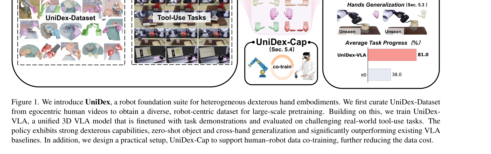
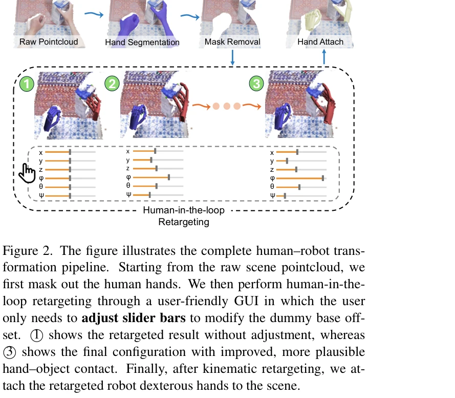

# DexUMI: Using Human Hand as the Universal Manipulation Interface for Dexterous Manipulation

> **저자**:  | **날짜**:  | **URL**: [https://dex-umi.github.io/](https://dex-umi.github.io/)

---

## Essence

*Figure 1. We introduce UniDex, a robot foundation suite for heterogeneous dexterous hand embodiments. We first curate Un*

UniDex는 인간 손의 egocentric 비디오로부터 생성한 대규모 로봇 중심 데이터셋, 통합 action space (FAAS), 그리고 pretrained 3D VLA 모델을 결합하여 다양한 손 embodiment에서 범용적인 기술숙련 조작을 가능하게 하는 로봇 파운데이션 스위트이다.

## Motivation

- **Known**: gripper 기반의 VLA 모델들은 다수 존재하나 기술숙련 손 조작을 위한 대규모 pretrained 파운데이션 모델은 부재하다. 또한 hand embodiment의 높은 이질성(6-24 DoF)과 손 형태의 다양성으로 인해 cross-hand 전이가 어렵다.
- **Gap**: 기술숙련 손 데이터 수집의 높은 비용, 서로 다른 손 embodiment 간의 poor transfer, 고차원 제어 문제가 미해결 상태로 남아있다.
- **Why**: 일상적 조작은 gripper로 불가능한 도구 사용(가위 사용, 스프레이 분사 등)을 요구하며, human-level manipulation을 위해서는 기술숙련 손이 필수적이다. 또한 인간이 생성하는 풍부한 manipulation 데이터를 활용하여 로봇 학습 데이터 수집 비용을 절감할 수 있다.
- **Approach**: 인간의 egocentric RGB-D 비디오를 human-in-the-loop retargeting 절차를 통해 로봇 중심 데이터로 변환하여 UniDex-Dataset을 구축하고, Function–Actuator–Aligned Space (FAAS)라는 통합 action space를 정의하며, 이를 기반으로 pretrained 3D VLA 모델 UniDex-VLA를 학습한다.

## Achievement

*Figure 1. We introduce UniDex, a robot foundation suite for heterogeneous dexterous hand embodiments. We first curate Un*

- **UniDex-Dataset 구축**: 8개의 기술숙련 손(6-24 DoF)에 걸쳐 50K개 이상의 궤적과 9M 프레임의 paired image–pointcloud–action 데이터로 구성된 최초의 대규모 통합 기술숙련 손 dataset 제공
- **FAAS와 UniDex-VLA 개발**: 기능적으로 유사한 actuator를 공유 좌표에 매핑하는 unified action space와 이를 기반으로 한 3D VLA 모델로 81% 평균 task progress 달성 (π0 38% 대비 2배 이상 향상)
- **강력한 generalization 능력**: spatial, object, zero-shot cross-hand generalization을 모두 달성하여 unseen 손에 대한 zero-shot transfer 가능
- **UniDex-Cap 실장**: 휴대 가능한 RGB-D capture 장치와 인간-로봇 co-training 파이프라인으로 human 데이터를 통해 robot demonstration 비용 감소

## How

*Figure 2. The figure illustrates the complete human–robot trans-*

- Egocentric human 비디오에서 human hand pose 추출 및 fingertip 기반 inverse kinematics와 interactive adjustment를 통한 human-in-the-loop retargeting으로 kinematic 및 visual gap 해소
- 3D pointcloud에서 human hand를 mask하고 retargeted robot hand를 장면에 삽입하여 visual domain shift 감소
- Function–Actuator–Aligned Space (FAAS)를 정의하여 서로 다른 morphology의 손들 간 기능적 유사성 기반의 unified control interface 제공
- UniDex-Dataset으로 pretrain한 후 task-specific 데이터로 finetune하는 3D vision–language–action 모델 학습
- RGB-D 스트림과 human hand pose를 동시 기록하는 UniDex-Cap 포트폴리오 장치로 human data를 robot-executable trajectories로 변환하여 co-training 지원

## Originality

- 인간의 egocentric 비디오를 대규모로 활용하되, 단순한 end-to-end 예측이 아닌 명시적 hand retargeting과 3D pointcloud 기반 supervision으로 robot-centric 데이터 생성하는 혁신적 접근
- Function–Actuator–Aligned Space (FAAS)로 heterogeneous hand embodiment 간의 unified control을 가능하게 하는 새로운 action space 설계
- 8개 손, 50K 궤적의 대규모 통합 dataset은 기술숙련 손 분야에서 최초의 시도로, 개방형 protocol로 확장 가능성 제공
- UniDex-Cap이라는 실용적 capture setup으로 인간-로봇 co-training을 현실화하여 실제 배포 가능성 제시

## Limitation & Further Study

- Human hand과 robot hand 간의 kinematic 차이(예: 인간의 더 높은 유연성)가 완전히 해소되지 않아 retargeting에서 부자연스러운 contact 발생 가능
- Pretrain과 finetune 단계의 action space consistency 검증이 명확히 기술되지 않음
- 5가지 tool-use task 평가로는 범용성 검증이 제한적이며, grasping 같은 다른 기술숙련 task에 대한 성능 평가 부재
- UniDex-Cap의 capture quality 및 동기화 정확도에 대한 상세한 기술 사양과 오류 분석 부족
- Cross-hand zero-shot transfer 시 action space 변환의 정확도 한계 및 high-DoF 손에서의 성능 저하 가능성 미평가
- 후속 연구에서는 (1) 더 다양한 hand embodiment 추가, (2) unseen tool-use task에 대한 generalization 검증, (3) real-time interactive correction 메커니즘 통합, (4) simulation-to-real gap 추가 분석 필요

## Evaluation

- Novelty: 4/5
- Technical Soundness: 4/5
- Significance: 4/5
- Clarity: 4/5
- Overall: 4/5

**총평**: UniDex는 기술숙련 조작 분야에서 인간 데이터 활용, 통합 action space, 대규모 dataset, 실용적 capture system을 통합한 종합적 솔루션으로, 기술숙련 손 기반 로봇 learning에 중대한 진전을 가져온다. 강력한 실험 결과와 높은 실용성으로 해당 분야의 새로운 기준을 제시한다.

## Related Papers

- 🏛 기반 연구: [[papers/1373_EgoVLA_Learning_Vision-Language-Action_Models_from_Egocentri/review]] — UniDex의 통합 action space와 3D VLA 모델은 EgoVLA의 Vision-Language-Action 학습을 위한 중요한 이론적 기반을 제공합니다.
- 🔗 후속 연구: [[papers/1426_HumanPlus_Humanoid_Shadowing_and_Imitation_from_Humans/review]] — UniDex의 범용적 손 조작 프레임워크는 HumanPlus의 RGB 카메라 기반 실시간 학습 시스템과 결합하여 더욱 포괄적인 humanoid 제어가 가능합니다.
- 🔗 후속 연구: [[papers/1336_DexHub_and_DART_Towards_Internet_Scale_Robot_Data_Collection/review]] — DexHub의 클라우드 데이터베이스는 UniDex의 대규모 로봇 중심 데이터셋 구축을 위한 인프라로 활용될 수 있습니다.
- 🔄 다른 접근: [[papers/1373_EgoVLA_Learning_Vision-Language-Action_Models_from_Egocentri/review]] — EgoVLA의 대규모 인간 egocentric 비디오 학습과 UniDex의 로봇 중심 데이터셋은 bimanual humanoid 조작을 위한 서로 다른 데이터 기반 접근법입니다.
